# Contest Winners

### 1, Khandaker Momataz (kmomataz)

My art implementation picks a random pixel and stores the color of the pixel. Then, it randomly calculates an adjacent pixel to color next. The color of the next pixel is stored and then the pixel's color is set to the color of the pixel previously visited. The filter completes when the pixel coordinates are out of bounds. The resulting image has portions that may appear as though you are looking through blurry/frosted glass or a painting. In the following images, I applied the custom filter multiple times to achieve this effect.

|   |   |   |
|:-:|:-:|:-:|
| 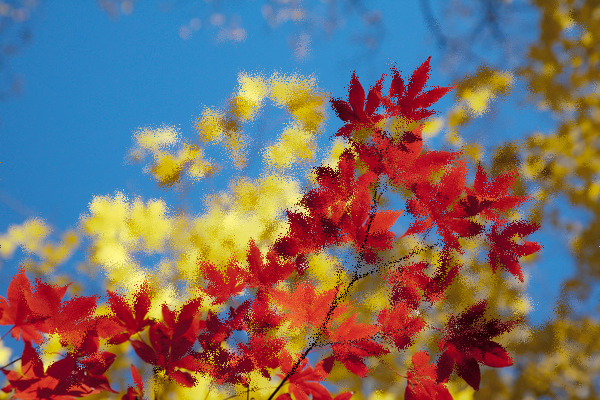 | 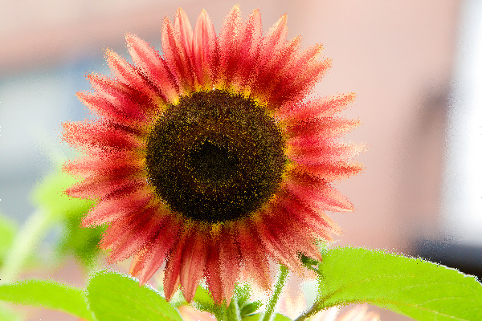 | 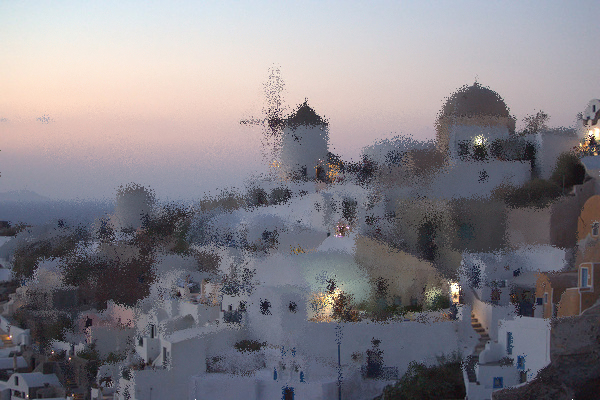 |
| Leaves (kmomataz) | Flower (kmomataz)| Town (kmomataz) |

### 2, Andy Wang (andywang)
The following animations make use of two custom filters: a sort of (intentionally) broken error diffusion dithering effect, and a zoom-in effect. The dithering filter functions similarly to the standard Floyd-Steinberg dithering algorithm, except our version iterates scans the columns of the image, rather than the rows. Additionally, we use the same Floyd-Steinberg diffusion weights, but we make the diagonal weights negative while the horizontal/vertical weights remain positive. These diagonal biases result in interesting patterns oriented along the diagonal axes.

Finally, we alternate colors between blue and green, and to add some motion to the animation, we introduce a small amount of random noise into the color. The zoom-in effect, on the other hand, functions completely normally, except the zoom is only applied to the portion of the image outside of a certain radius from a given central point.

|   |   |
|:-:|:-:|
|  | 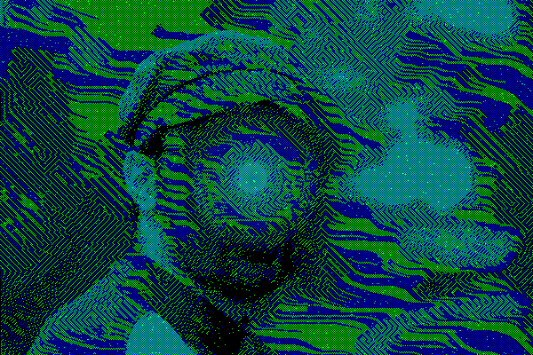 |

The "sun" in the top left is created by first using a black brush to clear the region, and then adding a single soft-brush point before applying the dithering filter. A similar technique is used to create the pattern at the center of the man's face below.

We are able to produce an unexpected and interesting result when we combine both the zoom-in and dithering filters. Although it seems that much information is lost or at least distorted in the first dithering filter, we are somehow able to recover much of the lost information through applying a zoom-in and a second dithering filter. Moreover, the pixels alternate in a high enough density so that the zoomed portion appears to be entirely cyan or black. It should be noted that normally, applying the dithering filter multiple times has no effect (ignoring the noise component), so the zoom-in filter is indeed necessary in this interaction.

Another thing worth noting is that the random noise effect seems to have very little effect on the visible patterns in an image except in very particular scenarios, e.g. when the soft brush is used on a black background. This is particularly noticeable in the final frames of the above animation.

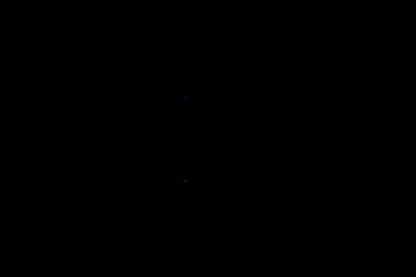

The above animation shows how three large soft brush centers interact as their alpha_at_center values increase. Unlike the previous animations, this one and the below images do not use random noise. This animation is also done with red and blue as the colors of choice, rather than blue and green. When the alpha is sufficiently high, there emerge two prominent pattern types: "rivers" and "mazes." "Rivers" are characterized by large pools of either solid red or solid blue (alternating with black) which seem to always flow from left to right and are often bordered by smooth curves, as opposed to the strictly diagonal edges of mazes. Mazes involve large groups of diagonals with alternating colors, which can either alternate between red and blue or between purple and black, depending on the brightness of the image.

It seems that mazes emerge at both moderately dim sections, as alternating red and blue diagonals, and at relatively bright (but not too bright) sections, as alternating purple and black diagonals. Rivers, on the other hand, emerge in moderlately bright sections; if the brightness is too high, then the image simply becomes solid purple. The back and forth between these two regimes can be seen very clearly in this animation, but it is also noticeable in noiseless shots of the filterings of the town and man, as shown below.

|   |   |
|:-:|:-:|
| 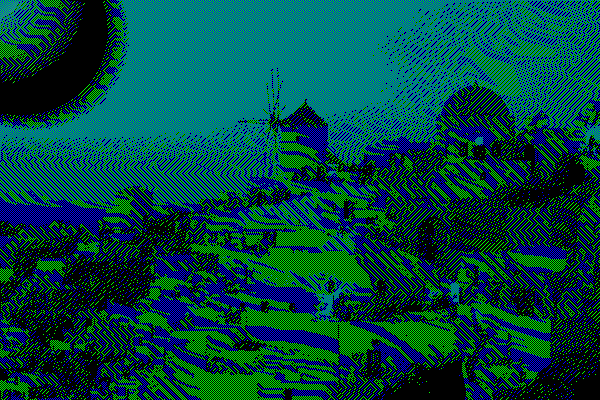 | 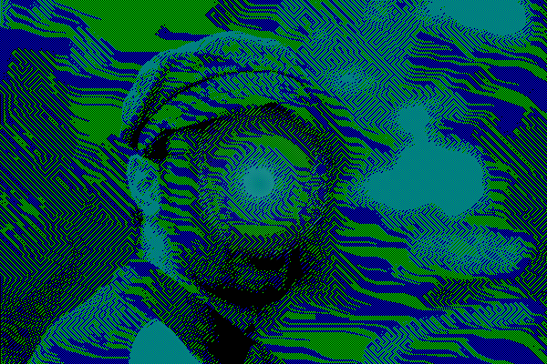 |

The image of the man and the town were the most interesting subjects for these filters due to their variety of brightness levels and structures.

The above image was the result of a faulty zoom-in implementation, in which we iterated over each column directly and set each pixel to the color of their target pixel. This was problematic since in scanning from left to right, once we passed the center x-position we would start modifying the pixels in the wrong order (i.e. from closer to further from the center).

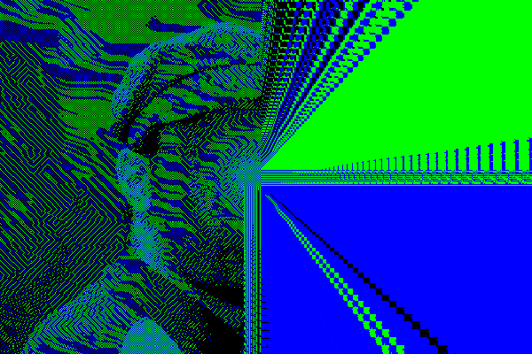

I implemented a somewhat very janky filter that performs a partial triangulation of the image, and then averages color within those triangles. The actual triangulation method is questionable, basically generating a random set of points and then connecting points to each other radially outwards from the center of the image (honestly I just didn't want to implement delauney). The result of this gives the triangulation a distinct circular look, and with repeated applications of this filter (around 20 times), this results in a fairly "abstractified" mosaic-style image, where detail and smoothness can be increased or decreased based on the number of triangles. The method for drawing triangles themselves is from triangle rasterization, with my own implementation.

### 3, Harvey Wang (harveyw)

My art submission features a customizable snow filter that takes applies a majestic snowy overlay that transforms any image into a wintry wonderland. The filter takes an input that determines the density of the snow and then repeatedly paints snow particles using a soft brush at random locations with random alpha levels and random sizes. Enjoy the snowfall!

|   |   |   |
|:-:|:-:|:-:|
| 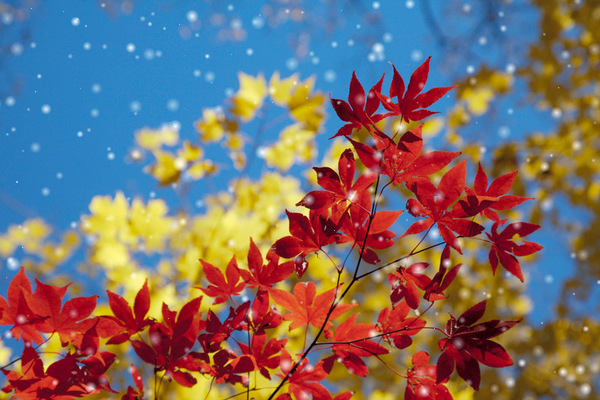 | 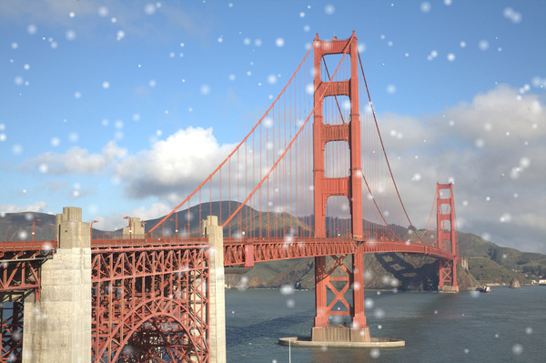 | 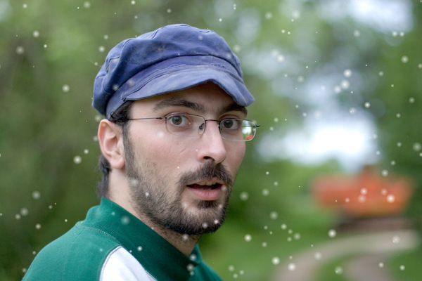 |
| Leaves (harveyw) | Golden Gate (harveyw)| Man (harveyw) |

# Other Art Galleries

<galleries></galleries>

