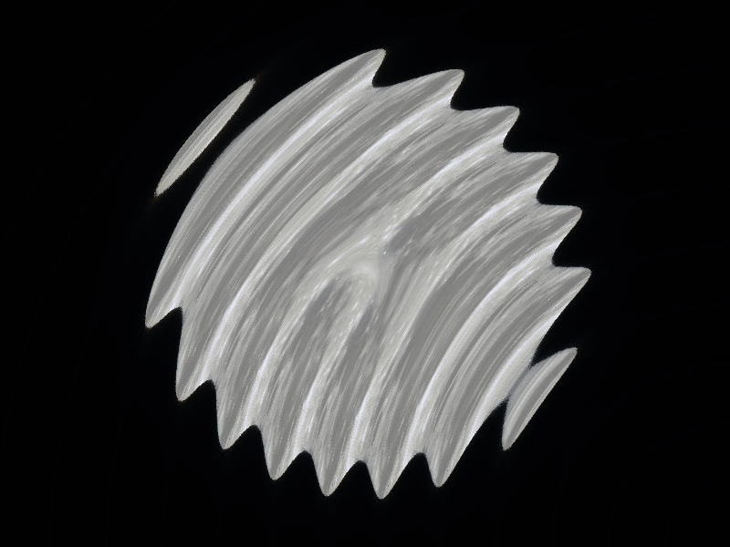
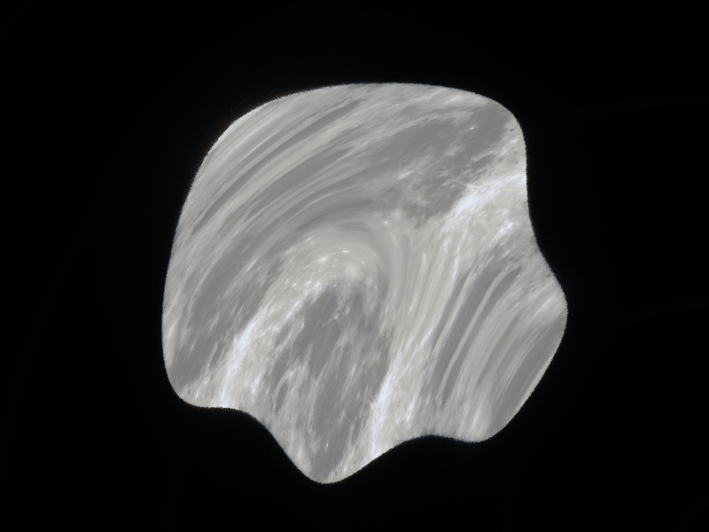
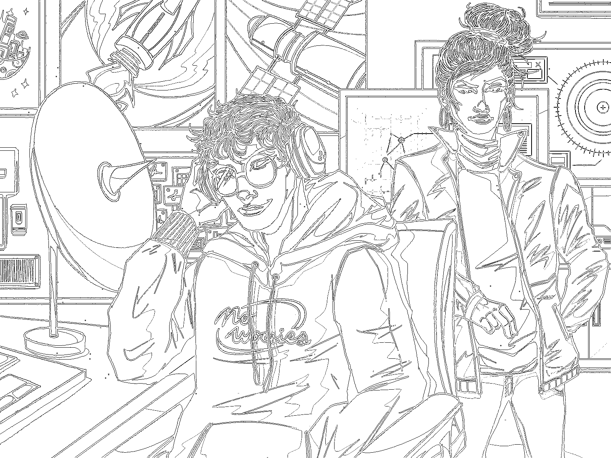
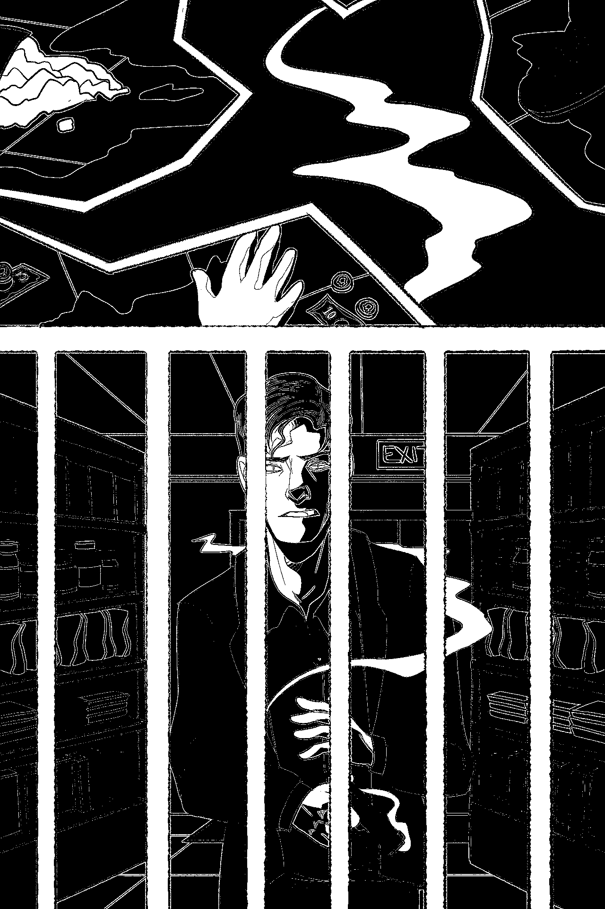
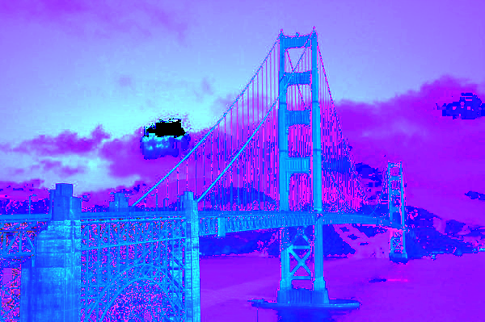
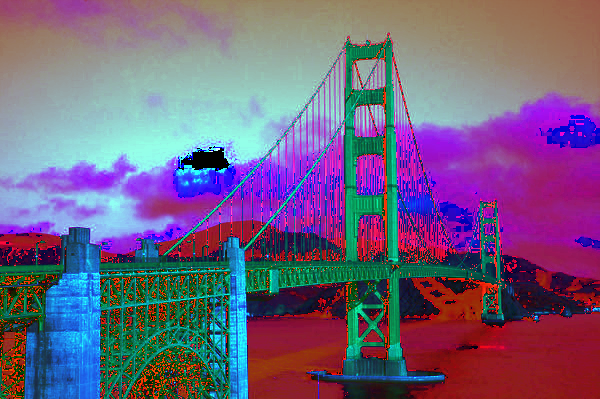

# Contest Winners

A three-way tie for first!

### 1, David Borts (dborts)

Ripple Effect Filter:
To produce my submission, I created a new custom filter that warps a source image to create a "ripple effect," as if the images is being reflected in a rippling pond. The ripples are circular, like they are coming from one point of disturbance (located in the bottom-right) on an otherwise placid water surface. The effect is best observed when animated, like in the examples below. The filter is implemented in a fashion very similar to the optional Swirl Filter; the most notable difference is that the rate at which pixel rotation increases radially outwards is far larger than in Swirl. Also, pixels are translated to the bottom right corner (instead of to the center) only when computing the amount of radians by which to rotate, such that the ripples appear to emanate from that same corner. It was a lot of fun to make!

Results:

|   |   |
|:-:|:-:|
|  |  |
| Ripple Alpha (dborts) | Ripple Moon (dborts) | 

|   |   |
|:-:|:-:|
|  |  |
| Ripple Moon 2 (dborts) | Ripple Face (dborts) | 

### 1, Sydney Peng (smpeng)

For the art contest, I took two drawings I made and used multiple combinations of the contrast, sharpen, edge detection, and quantize filters to highlight the edges to isolate the lineart. One of them has just the outlines, the other also has dramatic shading.
|   |   |
|:-:|:-:|
|  |  |
| Line Art (smpeng) | Line Art 2 (smpeng) |

### 1, Baris Onat (bonat)
For the art contest, I am submitting a gif I made using the paint filter I implemented. The filter recreates the image using brush strokes of size [value\*40, value\*20, value\*5]. As the value of the parameter decreases, the image captures finer and finer details. By setting the slider to different values of the parameter, I saved the different paintings and made them into a gif. The image has been doubly saturated before using the paint filter.

|   |
|:-:|
|  | 
| Bridge (bonat) | 

I am also attaching two bloopers I got trying to implement the histogram equalization and the histogram matching filters. (Notice how the white pixels on the cloud became black)

|   |   |
|:-:|:-:|
|  |  |
| Blooper 1 (bonat) | Blooper 2 (bonat) |

# Other Art Galleries

<galleries></galleries>

