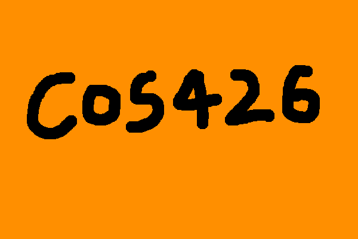

---
# Assignment Name
assignmentName: "JS Paint"
# Assignment Number
assignmentNumber: 0
# Are the specs published yet?
available: true
# Submission url
submitURL: ""
# Gallery url
galleryID: "A0"
# Feedback url
feedbackURL: ""
# Is this assignment listed on the assignments page?
visible: true
# Assignment due date
dueWeek: 2
dueDay: 'Tuesday'
dueTime: '11:55pm'
# Name as displayed on materials page
calendarName: "Assignment 0 (JS Paint)"
# Image for assignment
imageName: "assignment_0"
# Brief description of assignment
description: "Build a simple paint program in JavaScript. Think of this as the walk before the run."
# Scoring parameters
# Total points for required features, R
requiredPoints: 5
# Non-diminishing cutoff for optional features, N
optionalPoints: 0
# Diminishing return numerator
dimReturnTop: 1
# Diminishing return denominator
dimReturnBottom: 1
---
# Overview
In this assignment you will create a simple paint program. The purpose of this assignment is to ease you into both JavaScript programming and computational photography as comfortably and as painlessly as possible. Additionally, this assignment serves to familiarize you with the programming environment and interactive GUI that you will see in future assignments. Think of this as the walk before the run.

For this simple warm-up assignment, you will implement the fill and brush tools that you might be familiar with from MSPaint, Adobe Photoshop, or GIMP.

### Getting Started
The JavaScript based image processing program has two modes: (1) an interactive mode where you can enable/disable various filters, adjust parameters to these filters, and see the result right away; and (2) a batch mode where all the filters and parameters are fixed via the URL string. In general, you will find the interactive mode more useful for testing your programs during development, whereas you will find the batch mode more useful for generating output images while composing the writeups for your assignments.

To get started, download this <assignment-link>zip file</assignment-link> and unzip it on your computer.

### Setting Up a Development Webserver
Next, change to the subdirectory `COS-426-Assignment-0` and run the command `python3 -m http.server` in the terminal. (That command is for python 3. In python 2.7 it should be `python -m SimpleHTTPServer`. Note that there are many other ways to start a web server, for example using `php -S localhost:8000` or by installing WAMP, MAMP, or Node. Various other options are discussed [here](https://github.com/mrdoob/three.js/wiki)). A web server will be launched locally on your computer, rooted at this directory. Note that our assignments will not work if you simply open the html file in the browser directly using `file://...` due to the [same-origin security policy](https://developer.mozilla.org/en-US/docs/Web/Security/Same-origin_policy). Therefore we run a local web server.

Once you have started the local web server, direct your browser to `http://localhost:8000` (8000 is the default port used by the python web server). If you have done everything correctly up to this point, you should see a picture of a flower, which is the web page for Assignment 0. If you see something else, please reach out to your friends or to an instructor for help.

Before you begin, it is necessary to temporarily disable browser caching, or else changes you make to your code during development may not necessarily be reflected on the web page even after a hard refresh! **Many students skim over this step and struggle to get started.** For Google Chrome, you can disable cache via the DevTools: first right-click the web page background and choose `Inspect Element`; then, left-click `Network` in the toolbar to open the network pane. Finally, check the `Disable cache` checkbox at the top (you may need to scroll horizontally to find it).

Keep in mind, this setting is **only active while the DevTools are open.** In general, we strongly recommend Google Chrome for development.

### UI Tour
On the right hand side of the web page, you can find two control menus (created using the lightweight [dat.GUI library](https://workshop.chromeexperiments.com/examples/gui/#1--Basic-Usage)). The left panel is the feature menu, which contains a list buttons that, when pressed, apply a filter/tool/operation to the active canvas. Note that it is the goal of the assignment for you to implement most of these features, almost all of which are not implemented in the starter code.

The right panel is the history menu, which displays all operations that are actively applied to the canvas in the order that they were applied.

Take a moment to play around with the menu and to familiarize yourself with its behavior. For example, when "Fill" is clicked, a new operation is pushed to the bottom of the history menu, and now you can change the fill color using the color picker. Note that nothing happens right now since part of the fill filter is commented out in `js/filters.js`.

You will notice that a warning box pops up when you click on unimplemented features. You will need to comment out or delete the warning box code after you implement the features. All the operations you apply will appear in sequence in the history menu and you can delete the past operations if you want. Observe what happens when you push a number of images onto the history stack, and then click `Delete Below` on the topmost history element. For other operations, only the selected operation will be removed when its delete button is clicked. **Also note that all the history operations are encoded in the URL, so feel free to refresh the webpage and everything will still be there.** This allows you to change your code and then get back to the same place. It also allows you to change the values directly in the URL rather than in the GUI!

To make the assignment debugging and linking friendly, a "Batch Mode" is provided. Once you are satisfied with the parameters in the interactive GUI, click `Batch Mode` and the image output will be loaded in a new tab with all the parameters fixed. Then you can simply refresh when you make changes to your code. Note that when filters that are slow to process, the Batch mode will say "Processing" instead of immediately showing the result.

### How to Program the Features
To make your first edit use your favorite text/code editor (we recommend VSCode and Atom) to edit the file `js/student.js` and fill in your name and NetID. Reload the web page in your browser, and now your information should appear above the image. **You should do this for every assignment.**

To implement the image processing features listed below, **you only need to edit the file `js/filters.js`.** Nevertheless, before starting on that, we recommend you take a quick look at the file `js/image.js` because it has some important helper code relating to images and pixels. You are welcome to look at any of the other files, but it should not be necessary and some of them have some pretty byzantine JavaScript magic.

The first filter you should look at is `Filters.fillFilter( image, color )`. If you print the `color` to the developer console by adding the line `console.log(color)`; to the function, and then applying the filter, you will see that the `color` parameter holds a `Pixel()` object that has the same RGB values as specified in the UI. It will be important to understand the pixel data structure for the next two filters, but for now, you can complete the fill filter by uncommenting `image.setPixel(x, y, color)`; within the for loop. Play around with this filter to ensure it works!

The remaining filters are for you to solve and implement. Before steamrolling ahead, you might want to take the time to read, understand, and test out some of the `Pixel()` and `Image()` member functions implemented in `js/image.js`.

Note that it is not necessary to make deep copies of images since the html canvas always displays the returned image; it doesn't matter whether it's a new copy or the original image. Generally speaking, in-place image processing is the better solution due to significant speedup.

### A Note on Grading
Your assignment submissions for this course will be graded by manual inspection, not by scripts. **As such, do not stress about or waste your time striving for "pixel-perfect" accuracy.** For instance, if your Brush implementation draws a circle with a radius less-than-or-equal-to the radius parameter, whereas our reference example uses the strict less-than radius, you will still receive full-credit! We care far more about your understanding, and likely won't even notice small discrepancies so long as your result is generally correct.

### Debugging Tips
In general, graphics programs are very challenging to debug. Thankfully, modern browsers contain a built-in JavaScript debugger (under the sources pane in Chrome) that will allow you to set execution breakpoints and to trace variables. You can also pre-set breakpoints by inserting the line `debugger;` into your solution code — this trick will likely prove invaluable. Students also find print statements via the `console.log()` prove helpful.

### Hints
A few hints:

* This assignment is meant to be an easy warm-up. If you are struggling, seek help now, or consider taking COS 426 next year.
* Please make a public post on <piazza-link></piazza-link> if you have a question.
* Take note of the <internal-link href="/#late-policy">late policy</internal-link> and the <internal-link href="/#collaboration-policy">collaboration policy</internal-link>.

### FAQ
Here are some answers to frequently asked questions. Check back here occasionally, as we may add FAQs to this list:

* **How do I add my own images or .json files?**

  The file lists are hardcoded in coursejs/guiConfig.js because javascript does not have access to the filesystem. Please modify this file when needed.

# Deliverables

### Submitting
You should submit your solution via <submit-link>CS Tigerfile</submit-link>. The submitted zip file should preserve the directory structure of the skeleton code we provided in the zip file above. If you like to include larger files, that exceed the CS Tigerfile file size limitations, you can put these files in your own web space, Google Drive, Dropbox, etc. and then include a link to that in the write-up.

### Formatting
If your submission is too big for the CS Tigerfile, please first try to convert some of your results to the lossy `.jpg` format, if possible. You may include one or a few `.gif` files to show animations, but these files can be large so please try not to include lots of large gifs.

Note that you are expected to use good programming style at all times, including meaningful variable names, a comment or three describing what the code is doing, etc. Partial credit may not be assigned for code without comments. Although the assignment frameworks mostly conform to the now somewhat-aged [idiomatic JS style conventions](https://github.com/rwaldron/idiomatic.js/), we ask that students conform to modern ES6+ styling standards, such as the [Airbnb JS Style Guide](https://github.com/airbnb/javascript). **Moreover, we strongly recommend that students use a JS Linter when composing their solutions**. Linting your code will help catch bugs before they become a problem, while also enforcing reasonably clean style.

### Writeup
The `writeup.html` file should be an HTML document demonstrating the effects of the features you have implemented and would like scored. For the features you would like to demonstrate, make sure that you include the required results by replacing `placeholder.png(s)` with your results. You are encouraged to include more representative results, but extra results only affect your score when your implementation is partially correct. You don't have to show the input images for the required results.

You should start from the the example `writeup.html` provided. At the top of that file are a list of features that you might implement, linking to the section where you talk about them. Please remove any features that you do not implement from the list as well as the corresponding sections, but otherwise leave this header section intact. When you include an extra result, also include a link to the `batch.html` command that creates that image. Please put effort into your `writeup.html` as this is the file we spend the most time grading.

***Do not, under any circumstances, share any component of your writeup (text and images) with another student, even if you partnered with the student when composing your JavaScript solutions.***

### Scoring
This assignment is worth 5 points. The list of features that you need implement is provided below (roughly ordered from easiest to hardest). The number in front of each feature corresponds to how many points the feature is worth for the full implementation. Partial or partially-correct solutions will receive partial credit. For this assignment, all features are required. Example images of expected output are provided for your reference.

You are encouraged to use the implemented features or the custom filter to create an art piece to participate in the art contest (which yields one point for participation and two for winning). Your final score will be calculated by adding:

* Your score on the required features (up to 5 points).
* Your participation in the art contest (up to 2 bonus points). You are welcome to use the `customFilter()` to make your art project, although this is not required.

# Assignment Features

### (1.0) Fill
Fill the whole image with a given color.

|   |
|:-:|
|  |
| An image filled with Princeton Orange ([generate](http://localhost:8000/batch.html?Push_Image=flower.jpg&Fill=[1,0.560784313725,0,1])) |

### (2.0) Brush
On mouse click, draw a colored circle with a given radius that is centered at the mouse position. Note that the provided code both captures the click and computes the mouse position in image-coordinates for you. Your task is to figure out how to fill-out pixels in a circle of radius `r` that is centered at some point `(x, y)`.

|   |
|:-:|
|  |
| A painted course logo ([generate](http://localhost:8000/batch.html?Push_Image=flower.jpg&Fill=[1,0.560784313725,0,1]&Brush=10;[0,0,0,1];x116y130x114y130x109y130x104y130x98y131x87y134x82y136x79y138x76y141x72y145x68y150x65y157x60y165x58y170x57y174x56y178x55y186x54y195x54y202x55y206x57y210x59y212x64y217x66y218x69y220x72y221x75y222x78y223x80y223x82y223x83y223x84y223x85y223x86y223x87y223x89y223x93y222x95y221x97y220x98y220x99y219x101y219x102y218x104y217x105y216x107y214x108y213x109y212x110y211x110y210x112y210x112y209x113y208x114y208x114y207x116y205x117y205x117y204x118y203x119y203x119y202x151y157x151y158x150y160x149y162x148y164x148y166x148y168x148y170x147y172x147y175x147y177x147y178x147y179x147y180x147y181x147y182x147y185x147y186x148y190x148y191x150y192x150y194x151y195x151y196x152y196x154y197x157y198x161y199x163y200x165y200x167y200x169y200x171y200x173y200x175y199x176y199x179y198x181y197x183y195x186y194x187y194x188y193x189y191x190y189x191y187x191y185x191y183x191y181x191y179x192y178x192y177x192y176x192y173x192y171x192y167x192y162x189y159x188y157x185y156x182y155x180y153x178y153x176y152x174y151x172y151x170y151x164y151x160y151x157y151x156y151x154y151x252y127x240y131x238y132x237y132x236y133x234y135x233y137x232y137x231y138x230y141x228y145x228y148x227y152x227y156x227y158x227y159x227y162x227y163x228y164x231y164x231y165x235y165x243y165x250y165x253y165x256y166x259y168x261y170x263y172x264y174x264y175x264y176x264y177x265y179x265y183x265y184x265y185x265y186x265y187x264y189x264y190x263y192x263y193x261y195x259y198x259y199x258y199x257y200x257y201x256y201x256y202x255y202x255y203x253y204x252y205x251y205x250y206x249y206x248y207x247y207x245y207x245y208x244y208x243y208x242y209x241y209x240y209x240y210x238y210x237y211x236y211x234y212x231y212x230y212x229y212x228y212x227y212x226y212x225y212x224y212x223y212x222y212x221y212x220y212x325y125x325y126x323y127x322y129x321y131x318y133x317y134x316y138x314y143x313y145x313y146x312y148x311y149x311y150x310y151x310y152x309y153x308y156x307y157x306y159x305y161x304y162x302y163x302y165x301y166x301y167x301y168x300y168x300y169x299y169x299y170x299y171x299y172x300y172x301y174x303y174x306y174x308y175x311y175x314y175x316y175x321y175x325y174x328y174x330y173x332y173x335y172x337y172x340y171x342y171x344y170x349y169x350y168x351y168x353y167x354y167x356y167x358y167x359y167x360y166x361y166x362y166x332y128x332y129x332y131x332y135x332y137x332y139x332y141x333y143x334y146x335y150x335y151x335y152x335y154x336y155x336y156x336y157x336y159x336y160x336y161x337y165x337y168x337y171x337y172x337y173x337y174x339y177x339y178x339y180x339y183x339y187x339y188x339y189x339y190x340y192x340y193x340y194x339y196x339y198x339y201x339y203x339y205x339y206x395y125x396y125x402y125x407y125x412y126x414y127x415y127x418y129x420y131x421y133x422y134x423y139x425y144x425y145x425y148x425y151x425y154x422y158x421y160x419y164x414y169x409y175x405y180x401y183x399y185x395y190x392y192x389y196x388y197x387y199x386y200x387y200x388y200x390y200x394y200x396y199x403y198x408y197x410y197x415y195x416y195x419y194x422y193x426y193x428y192x430y192x432y192x433y192x434y192x435y192x436y192x437y192x438y192x439y192x441y192x442y192x443y192x444y192x445y192x446y192x447y192x448y192x449y192x450y193x450y194x514y119x513y119x512y119x511y119x510y119x507y118x506y118x505y118x503y118x501y118x499y118x498y118x498y119x497y119x496y120x495y121x494y122x493y123x493y124x490y130x488y133x488y134x487y136x486y138x486y139x486y140x485y141x485y142x485y143x484y148x483y150x483y151x483y153x483y155x483y156x483y159x483y162x482y164x482y168x482y172x482y173x482y174x482y176x482y178x482y179x482y180x482y181x482y182x482y184x483y185x483y186x484y187x484y188x485y188x486y189x486y190x488y191x490y192x491y192x492y193x493y193x494y194x496y194x497y195x498y195x499y195x500y195x501y195x502y195x503y195x504y196x505y196x506y196x508y196x511y196x513y196x514y196x515y196x516y195x518y194x519y194x519y193x520y193x520y192x522y190x523y189x523y188x524y188x524y187x524y186x524y185x525y185x525y184x525y183x525y181x525y180x525y179x526y178x526y177x526y176x526y175x526y173x526y171x526y170x526y168x526y167x525y166x525y165x525y164x524y163x522y161x521y160x520y160x519y159x517y159x516y158x515y158x514y158x513y158x512y158x511y158x510y157x509y157x508y157x507y157x506y157x505y157x504y157x503y157x502y157x501y157x500y157x500y158x499y158x498y158x498y159x497y159x496y159x496y160)) |

### (2.0) Soft Brush
On mouse click, draw a colored circle with opacity decreasing from center to the edge. You will likely want to read up on [alpha blending](https://en.wikipedia.org/wiki/Alpha_compositing#Alpha_blending). Note that you should not be touching the alpha channel of the `Pixel()` class to accomplish the blended compositing effect.

|   |
|:-:|
|  |
| A circle with center opacity 1.0 painted on top of the flower image ([generate](http://localhost:8000/batch.html?Push_Image=flower.jpg&Soft_Brush=85;[1,1,1,1];1;x270y196)) |

|   |
|:-:|
|  |
| A circle with center opacity 0.5 painted on top of the flower image ([generate](http://localhost:8000/batch.html?Push_Image=flower.jpg&Soft_Brush=85;[1,1,1,1];0.5;x270y196)) |

|   |
|:-:|
|  |
| Clouds painted over the Mesa ([generate](http://localhost:8000/batch.html?Push_Image=mesa.jpg&Soft_Brush=45;[1,1,1,1];0.15;x20y26x21y26x25y26x52y26x85y26x99y27x105y29x116y30x127y30x134y30x143y29x147y28x150y25x209y6x211y6x242y6x410y33x433y37x432y37x417y37x393y33x353y25x317y18x293y11x404y7x542y40x597y36x550y30x530y24x519y18x509y14x500y10x498y9x535y9x540y30x467y41x462y41x407y36x278y20x243y18x239y18x213y18x198y18x197y19x192y19x172y19x168y19x195y18x273y18x313y18x319y19x320y19x336y17x389y14x390y14x391y14x404y12x416y7x423y3x427y2x434y2x454y11x506y25x538y25x554y25x555y25x554y25x554y25x80y22x79y22x63y20x45y14x32y13x16y8x113y1x594y116)) |
