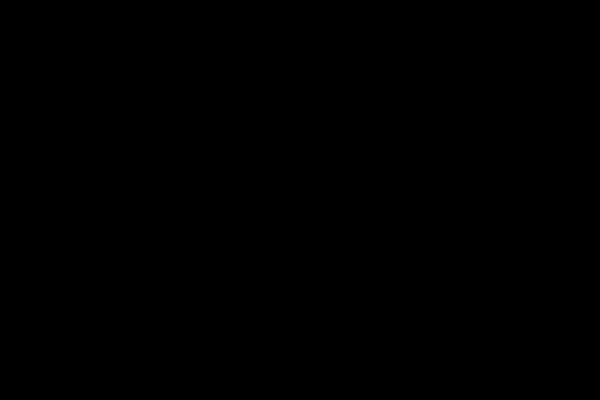
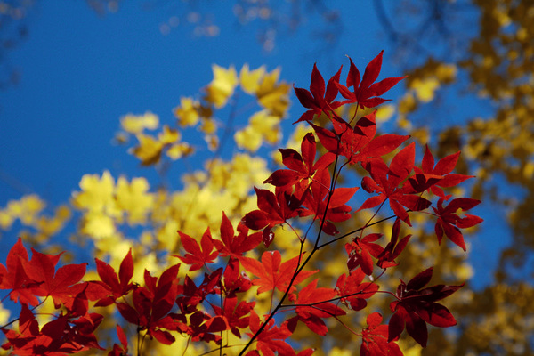
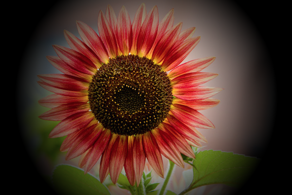
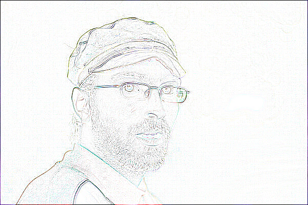
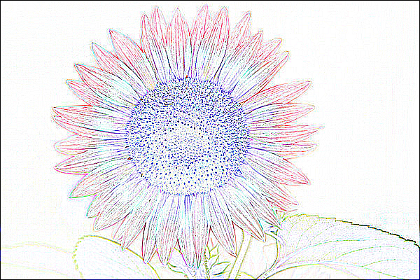
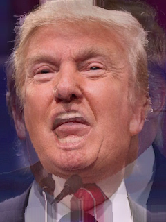

---
# Assignment Name
assignmentName: "Fauxtoshop"
# Assignment Number
assignmentNumber: 1
# Are the specs published yet?
available: false
# Submission url
submitURL: ""
# Gallery url
galleryID: ""
# Feedback url
feedbackURL: ""
# Is this assignment listed on the assignments page?
visible: true
# Assignment due date
dueWeek: 3
dueDay: 'Sunday'
dueTime: '11:55pm'
# Name as displayed on materials page
calendarName: "Assignment 1 (Fauxtoshop)"
# Image for assignment
imageName: "assignment_1"
# Brief description of assignment
description: "Build a photo editor that supports a rich and diverse set of image processing operations."
# Scoring parameters
# Total points for required features, R
requiredPoints: 14
# Non-diminishing cutoff for optional features, N
optionalPoints: 6
# Diminishing return numerator
dimReturnTop: 3
# Diminishing return denominator
dimReturnBottom: 4
---
# Overview
In this assignment you will create a simple photo editor that supports a rich and diverse set of image processing operations. The purpose of this assignment is to give you hands-on experience with implementing many of the filters discussed in lectures and precepts.

### Getting Started
The JavaScript based image processing program has two modes: (1) an interactive mode where you can enable/disable various filters, adjust parameters to these filters, and see the result right away; and (2) a batch mode where all the filters and parameters are fixed via the URL string. In general, you will find the interactive mode more useful for testing your programs during development, whereas you will find the batch mode more useful for generating output images while composing the writeups for your assignments.

Just as in the previous assignment, download this <assignment-link>zip file</assignment-link> and unzip it on your computer to get started.

### Setting Up a Development Webserver
Next, change to the subdirectory `COS-426-Assignment-1` and run the command `python3 -m http.server` in the terminal. (That command is for python 3. In python 2.7 it should be `python -m SimpleHTTPServer`. Note that there are many other ways to start a web server, as discussed in the Assignment 0 specifications). A web server will be launched locally on your computer, rooted at this directory.

Once you have started the local web server, direct your browser to `http://localhost:8000`. If you have done everything correctly up to this point, you should see a picture of a flower, which is the web page for Assignment 1. If you see something else, please reach out to your friends or to an instructor for help.

As before, it is necessary to temporarily disable browser caching, or else changes you make to your code during development may not necessarily be reflected on the web page even after a hard refresh! **Many students skim over this step and struggle to get started.** Refer to the Assignment 0 specifications for details on how to do this.

### UI Tour
On the right hand side of the web page, you can again find two control menus (created using the lightweight [dat.GUI library](https://workshop.chromeexperiments.com/examples/gui/#1--Basic-Usage)). The left panel is the feature menu, which contains a list buttons that, when pressed, apply a filter/tool/operation to the active canvas. Note that it is the goal of the assignment for you to implement most of these features, almost all of which are not implemented in the starter code.

The right panel is the history menu, which displays all operations that are actively applied to the canvas in the order that they were applied.

Please familiarize yourself with the already-implemented features (Push Image, Brightness, Grayscale, Quantize). As an example, we provide the implementation of "Brightness" under the `Luminance` tab. By clicking "Brightness", a new operation will be pushed to the bottom of the history menu, and now you can pull the slider to adjust the brightness of the image. Note that we also provide the implementation of "Grayscale" under the `Color` tab, and that of "Quantize" under the `Dithering` tab. If you want to add another image, simply click `Push Image` and a new image will be pushed to the image stack.

You will notice that a warning box pops up when you click on unimplemented features. You will need to comment out or delete the warning box code after you implement the features. All the operations you apply will appear in sequence in the history menu and you can delete the past operations if you want. Observe what happens when you push a number of images onto the history stack, and then click `Delete Below` on the topmost history element. For other operations, only the selected operation will be removed when its delete button is clicked. **Also note that all the history operations are encoded in the URL, so feel free to refresh the webpage and everything will still be there.** This allows you to change your code and then get back to the same place. It also allows you to change the values directly in the URL rather than in the GUI!

To make the assignment debugging and linking friendly, a "Batch Mode" is provided. Once you are satisfied with the parameters in the interactive GUI, click `Batch Mode` and the image output will be loaded in a new tab with all the parameters fixed. Then you can simply refresh when you make changes to your code. Note that when filters that are slow to process, the Batch mode will say "Processing" instead of immediately showing the result.

### How to Program the Features
To make your first edit use your favorite text/code editor (we recommend VSCode and Atom) to edit the file `js/student.js` and fill in your name and NetID. Reload the web page in your browser, and now your information should appear above the image. **You should do this for every assignment.**

To implement the image processing features listed below, **you only need to edit the file `js/filters.js`.** Nevertheless, before starting on that, we recommend you take a quick look at the file `js/image.js` because it has some important helper code relating to images and pixels. You are welcome to look at any of the other files, but it should not be necessary and some of them have some pretty byzantine JavaScript magic.

In `js/filters.js`, three of the image processing filters (`brightnessFilter`, `grayscaleFilter`, and `quantizeFilter`) are already implemented for you as examples. Some of the filters (like the Brightness filter) operate directly on the image that is passed to them (i.e. in-place); however, other filters (like, the Gaussian filter) will need to allocate a new image to avoid overwriting the original pixel values needed in subsequent processing. In any case, note that it is not necessary to make deep copies of images since the html canvas always displays the returned image; it doesn't matter whether it's a new copy or the original image. Generally speaking, in-place image processing is the better solution, when it is possible, due to significant speedup.

### A Note on Grading
Your assignment submissions for this course will be graded by manual inspection, not by scripts. **As such, do not stress about or waste your time striving for "pixel-perfect" accuracy.** For instance, if gaussian filter implementation uses a different padding strategy at the image boundary from our reference example, you will still receive full-credit! We care far more about your understanding, and likely won't even notice small discrepancies so long as your result is generally correct.

### Debugging Tips
In general, graphics programs are very challenging to debug. Thankfully, modern browsers contain a built-in JavaScript debugger (under the sources pane in Chrome) that will allow you to set execution breakpoints and to trace variables. You can also pre-set breakpoints by inserting the line `debugger;` into your solution code --- this trick will likely prove invaluable. Students also find print statements via the `console.log()` prove helpful.

### Hints
A few hints:

* Attempt the simplest filters first.
* Look at the precept slides from Week 2 and Week 3. They cover the this assignment's image processing features in detail.
* Please make a public post on <piazza-link></piazza-link> if you have a question.
* Take note of the <internal-link href="/#late-policy">late policy</internal-link> and the <internal-link href="/#collaboration-policy">collaboration policy</internal-link>.

### FAQ
Here are some answers to frequently asked questions. Check back here occasionally, as we may add FAQs to this list:

* **How do I add my own images or .json files?**

  The file lists are hardcoded in coursejs/guiConfig.js because javascript does not have access to the filesystem. Please modify this file when needed.

* **When filtering / sampling / convolving etc, I need pixels outside the image boundary. What do I do?**

  There are several ways to deal with that. You can *clamp* the lookup, that is, you use the closest coordinate that is still in bounds. Suppose your image is 10 pixels wide, and you want to retrieve a pixel at `x = 12`. In clamping mode, you would read the pixel with the highest available coordinate (that is, the one at index 9). You can also omit pixels outside the boundary from a convolution, but make sure that the remaining weights sum to 1 (for kernels that need this property). When implementing error diffusion dithering, you do not need to diffuse errors to pixels outside the image --- you can decide what to do with the extra error.

* **My blur filter is darkening the image. What is wrong?**

  Make sure that the entries in your kernel add up to 1. Be especially careful with rounding errors: although small in each entry, collectively they can be large enough to cause this undesired darkening effect.

* **My bilateral filter isn't preserving my edges --- it looks just like my gaussian filter! What is wrong?**

  When computing color distance in the bilateral filter, make sure you are working in RGB space. You should also be careful to scale the intensity of each pixel channel up to [0, 255] when weighting the distances.

# Deliverables

### Submitting
You should submit your solution via <submit-link>CS Tigerfile</submit-link>. The submitted zip file should preserve the directory structure of the skeleton code we provided in the zip file above. If you like to include larger files, that exceed the CS Tigerfile file size limitations, you can put these files in your own web space, Google Drive, Dropbox, etc. and then include a link to that in the write-up.

### Formatting
If your submission is too big for the CS Tigerfile, please first try to convert some of your results to the lossy `.jpg` format, if possible. You may include one or a few `.gif` files to show animations, but these files can be large so please try not to include lots of large gifs.

Note that you are expected to use good programming style at all times, including meaningful variable names, a comment or three describing what the code is doing, etc. Partial credit may not be assigned for code without comments. Although the assignment frameworks mostly conform to the now somewhat-aged [idiomatic JS style conventions](https://github.com/rwaldron/idiomatic.js/), we ask that students conform to modern ES6+ styling standards, such as the [Airbnb JS Style Guide](https://github.com/airbnb/javascript). **Moreover, we strongly recommend that students use a JS Linter when composing their solutions**. Linting your code will help catch bugs before they become a problem, while also enforcing reasonably clean style.

### Writeup
The `writeup.html` file should be an HTML document demonstrating the effects of the features you have implemented and would like scored; ***make sure to also complete the collaboration statement.*** For the features you would like to demonstrate, you should include the required results by replacing `placeholder.png(s)` with your results. You are encouraged to include more representative results, but extra results only affect your score when your implementation is partially correct. You don't have to show the input images for the required results. ***Please indicate late day usage at the top of the write-up.***

You should start from the the example `writeup.html` provided. At the top of that file are a list of features that you might implement, linking to the section where you talk about them. Please remove any features that you do not implement from the list as well as the corresponding sections, but otherwise leave this header section intact. When you include an extra result, also include a link to the `batch.html` command that creates that image. Please put effort into your `writeup.html` as this is the file we spend the most time grading.

***Do not, under any circumstances, share any component of your writeup (text and images) with another student, even if you partnered with the student when composing your JavaScript solutions.***

### Scoring
This assignment is worth **<total></total>** points. The list of features that you need implement is provided below (roughly ordered from easiest to hardest). The number in front of each feature corresponds to how many points the feature is worth for the full implementation. Partial or partially-correct solutions will receive partial credit. The features marked with an asterisk are required. All other features are optional.

Three of the features (brightness, grayscale and quantize) are already implemented for you as examples. If you correctly implement all the required features, you will receive **<required></required>** points. Full credit for this assignment is <total></total> points, so to complement the required features, you may choose from the optional features listed below, as well as participate in the art contest (which yields one point for participation and two for winning).

Note that it is possible to earn more than <total></total> points for this assignment; however, the value of non-required features incurs *diminishing returns* after the first **<optional></optional>** points. For sums of non-required features (`n` `>` <optional></optional>), each point beyond <optional></optional> will accrue a value **<dim></dim>** that of the previous point.

Your final score is a function of the following variables, rounded to the nearest `0.5`:
* **`r`**: your score on the required features  (up to `R` `=` <required></required> points)

* **`n`**: your score on the non-required features (a diminishing value `n` `>` `N` `=` <optional></optional>) .

* **`a`**: your participation in the art contest (`1` point for participating, `1.5` points for being selected for gallery, or `2` points for winning).

* **`d`**: the diminishing return factor (`d` `=` <dim></dim>)

Given these inputs, the formula for your final score as a JavaScript function is:
```javascript
function computeFinalScore(r, n, a, d, R, N) {
    const requiredFeatureScore = Math.min(R, r);
    const optionalFeatureScore = Math.min(N, n);
    const extraFeatureScore = Math.max(n - N, 0);
    const diminishingExtraScore = d * (1 - Math.pow(d, extraFeatureScore)) / (1 - d);
    const artContentScore = a;

    const floatingPointScore = (
        requiredFeatureScore
        + optionalFeatureScore
        + diminishingExtraScore
        + artContentScore
    );
    const finalScore = Math.round(floatingPointScore * 2.0) / 2.0;
    return finalScore;
}
```

To facilitate this computation, please take advantage of the following score calculator, which automatically computes your total score using the above formula and your provided inputs.

### Score Calculator

<div>
    <score-calculator></score-calculator>
</div>


# Assignment Features

## Luminance Operations

### (0.0)\* Brightness
`brightnessFilter(image, ratio)` changes the brightness of an image by blending the original colors with a black or white color in a ratio. When `ratio > 0`, we blend the image with white to make it brighter; when `ratio < 0`, we blend the image with black to make it darker.

|   |   |   |   |   |
|:-:|:-:|:-:|:-:|:-:|
|  |  |  |  |  |
| `-1.0` | `-0.5` | `0.0` | `0.5` | `1.0` |

### (0.5)\* Contrast
`contrastFilter(image, ratio)` changes the contrast of an image by interpolating between a constant gray image (`ratio = -1`) with the average luminance and the original image (`ratio = 0`). Interpolation reduces contrast, extrapolation boosts contrast, and negative factors generate inverted images. Use the following GIMP formula, as provided by [Wikipedia](https://en.wikipedia.org/wiki/Image_editing#Contrast_change_and_brightening):
$$
\vec{I}_{out} = \left(\vec{I}_{in} - \frac{K}{2}\right) \cdot \tan\left((contrast + 1) \cdot \frac{\pi}{4}\right) + \frac{K}{2}
$$
where $K$ denotes the maximum pixel value (`1.0` in this assignment).


|   |   |   |   |   |
|:-:|:-:|:-:|:-:|:-:|
|  |  |  |  |  |
| `-1.0` | `-0.5` | `0.0` | `0.5` | `1.0` |

### (0.5)\* Gamma
`gammaFilter(image, logOfGamma)` changes the image by applying a [gamma correction](https://en.wikipedia.org/wiki/Gamma_correction) to the image:
$$
\vec{I}_{out} = \vec{I}_{in}^\gamma
$$
where $\gamma = e^{\log \gamma}$.

|   |   |   |   |   |
|:-:|:-:|:-:|:-:|:-:|
|  |  |  |  |  |
| `-1.0` | `-0.4` | `0.0` | `0.4` | `1.0` |

### (0.5) Vignette
`vignetteFilter(image, innerR, outerR)` darkens the corners of the image, making the image appear as if it had been photographed [using lenses with very wide apertures](https://en.wikipedia.org/wiki/Vignetting). The function takes `innerR` and `outerR` as scalar inputs in the range of [0, 1]. These scalars are both to be interpreted as multiples of the image's half-diagonal $\frac{D}{2}$.

The vignette effect should be perfectly clear up to `innerR`, perfectly dark (black) beyond the `outerR`, and smoothly increase in darkness within the enclosed circular ring. For example, a vignette operation with `innerR = 1.0` should not visibly affect any image of any size.

Note that the vignetting effect should be perfectly circular --- not elliptic. Camera lenses typically have circular apertures, even if the sensor or film is rectangular itself. Finally, while submissions that use linear light falloff can receive full credit, we encourage students to attempt $\cos^4$ falloff, which [closely approximates the natural vignette phenomenon](https://www.opto-e.com/basics/vignetting).

Linear falloff examples, labeled `(innerR, outerR)`:

|   |   |   |   |
|:-:|:-:|:-:|:-:|
|  |  |  |  |
| `(0.25, 1.0)` | `(0.5, 1.0)` | `(0.25, 0.75)` | `(0.0, 0.75)` |

Natural falloff examples, also labeled `(innerR, outerR)`:

|   |   |   |   |
|:-:|:-:|:-:|:-:|
|  |  |  |  |
| `(0.25, 1.0)` | `(0.5, 1.0)` | `(0.25, 0.75)` | `(0.0, 0.75)` |

### (2.0) Histogram Equalization
`histogramEqualizationFilter(image)` increases the contrast of the image through a [histogram equalization](https://en.wikipedia.org/wiki/Histogram_equalization) of its lightness channel. In other words, this filter remaps pixel lightness intensities so that the final histogram of the image's L channel in its HSL representation is flat. Recall that a low contrast image usually clumps most pixels into a few tight clusters of intensities. Histogram equalization attempts to redistribute pixel values uniformly over the full range of intensities [0, 1], while maintaining the relationship between light and dark areas of the image. In particular, if some pixel $\vec{I}(u, v)$ in the image is darker than some other pixel $\vec{I}(u', v')$ before the histogram equalization, it will still hold that $\vec{I}(u, v)$ is darker than $\vec{I}(u', v')$ after the transformation (and vice versa).

|   |   |
|:-:|:-:|
|  |  |
| Before | After |

## Color Operations

### (0.0)\* Grayscale
`grayscaleFilter(image)` sets each pixel in the image to its luminance.

### (0.5)\* Saturation
`saturationFilter(image, ratio)` uses the method described in [Graphica Obscura](http://graficaobscura.com/interp/index.html) to adjust saturation of an image by interpolating between a gray level version of the image (`ratio = -1`) and the original image (`ratio = 0`). Interpolation decreases saturation, extrapolation increases saturation, and negative factors preserve luminance but invert the hue of the input image. Note that in this assignment, `ratio = alpha - 1`, where `alpha` is the blending factor referenced in the [Graphica Obscura method](http://graficaobscura.com/interp/index.html).

|   |   |   |   |   |
|:-:|:-:|:-:|:-:|:-:|
|  |  |  |  |  |
| `-1.0` | `-0.5` | `0.0` | `0.5` | `1.0` |

### (1.5)\* White Balance
`whiteBalanceFilter(image, white)` adjusts the [white balance](https://en.wikipedia.org/wiki/Color_balance) of the scene to compensate for lighting that is too warm, too cool, or tinted, to produce a neutral image. Use [Von Kries' method](https://en.wikipedia.org/wiki/Color_balance#Von_Kries.27s_method): convert the image from RGB to the [LMS color space](http://en.wikipedia.org/wiki/LMS_color_space), divide by the LMS coordinates of `white` (a hex color string that estimates tint of the illumination), and convert back to RGB. Before attempting to implement this filter, make sure to familiarize yourself with the provided color-space utility functions in `filters/image.js`.

|   |   |
|:-:|:-:|
|  |  |
| Before correction: too warm | After correction: neutral |

|   |   |
|:-:|:-:|
|  |  |
| `white = #cee2f5` | `white = #f5cece` |

### (2.0) Histogram Matching
`histMatchFilter(image, refImg)` adjusts the color and contrast of the input image by matching its lightness histogram to that of some reference image `refImg`. Drawing from [Wikipedia algorithm for histogram matching](https://en.wikipedia.org/wiki/Histogram_matching#Algorithm), first compute the lightness histograms of our two images, and then integrate these histograms to find their cumulative distribution functions --- $F_1()$ for the reference image, and  $F_2$ for the target image. Then for each lightness value $l_1 \in [0, L]$ (where $L$ is the maximum number of distinct lightness values), find the lightness value $l_2$ such that $\mid F_1(l_1) - F_2(l_2)\mid$ is minimized. Finally, apply this mapping of $l_1 \rightarrow l_2$ across the source image, thereby closely matching its lightness histogram to that of `refImg`.

Note that this filter will be far easier to implement if you have already completed Histogram Equalization.

|   |   |
|:-:|:-:|
|  |  |
| Reference Image: `town.jpg` | Reference Image: `flower.jpg` |

## Filter Operations

### (1.0)\* Gaussian Filter
`gaussianFilter(image, sigma)` blurs an image by convolving it with the Gaussian filter:

$$
G(x) = \exp\left(\frac{−x^2}{2\sigma^2}\right)
$$

Unlike other kernels in this assignment, the kernel for a Gaussian filter is [linearly separable](https://en.wikipedia.org/wiki/Gaussian_blur#Implementation). This means that blurring the image in the horizontal direction with a $K \times 1$ kernel and then in the vertical direction with a $1 \times K$ yields the same result as blurring the image along both axes at once with a $K \times K$ filter. Note that $K$ here denotes the window size `Math.round(3*sigma)*2 + 1`.

The benefit of linear separation is considerable: the filter will run in time proportional to $\mathcal{O}((K \times 1) + (1 \times K)) = \mathcal{O}(K)$ rather than $\mathcal{O}(K^2)$. Your implementation should take advantage of this optimization. The reference implementation takes no more than second to apply the Gaussian filter to the provided sample images.

|   |   |   |   |   |
|:-:|:-:|:-:|:-:|:-:|
|  |  |  |  |  |
| `1` | `2` | `3` | `4` | `5` |

### (0.5) Edge Filter
`edgeFilter(image)` isolates edges in an image it with the edge detection kernel:

$$
\begin{bmatrix}
-1 & -1 & -1 \\
-1 & 8 & -1 \\
-1 & -1 & -1 \\
\end{bmatrix}
$$

In the examples below, we invert the image (`pixel = 1 - pixel`) for clearer visualization.

|   |   |
|:-:|:-:|
|  |  |
| The Edges of a Man | The Outline of a Flower |

### (0.5)\* Sharpening Filter
`sharpenFilter(image)` sharpens edges in an image by convolving it with the edge detection kernel and adding the result to the original image. This is equivalent to convolving the image with the sharpening kernel:

$$
\begin{bmatrix}
-1 & -1 & -1 \\
-1 & 9 & -1 \\
-1 & -1 & -1 \\
\end{bmatrix}
$$

|   |
|:-:|
|  |
| A Sharpened Flower |

### (1.0) Median Filter
`medianFilter(image, winR)` blurs an image and removes speckle noise by replacing each pixel with the median of its neighbors. We define a pixel's neighborhood as a square window of side-length `2 * winR` that is centered at the pixel.

Note that median values can be computed over the RGB channels separately (as in the examples below), or using pixel luminance only. Although not required, it is possible to determine the median value of an array in linear time using the quick-select algorithm. We encourage you to implement this if you are looking for an extra challenge.

|   |   |   |   |   |
|:-:|:-:|:-:|:-:|:-:|
|  |  |  |  |  |
| `1` | `2` | `3` | `4` | `5` |

### (2.0)\* Bilateral Filter
`bilateralFilter(image, sigmaR, sigmaS)` blurs an image while preserving edges by replacing each pixel by a weighted average of nearby pixels. The weights depend not only on the Euclidean distance of pixels, but also on the color difference of pixels. For this assignment, we recommend that you use the L2 distance in integral (i.e. [0, 255]) RGB color space for color difference, but you are welcome to experiment and submit alternatives, so long as the bilateral effect is preserved. Regardless, for the pixel $\vec{I}(i, j)$ located at $(i, j)$, the bilateral filter weight of pixel $\vec{I}(k,l)$ is given by:

$$
W(i, j, k, l) = \exp\left(-\frac{(i - k)^2 + (j - l)^2}{2 \sigma_s^2} -\frac{\|\vec{I}(i, j) - \vec{I}(k, l)\|^2}{2 \sigma_r^2} \right)
$$

In the examples below, labeled `(sigmaR, sigmaS)`, we use the window size `Math.round(2*max(sigmaR,sigmaS))*2 + 1`, and we also multiply sigmaR by `Math.sqrt(2)*winR` to make the weight contributions between the pixel and spatial domains more even. If we don't take this factor into consideration, the filter does not perform blurring and the result appears unchanged.

|   |   |   |   |   |
|:-:|:-:|:-:|:-:|:-:|
|  |  |  |  |  |
| `(1.0, 1.0)` | `(2.0, 1.0)` | `(3.0, 0.5)` | `(4.0, 2.0)` | `(5.0, 3.0)` |

## Dithering Operations

### (0.0)\* Quantization
`quantizeFilter(image)` converts an image to the binary using simple rounding.

|   |
|:-:|
|  |
| Binary Flower, Explosion, or Ink Splotch? |

 If you are looking for an extra challenge, experiment with quantizing the image to some other fixed number of bits, as well as with quantizing each channel of color images separately (and a mix of the two). Note that this is not required to receive full credit for this filter.

|   |   |   |   |
|:-:|:-:|:-:|:-:|
|  |  |  |  |
| `1-bit RGB` | `2-bit RGB` | `3-bit RGB` | `4-bit RGB` |

### (0.5)\* Random Dither
`randomFilter(image)` converts an image to binary using random dithering. It is similar to uniform quantization, but random noise is used to perturb the greyscale value of each pixel during quantization, so that the expectation (i.e. arithmetic mean) of many output pixels with the same input level will be equal to this input level.

|   |
|:-:|
|  |
| Who Knew Flowers Could Be So Noisy? |

 As before, if you are looking for an extra challenge, experiment with dithering the image to some other fixed number of bits, as well as with dithering each channel of color images separately (and a mix of the two). Note that this is not required to receive full credit for this filter.

|   |   |   |   |
|:-:|:-:|:-:|:-:|
|  |  |  |  |
| `1-bit RGB` | `2-bit RGB` | `3-bit RGB` | `4-bit RGB` |

### (1.0)\* Floyd-Steinberg Dither
`floydFilter(image)` converts an image to binary using Floyd-Steinberg error diffusion. Each pixel $\vec{I}(x, y)$ is quantized, and the error introduced through quantization, $q$, is computed. Finally the error $q$ is diffused to the neighboring pixels that have not been quantized yet: $(x + 1,y)$, $(x - 1,y + 1)$, $(x,y + 1)$, and $(x + 1,y + 1)$, each receiving error diffusion $\frac{7}{16}q$, $\frac{3}{16}q$, $\frac{5}{16}q$, and $\frac{1}{16}q$, respectively.

|   |
|:-:|
|  |
| Floyd's Flower |

 As before, if you are looking for an extra challenge, experiment with dithering the image to some other fixed number of bits, as well as with dithering each channel of color images separately (and a mix of the two). Note that this is not required to receive full credit for this filter.

In the below examples, the visual fidelity of the 1-bit Floyd-Steinberg dither in comparison to the results of the previous dithers demonstrates how useful this algorithm can be in image compression. Do you notice any patterns or artifacts in these examples that [often appear in GIFs](https://en.wikipedia.org/wiki/GIF#Palettes)?

|   |   |   |   |
|:-:|:-:|:-:|:-:|
|  |  |  |  |
| `1-bit RGB` | `2-bit RGB` | `3-bit RGB` | `4-bit RGB` |

### (1.0) Ordered Dither
`orderedFilter(image)` converts an image to binary using ordered dithering. The below examples used the pattern "Bayer 4":

$$
\begin{bmatrix}
15 & 7 & 13 & 5 \\
3 & 11 & 1 & 9 \\
12 & 4 & 14 & 6 \\
0 & 8 & 2 & 10 \\
\end{bmatrix}
$$

We encourage you to experiment with other patterns and see what you can cook up. Note that the values can be used as thresholds for rounding up or down as described in the lecture and precept slides.

|   |
|:-:|
|  |
| Cross-stitch Flower |

 As before, if you are looking for an extra challenge, experiment with dithering the image to some other fixed number of bits, as well as with dithering each channel of color images separately (and a mix of the two). Note that this is not required to receive full credit for this filter.

|   |   |   |   |
|:-:|:-:|:-:|:-:|
|  |  |  |  |
| `1-bit RGB` | `2-bit RGB` | `3-bit RGB` | `4-bit RGB` |

## Resampling Operations

### (1.0)\* Sampling
Implement Bilinear and Gaussian sampling to complement the basic point sampling implementation already provided. This operation does not appear on GUI and should be used as a utility function for all other resampling operations in this assignment, including the image morph feature.

### (0.5)\* Translate
`translateFilter(image, x, y, sampleMode)` translates an image up, down, left, and right by `(x, y)` pixels. The result depends on the active sampling method, `sampleMode`. In the examples below, `x = -225` and `y = -115`.

|   |   |   |
|:-:|:-:|:-:|
|  |  |  |
| Point | Bilinear | Gaussian |

### (0.5)\* Scale
`scaleFilter(image, ratio, sampleMode)` scales an image in width and height by ratio. The result depends on the active sampling method, `sampleMode`. In the examples below, `sigma = 1`, the window radius of the Gaussian filter is `3`, and `ratio = 0.7`.

|   |   |   |
|:-:|:-:|:-:|
|  |  |  |
| Point | Bilinear | Gaussian |

### (1.5) Rotate
`rotateFilter(image, radians, sampleMode)` rotates an image by the given angle, in radians. A positive angle implies clockwise rotation, and the result depends on the active sampling method, `sampleMode`. In the examples below, `sigma = 1`, the window radius of the Gaussian filter is `3`, and `radians = 0.2 * Math.PI`.

|   |   |   |
|:-:|:-:|:-:|
|  |  |  |
| Point | Bilinear | Gaussian |

### (1.5) Swirl
`swirlFilter(image, radians, sampleMode)` warps an image around its center using a creative filter of your choice. In the examples below, each pixel is mapped to its corresponding scaled polar coordinates. Once again, `sigma = 1`, and the window radius of the Gaussian filter is `3`. This time, `radians = 0.4 * Math.PI`.

|   |   |   |
|:-:|:-:|:-:|
|  |  |  |
| Point | Bilinear | Gaussian |

## Composite Operations
### (1.0)\* Composite
`compositeFilter(backgroundImg, foregroundImg)` composites the foreground image over the background image using the alpha channel of the foreground image to blend the two together. The alpha channel of the `foregroundImg` can be set via the GUI by pushing or painting an opacity map as a third image. Opacity maps with Gaussian smoothing along alpha boundaries generally yields the best results.

|   |   |   |   |
|:-:|:-:|:-:|:-:|
|  |  |  |  |
| `backgroundImg` | `foregroundImg` | `foregroundImg.a` | Result |

|   |   |   |   |
|:-:|:-:|:-:|:-:|
|  |  |  |  |
| `backgroundImg` | `foregroundImg` | `foregroundImg.a` | Result |

### (3.0)\* Morph
`morphFilter(initialImg, finalImg, lines, alpha)` morphs two images together using [Beier92](/readings/Beier92.pdf). `initialImg` and `finalImg` are the before and after images, respectively; `lines` are corresponding line segments to be aligned; `alpha` is the morph time: it can either be a number between `0` and `1` that indicates which point in the morph sequence should be returned, or can be `(start:step:end)` to define a morph sequence. For the tuned parameters, the examples below use `p = 0.5`, `a = 0.01`, and `b = 2`. Note that you can use the `Animation` mode to generate a GIFs in the batch mode.

|   |   |   |   |   |
|:-:|:-:|:-:|:-:|:-:|
|  |  |  |  |  |
| `0.0` | `0.11` | `0.22` | `0.33` | `0.44` |
|  |  |  |  |  |
| `0.56` | `0.67` | `0.78` | `0.89` | `1.0` |

Here is an animation of the above sequence:

|   |   |   |
|:-:|:-:|:-:|
|   |  |   |
|   | Tuesday, January 20, 2009 |   |

For the example images and morph lines provided with the assignment zip, here is a morph with parameter `alpha=(0:0.1:1)` next to a still frame at `alpha = 0.5`:

|   |   |   |   |
|:-:|:-:|:-:|:-:|
|   |  |  |   |
|   | Open Wide | Yuge |   |

You can define your own line correspondences directly through the GUI using `morphlines`. If you start with sufficiently similar images and carefully set enough constraints, the resulting morph animations are often both really exciting and fairly convincing:

|   |   |
|:-:|:-:|
|  |  |
| Man To Monkey | Andy Snokis |

|   |   |   |   |   |
|:-:|:-:|:-:|:-:|:-:|
|   |  |   |  |   |
|   | Driver Bulks Up |   | Casting Decisions |   |

## Miscellaneous Operations
### (3.0) Palette
`paletteFilter(image, colorNum)` extracts `colorNum` colors from the image as a color palette that represents colors scheme of the image. We recommend you use the [k-means clustering method] (i.e. Lloyd's algorithm) with grid optimizations to extract a color palette from the image. The output of this filter should be a new image that contains the original image plus the palette drawn as `colorNum` rectangles along the right side, as in the examples below.

|   |   |   |
|:-:|:-:|:-:|
|  |  |  |
| `2` | `3` | `5` |

### (4.0) Paint By Numbers
`paintFilter(image, value)` implements the "paint by numbers" approach described by [Haeberli](https://www.cs.princeton.edu/courses/archive/spring19/cos426/papers/Haeberli90.pdf) to make the image look like a painting.

|   |   |   |   |   |
|:-:|:-:|:-:|:-:|:-:|
|  |  |  |  |  |
| `0.2` | `0.4` | `0.6` |`0.8` |`1.0` |

### (4.0) XDoG
`xDoGFilter(image, value)` stylizes images into a pencil-drawing using the eXtended Difference-of-Gaussians compendium described by [Winnemoeller](https://www.cs.princeton.edu/courses/archive/spring19/cos426/papers/Winnemoeller12.pdf). You can use the approach of [Kang](https://www.cs.princeton.edu/courses/archive/spring19/cos426/papers/Kang09.pdf) to make the flow field (instead of the one in the XDoG paper) because it is based on bilateral filter that you already implemented.

|   |   |   |   |
|:-:|:-:|:-:|:-:|
|  |  |  |  |
| `0.45` | `0.65` | `0.75` |`1.0` |

|   |
|:-:|
|  |
| `1.0` |
