---
# Assignment Name
assignmentName: "Mesh Editor"
# Assignment Number
assignmentNumber: 2
# Are the specs published yet?
available: true
# Submission url
submitURL: "https://tigerfile.cs.princeton.edu/COS426_S2022/Assignment-2/"
# Gallery url
galleryID: "A2"
# Feedback url
feedbackURL: ""
# Is this assignment listed on the assignments page?
visible: true
# Assignment due date
dueWeek: 6
dueDay: 'Friday'
dueTime: '11:55pm'
# Name as displayed on materials page
calendarName: "Assignment 2 (Mesh Editor)"
# Image for assignment
imageName: "assignment_2"
# Brief description of assignment
description: "Build a simple modeling program that uses half-edge based algorithms to filter and warp meshes."
# Scoring parameters
# Total points for required features, R
requiredPoints: 18
# Non-diminishing cutoff for optional features, N
optionalPoints: 4
# Diminishing return numerator
dimReturnTop: 4
# Diminishing return denominator
dimReturnBottom: 5
---
# Overview
In this assignment you will create a simple 3D modeling program that uses half-edge based algorithms to filter, transform, and warp meshes. The purpose of this assignment is to reinforce your understanding of half-edge data structures and give you hands-on experience with the mesh processing algorithms discussed in lectures and precepts. Note that in previous years, students generally considered this assignment to be the most challenging assignment in the course.

### Getting Started
The JavaScript based mesh processing program has two modes: (1) an interactive mode where you can enable/disable various filters, adjust parameters to these filters, and see the result right away; and (2) a batch mode where all the filters and parameters are fixed via the URL string. In general, you will find the interactive mode more useful for testing your programs during development, whereas you will find the batch mode more useful for generating output images while composing the writeups for your assignments.

Just as in the previous assignment, download this <assignment-link>zip file</assignment-link> and unzip it on your computer to get started.

### Setting Up a Development Webserver
Next, change to the subdirectory `COS-426-Assignment-2` and run the command `python3 -m http.server` in the terminal. (That command is for python 3. In python 2.7 it should be `python -m SimpleHTTPServer`. Note that there are many other ways to start a web server, as discussed in the Assignment 0 specifications). A web server will be launched locally on your computer, rooted at this directory.

Once you have started the local web server, direct your browser to `http://localhost:8000`. If you have done everything correctly up to this point, you should see the web page for Assignment 2 showing a cube. Click and drag near the cube (not on it) and you will see that this is a 3D viewer. In the upper right corner is a GUI, and the top two controls let you choose a model and change the display settings of the model --- try it. Below that is a collection of controls. Click on the `Transformations` folder to open it, and choose the top item --- `Translation`. Try adjusting the x-translation by pulling that slider around. It should move the model on the x-axis shown in red. Try adjusting adding a rotation slider, and you should see a warning that that feature is not implemented yet. You will be implementing that feature as part of the assignment. Click ok on the warning box.

As always, it will be necessary for you to temporarily disable your browser caching, or else changes you make to your code during development may not necessarily be reflected on the web page even after a hard refresh! **Many students skim over this step and struggle to get started.** Refer to the Assignment 0 specifications for details on how to do this.

### New UI Features
Although the mesh processing preserves most of the user interface from the previous assignment, there are several new features to make a note of:

* **Selection:** If you click on a face or vertex of the default cube, you will notice that it becomes 'selected'. If you click it again, it becomes 'deselected'. Clicking on multiple items allows you to select them all at once. The `Delete` button in the History GUI will delete that selection operation. Click the top face of the cube and then try translating it in X.

* **Display:** This dropdown on the side should be pretty self-explanatory. Try it out! When loading high-polygon models (such as the `cheetah`, `bunny`, `armadillo`, etc.) make sure to unselect `show labels` or the loading and interactions will be extremely slow (and may even crash your browser tab).

* **Image capture:** Pressing the `I` key captures an image of the current rendering. (In different browsers you may get slightly different behavior. In Chrome it should force a download, while in some other browsers, it may open in the captured image in a different window or tab). The resulting file will have a PNG encoding; however, you may need to add the file extension `.png` to your download.

* **Object download:** Pressing the `O` key downloads a `.obj` file representing the current 3D model so that you can get recover it quickly later on. For instance, you could move the download into the `obj/` directory, rename it `custom.obj`, and then load it into the program by selecting that menu item in the user interface. Note that some browsers may cache these `.obj` files so you may need to clear your browser cache to retrieve the freshest version of `custom.obj`. Alternatively, you can add the object to the mesh processing program under a new name if you edit the list of `.obj` files in `coursejs/guiConfig.js`.

### How to Program the Features
To make your first edit use your favorite text/code editor (we recommend VSCode and Atom) to edit the file `js/student.js` and fill in your name and NetID. Reload the web page in your browser, and now your information should appear above the image. **You should do this for every assignment.**

To implement the mesh processing features listed below, **you only need to edit the files `js/mesh.js` and `js/filters.js`.** The former file is where you will add your mesh traversal utilities, and the latter file is where you will compose your filter solutions.

Nevertheless, before making edits to these files, we recommend you take a quick look at the file `js/meshUtils.js` which contains an implementation of a mesh data structure and numerous functions for accessing and modifying a mesh's vertices, edges, and faces. You are welcome to look at any of the other files, but it should not be necessary and some of them have some pretty byzantine JavaScript magic.

Note that several of the requested features specifically mention whether it should be applied on the selected items only (if there are any), or to the entire mesh at once. When no items are currently selected, or if a filter does not explicitly specify that it should apply to selected items only, that feature should operate on the entire mesh. Please reference the example implementation of translation, as well as the beginning of each filter method, for how to do this. **Also, the triangulation and subdivision operations should propagate selection to the subdivided faces.** This can be accomplished by copying the selection attribute to the new faces.

For simplicity, you may assume all polygons are planar and convex during the implementation, but you should not assume that all polygons are necessarily triangular. Additionally, you may assume that faces share each edge with one (no more, no less) of any neighboring faces. **This is not to say that a selected face will necessarily have a selected neighbor along every edge.**

Finally, this assignment relies heavily on the half-edge mesh data structure. You can also read about it in Section 3.1 of the Botsch 2007 reading. (Links to these notes and readings are on the Materials page)

### ThreeJS
This assignment uses [ThreeJS](https://threejs.org/). It is okay to use the methods provided (e.g. "Euler" for rotation); however, you are encouraged to implement the filters without these ThreeJS features by thinking through the geometry and directly applying the appropriate mathematical operations.

Note that the provided mesh data structure makes use of many ThreeJS classes; however, the most important one for this assignment is `Vector3`, which implements a vector in 3D space. It will be useful for you to familiarize yourself with its [API](https://threejs.org/docs/#api/en/math/Vector3) so that you can leverage its built-in methods within your mesh processing operations.

### Debugging Tips
In general, graphics programs are very challenging to debug. Thankfully, modern browsers contain a built-in JavaScript debugger (under the sources pane in Chrome) that will allow you to set execution breakpoints and to trace variables. You can also pre-set breakpoints by inserting the line `debugger;` into your solution code --- this trick will likely prove invaluable. Students also find print statements via the `console.log()` prove helpful.

### Hints
A few hints:

* Attempt the simplest operations first. Note, however, there are some dependencies in this assignment. For example, you will need to implement mesh traversal before the any analysis and filtering operations.
* `js/meshUtils.js` contains useful helper functions for modifying mesh topologies. They will be especially useful for the topology filters.
* Look at the precept slides from Week 2 and Week 3. They cover the this assignment's image processing features in detail.
* Please make a public post on <piazza-link></piazza-link> if you have a question.
* Take note of the <internal-link href="/#late-policy">late policy</internal-link> and the <internal-link href="/#collaboration-policy">collaboration policy</internal-link>.

### FAQ
Here are some answers to frequently asked questions. Check back here occasionally, as we may add FAQs to this list:

* **My implementation operates only on meshes containing triangles by decomposing N-sided polygons into triangles before processing. Is this permitted?**

   ***No.*** For some of the operations (e.g., truncate), it is important that you correctly handle N-sided faces with `N > 3`, because otherwise, the result will depend on the topology of the triangulation, and you will not be able to reproduce the requested geometries.

* **Is my implementation required to handle arbitrary meshes? For instance, meshes that contain polygons with concavities, self-intersections, non-coplanar vertices, or other topological complexities?**

   In general, no. That said, while we only ask that your code works for manifold, closed meshes (e.g. no holes) with convex, planar faces containing vertices in counter-clockwise order, you will need to ensure that your solutions work correctly on all possible selections of a mesh.

   Note that this introduces challenging edge cases into certain filters (e.g. subdivision surfaces) that students often fail to correctly handle.

* **My smoothing operations are very slow --- requiring thousands of iterations for the explicit version, and dozens of seconds for the implicit solution. Is this expected?**

   Yes. These operations can take a while, but can also be very fast when properly implemented. You do not need to fully optimize your solutions' runtimes, provided they are not unreasonably extreme.

# Deliverables

### Submitting
You should submit your solution via <submit-link>CS Tigerfile</submit-link>. The submitted zip file should preserve the directory structure of the skeleton code we provided in the zip file above. If you like to include larger files, that exceed the CS Tigerfile file size limitations, you can put these files in your own web space, Google Drive, Dropbox, etc. and then include a link to that in the write-up.

### Formatting
If your submission is too big for the CS Tigerfile, please first try to convert some of your results to the lossy `.jpg` format, if possible. You may include one or a few `.gif` files to show animations, but these files can be large so please try not to include lots of large gifs.

Note that you are expected to use good programming style at all times, including meaningful variable names, a comment or three describing what the code is doing, etc. Partial credit may not be assigned for code without comments. Although the assignment frameworks mostly conform to the now somewhat-aged [idiomatic JS style conventions](https://github.com/rwaldron/idiomatic.js/), we ask that students conform to modern ES6+ styling standards, such as the [Airbnb JS Style Guide](https://github.com/airbnb/javascript). **Moreover, we strongly recommend that students use a JS Linter when composing their solutions**. Linting your code will help catch bugs before they become a problem, while also enforcing reasonably clean style.

### Writeup
The `writeup.html` file should be an HTML document demonstrating the effects of the features you have implemented and would like scored; ***make sure to also complete the collaboration statement.*** For the features you would like to demonstrate, you should include the required results by replacing `placeholder.png(s)` with your results. You are encouraged to include more representative results, but extra results only affect your score when your implementation is partially correct. You don't have to show the input images for the required results. ***Please indicate late day usage at the top of the write-up.***

You should start from the the example `writeup.html` provided. At the top of that file are a list of features that you might implement, linking to the section where you talk about them. Please remove any features that you do not implement from the list as well as the corresponding sections, but otherwise leave this header section intact. When you include an extra result, also include a link to the `batch.html` command that creates that image. Please put effort into your `writeup.html` as this is the file we spend the most time grading.

***Do not, under any circumstances, share any component of your writeup (text and images) with another student, even if you partnered with the student when composing your JavaScript solutions.***

### Scoring
This assignment is worth **<total></total>** points. The list of features that you need implement is provided below (roughly ordered from easiest to hardest). The number in front of each feature corresponds to how many points the feature is worth for the full implementation. Partial or partially-correct solutions will receive partial credit. The features marked with an asterisk are required. All other features are optional.

The translation filter is already implemented for you as an example. If you correctly implement all the required features, you will receive **<required></required>** points. Full credit for this assignment is <total></total> points, so to complement the required features, you may choose from the optional features listed below, as well as participate in the art contest (which yields one point for participation and two for winning).

Note that it is possible to earn more than <total></total> points for this assignment; however, the value of non-required features incurs *diminishing returns* after the first **<optional></optional>** points. For sums of non-required features (`n` `>` <optional></optional>), each point beyond <optional></optional> will accrue a value **<dim></dim>** that of the previous point.

Your final score is a function of the following variables, rounded to the nearest `0.5`:
* **`r`**: your score on the required features  (up to `R` `=` <required></required> points)

* **`n`**: your score on the non-required features (a diminishing value `n` `>` `N` `=` <optional></optional>) .

* **`a`**: your participation in the art contest (`1` point for participating, `1.5` points for being selected for gallery, or `2` points for winning).

* **`d`**: the diminishing return factor (`d` `=` <dim></dim>)

Given these inputs, the formula for your final score as a JavaScript function is:
```javascript
function computeFinalScore(r, n, a, d, R, N) {
    const requiredFeatureScore = Math.min(R, r);
    const optionalFeatureScore = Math.min(N, n);
    const extraFeatureScore = Math.max(n - N, 0);
    const diminishingExtraScore = d * (1 - Math.pow(d, extraFeatureScore)) / (1 - d);
    const artContentScore = a;

    const floatingPointScore = (
        requiredFeatureScore
        + optionalFeatureScore
        + diminishingExtraScore
        + artContentScore
    );
    const finalScore = Math.round(floatingPointScore * 2.0) / 2.0;
    return finalScore;
}
```

To facilitate this computation, please take advantage of the following score calculator, which automatically computes your total score using the above formula and your provided inputs.

### Score Calculator

<div>
    <score-calculator></score-calculator>
</div>


# Assignment Features

## Transformation Operations

### (0.0)\* Translation
`translation(mesh, x, y, z)` translates all selected vertices in the mesh by `(x, y, z)`.

|   |
|:-:|
|  |
| Translated Cube |

### (1.0)\* Rotation
`rotate(mesh, x, y, z)` rotates all selected vertices in the mesh around each axis
by the provided value. Note that the unit used for rotation here is radians.

|   |   |
|:-:|:-:|
|  |  |
| Entire Cube: `x = 0.8` | Selection of Cube: `x = 0.8` |

### (0.5)\* Scale
`scale(mesh, s)` scales all selected vertices in the mesh away from the origin by scale factor `s`.

|   |
|:-:|
|  |
| A Teapot for Ants |

## Traversal Utilities
These operations list vertices, edges, or faces adjacent to a given vertex or a face.
They are used by many of the operations that you will implement further below, and all rely on the half-edge data structure.
`verticesOnFace` has been provided for you as an example, and it returns a list of
the vertices that are adjacent to the face `f` that is the argument to the function.

Note that these operations live in `js/mesh.js`.

### (0.25)\* Edges On Face
`mesh.js/edgesOnFace(f)` returns an array of edges that are adjacent to the face `f`.

### (0.25)\* Faces On Face
`mesh.js/facesOnFace(f)` returns an array of faces that are adjacent to the face `f`.

### (0.25)\* Vertices On Vertex
`mesh.js/verticesOnVertex(v)` returns an array of vertices that are adjacent to the vertex `v`.

### (0.25)\* Edges On Vertex
`mesh.js/edgesOnVertex(v)` returns an array of all edges *pointing away* from vertex `v`.

### (0.25)\* Faces On Vertex
`mesh.js/facesOnVertex(v)` returns an array of all faces to which vertex `v` is assigned.

### (0.25)\* Vertices On Edge
`mesh.js/verticesOnEdge(e)` returns an array of all vertices incident to edge `e`.

### (0.25)\* Faces On Edge
`mesh.js/facesOnEdge(e)` returns the faces on that lie along `e`.

### (0.25)\* Edge Between Vertices
`mesh.js/edgeBetweenVertices(v1, v2)` returns the edge incident to both `v1`
and `v2` (if such an edge exists).

## Analysis Operations
Note that these operations live in `js/mesh.js`.

### (0.5)\* Face Area
`mesh.js/calculateFaceArea(f)` computes and returns the area of face `f` in the mesh.
We recommend that you write a helper function that computes the area of a triangle.
Then, for each face, create triangles that cover the face and sum their areas.

Store the resulting area in the `.area` property of `f` before returning.

### (0.5)\* Vertex Normals
`mesh.js/calculateVertexNormal(v)` computes and returns the surface normal at
vertex `v` in the mesh. The surface normal is a weighted average of the normals
for the vertex's adjacent faces, where the normalized weights are proportional to the areas
of the neighboring faces.

Be careful to normalize your weights, and store the
resulting vertex normal in the `.normal` property of `v` before returning. You can display
the computed normals by using the appropriate checkbox in the assignment GUI.

### (0.5)\* Average Edge Lengths
`mesh.js/averageEdgeLength(v)` computes and returns the average length of edges
attached to vertex `v` in the mesh. You can visualize this property by scaling
the normal stored at each vertex its average edge length and displaying
normals in the assignment GUI.

## Warp Operations

### (1.0)\* Twist
`twist(mesh, factor)` rotates all selected vertices in the mesh `v` along the Y-axis
by `v.position.y * factor`. Note that the unit used for rotation here is again radians.

|   |   |
|:-:|:-:|
|  |  |
| Large Cube: `1` | Large Cube: `2` |


### (1.0)\* Inflate
`inflate(mesh, factor)` moves all selected vertices in the mesh the direction of their respective
vertex normals, proportional to `factor`. Note that for the cube, this operation
yields a scaling effect.

|   |   |   |   |
|:-:|:-:|:-:|:-:|
|  |  |  | 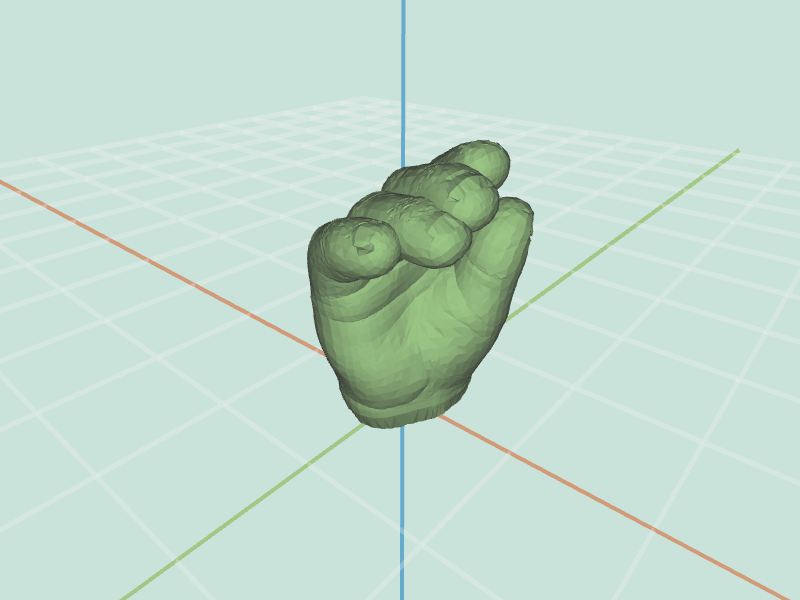 |
| Cube: `-1` | Cube: `1` | Hand: `-0.1` | Hand: `0.1` |

It is possible to augment this operation by `averageEdgeLength`. This adjustment gives
nicer results for the inflated hand --- the creases are better preserved ---, and the inflate operation is now aware of the mesh scale.

|   |   |   |   |
|:-:|:-:|:-:|:-:|
|  |  | 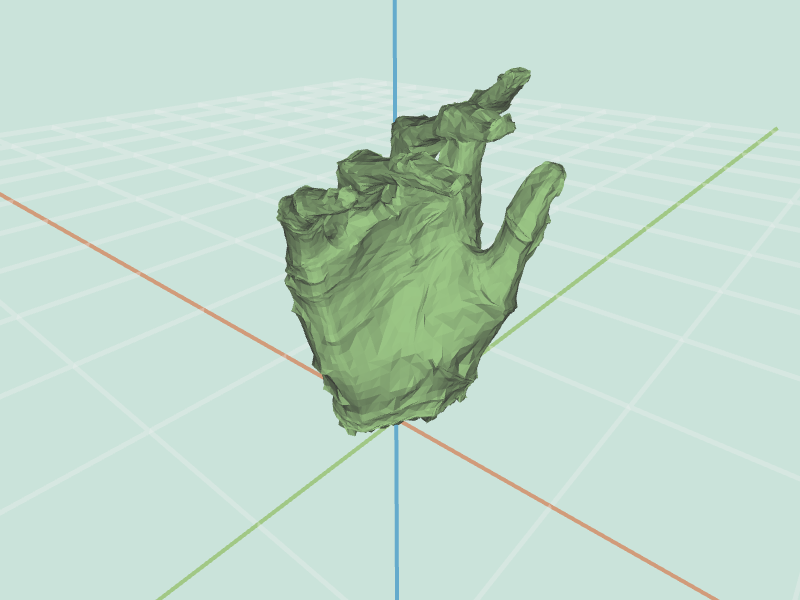 |  |
| Cube: `-1` | Cube: `1` | Hand: `-1` | Hand: `1` |

### (1.0) Wacky
`wacky(mesh, factor)` warps the mesh using some *non-linear* mapping of your
choice (e.g. sine, bulge, swirl, etc.). Get creative!

## Filter Operations

### (1.0)\* Noise
`noise(mesh, factor)` offsets each selected vertex in the mesh `v` in the direction
of its vertex normal, scaled by a random value in the range [-1, 1) and multiplied
by two other factors: the average edge length at that vertex, and `factor`. This filter
is easier with a working `mesh.averageEdgeLength(v)` implementation.

|   |   |
|:-:|:-:|
|  |  |
| Large Cube: `0.5` | Large Cube: `1` |

### (1.5)\* Uniform Laplacian Smoothing
`smooth(mesh, iter, delta, curvFlow=false, scaleDep, implicit)` smooths the mesh by moving every vertex towards the uniform average of its immediate neighbors. The process should repeat itself `iter` times. For each iteration, move each vertex towards the average of itself and its neighbor, scaling the motion according to `delta`. For a vertex $V$ with $N$ neighbors, its updated position $V_{new}$ should be $V_{new} = V + \left(\sum n_i - N \times V \right) \times \texttt{delta}$, where $n_i$ are the neighboring vertices.

You can normalize the weights (and we recommend doing so), but this can also be controlled through the delta variable, so normalization is not strictly necessary. You may also want to scale the mesh after every iteration so that the radius of the bounding box is not effected by the process (especially if the weights are not normalized). Note that a large `delta` will cause instabilities, yielding extreme artifacts on the mesh. The smaller the `delta`, the better the smoothing, but also more iterations are required.

*Be careful when updating the position.* During a single iteration you will want to use original vertex positions throughout the entire computation. Update the actual positions of the vertices only after all new locations have been calculated.

Note that this uniform weighting scheme should be active if `curvFlow` is false. In the following examples, labeled `(iter, delta)`, the weights are not normalized, hence small deltas should be used, as can be seen in the images below.

|   |   |   |   |
|:-:|:-:|:-:|:-:|
|  |  |  |  |
| Cheetah: `(1, 1)` | Cheetah: `(36, 0.15)` | Cheetah: `(3000, 0.01)` | 2Res Sphere: `(35, 0.15)` |

### (1.0)\* Sharpening
`sharpen(mesh, iter, delta)` accentuates details in the mesh by moving every selected vertex `v` along the opposite of the vector described in Uniform Laplacian Smoothing. This is done `iter` times. Note that this operation is very sensitive to `delta` values, and that sharpening examples are labeled as before.

|   |   |   |
|:-:|:-:|:-:|
|  |  | 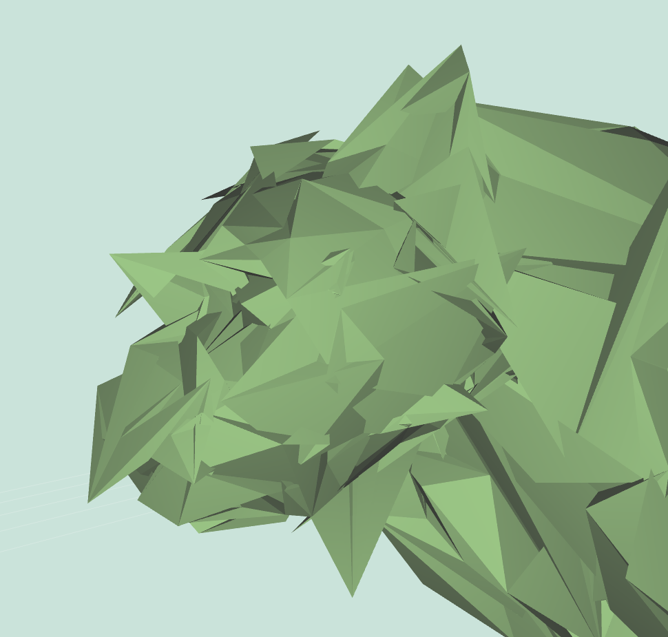 |
| Cheetah: `(5, 0.04)` | Cheetah: `(5, 0.02)` | Cheetah: `(12, 0.02)` |


### (1.5) Curvature-flow Laplacian Smoothing
`smooth(mesh, iter, delta, curvFlow=true, scaleDep, implicit)` smooths the mesh by moving every vertex towards the weighted average of itself and its immediate neighbors, using the cotangent weights as explained in lecture and precept. The same as uniform sampling, but with a different weighting scheme, which can be applied only to triangles. In this case, the update rule is $V_{new} = V + \left( \sum(w_i \times n_i) - \sum(w_i) \times V \right) \times \texttt{delta}$, where the weights $w_i$ are the cotangent weights. **Note that this method works only on triangles, so be sure to triangulate the mesh first, if it is not already triangulated.**

Note that this curvature-flow weighting scheme should be active if `curvFlow` is true. As can be seen in the examples below, labeled `(curvFlow, iter, delta)`, this scheme preserves triangle shapes well, and thereby preserves features better; however, it is still sensitive to triangle sizes. Note that this scheme is even more sensitive to `delta` than the uniform smoothing scheme. Also note that this scheme is very sensitive to long and thin triangles. To overcome this problem on bad meshes, either add checks in the code, or run a few uniform iterations before using this scheme, as was done for the hand example below.

|   |   |
|:-:|:-:|
|  |  |
| Cheetah: `(true, 30, 0.4)` | Cheetah: `(true, 3000, 0.02)` |

|   |   |
|:-:|:-:|
|  |  |
| Hand: `(false, 10, 0.02)`, `(true, 100, 0.04)` | 2Res Sphere: `(true, 35, 0.3)` |

### (1.0) Scale-Dependent Smoothing
`smooth(mesh, iter, delta, curvFlow, scaleDep=true, implicit)` smooths the mesh, agnostic to tessellation resolution. This is done by scaling the offset vector differently for every vertex. Calculate the area of all adjacent faces to every vertex $A_v$ and the average of that size across all vertices $A$. Scale every offset vector by $\frac{A}{A_v} = M_v$. The update rule is now $V_{new} = V + M_v \times \left( \sum(w_i \times n_i) - \sum(w_i) \times V \right) \times \texttt{delta}$, where $w_i$ is the weighting for each vertex (depends on weighting method determined by the other arguments to `smooth`).

No matter the weighting scheme, when `scaleDep` is true you should multiply the vertex offset by the scale dependent term. For convenience, you may want to scale the mesh to preserve its original size after each iteration. This can be accomplished by rescaling the bounding box diagonal to be the same length.

The following examples are labeled `(curvFlow, iter, delta)`:

|   |   |
|:-:|:-:|
|  |  |
| Cheetah: `(false, 300, 0.01)` | Cheetah: `(true, 300, 0.02)` |

|   |   |
|:-:|:-:|
|  |  |
| 2Res Sphere: `(false, 1000, 0.01)` | 2Res Sphere: `(true, 1000, 0.02)` |

### (3.0) Implicit Smoothing
`smooth(mesh, iter, delta, curvFlow, scaleDep, implicit=true)` performs implicit smoothing over a mesh, as described by [Desbrun et al., 1999](./papers/ImplicitFairing.pdf). Given the Laplacian $L' = ML \cdot \texttt{delta}$, scaled according to the other configuration choices of `smooth`, and the matrix of the coordinates of all vertices $V$ (of size $n \times 3$), explicit smoothing performs the iteration $V_{new} = V + L'V$. The required implicit smoothing operation computes the inverse problem --- it looks for a vertex configuration that when sharpened, will yield the current one. It searches for $V_{new}$ by solving the linear system $V = V_{new} - L' \cdot V_{new}$.

An implicit solution is completely robust to `delta` sizes, so you typically don't need more than one iteration.

Use the `math.lup()` algorithm (part of MathJS, which is already imported into the assignment framework) to decompose the matrix, and reuse the decomposition thrice to solve for the `x`, `y` and `z` axes. Note that the decomposition is slow, so you may want to stick to low vertex-count meshes such as `hand-simple`, `teapot` and `cheetah`.

The following examples are labeled `(curvFlow, scaleDep, iter, delta)`:

|   |   |
|:-:|:-:|
|  |  |
| Cheetah: `(false, true, 1, 30)` | Cheetah: `(true, true, 1, 30)` |

|   |   |
|:-:|:-:|
|  |  |
| Simple Hand: `(false, true, 1, 30)` | Simple Hand: `(true, true, 1, 30)` |

### (2.0) Curvature
`curvature(mesh)` computes an estimate of the per-vertex Gaussian curvature (the product of the principal curvatures) of the surface at each vertex `v` in the mesh. You can use a method based on the Gauss Bonet Theorem, which is described in [Akleman, 2006](./papers/GaussianCurvature.pdf). Store the resulting curvature values in the `.curvature` property of `v`. In addition, set the color of `v` to visualize the curvature values. The color mapping can be done however you like, but if you want some ideas, think about how to map curvature values to hue (via HSL or HSV). This feature is shown by selecting `vert colors` in the Display Settings.

Depending on your choice of visualization, your results might vary greatly from the examples below (in fact, our examples' color map is far from ideal). Regardless, for the cheetah you should see high curvature values (bright yellow in our visualization) in places like the claws, nostrils or ears, and low curvature values (blue in our visualization) around the body. Notice that for the cube, all the vertices have the same value.

|   |   |   |
|:-:|:-:|:-:|
|  |  |  |
| Blue Cube | Cheetah Claws | Neon Cow |

## Topology Operations

### (0.5)\* Triangulate
`triangulate(mesh)` replaces each selected face in the mesh with a set of triangles. An easy way to do this is repeatedly call the provided `splitFaceMakeEdge` utility in `meshUtils.js`.

### (2.0)\* Truncate
`truncate(mesh, factor)` creates an effect where each selected vertex in the mesh appears “cut off” (i.e. truncated). For every selected vertex `v`, create new vertices `factor` (a value in the range `[0, 0.5]`) of the way along each of `v`'s $N$ attached edges, and then "chop off" the pyramid whose base is formed by the $N$ new vertices and whose apex is the original vertex `v`; this creates a new planar face covering the hole. You are allowed to assume that the input shape is convex for this feature.

We recommend implementing this operation using `splitEdge()` and `splitFace()` functions. Also, topologically we are only adding vertices, so there is no need to actually remove any vertices (even though we used the notion of vertex removal above to describe the feature at a high-level). To accomplish this, carefully think about the necessary topological and geometrical changes that you will need to make before you begin coding your solution.

|   |   |   |
|:-:|:-:|:-:|
|  |  |  |
| Entire Cube: `0.2` | Entire Cube: `0.4` | Selection of Cube: `0.4` |

### (2.0)\* Extrude
`extrude(mesh, factor)` performs an extrusion on each selected face in the mesh. The vertices of each selected face `f` should be duplicated and moved along the normal of `f`. The original face `f` should be attached to the duplicated vertices. The set of original vertices and duplicated vertices should be connected together by new faces.

Note that this feature requires you to modify the half-edge data structure by using the `splitFaceMakeEdge()`, `joinEdgeKillVertex()`, and `splitEdgeMakeVertex()` utilities. Make sure you are familiar with these functions. Once again, you should carefully think about the necessary topological and geometrical changes that you will need to make before you begin coding your solution. You may want to work out your algorithm with a pencil and paper.

|   |   |
|:-:|:-:|
|  |  |
| Entire Cube: `1` | Selection of Cube: `1` |

### (2.0) Bevel
`bevel(mesh, factor)` creates an effect where each selected edge in the mesh appears “cut off” (i.e. beveled). For every selected edge `e`, create a new face whose vertices are `factor` (a value in the range `[0, 0.5]`) of the way along each of its attached edges. This requires first truncating all vertices by `factor`, which creates new vertices along each of the new edges, and then "chopping off" a prism for each of the original edges, thereby creating a new planar face covering the hole. You are allowed to assume that the input shape is convex for this feature.

Once again, before attempting to code this feature, you should carefully think about the necessary topological and geometrical changes that you will need to make to the mesh.

|   |   |   |
|:-:|:-:|:-:|
|  |  |  |
| Cube: `0.2` | Dodecahedron: `0.2` | Tetrahedron: `0.2` |

### (1.0) Split Long Edges
`splitLong(mesh, factor)` iteratively splits the longest edge in the mesh until the number of splits that have occurred exceeds `factor` times the number of edges in the original mesh. Note that every edge split produces a new vertex at the edge midpoint and replaces the two adjacent faces with four.

Depending on the choice of which vertices you select to connect to a newly created one, you might obtain different results than the examples below. Also, notes that as you go through the iterations, one of the newly-added edges might be the new longest edge.

|   |   |   |
|:-:|:-:|:-:|
|  |  |  |
| Cube: `0.1` | Cube: `0.5` | Cube: `1.0` |

## Subdivision Surfaces

### (1.5)\* Triangle Topology
`triSubdiv(mesh, levels)` recursively splits each selected face in the mesh into four triangles, arranged in the pattern used for Loop subdivision. This effect is applied `levels` number of times, and the selected mesh should be triangulated before using this function. Note that this method introduces midpoints on all edges, but does not move any existing geometry.

|   |   |   |
|:-:|:-:|:-:|
|  |  |  |
| Entire Tetrahedron: `1` | Entire Tetrahedron: `3` | Selection of Tetrahedron: `4` |

### (1.5)\* Loop Subdivision
`loop(mesh, levels)` recursively applies Loop subdivision to each selected face in the mesh. This effect is applied `levels` number of times. During each iteration, the positions of all vertices on selected faces are updated according to the Loop subdivision weights. Note that the (selected) mesh should be triangulated before using this function.

For full credit, you will need to be extremely careful when updating vertices on the border of a selection. For these vertices, use the boundary weights presented in lecture (which approximate a spline). Note that after subdivision, adjacent even and odd vertices along the border will share non-triangular faces that lie outside the boundary (hereafter referred to as boundary faces); however, they might not all agree on the plane of the face! Therefore, it is necessary to further sub-divide these boundary faces. Because each level of loop subdivision already requires a call to the triangle topology face subdivision algorithm, it is best to group these boundary faces into that call for both simplicity and symmetry. For the most elegant and correct result, do not "triangulate" the border faces before applying triangle topology subdivision (generalized for an n-sided polygon) to them.

The examples below use Warren weights for Loop subdivision.

|   |   |   |   |
|:-:|:-:|:-:|:-:|
|  |  |  |  |
| Tetrahedron: `1` | Tetrahedron: `3` | Cheetah: `1` | Cheetah: `3` |

|   |   |   |   |
|:-:|:-:|:-:|:-:|
|  |  | 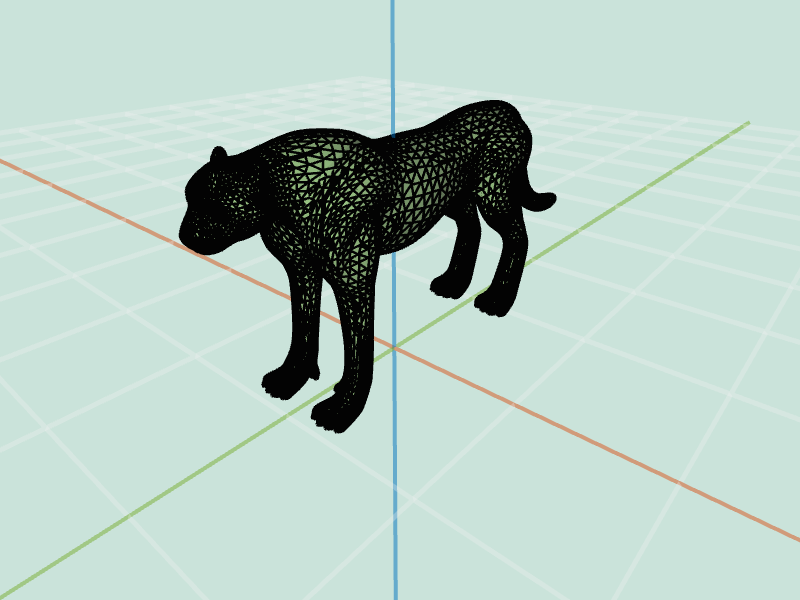 |  |
| Tetrahedron: `1` | Tetrahedron: `3` | Cheetah: `1` | Cheetah: `3` |

|   |   |   |
|:-:|:-:|:-:|
| 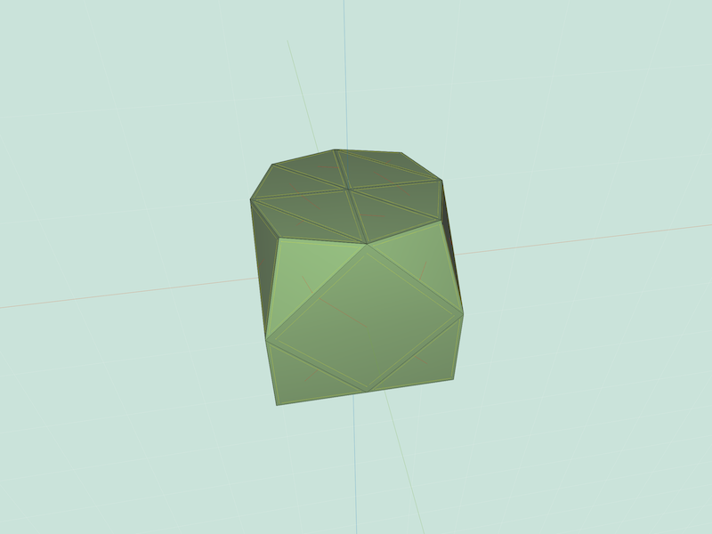 | 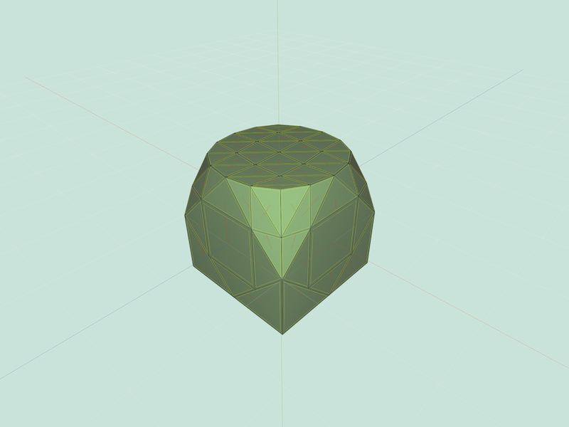 |  |
| Selection of Cube: `1` | Selection of Cube: `2` | Selection of Cube: `3` |

### (1.5) Quad Topology
`quadSubdiv(mesh, levels)` recursively splits each selected face into quadrilaterals. This effect is applied `levels` number of times. During each iteration, subdivide every $N$-sided face into $N$ quads by creating a new vertex in the center of every face that is connected to new vertices at the midpoint of every edge. Note that this method does not alter the geometry of the shape --- only the topology.

|   |   |   |
|:-:|:-:|:-:|
|  |  |  |
| Entire Cube: `1` | Entire Cube: `2` | Entire Cube: `3` |

|   |   |   |
|:-:|:-:|:-:|
|  |  |  |
| Selection of Cube: `1` | Selection of Cube: `2` | Selection of Cube: `3` |


### (1.5) Catmull-Clark Subdivision
`catmullClark(mesh, levels)` recursively applies Catmull-Clark subdivision to each selected face in the mesh. This effect is applied `levels` number of times. During each iteration, each face is split into quads and then updated using the Catmull-Clark rules as described in lecture and precept.

For full credit, you will again need to be extremely careful when updating vertices on the border of a selection. For these vertices, use the boundary weights presented in lecture (which approximate a spline; they are used both for Catmull-Clark and Loop). Note that after subdivision, adjacent even and odd vertices (i.e. edge vertices) along the border will share non-triangular boundary faces; however, they might not all agree on the plane of the face! Therefore, it is necessary to further subdivide these boundary faces. This process is more complex than in Loop because we need any faces that share an edge with our selection border to be triangles (to ensure co-planarity), however the face-subdivision scheme used in Catmull-Clark is quad topology, which does not produce triangles. Therefore, it is not possible to conveniently group the boundary faces into an existing subdivision call, as it was in Loop. Instead, we recommend iterating through all the boundary faces at the end of each "level", and applying a modified triangle topology subdivision to these faces, where odd vertices (those created by quad topology) are treated as pre-divided edge midpoints for the quasi-triangulation of triangle topology subdivision ("quasi-triangulation" because applying the triangle topology algorithm to a non-triangulated face may produce a non-triangular face in the center of the subdivided polygon, but such a face would only share an odd vertex with our boundary; odd vertices along the boundary do not move from their original position, and so this non-triangular face is guaranteed to still be planar, so long as the original face was planar).

As an alternative to the weights described in lecture, it may be easier to implement the Catmull-Clark mask as follows: each face-point $f$ receives the position of the face centroid; each edge-point $r$ receives the average of all its neighbor vertices after the quad subdivision is applied; and point vertices $p$ --- including extraordinary vertices --- of degree $n$ receive $\frac{F + 2R + (n - 3p)}{n}$, where $F$ is the average centroid position of the $n$ faces incident to $p$, and $R$ is the average of the $n$ vertices neighboring $p$ after the quad subdivision is applied.

|   |   |   |
|:-:|:-:|:-:|
|  |  |  |
| Cube: `1` | Cube: `2` | Cube: `3` |

|   |   |   |
|:-:|:-:|:-:|
|  |  |  |
| Cube: `1` | Cube: `2` | Cube: `3` |

|   |   |   |
|:-:|:-:|:-:|
|  |  |  |
| Dodecahedron: `1` | Dodecahedron: `2` | Dodecahedron: `3` |

|   |   |   |
|:-:|:-:|:-:|
|  |  |  |
| Dodecahedron: `1` | Dodecahedron: `2` | Dodecahedron: `3` |

|   |   |   |   |
|:-:|:-:|:-:|:-:|
| 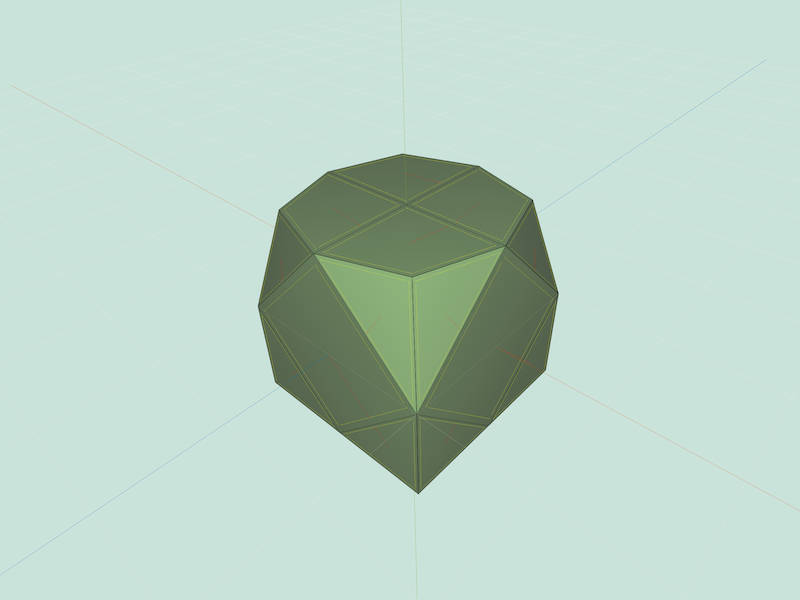 | 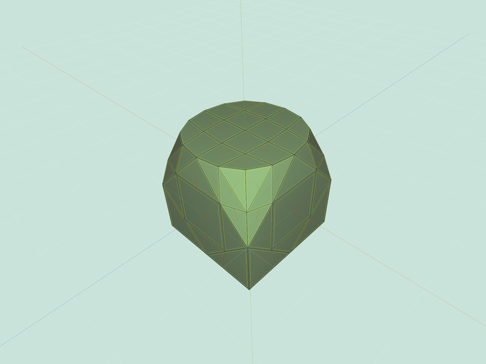 | 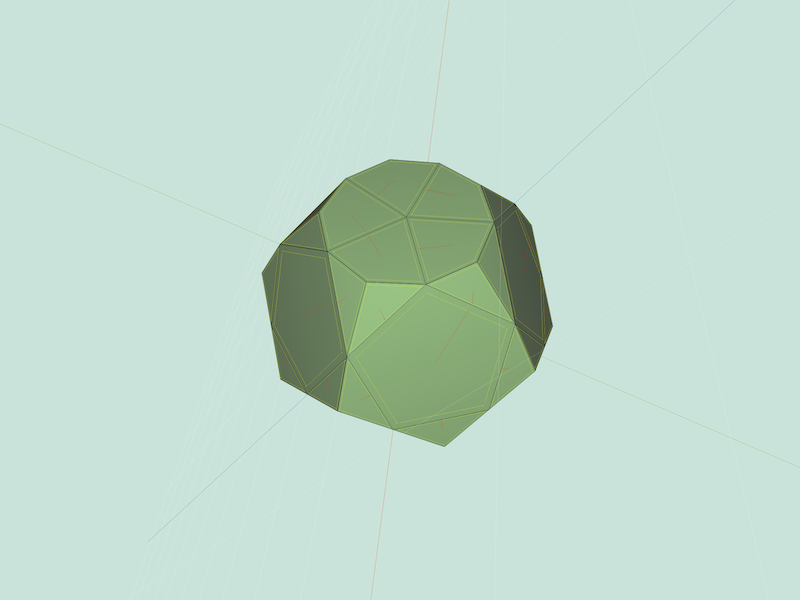 | 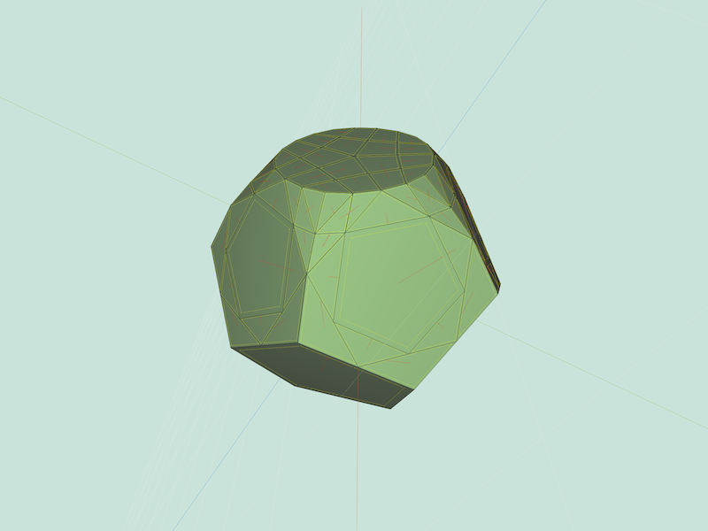 |
| Selection of Cube: `1` | Selection of Cube: `2` | Selection of Dodecahedron: `1` | Selection of Dodecahedron: `2` |

|   |
|:-:|
| 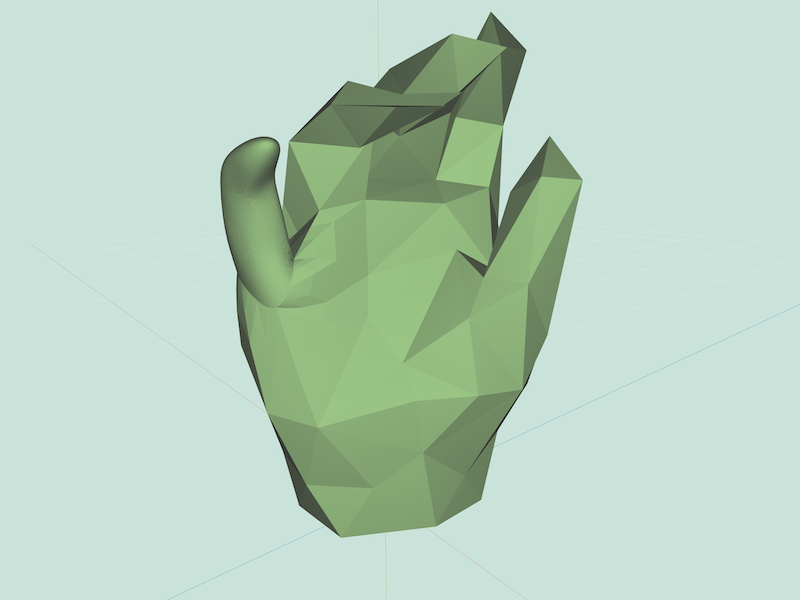 |
| Selection of Simple Hand: `2` |
