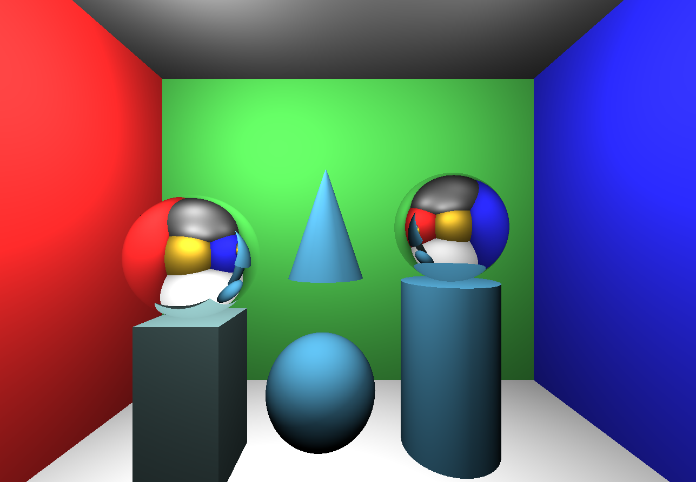
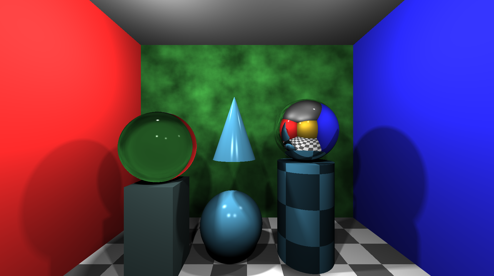

---
# Assignment Name
assignmentName: "Raytracer"
# Assignment Number
assignmentNumber: 3
# Are the specs published yet?
available: true
# Submission url
submitURL: ""
# Feedback url
feedbackURL: ""
# Is this assignment listed on the assignments page?
visible: true
# Assignment due date
dueWeek: 9
dueDay: 'Monday'
dueTime: '11:55pm'
# Name as displayed on materials page
calendarName: "Assignment 3 (Raytracer)"
# Image for assignment
imageName: "assignment_3"
# Brief description of assignment
description: "Build a raytracer that approximates the behavior of light to realistically render scenes."
# Scoring parameters
# Total points for required features, R
requiredPoints: 14
# Non-diminishing cutoff for optional features, N
optionalPoints: 6
# Diminishing return numerator
dimReturnTop: 3
# Diminishing return denominator
dimReturnBottom: 4
---
# Overview
In this assignment you will implement the core components of a photorealistic raytracing engine. This includes the raytracing pipeline, basic light simulation, simple surfaces reflectance, and assorted ray intersections.

The purpose of this assignment is to introduce you to fundamental path-tracing concepts, reinforce your understanding of the rendering equation, as well as what simplifications and approximations we must make to the rendering equation (at the cost of realism) to achieve an efficient runtime.

### A Bit Of History
The origins of raytracing can be traced all the way back to the 16th century, when Renaissance artist [Albrecht Dürer](https://en.wikipedia.org/wiki/Albrecht_D%C3%BCrer) described a now-famous painting technique that uses a grid layout to help the painter realistically capture their subject.

At the dawn of Computer Graphics, extensive research was poured into photorealistic image synthesis. One of the first major breakthroughs was defining analytical reflectance functions that model the behavior of light when it strikes a surface. These *bidirectional reflectance distribution functions*, or BRDFs, allowed us to compute first-order approximations of how light propagates across a scene. One of the most famous and efficient BRDFs (although not physically accurate) is the *Phong Reflection Model*, which was developed by University of Utah graduate student and graphics pioneer [Bui Tuong Phong](https://en.wikipedia.org/wiki/Bui_Tuong_Phong) in 1973. Around this time Phong wrote, "We do not expect to be able to display the object exactly as it would appear in reality, with texture, overcast shadows, etc. We hope only to display an image that approximates the real object closely enough to provide a certain degree of realism." Unfortunately, Phong was not able to live to prove himself wrong, as he passed away from Leukemia in 1975 at the young age of 32; however, his reflection model has remained one of the most popular and important BRDFs used in computer graphics due to its balance between quasirealism and speed.

Modern raytracing began in the early 1980s following [Turned Whitted's](https://en.wikipedia.org/wiki/Turner_Whitted) research into the rendering equation and recursive ray tracing algorithms. Although computational image synthesis achieved photorealism for certain scenes before the end of the 1980s, the process was impractically slow for computers of the day. *Toy Story* --- the first feature-length animation --- did not come out until 1995, but it used a rasterization rendering pipeline (which we use in most video games today) over raytracing for practical considerations. In fact, the industry had to wait until the release of *Monster House* in 2006 for a first fully path-traced feature film to hit theatres.

In its day, *Toy Story* would have taken a single computer over **6.5 years** to render. Today, a high-end consumer graphics card could render *Toy Story* in real time at 90fps. Needless to say, the computational horsepower of our modern machines is lightyears ahead of where the graphics industry began. For over a decade, nearly all feature-length films now use raytracing for their CGI, and modern animations are more-or-less [exclusively path-traced](https://graphics.pixar.com/library/PathTracedMovies/paper.pdf).

While rasterization is still the preferred technique for rendering scenes where efficiency is critical (such as in video games), even this is beginning to change as modern graphics cards now have hardware support for realtime raytracing. Speaking of which, when this raytracing assignment was first designed in the early 1990s, rendering a single output image could take up to an hour. Today, even mediocre laptops are fast enough to raytrace the scenes in realtime (roughly), which allows for fluid camera movement and other user interaction.

### Getting Started
This assignment is a bit different than previous assignments because it only has a batch mode.

To get started, download this <assignment-link>zip file</assignment-link> and unzip it on your computer.

### Setting Up a Development Webserver
Next, change to the subdirectory `COS-426-Assignment-3` and run the command `python3 -m http.server` in the terminal. (That command is for python 3. In python 2.7 it should be `python -m SimpleHTTPServer`. Note that there are many other ways to start a web server, as discussed in the Assignment 0 specifications). A web server will be launched locally on your computer, rooted at this directory.

Once you have started the local web server, direct your browser to `http://localhost:8000`. If you have done everything correctly up to this point, you should see a black screen. Verify that there are no errors in your console (if there are, see the next section).

As always, it will be necessary for you to temporarily disable your browser caching, or else changes you make to your code during development may not necessarily be reflected on the web page even after a hard refresh! **Many students skim over this step and struggle to get started.** Refer to the Assignment 0 specifications for details on how to do this.

### Troubleshooting
Most machines should be ready to go without any additional steps. However, if you are running an old operating system (e.g. macOS High Sierra) and have a dedicated NVIDIA graphics card, there may be a bug in some of the built-in graphics drivers that will break this assignment. If you have an affected machine (likely a high end MacBook Pro or iMac from 2014 or earlier that is still running an old operating system), you must do one of the following three things:

* Install the latest [Web Driver](https://images.nvidia.com/mac/pkg/387/WebDriver-387.10.10.10.25.161.pkg) directly from NVIDIA. Note that installing this driver will also install the "NVIDIA Driver Manager" for switching between macOS and NVIDIA drivers. Once the driver manager is installed, click the NVIDIA logo in the top right tray and make sure "NVIDIA Web Driver" is selected. This is the recommended option for patching the bug --- once you are using the latest web driver, you can be sure the bug isn't affecting you.

* Disable the NVIDIA card, either through the BIOS or with a tool like [gfxCardStatus](https://gfx.io/). This should get the job done, as the integrated Intel GPUO drivers don't have any issues. However, it is less recommended because integrated chips are slower, and Chrome may try to use the discrete card in spite of gfxCardStatus even when passing the `--force_integrated_gpu` flag. You can check whether the current Chrome window is using the NVIDIA card by navigating to "about:gpu".

* Use a different computer for Assignment 3 :(

If you have any doubts as to whether one of the fixes above has been correctly applied, please ask on <piazza-link></piazza-link>. If it has not been patched, correct code will sometimes still work (but not always).

Unfortunately, it may require some experimentation to find a computer/browser combination that works for you. If you cannot find a good development combination on your own computer, try using a computer running on one of Princeton's computing clusters.

We have tested heavily on Chrome, and Firefox on MacOS and these seem to work well.

### UI Tour
The raytracing program's user interface is rather different than those of previous assignments. In particular, there are several changes to make a note of:

* **Batch mode only:** In this assignment, the raytracer only works in batch mode, as there are relatively few parameters to specify.

* **Parameters:** The raytracer specifies parameters on the command line, for example:  `index.html?scene=default&width=600&height=400` --- this names the scene and sets the dimensions. If you omit the scene name it will use `default`'. The scenes are specified in a JSON format in the folder `scenes/` and the default scene (for example) is found in `scenes/default.json`. The width and height default to full screen.

* **Camera:** You can rotate the camera using the mouse, and move forward and backward using the up and down keys. If the frame rate is too clunky (which you should expect to happen near the end of the assignment), we recommend reducing the size of the rendering window.

* **Image capture:** Pressing the `I` key captures an image of the current rendering. (In different browsers you may get slightly different behavior. In Chrome it should force a download, while in some other browsers, it may open in the captured image in a different window or tab). The resulting file will have a PNG encoding; however, you may need to add the file extension `.png` to your download.

### How to Program the Features
Here is a quick overview of the interesting subdirectories for this assignment:

* `coursejs/`: infrastructure code for the GUI and raytracer.

* `js/`: contains a single file, `js/student.js`, which you should fill out with your information.

* `scenes/`: contains `.obj` and `.json` files that represent different scenes for rendering. We provide two scenes for you to use to test with your raytracer: `scenes/default.json` and `scenes/mesh.json`. You may choose to create your own scene as a non-required feature, which should be added here.

* `shaders/`: contains a fragment shader and a vertex shader GLSL program. The former of these two files contains the raytracer implementation.

To make your first edit use your favorite text/code editor (we recommend VSCode and Atom) to edit the file `js/student.js` and fill in your name and NetID. Reload the web page in your browser, and now your information should appear above the image. **You should do this for every assignment.**

To implement the raytracing features listed below, **you only need to edit the file `shader/fragmentShader.frag`**, which implements the ray tracer. The vertex shader program in the same directory does not require any modification.

For this assignment, you will be coding almost exclusively in GLSL. It is a powerful language, but tricky to debug. We recommend making small, incremental changes to the code as you edit; reload the page often. Note that a compiler error in the shader code will pop up as an alert in JavaScript. For tips on GLSL, see the FAQ below for useful links to references; the precept slides may also prove helpful.

Before getting started with coding, make sure the downloaded code works on your computer and browser. As mentioned earlier, when you  first launch the raytracer, you will not be able to see anything (just a black scene), but you should verify that there are no errors in your console.

### GLSL
Part of the [OpenGL](https://www.opengl.org/documentation/) specification is the [OpenGL Shading Language (GLSL)](http://docs.gl/sl4/acos). GLSL is a C/C++ flavored programming language and is used to write simple shaders that execute directly on the GPU.

Following increasing demands for hardware-accelerated graphics content on the Web, the Google Chrome team (subsequently followed by the other major browser developers) adapted the native-based OpenGL API into the browser-based [WebGL JavaScript API](https://developer.mozilla.org/en-US/docs/Web/API/WebGL_API). The latest major release of WebGL, WebGL 2.0, exposes the OpenGL ES 3.0 API, and allows website developers to include GPU-accelerated rendering, physics, image processing, and other effects in HTML5 canvas elements. One of the most appealing features of WebGL is that it ensures cross-browser and cross-platform support for WebGL-based graphics project.

Because of these recent advances, it is now possible to build and share portable, realtime raytracing programs for websites (i.e. this assignment)! Unfortunately, while shading languages like GLSL have incredible expressive capacity, they also tend to have steep learning curves. One possible resource for learning GLSL is the [Learn OpenGL tutorial](https://learnopengl.com/Getting-started/Shaders). We also recommend the wonderful, aesthetically pleasing, and interactive [Book of Shaders](https://thebookofshaders.com/), from which past students have occasionally drawn to inspire their art projects. If you are looking for more examples, check out [Shadertoy](https://www.shadertoy.com/), which not only contains a library of thousands of community-built shaders, but also provides a WebGL sandbox for building and editing shaders in real-time.

As a final note, GLSL can be very tricky to debug. At the very least, a GLSL linter is **highly recommended**, if not absolutely necessary altogether, for this assignment in order to at least catch syntax errors. All major code editors should have package support for GLSL syntax highlighting and linting.

### EPS and INFINITY
At the top of `shaders/fragmentShader.frag`, we define a constant called `EPS`, which is set to a small floating point number. Similarly, `INFINITY` is set to a large floating point number.

Comparing two floating point numbers for equality is only reliable within some margin due to the [IEEE floating point specification](https://en.wikipedia.org/wiki/Single-precision_floating-point_format#IEEE_754_single-precision_binary_floating-point_format:_binary32), which cannot represent all floating point numbers exactly. So to check if two floats are equal, we usually will look for `abs(a - b) < EPS`.

In raytracers, it is often necessary to include floating point math in order to compute intersections with objects in the scene as precisely as possible. Thus, when we are interested in checking for equality with zero, we will actually test for `abs(a) < EPS` (take this to mean "equal to zero").

Lastly, we will use `a >= INFINITY` to mean that a point is at infinity, or "out of the bounds of our scene." This case should trigger within the raytracer whenever a ray does not intersect anything in the scene.

### Debugging Tips
In general, graphics programs are very challenging to debug --- especially raytracers. Unfortunately, our handy built-in JavaScript debugger cannot help us debug our GLSL shader. Instead, you will need to rely on your eye and your sharp engineering instincts.

Nevertheless, here is a short list of some common issues that crop up in this assignment:

* Speckling and other noise are usually caused by floating point imprecision. It may help to add some "padding" of `EPS` to your computations to nudge the numbers in correct direction.

* Always check your normal vectors. In general, it is a good practice to keep these normalized, since many computations depend on this fact.

* Weird shading or patterns on your objects could mean that the normal vectors themselves are not in the correct direction.

* Objects appearing black could be caused by normal vectors not points in the correct direction, or the intersections with them not being correct at all. Remember that you should return the closest intersection greater than `EPS` (i.e. the closest intersection that is in front of the ray), when there is more than one candidate for intersection.

* You might have a GLSL syntax error. To prevent wasting your time, it is **highly recommended**, in not absolutely necessary, that you install both a GLSL syntax highlighter and a GLSL linter. All major code editors should have package support for these features.

This list is, of course, not exhaustive.

### Hints
A few hints:

* Attempt the simplest operations first. Note, however, there are some dependencies in this assignment. For example, you will need to implement the raytracing pipeline before any of the other features.
* Please make a public post on <piazza-link></piazza-link> if you have a question.
* Take note of the <internal-link href="/#late-policy">late policy</internal-link> and the <internal-link href="/#collaboration-policy">collaboration policy</internal-link>.

### FAQ
Here are some answers to frequently asked questions. Check back here occasionally, as we may add FAQs to this list:

* **What browsers are supported?**

   The code has been pretty heavily tested on Chrome and Firefox running on macOS, but it is still possible it will not work on some configurations of these browsers. In the past, we have seen problems in Safari, but these may have been resolved since we last tested. If you load the page and see errors in your console, or black after completing `traceRay`, try a different browser or a different computer.

* **What version of GLSL are we using?**

   In this assignment, we are using WebGL 1.0, which is an implementation based on OpenGL ES 2.0 that runs in your browser. WebGL only accepts shader programs that conform to the GLSL ES 1.00 specification.

* **My frame rate is really slow. Is something wrong?**

   Probably not. Until neural networks exploded last decade, raytracing was the most computationally expensive task a COS major would have expected to implement for a course. Because our raytracer is simple and modern hardware is relatively fast, you might get 60fps, but as you add advanced (distributed) effects like soft shadows, the number of ray intersections you are shooting into the scene will increase exponentially, and your frame rate will plummet accordingly. If you are running into serious trouble, try disabling taxing features (like soft shadows) using a global toggle, and consider treating the your program more like a static renderer that is not expected to respond to user input. Note that you can still edit the camera position via the scene description.

* **Why doesn't my scene look like real life?**

   In this assignment, you are only implementing a simple raytracer --- there are a number of complex light interactions that we are ignoring. If you want to build a photorealistic raytracer, take COS 526: Advanced Computer Graphics!

* **Where can I learn more about GLSL?**
    You shouldn't have much to learn if you already know C. There are many resources online, including these:

    * [OpenGL ES 2.0 / GLSL ES 1.0 Quick Reference Card (see pages 3-4 for GLSL)](https://www.khronos.org/opengles/sdk/docs/reference_cards/OpenGL-ES-2_0-Reference-card.pdf)

    * [A general introduction to OpenGL (WebGL) and GLSL](https://open.gl/introduction)

    * [OpenGL ES Shading Language Reference](http://www.shaderific.com/glsl/)

    * [An overview of differences between C and GLSL](https://www.opengl.org/wiki/Core_Language_%28GLSL%29)

    * [Examples and interactive sandbox for GLSL shader programs](http://glslsandbox.com/)

    * [Learn OpenGL tutorial](https://learnopengl.com/Getting-started/Shaders)

    * [Book of Shaders](https://thebookofshaders.com/)

# Deliverables

### Submitting
You should submit your solution via <submit-link>CS Tigerfile</submit-link>. The submitted zip file should preserve the directory structure of the skeleton code we provided in the zip file above. If you like to include larger files, that exceed the CS Tigerfile file size limitations, you can put these files in your own web space, Google Drive, Dropbox, etc. and then include a link to that in the write-up.

### Formatting
If your submission is too big for the CS Tigerfile, please first try to convert some of your results to the lossy `.jpg` format, if possible. You may include one or a few `.gif` files to show animations, but these files can be large so please try not to include lots of large gifs.

Note that you are expected to use good programming style at all times, including meaningful variable names, and a few comments describing what the code is doing, etc. Partial credit may not be assigned for code without comments. You should strive to style your code as cleanly and as clearly as you would style a COS 217 assignment.

### Writeup
The `writeup.html` file should be an HTML document demonstrating the effects of the features you have implemented and would like scored; ***make sure to also complete the collaboration statement.*** We recommend that you capture screenshots using the `I` key of your results incrementally --- that is, as you work through the assignment.

For this assignment, please provide results for the given scenes, if and only if they are relevant to the feature that you have implemented. You will probably provide mostly example screenshots of the `scenes/default.json`, but will need to use `scenes/mesh.json` to show us your triangle intersection code, for example.

You should start from the the example `writeup.html` provided. At the top of that file are a list of features that you might implement, linking to the section where you talk about them. Please remove any features that you do not implement from the list as well as the corresponding sections, but otherwise leave this header section intact. Please put effort into your `writeup.html` as this is the file we spend the most time grading.

***Do not, under any circumstances, share any component of your writeup (text and images) with another student, even if you partnered with the student when composing your JavaScript solutions.***

### Scoring
This assignment is worth **<total></total>** points. The list of features that you need implement is provided below (roughly ordered from easiest to hardest). The number in front of each feature corresponds to how many points the feature is worth for the full implementation. Partial or partially-correct solutions will receive partial credit. The features marked with an asterisk are required. All other features are optional.

The plane intersection is already implemented for you as an example. If you correctly implement all the required features, you will receive **<required></required>** points. Full credit for this assignment is <total></total> points, so to complement the required features, you may choose from the optional features listed below, as well as participate in the art contest (which yields one point for participation and two for winning).

Note that it is possible to earn more than <total></total> points for this assignment; however, the value of non-required features incurs *diminishing returns* after the first **<optional></optional>** points. For sums of non-required features (`n` `>` <optional></optional>), each point beyond <optional></optional> will accrue a value **<dim></dim>** that of the previous point.

Your final score is a function of the following variables, rounded to the nearest `0.5`:
* **`r`**: your score on the required features  (up to `R` `=` <required></required> points)

* **`n`**: your score on the non-required features (a diminishing value `n` `>` `N` `=` <optional></optional>) .

* **`a`**: your participation in the art contest (`1` point for participating, `1.5` points for being selected for gallery, or `2` points for winning).

* **`d`**: the diminishing return factor (`d` `=` <dim></dim>)

Given these inputs, the formula for your final score as a JavaScript function is:
```javascript
function computeFinalScore(r, n, a, d, R, N) {
    const requiredFeatureScore = Math.min(R, r);
    const optionalFeatureScore = Math.min(N, n);
    const extraFeatureScore = Math.max(n - N, 0);
    const diminishingExtraScore = d * (1 - Math.pow(d, extraFeatureScore)) / (1 - d);
    const artContentScore = a;

    const floatingPointScore = (
        requiredFeatureScore
        + optionalFeatureScore
        + diminishingExtraScore
        + artContentScore
    );
    const finalScore = Math.round(floatingPointScore * 2.0) / 2.0;
    return finalScore;
}
```

To facilitate this computation, please take advantage of the following score calculator, which automatically computes your total score using the above formula and your provided inputs.

### Score Calculator

<div>
    <score-calculator></score-calculator>
</div>


# Assignment Features

## Raytracing Pipeline
To start, you will complete the higher-level functions of a raytracer to get a better intuition of what a raytracer is doing at a high level, before diving into implementing more of the finer details and behaviors. For this part, you will fill in code for the `traceRay` and `calculateColor` functions.

We recommend skimming over the struct definitions located at the top of the `shaders/fragmentShader.frag` file before continuing. We also suggest that you read over the entire assignment specifications for the Raytracing Pipeline in order to familiarize yourself with the code and what you have available to you.

### (1.0)\* Trace Ray
`vec3 traceRay(Ray ray)` traces a ray `ray` into the scene and returns a three-channel color.

On a step by step level, `traceRay` should:

1. Traces `ray` into the scene and finds an intersection using `rayIntersectScene`

2. If no intersection, terminate the raytrace and return the final result color as a `vec3`. This is a base case --- do not recur (i.e. trace) further.

3. Otherwise, compute the color at the point of intersection using `calculateColor`

4. Accumulate the color into a final result color (accumulation of color is additive; however, beware that distributed raytracing effects such as soft shadows and glossy reflection require a weighted average (integral approximation) of samples rays, with weights determined by how like a ray bounce in a particular distribution is to occur).

5. If appropriate, reflect/refract the ray through the intersected object and recur.

A material is neither refractive nor reflective if its reflectivity is "equal to zero" (that is, less than `EPS`). This is a sufficient case for terminating further tracing of the ray!

**A note on recursion:** We have unrolled the `traceRay` recursion into a for-loop for you. This is necessary because GLSL does not actually support recursion! While a single graphics cards can contain over a thousand times more cores than your CPU can, each core in your GPU (where this shader executes) has significantly less memory and computational power than any core in your CPU; there is a fundamental tradeoff here are the hardware level: you can have massively parallelized computations, or you can have complex computations, but you cannot have both. Thus, there are certain coding paradigms (like recursion) that we cannot include in our shader.

**A note on `rayIntersectScene`:** In `traceRay`, you are asked to use the provided `rayIntersectScene` function. If you look through the GLSL code, you may be wondering why the only reference to it is the following line:

```Cpp
float rayIntersectScene(Ray ray, out Material out_mat, out Intersection out_intersect);
```

This is a forward declaration of the function, whose body is actually dynamically generated as a string in JavaScript and then appended to the GLSL source code before the GLSL compiler is called, hence the need for the declaration. The reason we do this is purely for performance --- it allows us to hardcode the geometry of the scene into the function, which is more efficient than parsing a XML scene specification directly within GLSL.

Once you have filled out `traceRay`, refresh your browser and you should see the walls of the Cornell Box in this scene with their diffuse material colors. You are able to see these walls because the plane intersection code is provided as an example. If you are not able to see this, make sure that `SOFT_SHADOWS` is set to `0`.

Note that you can use your mouse and keyboard to move around and interact with the scene.

|   |
|:-:|
|  |
| A Cornell Box |

### (1.0)\* Calculate Color
`vec3 calculateColor(Material mat, vec3 posIntersection, vec3 normalVector, vec3 eyeVector, bool phongOnly)` returns the color radiating in the direction `eyeVector` from the point at `posIntersection` with surface normal `normalVector` and  material `mat`. `phongOnly` is `true` if and only if the material does not exhibit diffuse (Lambertian/matte) reflectance.

The provided `calculateColor` function returns the diffuse color associated with the hit material; it does not take any of the lighting in the scene into account. You will need to add direct lighting from all of the lights in the scene by looping over the `MAX_LIGHTS` and calling the function `getLightContribution` with the appropriate arguments (see the function signature above `calculateColor`). All of the lights in the scene are stored in a uniform GLSL array called `lights` --- light `i` is available at `lights[i]`.

Accumulate the contribution of each light in the scene into the variable outputColor and return the total, which represents the direct lighting contribution.

**A note on lighting:** `MAX_LIGHTS` and `numLights` are artifacts from old OpenGL lighting pipelines. `MAX_LIGHTS` defines the maximum number of lights supported by the shader, and `numLights` defines the number of lights actually in use. Be sure to break your loop over `MAX_LIGHTS` if `i` ever exceeds `numLights`.

After completing this, you should see a brighter box:

|   |
|:-:|
|  |
| A Cornell Box with Direct Lighting |

Congratulations! You can now fire rays into a scene, intersect with planes, and compute direct lighting within the scene!

## Ray Intersections
Next, let's add the ability to intersect with other types of objects.

For the various ray-object intersection functions, we recommend that you use the provided `findIntersectionWithPlane` and `rayGetOffset` helper functions. Be sure to read through these so you understand how they work, and so that you get an idea of how to implement the other intersection functions.

Each intersection function should fill out the `Intersection` object passed into it with information about the intersection, if one exists, by storing the position of the intersection in the `position` field and the normal vector (**normalized** to unit length) at the point of intersection in the `normal` field.

Be careful to return the **closest** intersection with the object. You may find the provided helper function `chooseCloserIntersection` useful for this.

These functions should return `INFINITY` if the ray does not intersect the object. Note that intersections at time `t < EPS` should not count as true intersections, since these are usually false intersections with the surface whence the ray originates. Recall that we treat values less than `EPS` as being equivalent to zero. This case usually pops up when tracing secondary rays through the scene.

*Debugging note:* As you move forward, note that visual artifacts are commonly caused by not properly returning the closest intersection or not properly calculating the surface normal at the point of intersection, among other things.

### (0.0)\* Plane
`float findIntersectionWithPlane(Ray ray, vec3 norm, float dist, out Intersection intersect)` computes the intersection of `ray` with the plane defined by normal `norm` and distance `dist` (this is the [general form of a plane](https://en.wikipedia.org/wiki/Plane_(geometry)#Point-normal_form_and_general_form_of_the_equation_of_a_plane)). If no such intersection exists, this function returns `INFINITY`. Otherwise, the fields `position` and `normal` of intersection `intersect` are assigned the intersection point surface normal of the ray intersection, respectively. You may want to look at `rayGetOffset`. Finally, the distance from the origin of `ray` to the intersection point is returned.

We have provided you with the implementation of plane intersection as an example.

### (2.0)\* Triangle
`float findIntersectionWithTriangle(Ray ray, vec3 t1, vec3 t2, vec3 t3, out Intersection intersect)` computes the intersection of `ray` with the triangle defined by points `t1`, `t2`, and `t3` (in counterclockwise order). If no such intersection exists, this function returns `INFINITY`. Otherwise, the fields `position` and `normal` of intersection `intersect` are assigned the intersection point surface normal of the ray intersection, respectively. You may want to look at `rayGetOffset`. Finally, the distance from the origin of `ray` to the intersection point is returned.

Feel free to use any of the three approaches for computing this intersection that we discussed in lecture (and we encourage you to do so). You will probably want to call `findIntersectionWithPlane` from somewhere within your implementation.

This said, are also welcome to implement the more efficient yet more challenging [Möller-Trumbore algorithm](https://www.scratchapixel.com/lessons/3d-basic-rendering/ray-tracing-rendering-a-triangle/moller-trumbore-ray-triangle-intersection), ***but do not look at example code for this algorithm under any circumstances***, even though it is readily available online --- you are only permitted to look at descriptions, mathematics, and diagrams when composing your solution. Note that the Möller-Trumbore algorithm is the industry standard for computing ray-triangle intersections in production.

### (2.0)\* Sphere
`float findIntersectionWithSphere(Ray ray, vec3 center, float radius, out Intersection intersect)` computes the *closest* intersection of `ray` with the sphere defined by center `center` and radius `radius`. If no such intersection exists, this function returns `INFINITY`. Otherwise, the fields `position` and `normal` of intersection `intersect` are assigned the intersection point surface normal of the ray intersection, respectively. You may want to look at `rayGetOffset`. Finally, the distance from the origin of `ray` to the intersection point is returned.

### (2.5)\* Axis-aligned Box
`float findIntersectionWithBox(Ray ray, vec3 pmin, vec3 pmax, out Intersection intersect)` computes the *closest* intersection of `ray` with the axis-aligned spanned between the points `pmin` and `pmax`. If no such intersection exists, this function returns `INFINITY`. Otherwise, the fields `position` and `normal` of intersection `intersect` are assigned the intersection point surface normal of the ray intersection, respectively. You may want to look at `rayGetOffset`, as well as `findIntersectionWithPlane`. Finally, the distance from the origin of `ray` to the intersection point is returned.

For you convenience, we recommend the following simple approach:

1. Create a helper function that takes the bounding points of the box and some arbitrary point and returns whether or not that point is inside the box (that is, within a distance `EPS` to the box).

2. Iterate over the sides of the box. For each side, intersect `ray` with the appropriate plane, and then call your helper function from part (1) to determine whether or not that intersection is within the box. Note the similarity of this strategy to ray-triangle intersections described in lecture.

3. Return the closest of these intersections that is greater than `EPS`.

You are welcome to implement a more optimal approach if you are interested and have extra time. For example, you might want to only intersect your ray with the front-facing (i.e. camera-visible) faces of the box.

Here is the `default.json` scene with sphere and box intersections. Two of the spheres have reflective/refractive materials (both appear as mirror reflective materials for now, until you implement transmission rays below), while the third is diffuse. The blue box itself is also diffuse:

|   |
|:-:|
|  |
| Sphere and Box Intersections |

Here is the `mesh.json` scene, which showcases triangle and box intersections:

|   |
|:-:|
|  |
| Triangle and Box Intersections |

### (2.0) Cylinder
`float findIntersectionWithCylinder(Ray ray, vec3 center, vec3 apex, float radius, out Intersection intersect)` computes the *closest* intersection of `ray` with the cylinder spanned from points `center` to `apex` with radius `radius`. If no such intersection exists, this function returns `INFINITY`. Otherwise, the fields `position` and `normal` of intersection `intersect` are assigned the intersection point surface normal of the ray intersection, respectively. Finally, the distance from the origin of `ray` to the intersection point is returned.

Note that `findIntersectionWithCylinder` is already filled out for you: it breaks the problem up into an open cylinder and its two end caps, modeled as discs. Thus, you will need to implement both `getIntersectOpenCylinder` and `getIntersectDisc` to complete this geometry intersection filter.

The equation for an infinite cylinder of radius $r$ is given by $x^2 + z^2 + r^2 = 0$. Solutions for points $\vec q = (x, y, z)$ on an infinite cylinder with axis $\vec p_a + \vec v_a t$ are given by the parametric equation for a cylinder:

$$
\left\lVert \vec q - \vec p_a - \left( \vec v_a \cdot \left(\vec q - \vec p_a \right) \right)\vec v_a \right\rVert^2 - r^2 = 0
$$

To test if our ray $\vec p_r + \vec v_r t$ intersects with this infinite cylinder, we must substitute $q = \vec p_r + \vec v_r t$ and solve for $t$ --- the distance or distances along our ray that intersect with the cylinder.

$$
\left\lVert \left(\vec p_r + \vec v_r t\right) - \vec p_a - \left( \vec v_a \cdot \left(\left(\vec p_r + \vec v_r t\right) - \vec p_a \right) \right)\vec v_a \right\rVert^2 - r^2 = 0
$$

This factors into quadratic form! If we let $\vec v_d = \vec p_r - \vec p_a$, $\phi = \vec v_d \cdot \vec v_a$, and $\theta = \vec v_r \cdot \vec v_a$, we have:

$$
\begin{aligned}
a & = \left\lVert \vec v_r - \theta \vec v_a \right\rVert^2 \\
b & = 2\left(\vec v_r - \theta \vec v_a \right) \cdot \left(\vec v_d - \phi \vec v_a \right) \\
c & = \left\lVert \vec v_d - \phi \vec v_a \right\rVert^2 - r^2 \\
\end{aligned}
$$

This will give us up to two solutions for $t$. At this point, you can throw out any negative solutions, which will leave you with the correct infinite cylinder intersections. Our cylinder, however, is not infinite, so we must constrain our solutions further using its vertical span. Let's say the center of the two caps on the cylinder are given by $\vec p_1$ and $\vec p_2$, such that $\vec v_a$ spans **from** $\vec p_1$ to $\vec p_2$. We see that the following relations must hold:

$$
\begin{aligned}
\vec v_a \cdot \left(\vec q - \vec p_1 \right) & > 0 \\
\vec v_a \cdot \left(\vec q - \vec p_2 \right) & < 0 \\
\end{aligned}
$$

To test this, plug $q = \vec p_r + \vec v_r t$ again, where $t$ is any positive solution to quadratic equation we solved above. Any solution $t$ that satisfies both constraints is a valid intersection with the finite cylinder. You should return the nearest (least positive) $t$.

Finally, you will need to test for intersections on the end caps. The intersection formulae for the bottom and top caps, respectively, are given by:

$$
\begin{aligned}
\vec v_a \cdot \left(\vec q - \vec p_1 \right) & = 0 \text{, and } \left\lVert \vec q - \vec p_1 \right\rVert^2 < r^2 \\
\vec v_a \cdot \left(\vec q - \vec p_2 \right) & = 0 \text{, and } \left\lVert \vec q - \vec p_2 \right\rVert^2 < r^2 \\
\end{aligned}
$$

You should solve this by following similar techniques as you used above. As always, once you have determined all possible intersections with your closed cylinder, be careful to return the nearest.

### (3.0) Cone
`float findIntersectionWithCone(Ray ray, vec3 center, vec3 apex, float radius, out Intersection intersect)` computes the *closest* intersection of `ray` with the cone that spans from the `center` point (where the radius is `radius`) to the `apex` point. If no such intersection exists, this function returns `INFINITY`. Otherwise, the fields `position` and `normal` of intersection `intersect` are assigned the intersection point surface normal of the ray intersection, respectively. Finally, the distance from the origin of `ray` to the intersection point is returned.

Note that `findIntersectionWithCone` is already filled out for you: it breaks the problem up into an open cone and a single end cap, modeled as a disc. Thus, you will need to implement both `getIntersectOpenCone` and `getIntersectDisc` to complete this geometry intersection filter. We suggest attempting the Cylinder filter before starting this one.


The equation for an infinite double cone is given by $x^2 + z^2 - y^2 = 0$. Solutions for points $\vec q = (x, y, z)$ on an infinite double cone with conic axis $\vec p_a + \vec v_a t$ and half-angle $\alpha$ are given by the parametric equation for the geometry:

$$
\left\lVert \vec q - \vec p_a - \left( \vec v_a \cdot \left(\vec q - \vec p_a \right) \right)\vec v_a \right\rVert^2 \cos^2(\alpha) - \left(v_a \cdot \left(\vec q - \vec p_a \right)\right)^2\sin^2(\alpha) = 0
$$

To test if our ray $\vec p_r + \vec v_r t$ intersects with this infinite double cone, we must substitute $q = \vec p_r + \vec v_r t$ and solve for $t$ --- the distance or distances along our ray that intersect with the conic surface. This will again factor into quadratic form. As before, if we let $\vec v_d = \vec p_r - \vec p_a$, $\phi = \vec v_d \cdot \vec v_a$, and $\theta = \vec v_r \cdot \vec v_a$, we have:

$$
\begin{aligned}
a & = \left\lVert \vec v_r - \theta \vec v_a \right\rVert^2 \cos^2(\alpha) - \theta^2 \sin^2(\alpha) \\
b & = 2\left(\left(\vec v_r - \theta \vec v_a \right) \cdot \left(\vec v_d - \phi \vec v_a \right) \cos^2(\alpha) - \theta \phi \sin^2(\alpha) \right) \\
c & = \left\lVert \vec v_d - \phi \vec v_a \right\rVert^2 \cos^2(\alpha) - \phi^2\sin^2(\alpha) \\
\end{aligned}
$$

This will give us up to two solutions for $t$. Once more, you can throw out any negative solutions, which will leave you with the correct infinite double cone intersections. Our cone, however, is not only finite, but it is also not a double cone! Thus, we must constrain our solutions further using its vertical span. Let's say that the *apex* of the cone (the sharp point) is given by the axis origin, $p_a$, and that center of the single cap on the cone is given by $\vec p_c$. Note that $\vec v_a$ spans **from** $\vec p_a$ to $\vec p_c$. We see that the following relations must hold:

$$
\begin{aligned}
\vec v_a \cdot \left(\vec q - \vec p_a \right) & > 0 \\
\vec v_a \cdot \left(\vec q - \vec p_c \right) & < 0 \\
\end{aligned}
$$

To test this, plug $q = \vec p_r + \vec v_r t$ again, where $t$ is any positive solution to quadratic equation we solved above. Any solution $t$ that satisfies both constraints is a valid intersection with the finite open cone. You should return the nearest (least positive) $t$.

Finally, you will need to test for intersections on the single end cap. Follow the formulae for disc intersections provided at the end of the cylinder intersection guide. As always, once you have determined all possible intersections with your closed cone, be careful to return the nearest.

Here is the same default.json scene as before, but now with support for cylinder and cone intersections:

|   |
|:-:|
|  |
| Cylinder and Cone Intersections |

## Lighting Effects

### (1.0)\* Hard Shadows
`bool pointInShadow(vec3 pos, vec3 lightVec)` checks if position `pos` is visible (i.e. the first intersection) from the light position at `lightVec + pos` (`lightVec` itself is a relative offset). If so, it returns `false`; otherwise, it returns `true`, implying `pos` is in a shadow with respect to the light. You might want to use the `rayIntersectScene` function.

Note that `pointInShadow` is called from the function `getLightContribution`, which you used earlier in Calculate Color. `getLightContribution` returns black (`vec3(0.0, 0.0, 0.0)`) when the provided point cannot "see" the provided light (i.e. an object obstructs it). To determine this, it calls the `pointInShadow` function, which always returns false by default, hence the lack of shadows in the above example images.

|   |
|:-:|
|  |
| Hard (Simple) Shadows |

### (3.0) Soft Shadows
`float softShadowRatio(vec3 pos, vec3 lightVec)` use random sampling on the surface of a sphere (you can choose the radius and sample count) to approximate the fractional contribution of the light at position `lightVec + pos` to the intersection position `pos`.

In real life, lights do not emit photons from a single point (especially large area lights), which is why soft shadows are a common natural phenomenon. To implement soft shadows, you will need to cast multiple rays from the point to an area around the light, as suggested above.

First, randomly sample points with uniform density on the surface of a sphere around the light using the approach described [here](http://mathworld.wolfram.com/SpherePointPicking.html) in order to create your rays. Feel free to experiment with the radius of this sphere around the light. Also feel free to experiment with the number of points that you choose to sample. How many samples do you need in order to get good soft shadows?

For each of these randomly sampled points, cast a ray from the point in question to the sampled point. The fraction of the rays that make it through to the point (i.e. the percentage of points that can "see" the light) is the fractional contribution of that light to the point in question.

**A note on randomization in GLSL:** Unfortunately, GLSL does not provide any built-in psuedorandom number generators, so you will have to use a simple hash function that behaves like a random number generator. Take a look [here](https://stackoverflow.com/questions/4200224/random-noise-functions-for-glsl) and [here](https://thebookofshaders.com/13/) for some examples and further discussion on implementing randomness and noise. You are permitted to use code from online sources (copy and pasted) to inject "randomness" into your program, but be sure to leave a comment citing your source.

**A note on efficiency:** The process of casting multiple, randomly-sampled rays within a raytracer is referred to as *Distributed Raytracing*. Advanced raytracers use distributed techniques almost exclusively when synthesizing photorealistic images. The computational cost of these randomized samples, however, is not small --- in fact, you will find that adding distributed effects to your raytracer will exponentially increase the number of rays your program casts when rendering an image. As such, when you complete this filter, you will likely find that your frame rate plummets --- **do not be alarmed!** We provide a global variable `SOFT_SHADOWS` (defined at the top of the shader) that you can use in your `getLightContribution` function to toggle between simple/hard shadows and soft shadows. Set `SOFT_SHADOWS` to `0` for `false` or `1` for `true`. We recommend that you work through this assignment with `SOFT_SHADOWS = 0`, except when you are implementing this feature or creating glamour shots.

Note that you are free to reorganize and modify the `getLightContribution` function as needed in order to get your soft shadows working (although this should not be necessary).

The following examples show soft shadows, as computed using a varying number of shadow samples per intersection. **Look out for banding!** If you're not careful about how you randomly sample, you might see random grid-like or circular artifacts. Note that a slightly noisy result, as you see for low sample counts, is fine and even expected. In fact, uniform noise like this suggests that your implementation is probably correct. Note that in the below captions, `N` denotes the number of shadow rays cast per call to `softShadowRatio()`.

|   |   |   |
|:-:|:-:|:-:|
|  |  |  |
| `N = 4` | `N = 25` | `N = 625` |

These two examples provide closeups of soft shadows. Again, expect to see noisy soft shadows when you are not taking dense samples of your area lights. As a noise-reduction tip, try the stratified sampling approach (i.e. "jitter") discussed in the precept slides.

|   |   |   |
|:-:|:-:|:-:|
|  |  |  |
| `N = 25` | `N = 25` | `N = 100` |

### (2.0)\* Transmission
`vec3 calcReflectionVector(Material material, vec3 direction, vec3 normalVector,  bool isInsideObj)` returns the reflection or refraction direction (depending on the material) of a ray with direction `direction` that intersects material `material` with surface normal `normalVector`. If `isInsideObj` is `true`, then the ray is exiting the material and moving into air, which means the refraction ratio must be flipped.

Perfect reflection is already implemented for you. You must implement transmission to handle the refraction of rays through materials such as glass. This should all be done within the `calcReflectionVector` function.

By default, `calcReflectionVector` reflects the incoming ray regardless of whether the material is reflective or refractive (hence why both spheres in one of the above examples appear mirror-like, but the left one is actually glass). You should overwrite this behavior to handle refraction.

You will need to use [Snell's law](https://en.wikipedia.org/wiki/Snell%27s_law) in its vector form to compute the outgoing refraction direction. Do not be afraid to pull out a pencil and paper, and work this out by hand.

When implementing Snell's law, you will need to be mindful of the value of `eta` and the direction of the normal vector. The handling of `eta` is given to you, so that it contains the correct value for when you are inside of the object. Note that the normal vector passed into this function is **already negated** for you if it is inside of the object. See the `traceRay` function again for how and when this happens.

***Nota Bene: You may NOT use GLSL's built-in `refract` function. However, you may find it useful to use this function verify and debug your own implementation.***

*Debugging note:* If your glass sphere (the left sphere in the default scene) is black, then you might not be properly returning the *closest* valid intersection for your spheres.

**A note on total internal reflection:** You will not likely run into total internal reflection for the provided scenes; however, you should check for it and handle it appropriately. It is acceptable to simply return a zero vector direction for total internal reflection, which essentially kills the ray.

**A note on real materials:** As you may recall from your Electromagnetism class, or as you may observe from staring at a glass object, real materials are not entirely transmissive (T), nor are they entirely reflective (R). In fact, both effects occur at once, and the weighted contributions of T and R to sampled radiance are a function of the intersection material and the incident angle of the ray. The precise coefficients for T and R are given by the [Fresnel equations](https://en.wikipedia.org/wiki/Fresnel_equations), however, Computer Graphics programs often opt to use [Schlick's approximation](https://en.wikipedia.org/wiki/Schlick%27s_approximation) for these coefficients instead, as the latter formula is far quicker to evaluate. Note that we do not expect you to account for this effect; we only note this for your interest or future study. As an aside, you will find that almost all quasi-glossy surfaces (from wall paint to MacBook Pros) approach a perfect mirror as your grazing angle nears 0.

In the following example, the left sphere now properly exhibits its glass-like properties:

|   |
|:-:|
|  |
| Reflection and Transmission |

## Materials

### (1.0)\* Checkerboard
`vec3 calculateSpecialDiffuseColor(Material mat, vec3 posIntersection, vec3 normalVector)` returns the color of a special material (as determined by `mat`) at position `posIntersection` with surface normal `normalVector`. If `mat.special == CHECKERBOARD`, then a checkerboard pattern should be returned. You will need to fill out this case in `calculateSpecialDiffuseColor`.

A checkerboard pattern can be created by returning one of two colors based on a position in space. First, you should choose the size for each "tile", and then you can determine what tile any point of intersection is in, which in turn determines which color should be returned.

If you follow the approach suggested in the precept slides, you might find it helpful to add an offset of `EPS` to your coordinates before applying the `floor` operation, in order to counter floating-point imprecision when the ray intersects with the plane.

In the default scene, the cylinder and the floor use the diffuse checkerboard material; however, they should appear to have solid colors until this feature is completed.

### (1.5)\* Phong
`vec3 getLightContribution(Light light, Material mat, vec3 posIntersection, vec3 normalVector, vec3 eyeVector, bool phongOnly, vec3 diffuseColor)` returns the color radiating in the direction `eyeVector` from the point at `posIntersection` with surface normal `normalVector`, diffuse color `diffuseColor`, and  material `mat`, due to the light `light`. `phongOnly` is `true` if and only if the material does not exhibit diffuse (Lambertian/matte) reflectance.

If `mat.materialType == PHONGMATERIAL`, then `getLightContribution` should also include the specular term of the [Phong reflection model](https://en.wikipedia.org/wiki/Phong_reflection_model), which approximates specular (i.e. shiny) highlights on materials.

Be careful to use normalized vectors when appropriate. Also beware of negative numbers --- it might be a good idea to clamp values to zero (see the computation for the diffuse component). Finally, be careful to account for light attenuation --- light falls off over distance, and we provide a variable called `attenuation` for this.

Note that the Phong specular reflection constant $k_s$ is given by `mat.specular`, and shininess $\alpha$ (notated as $n$ in the lecture slides) is given by `mat.shininess`.

### (1.5) Special
`vec3 calculateSpecialDiffuseColor(Material mat, vec3 posIntersection, vec3 normalVector)` returns the color of a special material (as determined by `mat`) at position `posIntersection` with surface normal `normalVector`. If `mat.special == MYSPECIAL`, then your own special pattern should be returned. You will need to fill out this case in `calculateSpecialDiffuseColor`.

One suggestion is to implement a parametric noise texture, such as [Perlin noise](https://en.wikipedia.org/wiki/Perlin_noise) or its successor [Fractal Noise](https://thebookofshaders.com/13/), which are both extremely important in Computer Graphics. Although these noisy patterns are random, all of its visual details are the same size. Because of this, the pattern appears natural to our eyes, so it is often used to generate photorealistic textures and natural landscapes (Minecraft uses Perlin noise). As noted above, you are also welcome to use someone else's GLSL implementation of noise, but be sure to cite your sources, as always.

Another idea is to adapt a complex shader (or better yet --- build your own) sourced from a community library like [Shadertoy](https://www.shadertoy.com/). Note that you can use the `frame` variable as an alias for time. To enable this feature you need to add ""?animated=1" to the URL.

Although you are permitted to use someone else's GLSL shader as a baseline, you must at least make a few significant aesthetic contributions of your own; just be certain to both cite your source and document your contributions.

Here is a final rendering of the default scene, now with all the materials enabled. We chose to implement Perlin noise for our special material. Also, pay careful attention to the specular highlights on the sphere and cone --- these come from the Phong material. If your specular highlights do not agree with what you see here, there is probably something wrong with your code.

|   |
|:-:|
|  |
| The A3 Cornell Box |

As another example, here we sampled Perlin noise at five different octaves and summed up the result to create *fractional Brownian Motion*. Our initial fBM parameters here are `0.5` and `0.1` for amplitude and frequency, respectively. The gain is set to `0.5`, and the lacunarity is `2.0`.

|   |
|:-:|
|  |
| The A3 Cornell Box with fBM |

## Artistic Rendering

### (1.0) Custom Scene
Model a scene of your choosing! You have complete freedom here, although beware that there is a maximum number of triangle faces. Increasing this number is possible, but it will slow the program and can even cause it to fail (depending on your graphics hardware), so be mindful of going overboard with the complexity of your scene. You may want to read through the provided scenes in `scenes/`, which use JSON format. You should place your custom scene in this directory.

### (2.0) Animation
Animate a scene! Your animation does not have to be overwhelmingly complex, but it should have substance. Note that you can use the `frame` variable as an alias for time if you add "?animated=1" to the URL. Alternatively, you could stitch together screenshots into a stop motion.

As the provided codebase does not save animations, you will need to use screen-capture software such as QuickTime to make a movie or GIF. If the resulting file is too big for your TigerFile submission, please upload it to Google Drive and then provide a link to the file in the writeup.

[Here's an A+ example](https://jadbechara.com/Singularity/) from a previous year.

### (0.0 -- 5.0) Improve the Raytracer
The raytracer you built in this assignment is far from photorealistic. For example, we have completely ignored global illumination effects like indirect diffuse lighting and caustics (caused by lens focusing of light). While we do not expect you to convert this raytracer into a full distributed path-tracer with GI support, think about one or two natural phenomena (e.g. the Fresnel effect, energy conserving reflectance models, glossy reflections, etc.) that you could add to this assignment. You may find it helpful to read through a few raytracing papers for inspiration (the images in these papers can be very cool). You might also want to investigate distributed raytracing and importance sampling before attempting your novel effect.

Instructors will award you points for this feature depending on the technical significance of your contribution(s). Note that no more than `3` of these points will count towards your optional score on this assignment; the remaining points will be added to the art contest score instead, so that you can more directly reap the benefit of your A+ labors.

## Art Contest
For the art contest, **you must submit works that satisfy one of the Artistic Rendering filters.** Please include a description of your submission(s); you are welcome to recycle explanations that you used elsewhere in the writeup for a particular work. As always, participation in the art contest counts for 1 point, being selected for the art gallery counts for 1.5 points, and winning the contest counts for 2 points.
