---
# Assignment Name
assignmentName: "Rasterizer"
# Assignment Number
assignmentNumber: 4
# Are the specs published yet?
available: true
# Submission url
submitURL: ""
# Feedback url
feedbackURL: ""
# Is this assignment listed on the assignments page?
visible: true
# Assignment due date
dueWeek: 10
dueDay: 'Tuesday'
dueTime: '11:55pm'
# Name as displayed on materials page
calendarName: "Assignment 4 (Rasterizer)"
# Image for assignment
imageName: "assignment_4"
# Brief description of assignment
description: "Build a rasterizer that renders scenes at a frame rate suitable for games and other media."
# Scoring parameters
# Total points for required features, R
requiredPoints: 15
# Non-diminishing cutoff for optional features, N
optionalPoints: 0
# Diminishing return numerator
dimReturnTop: 0
# Diminishing return denominator
dimReturnBottom: 1
---
# Overview
While the raytracer you built in Assignment 3 can render scenes with high fidelity, its frame rate is so slow by the end of the assignment that you probably stopped interacting with the scene in real-time. In this assignment you will create a software rasterizer in JavaScript that renders scenes at the frame rate necessary for video-games and other interactive media. The rasterizer will load meshes with multiple textures, apply simple lighting models, and then output rendered images in (almost) real-time.

The purpose of this assignment is to introduce you to the fundamental techniques used in industry to render 3D scenes very quickly. Rasterization often focuses on speed and simplicity whereas raytracing focuses on realism and photoaccuracy.

### Getting Started
This assignment will feature the return of the familiar assignment user-interface from A0 through A2; however, as in A3, there will be no batch mode because your rasterizer is expected to render images on the fly.

To get started, download this <assignment-link>zip file</assignment-link> and unzip it on your computer.

### Setting Up a Development Webserver
Next, change to the subdirectory `COS-426-Assignment-4` and run the command `python3 -m http.server` in the terminal. (That command is for python 3. In python 2.7 it should be `python -m SimpleHTTPServer`. Note that there are many other ways to start a web server, as discussed in the Assignment 0 specifications). A web server will be launched locally on your computer, rooted at this directory.

Once you have started the local web server, direct your browser to `http://localhost:8000`. If you have done everything correctly up to this point, you should see the traditional assignment GUI setup and an output screen featuring a red box over a black background.

As always, it will be necessary for you to temporarily disable your browser caching, or else changes you make to your code during development may not necessarily be reflected on the web page even after a hard refresh! **Many students skim over this step and struggle to get started.** Refer to the Assignment 0 specifications for details on how to do this.

### UI Tour
The rasterization program's user interface returns to the familiar user-interface for this course, but there are still several changes to note:

* **Push Mesh:** In the first few assignments, we used `Push Image` to add an image. In this assignment, you can use `Push Mesh` to add a mesh. The checkbox `Use Material` specifies whether you want to load the mesh's textures as well (if any exist). You can also remove the mesh by clicking `Delete`.

* **Adding Custom Meshes:** Every mesh has a JSON file that specifies related textures for the mesh. Make sure you make a JSON file with the same name as the OBJ file when you add your own mesh.

* **Frame Rate Statistics:** In the bottom right corner of the webpage, there is a tiny monitor which shows the frame rate of your rasterizer. This is useful for monitoring and optimizing the performance of your code.

* **Texture Maps:** The `Ambient`, `Diffuse`, `Specular` and `Shininess` color pickers are global material parameters. If a texture map is loaded, the corresponding parameter no longer takes effect. For example, loading a diffuse texture map overwrites `Diffuse`. Note that the active `Shading Model` is still respected.

* **Output Resolution:** You can change the output resolution using the dropdown menu. If you are struggling with poor performance, we strongly encourage you to use a low resolution while working. Switch to high resolution when your program is finished.

* **Shading Models:** There are four shading models available. The `Wire` shader is given.

### How to Program the Features
Here is a quick overview of the interesting subdirectories and files for this assignment:

* `coursejs/`: infrastructure code for the GUI and rasterizer. Before starting on the assignment, we recommend you take a quick look at `coursejs/main.js` and `coursejs/image.js` because they contain some useful definitions.

* `js/`: contains two files: `js/student.js`, which you should fill out with your information, and `js/renderer.js`, wherein you will implement the required features for this assignment.

* `json/`: contains texture mappings for the assignment meshes.

* `obj/`: contains the object files for the assignment meshes.

* `textures/`: contains the textures for the assignment meshes.

To make your first edit use your favorite text/code editor (we recommend VSCode and Atom) to edit the file `js/student.js` and fill in your name and NetID. Reload the web page in your browser, and now your information should appear above the image. **You should do this for every assignment.**

To implement the rasterization features listed below, **you only need to edit the file `js/renderer.js`**, which implements the renderer.

Similar to Assignment 2, this assignment uses [ThreeJS](https://threejs.org/), the widely-adopted JavaScript 3D library. In addition to convenient data structure classes [Vector2](https://threejs.org/docs/index.html#api/en/math/Vector2) / [Vector3](https://threejs.org/docs/index.html#api/en/math/Vector3) / [Vector4](https://threejs.org/docs/index.html#api/en/math/Vector4) / [Matrix4](https://threejs.org/docs/index.html#api/en/math/Matrix4), we will use [PerspectiveCamera](https://threejs.org/docs/#api/en/cameras/PerspectiveCamera) class from ThreeJS to represent camera. You may refer to those APIs during your implementations of the features to have a better understanding.

### Debugging Tips
In general, graphics programs are very challenging to debug. Thankfully, modern browsers contain a built-in JavaScript debugger (under the sources pane in Chrome) that will allow you to set execution breakpoints and to trace variables. You can also pre-set breakpoints by inserting the line `debugger;` into your solution code --- this trick will likely prove invaluable. Students also find print statements via the `console.log()` prove helpful.

### Hints
A few hints:

* Do not try to proceed in the order that features are listed. Here is the recommended workflow for starting the project:

  * Perspective Projection
  * Bounding Box
  * Barycentric Coordinates
  * Flat Shader
  * Phong reflection model (you can implement this after the Flat Shader because the given diffuse term is already sufficient for debugging).

* Not all meshes are associated with UV coordinates or textures. Always check whether these properties are defined via the boolean statement `=== undefined`. Here is list of optional parameters that you should pay attention to:

  * `mesh.uvs`: UV coordinates
  * `material.diffuse`: Diffuse texture map
  * `material.specular`: Specular texture map
  * `material.xyzNormal`: XYZ normal map

* Please make a public post on <piazza-link></piazza-link> if you have a question.
* Take note of the <internal-link href="/#late-policy">late policy</internal-link> and the <internal-link href="/#collaboration-policy">collaboration policy</internal-link>.

### FAQ
Here are some answers to frequently asked questions. Check back here occasionally, as we may add FAQs to this list:

* **How do I add my own meshes or .json files?**

  The file lists are hardcoded in `coursejs/guiConfig.js` because JavaScript does not have access to the filesystem. Please modify this file when needed. From there, you should add custom files to `obj/`, `json/`, and `textures/` as needed.

### Acknowledgements
  Some meshes as well textures are downloaded from [Tiny Renderer](https://github.com/ssloy/tinyrenderer). The COS 426 course staff would like to thank the author Dmitry Sokolov for making these very useful test data available to us.

# Deliverables

### Submitting
You should submit your solution via <submit-link>CS Tigerfile</submit-link>. The submitted zip file should preserve the directory structure of the skeleton code we provided in the zip file above. If you like to include larger files, that exceed the CS Tigerfile file size limitations, you can put these files in your own web space, Google Drive, Dropbox, etc. and then include a link to that in the write-up.

### Formatting
If your submission is too big for the CS Tigerfile, please first try to convert some of your results to the lossy `.jpg` format, if possible. You may include one or a few `.gif` files to show animations, but these files can be large so please try not to include lots of large gifs.

Note that you are expected to use good programming style at all times, including meaningful variable names, a comment or three describing what the code is doing, etc. Partial credit may not be assigned for code without comments. Although the assignment frameworks mostly conform to the now somewhat-aged [idiomatic JS style conventions](https://github.com/rwaldron/idiomatic.js/), we ask that students conform to modern ES6+ styling standards, such as the [Airbnb JS Style Guide](https://github.com/airbnb/javascript). **Moreover, we strongly recommend that students use a JS Linter when composing their solutions**. Linting your code will help catch bugs before they become a problem, while also enforcing reasonably clean style.

### Writeup
The `writeup.html` file should be an HTML document demonstrating the effects of the features you have implemented and would like scored; ***make sure to also complete the collaboration statement.*** We recommend that you capture screenshots using the `I` key of your results incrementally --- that is, as you work through the assignment. ***Please indicate late day usage at the top of the write-up.***

You should start from the the example `writeup.html` provided. At the top of that file are a list of features that you might implement, linking to the section where you talk about them. Please remove any features that you do not implement from the list as well as the corresponding sections, but otherwise leave this header section intact. Please put effort into your `writeup.html` as this is the file we spend the most time grading.

***Do not, under any circumstances, share any component of your writeup (text and images) with another student, even if you partnered with the student when composing your JavaScript solutions.***

### Scoring
This assignment is worth **<total></total>** points. The list of features that you need implement is provided below (roughly ordered from easiest to hardest). The number in front of each feature corresponds to how many points the feature is worth for the full implementation. Partial or partially-correct solutions will receive partial credit.

***Unlike previous assignments, in this assignment, all features are required.*** The wire shader and the orthographic projection features are already implemented for you as examples. If you correctly implement all the required features, you will receive **<required></required>** points.

Note that it is possible to earn more than <total></total> points for this assignment through participation in the *optimization contest*. The optimization contest (detailed below) takes the place of the art contest for this assignment. Indeed, you are encouraged to optimize the performance of your rasterizer as much as possible to achieve a satisfactory frame. As suggestion, an easy optimization for scanning pixels in a triangle is to terminate scanning a line when it hits the right side of the triangle, as triangles are convex.

# Assignment Features

## Camera Views

### (0.0)\* Orthographic Projection
`projectVerticesNaive(verts)` implements a simple orthogonal projection of `verts` onto a fixed camera. It does not even consider camera pose and is implemented for you as an example.

### (2.0)\* Perspective Projection
`vprojectVertices = function(verts, viewMat)` projects the triangle `verts` using the matrix `viewMat`, which is a `THREE.Matrix4` composed of the perspective projection matrix and the inverse camera pose. The perspective projection and inverse camera matrices have been computed for you and then multiplied together beforehand in the render function for efficiency. Thus, `viewMat` serves to map world space coordinates to *normalized device coordinates* (NDC).

This function returns the screen space coordinates of each projected vertex, as well as its `z` depth in normalized device coordinates (NDC) for later use in Z-buffering. Note that we need to skip the input triangle (return `undefined`) if any of its camera-space `z` depth is not between the near plane and the far plane of the camera frustum, as it should not be visible.

We recommend that you refer to the provided implementation of an orthographic projection in `projectVerticesNaive` as a starting point. You may also find [this presentation](./papers/PerspectiveProjection.pdf) on perspective projections in OpenGL helpful for understanding how a perspective projection transformation maps a view volume (pyramidal frustum) to the canonical view volume (cube with range [−1, 1] in each of x, y, and z dimensions) in which normalized device coordinates are defined.

By completing this feature, you will automatically enable a trackball camera, similar to the one you used in Assignment 2.

**A note on `Renderer`:** In `js/renderer.js`, there is a global object called `Renderer` that stores important properties of the assignment renderer and contains functions that define the entire rendering pipeline. You will need to utilize its fields in your implementation of perspective projection, as well as in other assignment features.

The following images are generated using the provided links, which you can click to examine your own results. Note that the cube's back face appears to be smaller than its front face because of the perspective projection.

|   |   |
|:-:|:-:|
| 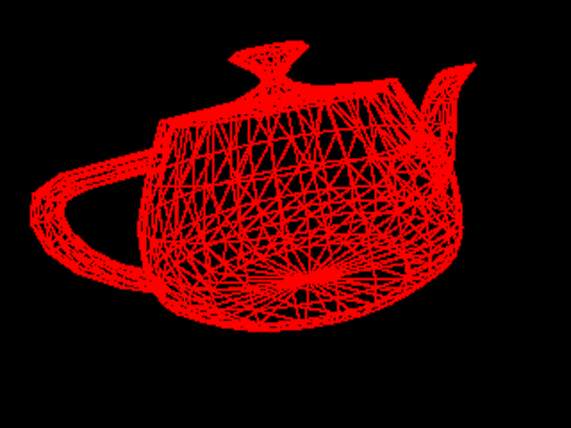 | 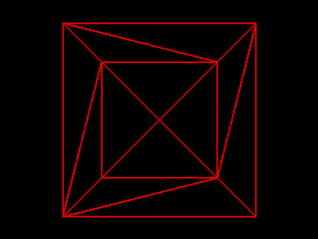 |
| A Wire Teapot ([generate](http://localhost:8000/index.html?Camera=[-1.0777,0.87769,-1.9828];[-0.2653,-0.95558,-0.12839];[-0.0076523,0.3019,0.091585]&Mesh=teapot.obj;false&Resolution=640x480&Shading_Model=Wire&Ambient=[0,0,0]&Diffuse=[255,255,255]&Specular=[255,255,255]&Shininess=15))| A Wire Box ([generate](http://localhost:8000/index.html?Camera=[0,0,-3.975];[0,-1,0];[0,0,0]&Mesh=cube.obj;false&Resolution=640x480&Shading_Model=Wire&Ambient=[0,0,0]&Diffuse=[255,255,255]&Specular=[255,255,255]&Shininess=5)) |

## Lighting

### (1.0)\* Phong Reflection Model
`phongReflectionModel(vertex, view, normal, lightPos, phongMaterial)` takes a 3D position `vertex`, a 3D camera position `view`, a 3D surface normal `normal`, a 3D light position `lightPos`, and a Phong material `phongMaterial`, and evaluates the Phong reflectance model:

$$
I_P = I_E + K_A I_{AL} + K_D(N \cdot L) I_L + K_S(V \cdot R)^\alpha I_L
$$

You may ignore the emission term and assume that the light color is bright white --- thus, $I_E = (0,0,0)$ and $I_{AL} = I_L = (1,1,1)$. This is similar to the reflectance model you implemented in Assignment 3. In the provided code, we already compute diffuse color, and so you only need to add the terms for ambient and specular color contributions.

The following images are generated using the Phong shader.

|   |   |   |
|:-:|:-:|:-:|
| 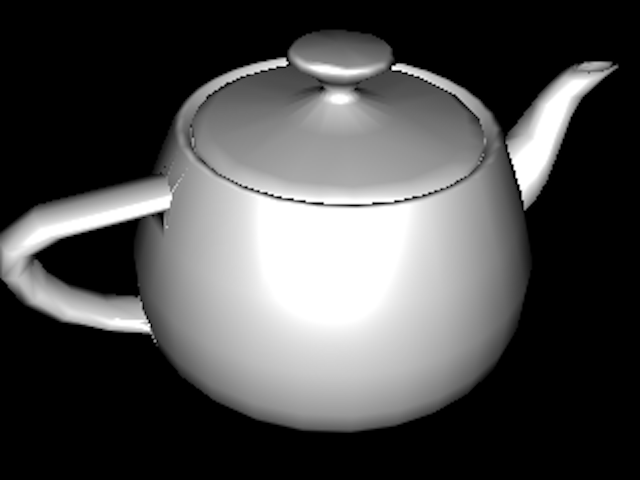 | 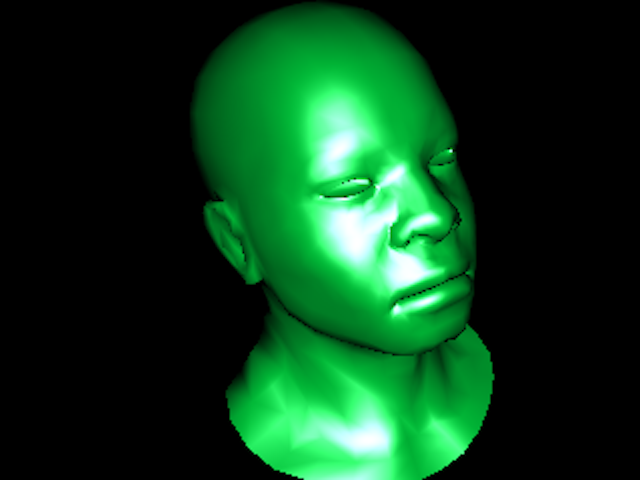 | 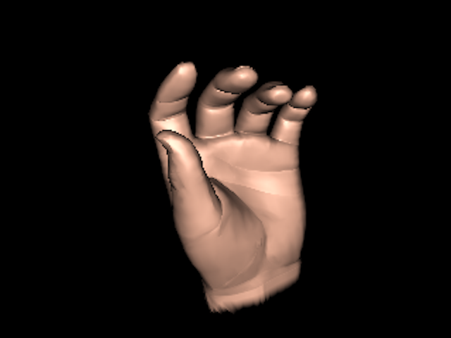 |
| The Utah Teapot | It's Not Easy Being Green | A Plastic Hand |

## Utilities
You will not be able to directly observe the effects of these helper functions on the user interface, but they will be very useful to you when composing your solutions to the shaders.

### (1.0)\* Bounding Box
`computeBoundingBox(projectedVerts)` computes the screen-space bounding box for the triangle defined by `projectedVerts`. The bounding box should always be within the screen coordinates since any locations outside the screen won't be rendered.

This function is useful when we rasterize each projected triangle, during which we need to loop over the pixels that cover the projected triangle. One simple way to do this is to compute the bounding box around the projected triangle and just loop over pixels inside it. This said, there exist more efficient algorithms for rasterizing triangles; you are welcome to attempt one for the optimization contest, so long as you are not copying any code **or pseudocode.**

### (1.0)\* Barycentric Coordinates
`computeBarycentric(projectedVerts, x, y)` computes the barycentric coordinates for a point `(x, y)` inside the triangle defined by `projectedVerts`. Return `undefined` if `(x, y)` is outside the triangle.

For an efficient 2D algorithm, refer to [this article](https://fgiesen.wordpress.com/2013/02/06/the-barycentric-conspirac/) and check out [slides 30 to 33 in this deck](https://www.cs.drexel.edu/~david/Classes/CS430/Lectures/L-10_NURBSDrawing.pdf). Note that the only difference here from Assignment 3 is that the points are **all 2D** and that high efficiency is critical.

Note that the barycentric coordinates utility provided through the `THREE.Triangle` class is off-limits for this assignment.

## Shaders
The pipeline for shading a triangle is similar for all of the three shaders you will implement:

For each pixel in the triangle:

1. Test the `z` value of the pixel and check if it's any closer than the buffered `z` at the pixel. If not, move on to the next pixel. Otherwise, continue to render the pixel to the frame buffer.
2. Compute the normal of the pixel in world coordinates.
3. Compute the vertex position of the pixel in world coordinates.
4. Compute the material of the pixel.
5. Apply the Phong reflection model using the view position and the singular light position in the scene.
6. Store the computed color to frame buffer for later display; update the Z-Buffer at the pixel as well with the new `z` depth.

Before you attempt your implementation, you may want to first read through some of the provided functions in the `Renderer` object to get a better sense of the entire rendering pipeline.

### (0.0)\* Wire
`drawTriangleWire(projectedVerts)` applies a simple wire shader for the triangle defined in screen space by `projectedVerts`. This is implemented for you as a baseline example.

### (2.0)\* Flat
`drawTriangleFlat(verts, projectedVerts, normals, uvs, material)` applies flat shading for the triangle defined in world coordinates as `vert` with vertex normals `normals` and projected onto screen space as `projectedVerts`. The arguments `uvs` and `material` will be used later to complete the texture mapping features.

First, compute the face normal using the three vertex normals. Then, compute the face centroid using the three vertices positions. Finally, pass the face normal and the face centroid into the Phong reflection model to determine the color to uniformly shade the triangle.

|   |   |   |
|:-:|:-:|:-:|
| 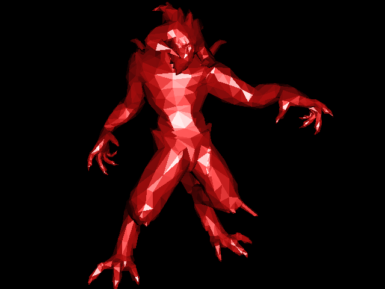 |  | 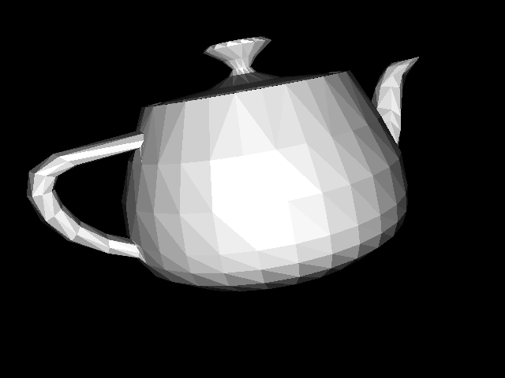 |
| Flat Shaded Diablo ([generate](http://localhost:8000/index.html?Camera=[1.2094,0.33718,2.0954];[0.15524,-0.98547,0.068975];[0,0,0]&Mesh=diablo.obj;false&Resolution=640x480&Shading_Model=Flat&Ambient=[0,0,0]&Diffuse=[197.5,15.49,15.49]&Specular=[235,235,235]&Shininess=7))| Flat Shaded Cheetah ([generate](http://localhost:8000/index.html?Camera=[2.1744,2.1731,1.5819];[0.54475,-0.83857,0.0066899];[-0.26187,0.57723,-0.077202]&Mesh=cheetah.obj;false&Resolution=640x480&Shading_Model=Flat&Ambient=[0,0,0]&Diffuse=[202.5,188.49,83.382]&Specular=[255,255,255]&Shininess=11)) | Flat Shaded Teapot ([generate](http://localhost:8000/index.html?Camera=[-1.0777,0.87769,-1.9828];[-0.2653,-0.95558,-0.12839];[-0.0076523,0.3019,0.091585]&Mesh=teapot.obj;false&Resolution=640x480&Shading_Model=Flat&Ambient=[0,0,0]&Diffuse=[255,255,255]&Specular=[255,255,255]&Shininess=15)) |

### (2.0)\* Gouraud
`drawTriangleGouraud(verts, projectedVerts, normals, uvs, material)` applies Gouraud shading for the triangle defined in world coordinates as `vert` with vertex normals `normals` and projected onto screen space as `projectedVerts`. The arguments `uvs` and `material` will be used later to complete the texture mapping features.

For this shader, you will need to interpolate the colors of the pixels inside the triangle using the barycentric coordinates.

|   |   |   |
|:-:|:-:|:-:|
| 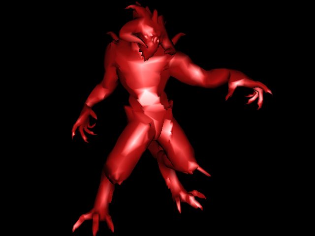 |  | 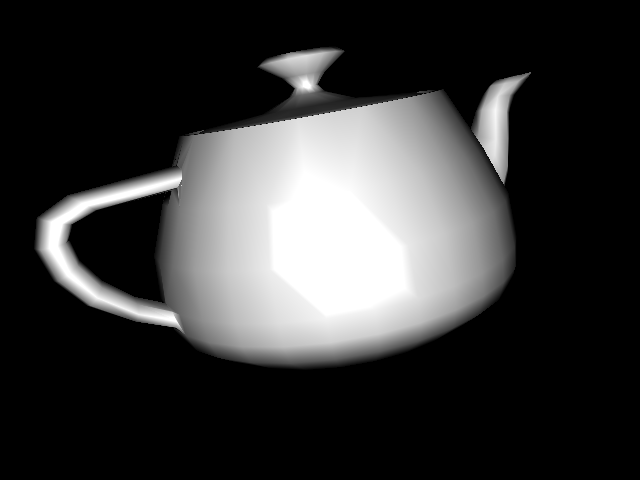 |
| Gouraud Shaded Diablo ([generate](http://localhost:8000/index.html?Camera=[1.2094,0.33718,2.0954];[0.15524,-0.98547,0.068975];[0,0,0]&Mesh=diablo.obj;false&Resolution=640x480&Shading_Model=Gouraud&Ambient=[0,0,0]&Diffuse=[197.5,15.49,15.49]&Specular=[235,235,235]&Shininess=7))| Gouraud Shaded Cheetah ([generate](http://localhost:8000/index.html?Camera=[2.1744,2.1731,1.5819];[0.54475,-0.83857,0.0066899];[-0.26187,0.57723,-0.077202]&Mesh=cheetah.obj;false&Resolution=640x480&Shading_Model=Gouraud&Ambient=[0,0,0]&Diffuse=[202.5,188.49,83.382]&Specular=[255,255,255]&Shininess=11)) | Gouraud Shaded Teapot ([generate](http://localhost:8000/index.html?Camera=[-1.0777,0.87769,-1.9828];[-0.2653,-0.95558,-0.12839];[-0.0076523,0.3019,0.091585]&Mesh=teapot.obj;false&Resolution=640x480&Shading_Model=Gouraud&Ambient=[0,0,0]&Diffuse=[255,255,255]&Specular=[255,255,255]&Shininess=15)) |

### (2.0)\* Phong
`drawTrianglePhong(verts, projectedVerts, normals, uvs, material)` applies Phong shading for the triangle defined in world coordinates as `vert` with vertex normals `normals` and projected onto screen space as `projectedVerts`. The arguments `uvs` and `material` will be used later to complete the texture mapping features.

For this shader, you will need to interpolate the normals and the vertex positions of the pixels inside the triangle using the barycentric coordinates.

|   |   |   |
|:-:|:-:|:-:|
|  | 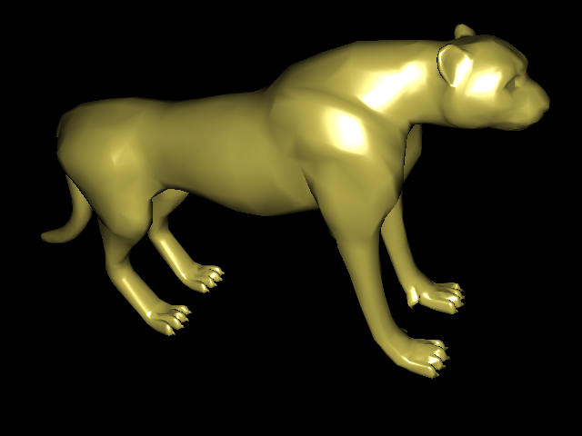 | 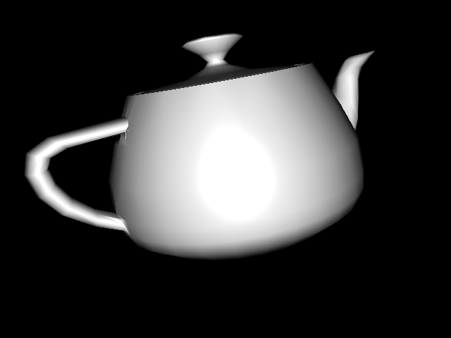 |
| Phong Shaded Diablo ([generate](http://localhost:8000/index.html?Camera=[1.2094,0.33718,2.0954];[0.15524,-0.98547,0.068975];[0,0,0]&Mesh=diablo.obj;false&Resolution=640x480&Shading_Model=Phong&Ambient=[0,0,0]&Diffuse=[197.5,15.49,15.49]&Specular=[235,235,235]&Shininess=7))| Phong Shaded Cheetah ([generate](http://localhost:8000/index.html?Camera=[2.1744,2.1731,1.5819];[0.54475,-0.83857,0.0066899];[-0.26187,0.57723,-0.077202]&Mesh=cheetah.obj;false&Resolution=640x480&Shading_Model=Phong&Ambient=[0,0,0]&Diffuse=[202.5,188.49,83.382]&Specular=[255,255,255]&Shininess=11)) | Phong Shaded Teapot ([generate](http://localhost:8000/index.html?Camera=[-1.0777,0.87769,-1.9828];[-0.2653,-0.95558,-0.12839];[-0.0076523,0.3019,0.091585]&Mesh=teapot.obj;false&Resolution=640x480&Shading_Model=Phong&Ambient=[0,0,0]&Diffuse=[255,255,255]&Specular=[255,255,255]&Shininess=15)) |

## Texture Mapping

### (2.0)\* Diffuse and Specular Mapping
Add diffuse and specular texture mapping to the three shaders you completed for this assignment. First, interpolate the UV coordinates of the pixels inside the triangle using barycentric coordinates. Then, look up the material for that pixel using the function `getPhongMaterial()`.

Watch out for the cases where meshes do not have UV coordinates or textures. Always check whether those are provided by comparing them to `undefined`, as discussed in the hints section.

|   |   |
|:-:|:-:|
| 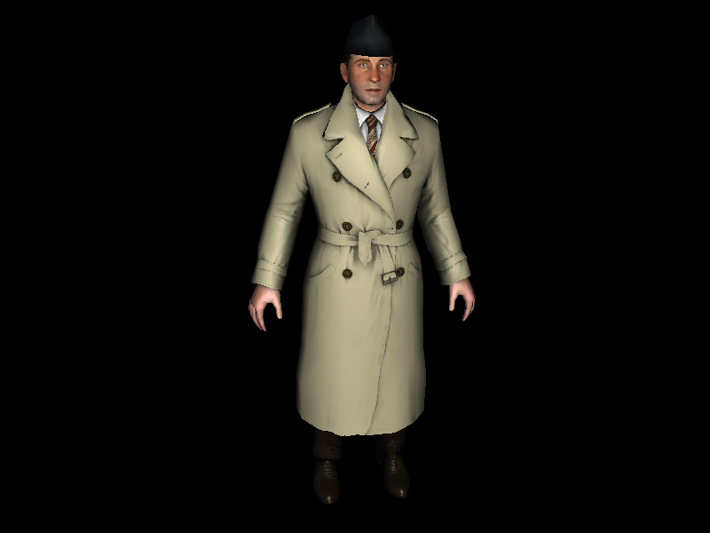 | 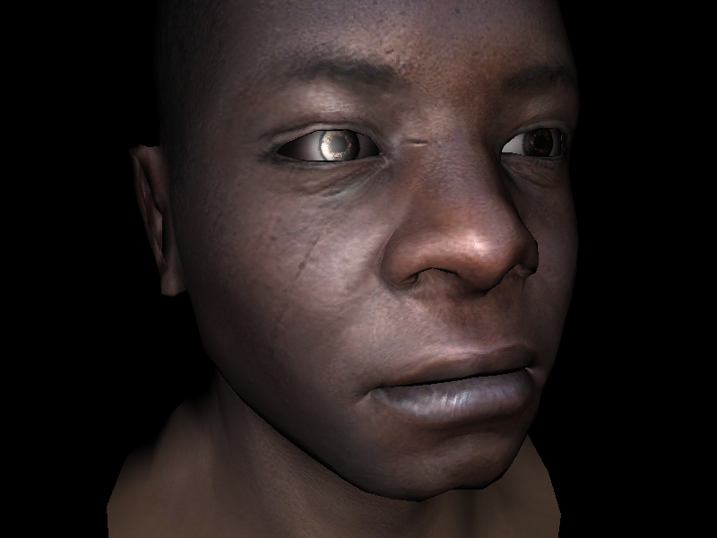 |
| Boggie Is On the Case | A Smooth Human Head |

### (2.0)\* XYZ Normal Mapping
Add XYZ normal texture mapping to the Phong shader (only). Some material comes with an XYZ normal texture (essentially an image), where each RGB pixel in the texture is mapped to actual XYZ coordinates that represent a normal vector. Incorporating these specific normal into Phong shading adds a layer of fine detail and realism to the mesh.

As covered on the [Wikipedia page for normal mapping](https://en.wikipedia.org/wiki/Normal_mapping), we can use the interpolated UV coordinates (as before) to lookup RGB values in the XYZ normal texture. Assuming RGB is in the range `[0, 1]`, the mapping to XYZ is simply `XYZ = 2 * RGB - 1`.

 Remember to normalize the derived normal vector! Also, watch out for the cases where meshes do not have XYZ coordinates or textures. Always check whether those are provided by testing `material.xyzNormal === undefined`.

 |   |   |
 |:-:|:-:|
 | 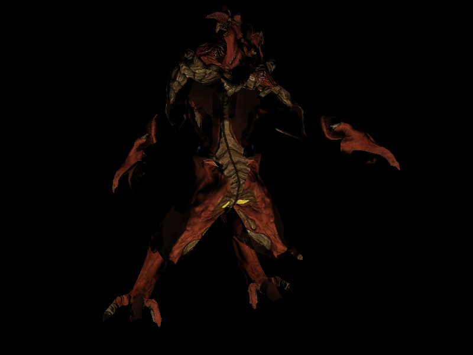 | 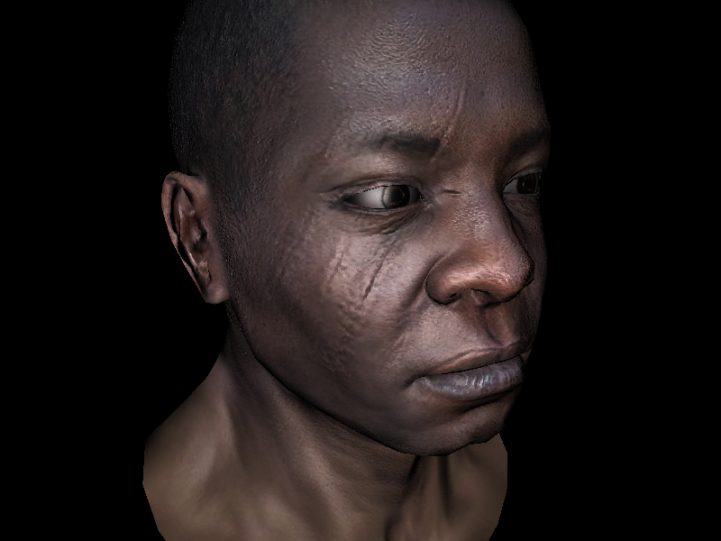 |
 | A Textured Diablo ([generate](http://localhost:8000/index.html?Camera=[1.261,0.56135,2.1921];[0.10486,-0.97623,0.18967];[0,0,0]&Mesh=diablo.obj;true&Resolution=800x600&Shading_Model=Phong&Ambient=[0,0,0]&Diffuse=[255,255,255]&Specular=[255,255,255]&Shininess=5))| A Textured Human Head ([generate](http://localhost:8000/index.html?Camera=[0.99316,0.4486,1.6867];[0.13566,-0.9744,0.17927];[0,0,0]&Mesh=afrhead.obj;true&Mesh=afreye.obj;true&Resolution=800x600&Shading_Model=Phong&Ambient=[0,0,0]&Diffuse=[255,255,255]&Specular=[255,255,255]&Shininess=5)) |

## Optimization Contest
Instead of an art contest, this assignment features an optimization contest! You are **not** competing directly against your peers (at least, for points) --- just try your best to optimize the frame rate of your code. Once you are finished speeding up your code, describe your optimizations in the writeup.

In order to participate in and receive credit for this contest, report (under your writeup for this contest) the FPS ratio of the following two renders, as well as their absolute frame rates:

* [Baseline Hardware Performance](http://localhost:8000/index.html?Camera=[0.99316,0.4486,1.6867];[0.13566,-0.9744,0.17927];[0,0,0]&Mesh=afrhead.obj;true&Mesh=afreye.obj;true&Resolution=800x600&Shading_Model=Wire&Ambient=[0,0,0]&Diffuse=[255,255,255]&Specular=[255,255,255]&Shininess=5)
* [Phong Shader Performance](http://localhost:8000/index.html?Camera=[0.99316,0.4486,1.6867];[0.13566,-0.9744,0.17927];[0,0,0]&Mesh=afrhead.obj;true&Mesh=afreye.obj;true&Resolution=800x600&Shading_Model=Phong&Ambient=[0,0,0]&Diffuse=[255,255,255]&Specular=[255,255,255]&Shininess=5)

For example, for the unoptimized instructor solution on a late 2016 MacBook Pro running macOS Catalina with a 2.6 GHz Quad-Core Intel Core i7 Radeon Pro 460, the baseline render gets `30` FPS and the Phong render gets `4` FPS. So, we would report a frame rate ratio of `0.133`. Do not modify the wireframe shader at all (of course), and note that optimizations resulting in incorrect outputs will disqualify the entry. **All required features must be implemented to participate.** If the reported ratio is high enough, then we will run the submitted code on our hardware to determine your score. Participating in the optimization contest will be worth between `0.5` and `2.0` points, depending on your effort and final frame rate achieved.
