---
# Assignment Name
assignmentName: "Simulator"
# Assignment Number
assignmentNumber: 5
# Are the specs published yet?
available: true
# Submission url
submitURL: ""
# Feedback url
feedbackURL: ""
# Is this assignment listed on the assignments page?
visible: true
# Assignment due date
dueWeek: 11
dueDay: 'Sunday'
dueTime: '11:55pm'
# Name as displayed on materials page
calendarName: "Assignment 5 (Simulator)"
# Image for assignment
imageName: "assignment_5"
# Brief description of assignment
description: "Build a cloth simulator that numerically integrates Newton's equations of motion to model fabric."
# Scoring parameters
# Total points for required features, R
requiredPoints: 9
# Non-diminishing cutoff for optional features, N
optionalPoints: 3
# Diminishing return numerator
dimReturnTop: 3
# Diminishing return denominator
dimReturnBottom: 4
---
# Overview
In this assignment you will create a basic cloth simulator in JavaScript, leveraging the ThreeJS graphics library, as in previous assignments. The purpose of this assignment is to give you hands-on experience with important simulation concepts and techniques, such as [Verlet integration](https://en.wikipedia.org/wiki/Verlet_integration) and collision handling.

### Getting Started
The JavaScript based cloth simulation program features an interactive mode where you can toggle and adjust the parameters for various visual and behavioral features; similar to the previous assignment, there is no batch mode.

To begin, download this <assignment-link>zip file</assignment-link> and unzip it on your computer.

### Setting Up a Development Webserver
Next, change to the subdirectory `COS-426-Assignment-5` and run the command `python3 -m http.server` in the terminal. (That command is for python 3. In python 2.7 it should be `python -m SimpleHTTPServer`. Note that there are many other ways to start a web server, as discussed in the Assignment 0 specifications). A web server will be launched locally on your computer, rooted at this directory.

Once you have started the local web server, direct your browser to `http://localhost:8000`. If you have done everything correctly up to this point, you should see the Assignment 5 webpage with a wireframe net in the center. Click and drag on the HTML5 canvas and you will see that this is a 3D viewer. In the upper right corner is a GUI, which we will briefly discuss in the next section.

As always, it will be necessary for you to temporarily disable your browser caching, or else changes you make to your code during development may not necessarily be reflected on the web page even after a hard refresh! **Many students skim over this step and struggle to get started.** Refer to the Assignment 0 specifications for details on how to do this.

### UI Tour
Although most of the simulation program's user interface should already be familiar to you, there are several features to make a note of:

* **Cloth Size:** The size slider adjusts the size of the cloth. Initially, adjusting this will only change the density of the wireframe.

* **Wireframe:** The `wireframe` button toggles between the wireframe and the cloth visualizations, and may be helpful when debugging.

* **Forces:** The `Forces` folder lets you toggle and adjust the forces present in the scene. Note that forces are not provided for you --- you will have to implement them yourself as part of the assignment.

* **Scene:** The `Scene` folder lets you adjust various properties of the scene. For instance, an invisible object (sphere or box) can be added for more interesting cloth interactions. You can also choose from 6 different ways in which the cloth is pinned. Initially, changing these settings will not do anything interesting.

* **Behavior:** The `Behavior` folder allows you to alter the structure of the cloth's underlying particle-spring system. In addition, the friction slider affects how the cloth interacts with other objects (such as the sphere or table). Lastly, you can toggle whether the cloth avoids self-intersections.

* **Appearance:** The `Appearance` folder contains settings that determine the visual style of the simulator --- you can even change the texture of the cloth! Note that these properties are cosmetic only; they do not affect the behavior of your cloth.

* **Image capture:** Pressing the `I` key captures an image of the current rendering.

* **Video capture:** Pressing the `V` key starts a video capture of the rendering and will illuminate the red "recording icon" in the top left corner of the screen. When you are ready to finish your recording, press `V` again. A `.webm` (a modern web-friendly video format) of the video capture will be downloaded to your local machine.

### How to Program the Features
Before you start, here's some basic information on the structure of the starter code.

Files that you should take a brief look at, but **probably will not need to modify**:

* `coursejs/guiConfig.js`: Defines the entries in the GUI menu in the top-right. You may need to modify this if you want to add new interactive features to your simulation.
* `coursejs/gui.js`: Builds the GUI from the options specified in `guiConfig.js`. You will only need to modify this if you plan to make dramatic changes to the GUI.
* `coursejs/params.js`: Stores all of the parameters in the simulation, such as the effect of gravity, friction, or the size of the cloth. When GUI sliders are changed or updated, the new values are stored into the global `SceneParams` object defined here.
* `coursejs/scene.js`: Sets up all of the cameras, lights, and meshes in the scene. You will need to edit this if you choose to make a custom scene or significantly alter the properties of any of the objects.
* `coursejs/renderer.js`: Renders the scene. It uses ThreeJS to create and render the application in your browser. This is the main "starting point" of the cloth simulation. You may find it helpful to briefly take a look at its `Renderer.animate()` and `Renderer.render()` functions. The `animate()` function calls the `Sim.simulate()` (which is defined in `coursejs/sim.js`) and `render()` functions repeatedly in a loop, which produces the results in your browser.

    * On each time-step, the `simulate()` function performs the cloth physics in order to compute new positions. Then, in `render()`, these new positions are copied into a parametric mesh that is rendered onto your screen as the cloth.

* `coursejs/sim.js`: Code for the overall simulation. This file defines a global variable `cloth` that refers to the `Cloth` object being simulated. The most interesting function here is `simulate()`, which performs one "step" of the simulation per call. It is **highly recommended** that you look at this function to get a high-level understanding of what should be happening in each iteration of the simulation. Note that the almost all of the called operation in `simulate()` are to the cloth methods that you will be implementing!

Files that you should look closely at, and will **definitely need to modify**:

* `js/cloth.js`: Handles cloth physics for the simulation. This file frequently accesses the global `SceneParams` object to obtain the cloth's properties (which can be modified interactively in the GUI). It also contains a definition for a `Constraint` object, which is used by the `Cloth` object defined further below. A `Cloth` object is defined primarily by its `Particle`s and `Constraint`s.  Most of the `Cloth` object's functions (including the constructor) are left for you to implement.
* `js/particle.js`: Implements the `Particle` object used by the `Cloth` object. The constructor is provided.

As always, to make your first edit use your favorite text/code editor (we recommend VSCode and Atom) to edit the file `js/student.js` and fill in your name and NetID. Reload the web page in your browser, and now your information should appear above the image. **You should do this for every assignment.**

To implement the cloth simulation, **you only need to edit the files `js/cloth.js` and `js/particle.js`.** Before writing any code, look through these files and get an understanding of the constructors for the `Cloth`, `Particle`, and `Constraint` objects.

Note that unlike previous assignments, Assignment 5 is fairly linear, and so we highly recommend working through required features in the order they are listed below.

### Policy on Sources
As the perceptive among you may notice, this assignment is somewhat similar to the cloth simulation example provided on the ThreeJS website, and to numerous other Verlet-based cloth simulations found across the web.

This should go without saying, but since the goal of this assignment is to learn how simulations work by yourself (and frankly, because this assignment is intended to be fairly easy anyway), you are ***forbidden from inspecting the source code of any pre-existing cloth simulation***, including the one listed on the ThreeJS examples page. Doing so would be in violation of both course policy and Rights, Rules, & Responsibilities (RRR).

After the assignment deadline has passed (*and* you have turned the assignment in), this restriction is lifted, and you are free to inspect any code you'd like (as it may be useful for your final project).

### Debugging Tips
In general, graphics programs are very challenging to debug. Thankfully, modern browsers contain a built-in JavaScript debugger (under the sources pane in Chrome) that will allow you to set execution breakpoints and to trace variables. You can also pre-set breakpoints by inserting the line `debugger;` into your solution code --- this trick will likely prove invaluable. Students also find print statements via the `console.log()` prove helpful.

### Hints
A few hints:

* Work linearly and test often!
* Make use of the JavaScript debugger to inspect objects and other structures that you are not familiar with.
* This will not be a perfect simulation --- we make some simplifications for your sake. Even if you implement everything correctly, you might still see some weird behaviors (e.g. clipping, random oscillations/vibrations in the cloth).
* Read through the Week 10 precept slides. They cover this assignment in detail.
* Please make a public post on <piazza-link></piazza-link> if you have a question.
* Take note of the <internal-link href="/#late-policy">late policy</internal-link> and the <internal-link href="/#collaboration-policy">collaboration policy</internal-link>.

### FAQ
We currently have no FAQs. This may change, so check back here occasionally!

### Acknowledgements
Special thanks to [Aatish Bhatia](https://cst.princeton.edu/people/aatish-bhatia), who is an associate director on the Council on Science and Technology at Princeton University. This assignment was adapted from his ThreeJS cloth simulation and turned into the new animation assignment for COS 426 in Spring 2019, in an effort led by Austin Le in collaboration with Professor Adam Finkelstein and Aatish Bhatia himself. The course staff would also like to thank William Sweeney for revising and expanding this assignment in Spring 2020.

# Deliverables

### Submitting
You should submit your solution via <submit-link>CS Tigerfile</submit-link>. The submitted zip file should preserve the directory structure of the skeleton code we provided in the zip file above. If you like to include larger files, that exceed the CS Tigerfile file size limitations, you can put these files in your own web space, Google Drive, Dropbox, etc. and then include a link to that in the write-up.

### Formatting
If your submission is too big for the CS Tigerfile, please first try to convert some of your results to the lossy `.jpg` format, if possible. For this assignment, you will need to include several `.webm` files to show animations of your simulations; these files can be large so please try to limit their duration to no more than ten or so seconds for each result.

Note that you are expected to use good programming style at all times, including meaningful variable names, a comment or three describing what the code is doing, etc. Partial credit may not be assigned for code without comments. Although the assignment frameworks mostly conform to the now somewhat-aged [idiomatic JS style conventions](https://github.com/rwaldron/idiomatic.js/), we ask that students conform to modern ES6+ styling standards, such as the [Airbnb JS Style Guide](https://github.com/airbnb/javascript). **Moreover, we strongly recommend that students use a JS Linter when composing their solutions**. Linting your code will help catch bugs before they become a problem, while also enforcing reasonably clean style.

### Writeup
The `writeup.html` file should be an HTML document demonstrating the effects of the features you have implemented and would like scored; ***make sure to also complete the collaboration statement.*** For the features that you completed or attempted, briefly write about how you went about implementing it. Whenever possible, you should include an animation (or image, if there is no interesting motion to show) of your results by replacing `placeholder` files.

You should start from the the example `writeup.html` provided. At the top of that file are a list of features that you might implement, linking to the section where you talk about them. Please remove any features that you do not implement from the list as well as the corresponding sections, but otherwise leave this header section intact. Please put effort into your `writeup.html` as this is the file we spend the most time grading.

***Do not, under any circumstances, share any component of your writeup (text and images) with another student, even if you partnered with the student when composing your JavaScript solutions.***

### Scoring
This assignment is worth **<total></total>** points. The list of features that you need implement is provided below in the order you will want to implement them. The number in front of each feature corresponds to how many points the feature is worth for the full implementation. Partial or partially-correct solutions will receive partial credit. The features marked with an asterisk are required. All other features are optional.

The translation filter is already implemented for you as an example. If you correctly implement all the required features (Parts 1 through 4), you will receive **<required></required>** points. Full credit for this assignment is <total></total> points, so to complement the required features, you may choose from the optional features listed in the cloth simulation extensions section, as well as participate in the art contest (which yields one point for participation and two for winning).

Note that it is possible to earn more than <total></total> points for this assignment; however, the value of non-required features incurs *diminishing returns* after the first **<optional></optional>** points. For sums of non-required features (`n` `>` <optional></optional>), each point beyond <optional></optional> will accrue a value **<dim></dim>** that of the previous point.

Your final score is a function of the following variables, rounded to the nearest `0.5`:
* **`r`**: your score on the required features  (up to `R` `=` <required></required> points)

* **`n`**: your score on the non-required features (a diminishing value `n` `>` `N` `=` <optional></optional>) .

* **`a`**: your participation in the art contest (`1` point for participating, `1.5` points for being selected for gallery, or `2` points for winning).

* **`d`**: the diminishing return factor (`d` `=` <dim></dim>)

Given these inputs, the formula for your final score as a JavaScript function is:
```javascript
function computeFinalScore(r, n, a, d, R, N) {
    const requiredFeatureScore = Math.min(R, r);
    const optionalFeatureScore = Math.min(N, n);
    const extraFeatureScore = Math.max(n - N, 0);
    const diminishingExtraScore = d * (1 - Math.pow(d, extraFeatureScore)) / (1 - d);
    const artContentScore = a;

    const floatingPointScore = (
        requiredFeatureScore
        + optionalFeatureScore
        + diminishingExtraScore
        + artContentScore
    );
    const finalScore = Math.round(floatingPointScore * 2.0) / 2.0;
    return finalScore;
}
```

To facilitate this computation, please take advantage of the following score calculator, which automatically computes your total score using the above formula and your provided inputs.

### Score Calculator

<div>
    <score-calculator></score-calculator>
</div>

# Assignment Features
This assignment is broken down into five parts:

* Part 1: Baby Steps
* Part 2: Particles and Springs
* Part 3: Numerical Integration
* Part 4: Collisions
* Part 5: Extensions

Each part will involve writing code in one or more locations. Some parts require only a few lines of code, while others are more involved. The goal is for you to implement as much of the core pipeline of the cloth physics simulation loop as possible so that you can understand (and visualize) how it works.

## I. Baby Steps
It will be frustrating to debug the motions of your cloth unless you have some way of directly interacting with it. Before we dive into the cloth itself, let's add some simple keyboard controls to let us move the cloth around.

### (0.5)\* Event Handler
`cloth.js/handleImpactEvents(event)` is called on a keyboard press `event` and applies a small directional impulse to the cloth fragment at the location of the mouse cursor. The direction of the impulse is determined by the keypress contained in the `event` object. We encourage you to examine the standardized structure of keyboard event objects either by using the built-in debugger, or by referencing formal JavaScript documentation.

Note that you will have to register `handleImpactEvents` with the browser window's "keydown" event listener yourself at the end of the `Cloth` constructor (within the "`if (!Cloth.eventHandlerRegistered)`" code block). When we register an event handler with an event listener, we signal to the browser that whenever the event listener intercepts a particular action (e.g. a keypress), it should execute the handler function (in this case, `handleImpactEvents`). Note that you can register multiple event handlers for the same action, although this can slow down your code.

**A note on event listeners:** Event listeners are incredibly important in building interactive application. For instance, the table of contents along the right of this page is able to follow you and highlight the section you are currently viewing via an event handler that fires whenever you scroll or resize the window. *We expect that you will find event handlers incredibly useful in your final projects.*

**A note on asynchronous JavaScript:** Although JavaScript is asynchronous, it is not multithreaded. Event handlers will run in the browser tab's main thread, just like your program's primary execution path. Implementation specifics can depend on your browser's JavaScript engine, but in general, expect asynchronous JavaScript code to be scheduled between other function calls (i.e. it will begin execution after the most recently scheduled function returns; [read more here](https://blog.sessionstack.com/how-javascript-works-event-loop-and-the-rise-of-async-programming-5-ways-to-better-coding-with-2f077c4438b5)). The benefit of this single threaded behavior is that it eliminates the most nasty multithreaded race cases you might run into (such as simultaneous writes and reads --- for more, take COS 318: Operating Systems);  however, it also means that an infinite loop in your code (or even just slow code) will block all user input, which has likely frustrated you during a number of assignments in this course. Recently, major browsers have adopted "Web Workers" to allow for multithreaded JavaScript applications (which is especially great for computationally-expensive physics engines that can be offloaded into a separate thread), but this is beyond the scope of this assignment.

To finish the `handleImpactEvents` function, follow the commented directions to trace a ray into the scene, intersect that ray with a particle in the cloth, and then offset the position of that particle in a particular direction, based on the key pressed.

We recommend adding bindings to each of the arrow keys to offset the particle in a sensible direction for that key: for instance, an offset upwards, towards `(0, 1, 0)`, for the `ArrowUp` key. You are welcome to bind these actions to different keys, or even add new bindings that you think would look cool or assist you in debugging. Note that the `I` and `V` keys are already bound to screenshots and video recording, respectively.

Please briefly document all added event listeners in your writeup. When you have implemented your event listeners, try placing your mouse cursor above the cloth and pressing one of the bound keys. Here is the behavior of our implementation at this point:

|   |
|:-:|
| 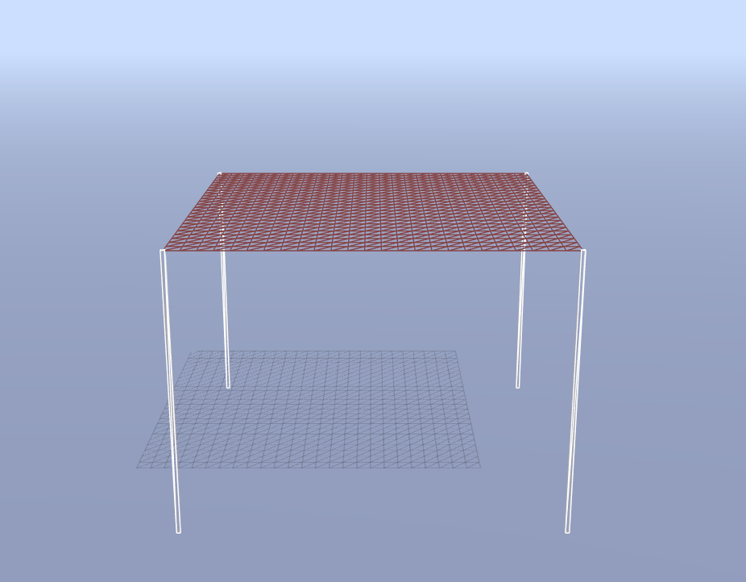 |
| Pressing the Up Arrow over an Unconstrained Cloth ([simulate](http://localhost:8000/index.html?structuralSprings=false&shearSprings=false&bendingSprings=false&gravity=false)) |

## II. Particles and Springs
In computer graphics, many different cloth models have been developed for simulation purposes. Of these, one of the simplest models uses a system of particles ("point masses") and springs. Given a sheet of cloth with some desired dimensions and parameters, we can divide the cloth up into evenly spaced particles and then connect nearby particles with springs. The springs hold the particles together, and the different types of springs affect how the cloth behaves.

|   |
|:-:|
| 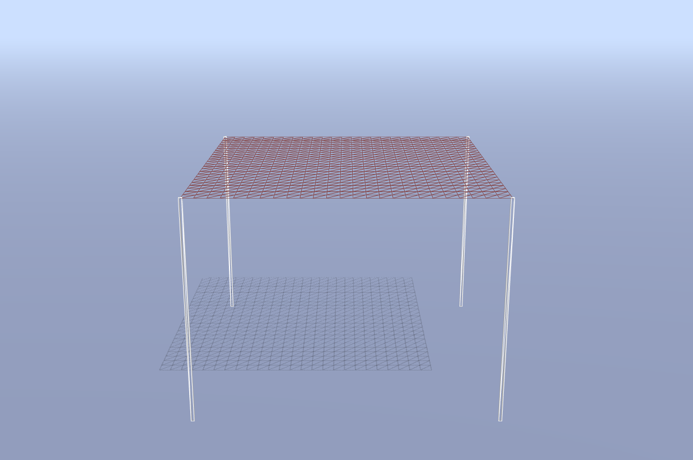 |
| The Initial Cloth, Held by its Corners ([simulate](http://localhost:8000/index.html?gravity=false)) |

### (1.0)\* Let's Build a Cloth!
For this part, we will be working with the `Cloth` constructor in `cloth.js`. The image above shows the wireframe of the cloth, but the underlying structure of particles and springs does not exist yet, which we will need if we want to simulate the cloth's physics and then animate it.

The starter code in the `Cloth` constructor creates the list of `Particle` objects that make up the cloth and then stores this list as the instance variable `this.particles` in row-major order.

Next, we need to create the springs that bind the cloth's particles together. In this assignment, our springs are represented by `Constraint` objects. Each `Constraint` object requires the two `Particle` objects that it constrains, and the resting distance between them at equilibrium.

As an example, the starter code handles the necessary structural constraints along the edges of the square cloth as an example. In other words, the edge cases are quite literally handled for you.

In addition to these structural constraints along the edges, you will need to create springs to apply structural, shearing, and bending constraints to the particles. For a given particle:

* Structural constraints exist between itself and the particle to its right, as well as between itself and the particle directly below. A structural constraint's resting distance is simply the instance variable `restDistance`. Intuitively, this describes the distance between two directly (non-diagonally) neighboring particles on the cloth, when the cloth is not being stretched or compressed.
* Shearing constraints exist between itself and the particle to its diagonal bottom-left, as well as between itself and the particle to its diagonal bottom-right. A shearing constraint's resting distance is `restDistance` scaled by `restDistanceS` (see the constants at the top of the `Cloth` constructor). Make sure you understand why this is the case!
3. Bending (or "creasing") constraints exist between itself and the particle two away to its right, as well as between itself and the particle two positions below. A bending constraint's resting distance is `restDistance` scaled by `restDistanceB`. Again, you should build intuition for the physical meaning of this value.

|   |
|:-:|
| 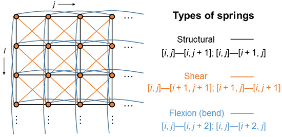 |
| Cloth Constraints (via UC Irvine / CS 114) |

**Implementation Advice**

* Be mindful of the edge conditions --- don't accidentally go "out-of-bounds" and create an impossible constraint between two particles (one of which may not exist).
* Note that constraints are bidirectional, so if Particle $A$ already has a constraint with Particle $B$, you should not add the opposite constraint as well.
* Use the cloth's private helper function `index` to convert a desired 2D index into the appropriate 1D index in the `particles` list.

**Big Picture Note**

We haven't written any code to enforce these constraints, so we can't see their effects just yet! However, you should toggle constraints in the user interface to double check in the console that you have not introduced any syntax errors thus far. Also, you can try enabling the "show constraints" option in the GUI in order to overlay a snapshot of all of the constraints present in the cloth onto the scene.

|   |
|:-:|
| 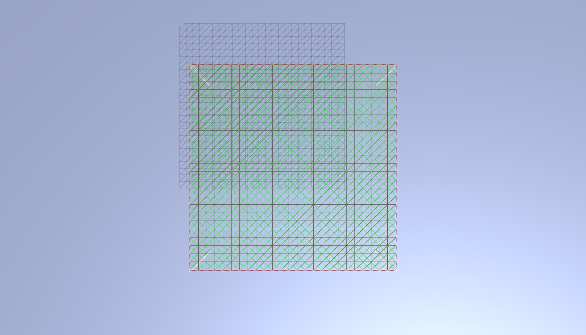 |
| Shear Constraints Only ([simulate](http://localhost:8000/index.html?structuralSprings=false&bendingSprings=false&showConstraints=true&gravity=false)) |

### (1.5)\* Enforce the Constraints
Observe that each `Constraint` object contains two `Particle` objects, which are stored in the instance variables `this.p1` and `this.p2`, and the equilibrium distance, stored in `this.distance`.

Now that our constraints are set up, we will *approximate* the effects of spring forces acting on particles without directly invoking Hooke's law. Enforce each constraint on its two particles by computing the vector $\vec v_{AB}$ from one particle to the other. Then, compute the correction vector as:

$$
v_{corr} = \left(\left\lVert \vec v_{AB} \right\rVert - d \right)\frac{\vec v_{AB}}{\left\lVert \vec v_{AB} \right\rVert}
$$

where $d$ is the value stored in `this.distance`. Make sure to determine the physical meaning of $v_{corr}$. It may help to use a pencil and paper if you have trouble visualizing vectors in your head.

**Step 1:** Complete `cloth.js/Constraint.prototype.enforce`. Since the particles are of equal mass, apply half of this correction to one particle, and half to the other particle; this brings them both closer to each other along the line that connects them. Be careful to bring the particles *closer together*, rather than *further apart*.

**Step 2:** Next, complete `cloth.js/Cloth.prototype.enforceConstraints`. In this function, loop over the cloth's constraints and enforce each one by calling the function you just wrote above.


**Big Picture Note**

Now that constraints have been defined and enforced, we can finally observe some motion in the scene. Try enabling each type of constraint in the GUI in turn, and then use the event handler you defined in Part 1 to disturb particles in the cloth. Does the cloth react how you would expect? If not, there is likely a bug in the way you have defined or enforced your constraints.

|   |
|:-:|
|  |
| Pressing the Up Arrow over a Constrained Cloth ([simulate](http://localhost:8000/index.html?gravity=false)) |

Note that you can also make use of the `wave` setting in the UI to debug your constraints. This feature will oscillate one edge of the cloth up and down, while fixing the opposite edge in place, allowing you to get a feel for the motion of the cloth as a whole.

|   |
|:-:|
| 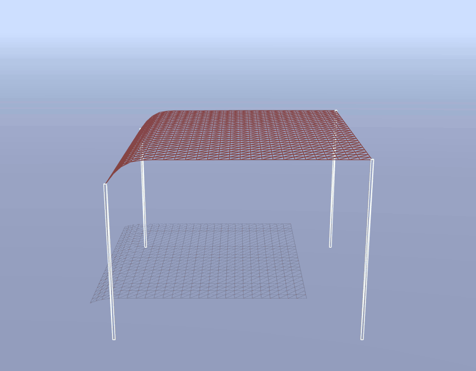 |
| Wave Oscillations across a Constrained Cloth ([simulate](http://localhost:8000/index.html?gravity=false&wave=true)) |

## III. Numerical Integration
Now that we have set up the cloth model as a system of particles and springs (that is, constraints), we need to integrate the physical equations of motion in order to apply the forces on our cloth's particles. This computation determines how the cloth moves from one time-step to the next.

### (1.0)\* Let there be Gravity!
To start off, let's apply the gravitational force to each particle in the cloth.

**Step 1:** Add support for a particle to accumulate forces acting on it by filling in `particle.js/Particle.prototype.addForce`. This should be a one-liner.

**Step 2:** Next, complete `cloth.js/Cloth.prototype.applyGravity`, so that it applies a force due to gravity to each of its particles.

**Implementation Advice**

* Use the provided constant `GRAVITY` which is the default acceleration due to gravity.
* A force is a ThreeJS `Vector3` object.
* Gravity acts downwards, in the negative Y direction.
* Recall Newton's second law of motion: $\vec F = m \vec a$. Note that each particle stores a `mass` attribute.

**Big Picture Note**

Within each call to `Sim.simulate()`, `cloth.applyForces()` calls `cloth.applyGravity()`. It also calls other force handlers, like `cloth.applyWind()`, for which a simple implementation has been given. At this point, we are able to accumulate forces into each of our cloth's particle, but nothing is happening in the scene yet, because the particles don't know what to do with the forces acting on them!

### (1.5)\* Verlet Integration
Now, we will perform numerical integration to compute each particle's change in position. There are many ways of integrating our equations of motion, which include Euler's method (explicit and implicit), Verlet integration, the Runge-Kutta method, and more. In this assignment, we will use [Verlet integration](https://en.wikipedia.org/wiki/Verlet_integration), an explicit integrator that is fairly accurate and relatively easy to implement. If you took COS 126, you might recall this procedure from the N-body assignment.

Verlet integration computes a point mass's new position $\vec x_{t+dt}$ at time $t + dt$ as follows:

$$
\vec x_{t+dt} = \vec x_t + (1 - D) \vec v_t  dt + \vec a_t dt^2
$$

where $\vec x_t$ is the current position, $\vec v_t$ is the current velocity, $\vec a_t$ is the current *total acceleration* from all accumulated forces acting on the particle, $D$ is a damping coefficient `DAMPING`, and $dt$ is the time-delta constant `deltaT`.

In Verlet integration, we approximate $\vec v_t dt = \vec x_t - \vec x_{t - dt}$, where $\vec x_{t - dt}$ is the particle's previous position (from the last time-step):

$$
\vec x_{t+dt} = \vec x_t + (1 - D) (\vec x_t - \vec x_{t - dt}) + \vec a_t dt^2
$$

**Step 1:** Implement `particle.js/Particle.prototype.integrate`, so that it performs Verlet integration on the particle with the provided `deltaT` argument. See the comments in the function for more details.

**Step 2:** Now, return to `cloth.js` and fill in the code for `cloth.js/Cloth.prototype.update`, so that each of its particles performs Verlet integration to compute new positions for the current time-step.

**Big Picture Note**

At long last, we can now observe our cloth falling to the floor due to gravity! However, note that we have not yet implemented any collision detection, so our cloth will clip through the ground under certain pinning configurations (such as `OneEdge`).

Try the following to sanity experiments to check your work so far:

* Let the cloth drop naturally due to gravity with the corners pinned (default setting).
* Enable the simple wind force to see some more exciting action.
* Try different combinations of structural/shearing/bending constraints. Note that disabling all three constraints will cause your cloth to fall apart. Combine this with wind to see an amusing result!

|   |   |
|:-:|:-:|
|  |  |
| Gravity Force: Wireframe ([simulate](http://localhost:8000/index.html?fabricLength=540)) | Gravity Force: Cloth ([simulate](http://localhost:8000/index.html?fabricLength=540&wireframe=false)) |

|   |   |
|:-:|:-:|
|  | 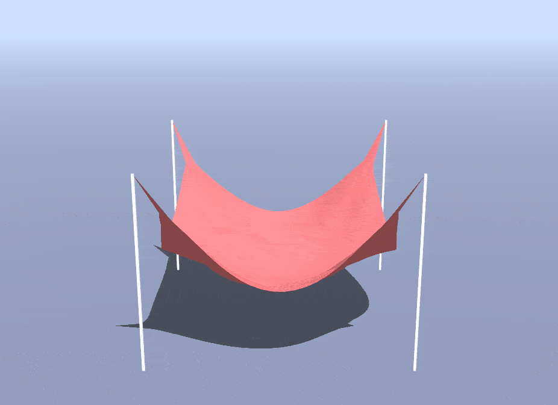 |
| Wind Force: Wireframe ([simulate](http://localhost:8000/index.html?wind=true)) | Wind Force: Cloth ([simulate](http://localhost:8000/index.html?wireframe=false&wind=true)) |

## IV. Collisions

In this part, we will add support for collisions with other objects to yield more interesting results.

### (0.5)\* Floor Collisions
First, let's handle collisions with the floor in our scene. The floor is defined by an x-z plane with y-coordinate equal to some constant `GROUND_Y`. For this assignment, you may assume that the floor is an infinite plane and that objects in our scene are guaranteed to initialize above this plane. Thus, you will only need to handle collisions with the ground from above.

As an aside, in Part 5, you may extend this feature to work for any general plane with particle collisions coming from either side of the plane, and you could also account for more realistic factors such as friction.

**Step 1:** Complete `particle.js/Particle.prototype.handleFloorCollision`. If the particle's y-coordinate is less than `GROUND_Y`, simply force the position's y-coordinate back to `GROUND_Y`. To prevent clipping and ensure stability, you should apply a small fudge-factor `EPS` to `GROUND_Y`, just as in Assignment 3. At a macroscopic scale with a relatively small time-step, this is a simple, yet effective method for handling floor collisions.

**Step 2:** Now, fill out `cloth.js/Cloth.prototype.handleCollisions`, so that it calls `handleFloorCollision` for each particle.

You should now be able to observe your cloth properly interacting with the floor in pinning configurations such as `OneEdge`, or by simply increasing the size of your cloth.

|   |   |
|:-:|:-:|
| 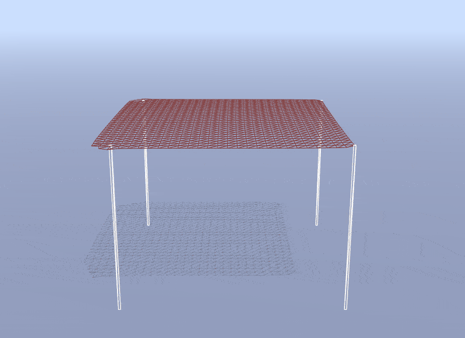 | 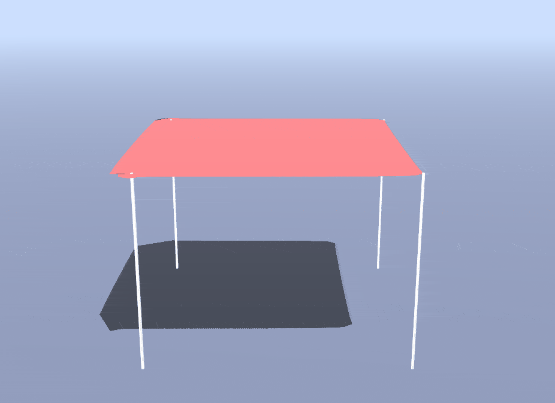 |
| Floor Collision: Wireframe ([simulate](http://localhost:8000/index.html?fabricLength=540)) | Floor Collision: Cloth ([simulate](http://localhost:8000/index.html?fabricLength=540&wireframe=false)) |

### (1.5)\* Sphere Collisions
Our scene contains a single, semitransparent (and currently invisible) sphere, described by the `Scene.sphere` variable. Toggle its existence in the scene by selecting `Sphere` from the appropriate dropdown menu in the user interface. Additionally, make the ball move around in a repeated loop by checking `moving sphere`.

If you set your scene up correctly, you should be able to see the ball oscillating about in your simulation, passing through the cloth like a ghost. Indeed the sphere cannot interact with your cloth at all until you implement sphere collisions!

**Step 1:** Complete `particle.js/Particle.prototype.handleSphereCollision` using the following procedure:

  1. First check if the particle is inside the sphere at all. If not, return and do nothing.

  2. If so, compute a position `posNoFriction`, which is the projection of the particle's current position to the nearest point on the sphere's surface.

  3. If the particle was outside of the sphere in the last time-step, then take corrective action while accounting for friction. To do so, compute a position `posFriction`, which is the particle's previous position, adjusted by the sphere's movement in the last time-step. If the sphere is not moving, then this adjustment should be zero. This adjustment simulates perfect friction (i.e. `friction = 1`). However, to generalize it to any `friction` parameter, let the particle's new position be the weighted sum of `posFriction` and `posNoFriction`, weighted by `friction` and `1.0 - friction`, respectively.

  4. If the particle was instead inside of the sphere in the last time-step, project it back onto the surface of the sphere directly at `posNoFriction`. You do not have to account for friction in this case.

**Step 2:** Now, edit the code in `cloth.js/Cloth.prototype.handleCollisions`, such that it also calls `handleSphereCollision` for each of its particles.

**Implementation Advice**

* `posNoFriction` and `posFriction` are initialized as zero `Vector3` objects for your convenience.
* The radius of the sphere is stored in the `radius` property of the input sphere.
* The sphere's current position is stored in the `position` property of the input sphere.
* The sphere's previous position from the last time-step is stored in the `prevPosition` property of the input sphere.
* `friction` is a scene parameter initialized to `0.9` and can be changed interactively in the UI.
* If you are having trouble debugging, you can try some visual debugging by going into `coursejs/scene.js` and modifying the `sphere` material so that it has an opacity of `1.0`. Then, you can view your scene with the sphere in wireframe mode. Note that it's expected that the cloth may appear to clip slightly through the sphere's surface in normal viewing mode.

If you return to your simulation and refresh the page, you should now see your cloth properly interacting with the sphere, as expected. Note that your results may differ from the examples below depending on how the ball moves and when your cloth drops.

|   |   |
|:-:|:-:|
| 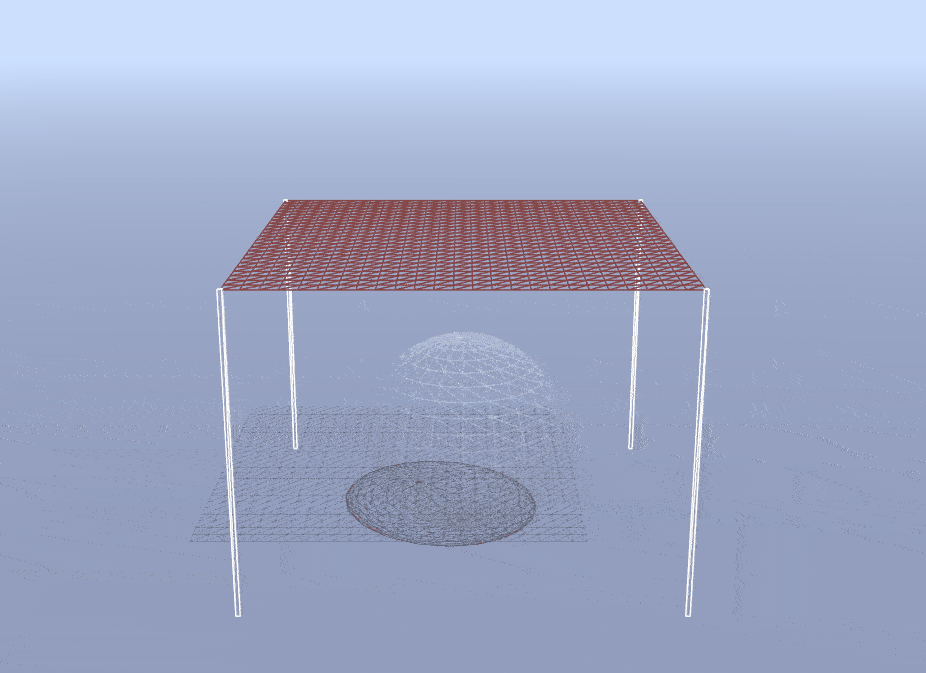 | 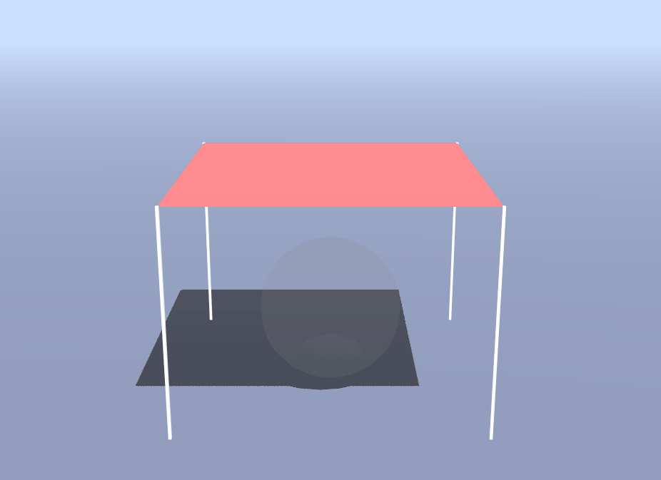 |
| Sphere Collision: Wireframe ([simulate](http://localhost:8000/index.html?object=Sphere)) | Sphere Collision: Cloth ([simulate](http://localhost:8000/index.html?object=Sphere&wireframe=false)) |

|   |
|:-:|
|  |
| The Cloth and a Moving Sphere ([simulate](http://localhost:8000/index.html?object=Sphere&movingSphere=true&wireframe=false)) |

### (1.5)\* Box Collisions
In addition to the sphere, the scene also contains an *axis-aligned* box, maintained at the variable `Scene.box`. You can toggle its existence in the scene by selecting `Box` from the dropdown in the UI.

Unlike the sphere, this box does not move and is static in the scene. However, just as before, you will be unable to notice the effects of the box until you implement collisions with the cloth. Also just as before, you will be using an `EPS` term to prevent clipping.

**Step 1:** Complete `particle.js/Particle.prototype.handleBoxCollision` using the following procedure:

  1. Check if the particle is inside the box. If not, do nothing.

  2. If so, compute a position `posNoFriction`, which is the projection of the particle's current position to the nearest point on the box surface. You may assume that the box is axis-aligned, similar to the one you worked with in Assignment 3's raytracer.

  3. If the particle was outside of the box in the last time-step, then take corrective action while accounting for friction. Let the particle's new position be the weighted sum of `posFriction` and `posNoFriction`, weighted by `friction` and `1.0 - friction`, respectively. The box does not move, so you do not have to worry about "following" the box movements.

  4. Otherwise, if the particle was in the box in the last time-step, have it cling onto the surface of the box directly at `posNoFriction`. You do not have to account for friction in this case.

**Step 2:** Now, go back to `js/cloth.js` and edit the code for `cloth.js/Cloth.prototype.handleCollisions` function, so that it also calls `handleBoxCollision` on each of its particles.


**Implementation Advice**

* `posNoFriction` and `posFriction` are initialized as zero `Vector3` objects for your convenience.
* The box's bounding box is stored in `boundingBox` property of the provided `box`, which is a ThreeJS [`Box3` object](https://threejs.org/docs/#api/en/math/Box3). You can use the `Box3` API to determine whether or not a point is inside of it. In addition, the `Box3` object also has its `min` and `max` points, which define its bounding box in 3D space.
* `friction` is a scene parameter initialized to `0.9` and can be changed interactively in the UI.
* If you are having trouble debugging, you can try some visual debugging by going into `coursejs/scene.js` and modifying the `box` material so that it has an opacity of `1.0`. Then, you can view your scene with the box in wireframe mode. It's expected that the cloth will appear to clip with the box at the surface and at the corners in normal viewing mode.

When you refresh simulation, you should see that your cloth properly interacts with the box.

|   |   |
|:-:|:-:|
| 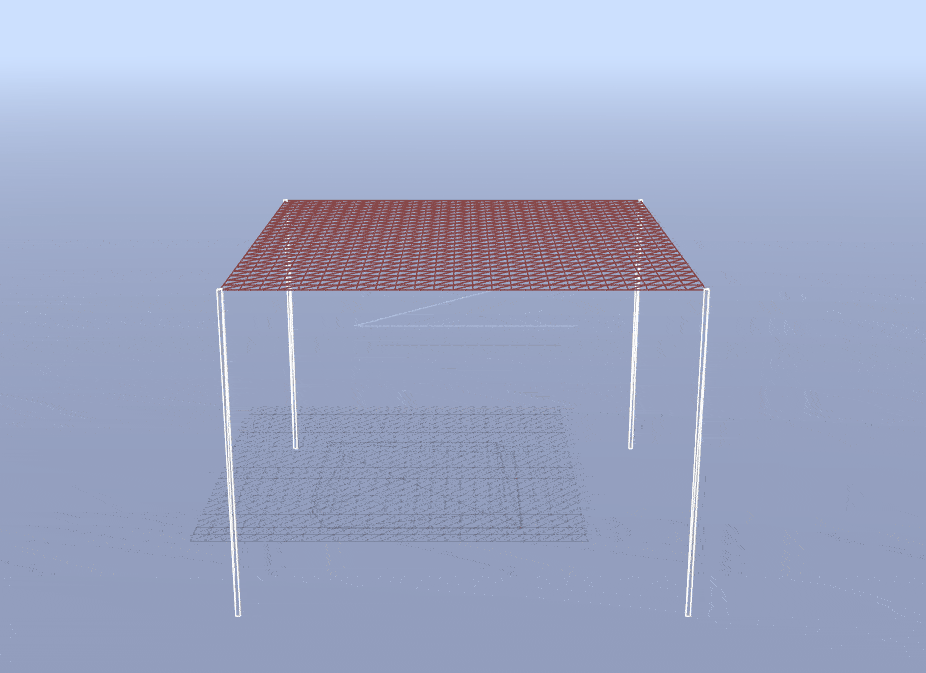 | 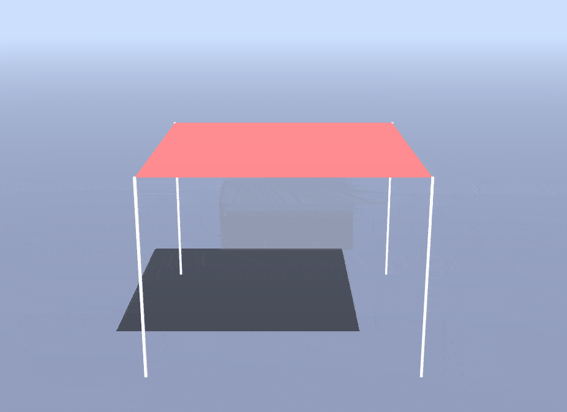 |
| Box Collision: Wireframe ([simulate](http://localhost:8000/index.html?object=Box)) | Box Collision: Cloth ([simulate](http://localhost:8000/index.html?object=Box&wireframe=false)) |

## V. Extensions

Implement one or more extension(s) of your choice to the cloth simulation! Note that you are welcome (and even encouraged) to devise your own extension, especially if you find yourself struck with a spark of creativity! Among the suggested extensions below, the first handful are technical extensions, whereas the last few are more artistic. You are welcome to complete any subset for credit!

### (1.0 – 2.0) Event Handlers Revisited
Add additional event handlers to your scene to introduce some novel effect. Perhaps you could bind a key to augment the behavior of gravity, or to create an explosion that pushes all nearby particles away, or to any other creative effect you can dream up. You could also attach event handlers to mouse events to allow you to click and drag a fragment of the cloth. The choice is yours!

### (1.0) Changing Winds
Make the wind force more interesting by incorporating the global variable `time` (a scaled counter that ticks up every animation frame) with some sinusoidal functions. To do so, edit the definitions of `windStrength` and `windForce` in the `cloth.js/Cloth.prototype.applyWind` function.

### (1.0) Rain
Add rain impulses by simulating many small objects striking the cloth at random positions during each animation frame. Each "raindrop" should apply some downward offset to the position of the particle at a random position in the cloth, and it should also apply a smaller downward offset to nearby particles, to mimic each raindrop having a physical size. See the comments in `cloth.js/Cloth.prototype.applyRain` for more.

|   |
|:-:|
| 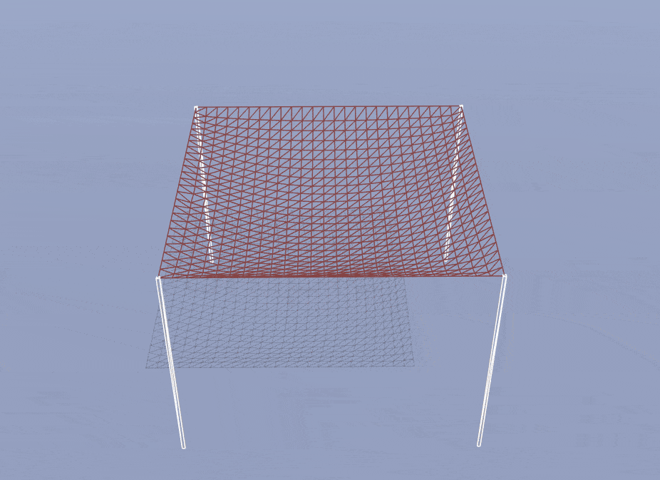 |
| A Cloth in the Rain ([simulate](http://localhost:8000/index.html?pinned=FourEdges&rain=true)) |

### (1.0) Custom Force
Complete `cloth.js/Cloth.prototype.customForce` to add a custom force. This could really be anything, from a vortex/tornado winds to underwater drag. You could also try for something completely whacky! Note that to receive full credit, your result should have some aesthetic or physically meaningful value.

### (1.5 – 3.0) Self-Intersections
You might notice that your cloth can pass through itself! To prevent this, you will need to handle self-intersections by filling in `cloth.js/Cloth.prototype.handleSelfIntersections`. This behavior can be enabled in the GUI by checking the corresponding box.

A simple, naive implementation is sufficient to earn `1.5` points; however, you can earn additional points if you can optimize this further! The precept slides and in-code comments describe several heuristic approaches you may attempt. You are also welcome to attempt a more complex, yet efficient approach called [spatial hashing](http://www.cs.ucf.edu/~jmesit/publications/scsc%202005.pdf). Feel free to look around online to learn more about this (or ask on <piazza-link></piazza-link>) --- just please do not copy any code for existing or example implementations. Note that spatial hashing is not the only efficient approach, and you can research and implement an alternative solution if you would like. Regardless, ***if you use external sources, be sure to cite them.***

|   |   |
|:-:|:-:|
|  |  |
| A Falling Cloth without Self Intersections ([simulate](http://localhost:8000/index.html?fabricLength=800&pinned=OneEdge&avoidClothSelfIntersection=true)) | A Falling Cloth with Self Intersections ([simulate](http://localhost:8000/index.html?fabricLength=800&pinned=OneEdge)) |

### (1.5) General Plane Collisions
Implement and support generalized cloth-plane collisions, rather than the simple case of an infinite floor plane from Part 4. You should account for friction, similar to how you account for it with spheres and boxes. In addition, you should account for collisions coming from **both sides** of the plane. To do so, you will probably need to introduce a new `particle.js/Particle.prototype.handlePlaneCollision` function, as well as a new plane object in `coursejs/scene.js`. Read the current code to see we add the sphere and box to the scene; then add your own plane.

### (1.5 – 3.0) New Geometries
Add a different type of object (besides sphere, box, or plane) to the scene and implement proper cloth collisions with them. You will likely need to modify several different files beyond just `js/cloth.js` and `js/particle.js`, such as `coursejs/render.js` and `coursejs/sim.js` in order to support this.

For the truly ambitious student, you might consider implementing a function `Particle.prototype.handleTriangleCollision` to handle intersections with arbitrary triangles in a triangular mesh. Then, load a mesh into your scene by modifying `coursejs/scene.js`, triangulate that mesh, and check for intersections with each triangle in the mesh. Note that unoptimized solutions may be very slow for high-poly meshes.

### (1.5) Custom Scene
Improve the scene by adding more objects, rather than only having a sphere or a box to collide with. For example, you could introduce several spheres, or some combination of spheres and boxes. You could also experiment with the initial position of the cloth.

To implement a custom scene, you will need to modify `coursejs/scene.js` to create meshes for your new objects, as well as `coursejs/sim.js` to handle collisions with those objects. You may also need to amend `coursejs/renderer.js` depending on the objects you add. In any case, we recommend that you explore these three files a bit first to get a feel for how ThreeJS handles this sort of thing (and to build up your familiarity with the library in preparation for the final project).

### (1.0) Textures and Materials
Dig into `coursejs/scene.js` and look for texture-related snippets of code in `buildCloth` and `buildGround`. The provided starter code includes a `textures/` directory with some sample images that can be texture mapped onto the different meshes in the scene (e.g. cloth, ground). Begin by trying the given texture mappings to build your understanding of how the ThreeJS code in `coursejs/render.js` applies textures to objects. Then, create your own textures (or find some online) and edit the `coursejs/render.js` code to create a more visually exciting scene for your cloth. Put any new textures that you use in the `textures/` directory, and write about them in your writeup.

|   |
|:-:|
| 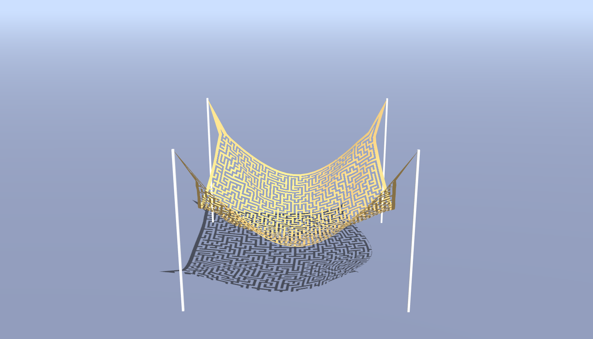 |
| A Crazy Cloth ([simulate](http://localhost:8000/index.html?wireframe=false&clothColor=11170857&showClothTexture=true)) |

Alternatively, change the rendering material of the cloth, ground, or other scene objects to produce interesting visual effects. For example, you could try to model highly-specular "clear coats", Aluminium foil, or materials that display the normals of an object through its RGB channels.

One further idea is to implement normal-mapping and bump-mapping, so that the normals or positions of meshes in your scene are offset by an amount specified in the RGB components of a provided input image. This can be used to add surface features to an object, such as making it look ridged or bumpy. For example, you can use this to make the grass texture on the floor of the scene look more realistic.

### (1.0 – 3.0) Creative Idea
Implement your own custom feature! There are a lot of directions in which this simple cloth simulation can grow, so feel free to be as creative (and run as wild) as you like. If you have any questions or concerns about your idea, please ask us on <piazza-link></piazza-link>.

## Art contest
Similar to the art contest for Assignment 3, your art contest submission must be drawn from your work on one of the extensions. Feel free to submit your wackiest bugs, most colorful scenes, or most meme-worthy textures to the art contest!

As always please include a description of your submission(s); you are welcome to recycle explanations that you used elsewhere in the writeup for a particular work. Participation in the art contest counts for 1 point, being selected for the art gallery counts for 1.5 points, and winning the contest counts for 2 points.
