# Contest Winners

### 1, Gabriel Roth (gjroth)

For the art contest, I created a Mosaic filter that represents the image with solid color square tiles. Just as an artist creates a mosaic by choosing a solid color tile to represent a piece of an image, this filter replaces a region of the image with a single colored tile. The color of each tile is computed as the average of the colors of each pixel in that tile’s region. In addition, beige colored lines line each tile, just as grout separates tiles in a real mosaic.

The greater the input value, the larger the tiles grow, and thus the more abstract the mosaic representation becomes. Conversely, as the input value shrinks, so too do the tiles, thereby producing a more accurate mosaic representation. Below are some beautiful mosaics of different images with various sized tiles.

|   |   |
|:-:|:-:|
| 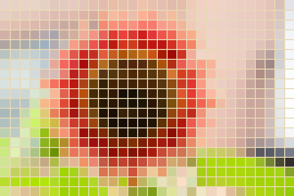 | 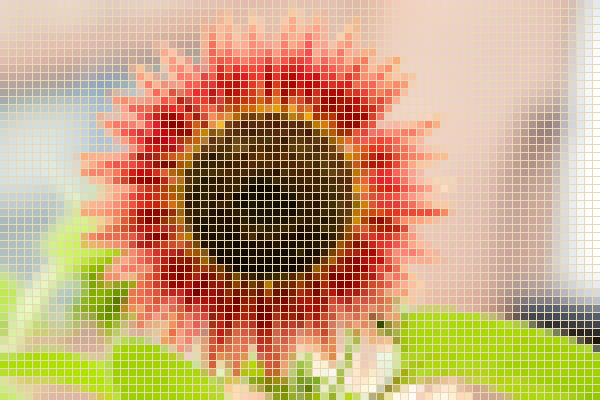 |
| Abstract Flower Mosaic (gjroth) | Detailed Flower Mosaic (gjroth) |

|   |   |
|:-:|:-:|
|  | 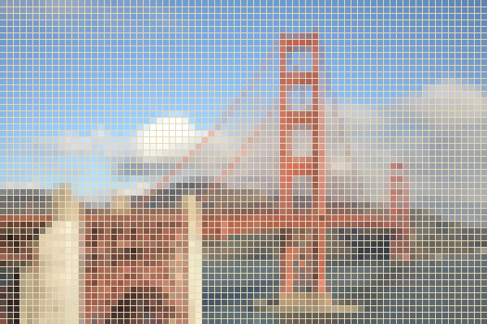 |
| Abstract Golden Gate Mosaic (gjroth) | Detailed Golden Gate Mosaic (gjroth) |

|   |   |   |
|:-:|:-:|:-:|
| 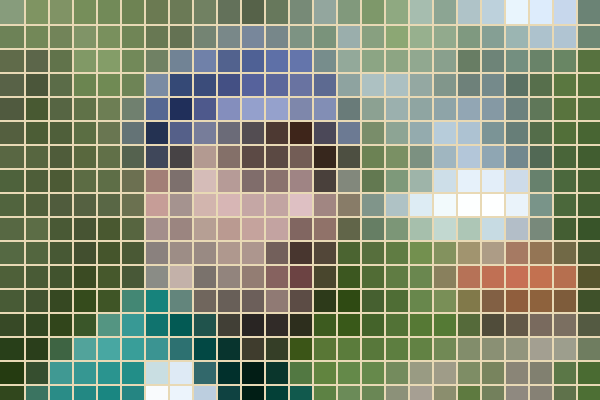 |  |  |
| A Tiled Man (gjroth) | A Mosaic of a Mesa (gjroth) | A Mosaic of a Doge (gjroth) |

### 2, David Todd (dtodd)

First, I sampled a random number of pixels (inversely proportional to the user-input value). For each pixel in the image, I then found the closest randomly sampled point by color and set the pixel to this color --- in effect, quantizing the image. I then approximately traced contours by checking an appreciable difference between each pixel and one of its cardinal neighbors. This edge detection was crude but worked well since the image had been quantized.

|   |
|:-:|
| 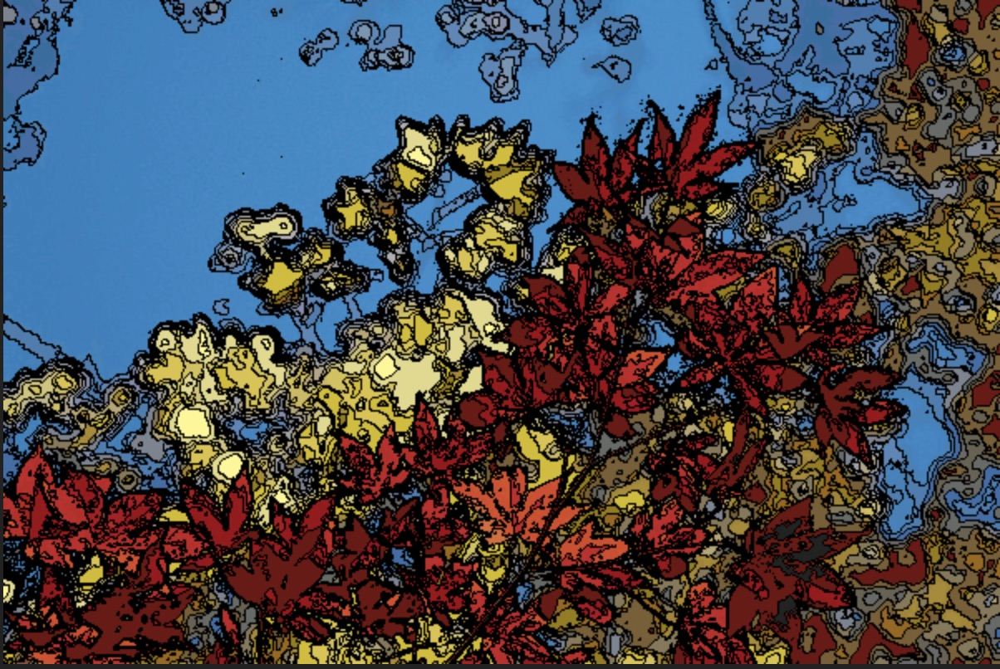 |
| Leaf Topologies (dtodd) |

|   |
|:-:|
| 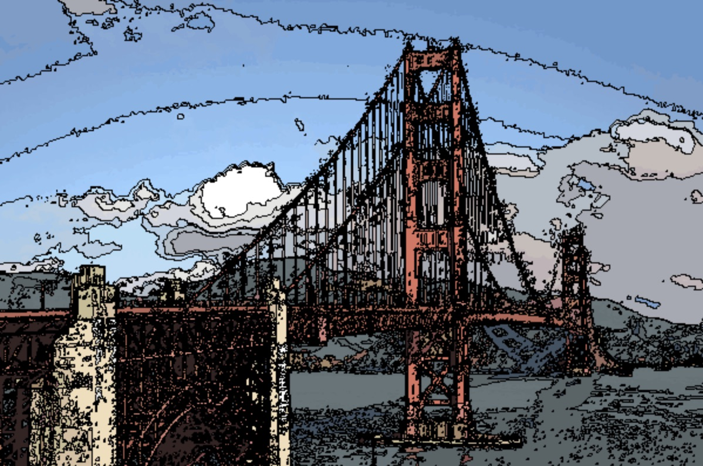 |
| A Golden Cartoon (dtodd) |

### 3, Audrey Cheng (accheng)

I simulated intense light coming out of the windows of the town for my art project. First, I inverted the distance calculation of opacity for the soft brush to create the intense lighting effect. Then, I added light to the windows using the modified brush. Finally, I assembled several screenshots taken with different brush radii into an animated GIF.

|   |
|:-:|
| 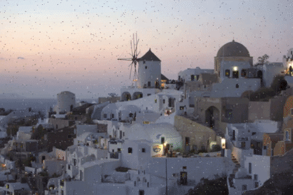 |
| Santorini Lights (accheng) |

### 3, Brandy Chen (brandyc)

For the Art Contest, I drew a landscape of a mountain. I used the soft brush for big components like the sky and used the regular brush for the smaller details like the trees and mountain.

|   |
|:-:|
|  |
| the mountains are calling and i must go (brandyc) |

### 3, Yujin Yamahara (yamahara)

My custom filter covers about a quarter of the image with circles of a randomly chosen color from the original image. My initial thoughts were that it would look as if an original image's painter had splattered the finished product with random colors from their color palette. The number and size of the color circles change proportionally with the input value, in order to remain consistent in covering 25% of the canvas. After adding alpha-blending, however, it now looks more like colored drops of water were sprinkled onto the camera lens.

|   |
|:-:|
|  |
| The Cheetah Slurps (yamahara) |

|   |
|:-:|
| 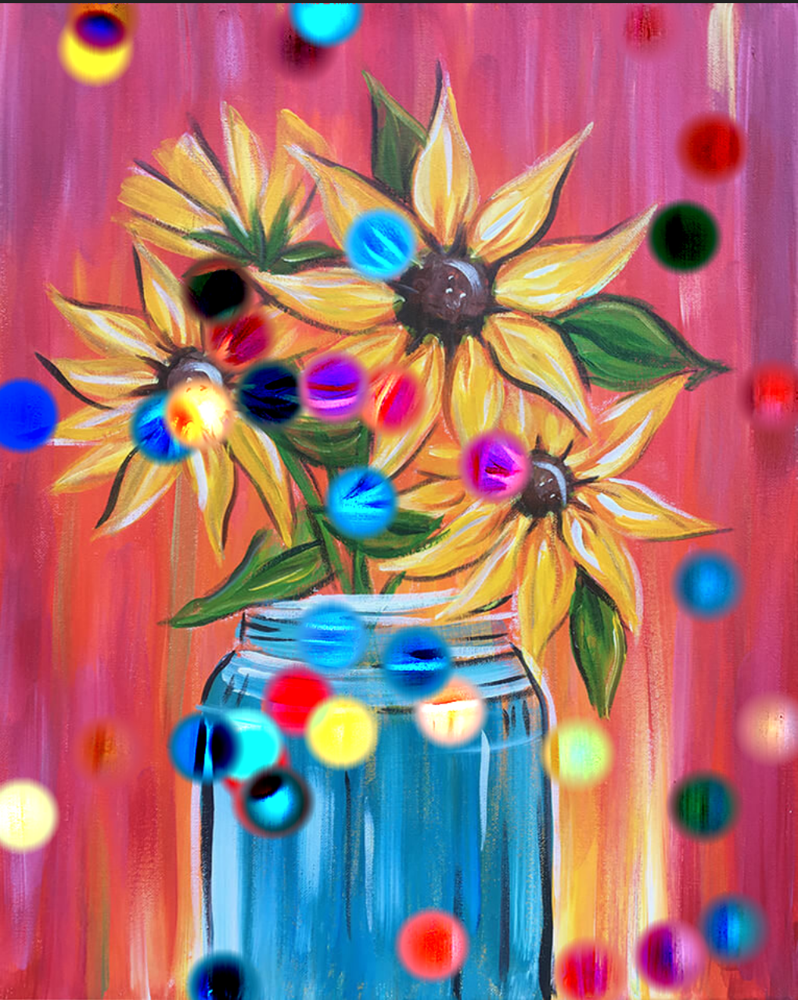 |
| The Fun Flowerpot (yamahara) |

### 4, Ofek Peres (operes)

For the Art contest, I implemented the Gaussian Blur filter and the Edge Detection filter.

I randomly applied the two filters to every pixel in an image. The Edge Detection filter had a 90% chance of being picked and the Blur Effect had a 10% chance of being picked. This resulted in a very neat effect :)

The Gaussian blur kernel function had a radius of `3` pixels, a mean of `0` and a standard deviation of `100`. The Edge Detection filter subtracted all of the surrounding pixels from the center pixel, which had a weight of the area of the convolution matrix minus `1`. For the `3x3` case, the center pixel was assigned a weight of `8`, and the rest each had a weight of `-1`.

Both of my convolution functions are able to handle variable inputs for radius, but I hardcoded them because I did not have the sliders needed to adjust those parameters. If you slide the value parameter in the custom filter to the left, the image will have the blur effect applied. If the slider is in the middle, it will have the mixed blur/edge detection effect applied. If the slider is towards the right, only the edge detection filter will apply.

|   |   |   |   |
|:-:|:-:|:-:|:-:|
|  |  | 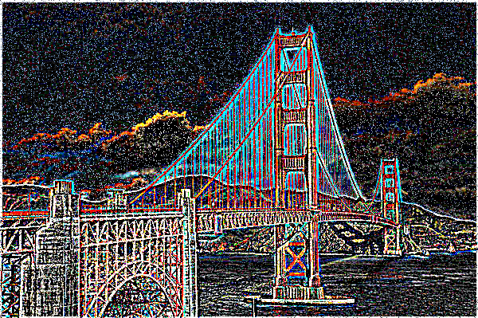 | 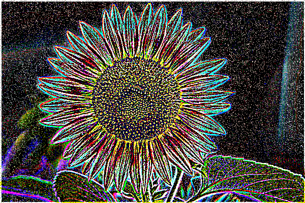 |
| Trippy Fall (operes) | The Edge of Man (operes) | The Rainbow Gate (operes) | A Yellow Sun (operes) |

### 4, Christine Kwon (cmkwon)

My filter creates columns of green diamonds, which form an alternating horizontal gradation. The gradation was achieved by changing the alpha values from `0.25` to `1`, with increments of `0.25`. The green color was achieved by preserving the green channel of each pixel, while zeroing out the other two channels.

The overall effect resembles shards of green glass or crystal.

|   |   |
|:-:|:-:|
|  | 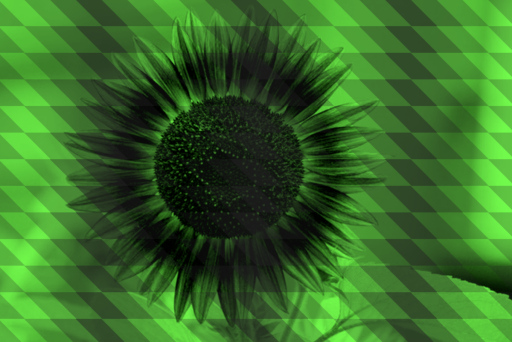 |
| Leaves in Oz (cmkwon) | The Emerald Sun (cmkwon) |

### 4, Lily Zhang (llzhang)

|   |   |
|:-:|:-:|
|  |  |
| Hazy Portrait Pic in SF (llzhang) | Sunflower Seeded (llzhang) |

### 4, Tyler Campbell (tylercc)

My art contest filter makes the image look like a sketch. For each pixel, it calculates the sum of neighbor pixels times a scaling matrix, and then sets that sum (a color) to the value (also a color) of that pixel.

If the input parameter is less than `.5`, my filter will do image processing in color; otherwise, the image is processed in gray scale.

|   |   |
|:-:|:-:|
| 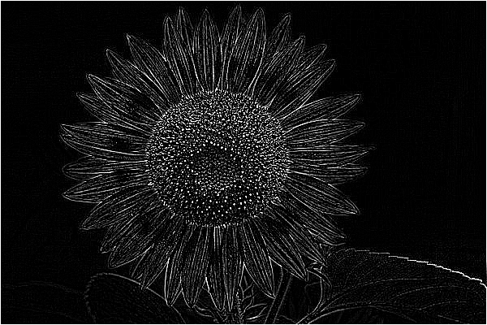 | 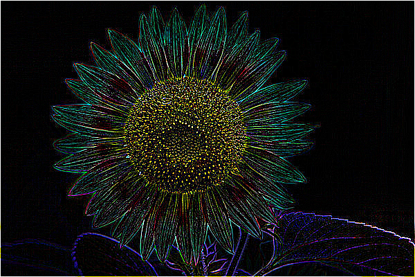 |
| Sunflower Sketch (tylercc) | Colorized Sunflower Sketch (tylercc) |

|   |   |
|:-:|:-:|
| 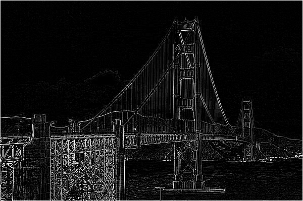 |  |
| Golden Gate Sketch (tylercc) | Colorized Golden Gate Sketch (tylercc) |

### 4, Zak Dasaro (zdasaro)

For the art contest, I implemented a spiral feature. It rotates every concentric ring of pixels about the center of the image, such that the innermost ring rotates the most and each subsequent ring rotates less and less (proportional to $\frac{1}{r^2}$). The slider controls how far to spiral the image, with `0.5` indicating no spiraling, `0.0` indicating maximum counterclockwise spiraling, and `1.0` indicating maximum clockwise spiral. To create the Doge animation, I set the slider to values `[0, 0.05, 0.1, ..., 0.5]`.

|   |
|:-:|
|  |
| Spiraling Doge (zdasaro) |

# Honorable Mentions

### Dora Zhao (dorothyz)

For the art contest, I made two images. The first uses the fill, brush, and soft brush filters to create the image of a warm mountain sunset. The second image takes the first image and inverts it using my custom filter. I inverted the image by taking each pixel and finding its inverted color through the following formula: white (R,G,B) - pixel color. I then set the pixel color to the newly calculated color.

|   |   |
|:-:|:-:|
| 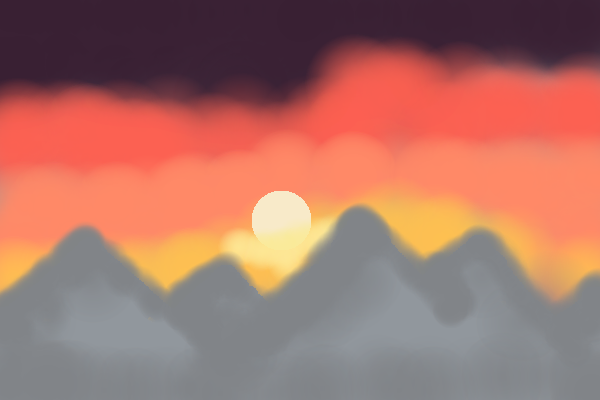 | 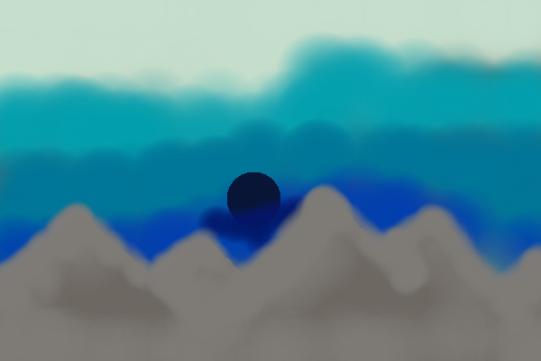 |
| Sunset Mountain (dorothyz) | Rise of the Ice Black Sun (dorothyz) |

### Daniel Wey (dwey)

My submission reflects an original image on a horizontal axis along the photo’s center. The sketch is meant to resemble a sky’s reflection on a creek.

|   |
|:-:|
| 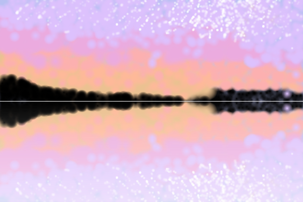 |
| Clouded Reflection (dwey) |

### Henry Wang (htwang)

For the art contest, I implemented a custom filter that rotates each pixel according to the given value and scales the distance from the center of the picture to the pixel by that same given value; a rotating spiral effect
was achieved.

By also applying a soft brush filter at the center of the image and slowly increasing the alpha value, images fade as they spiral inward. To assemble the animation, I captured the image at various intervals along its inward spiral and then used [EZGif](ezgif.com) to link the various frames together.

My animation uses 69 unique frames. Each frame after frame 26 was computed via [this batch link](batch.html?Push_Image=thisisfine.jpg&CustomFilter=value&Soft_Brush=100;[1,1,1,1];alpha;x200y194). The final
few frames were made through a simple application of the brush filter.

|   |   |   |
|:-:|:-:|:-:|
|   | 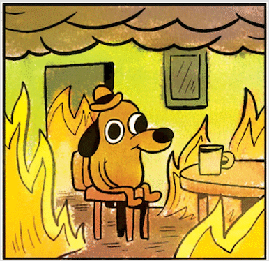 |   |
|   | Spiral Into Madness: Thesis 2020 (htwang) |   |

### Jake Kirkham (jak4)

For my art contest submission, I created a surreal, truly-golden Golden Gate Bridge. To do this, I first mirrored the image and flipped it on one side. I also added a vertical offset so that the cables in the middle would line up to create a crossing effect. I then changed all pixels to HSL format, set hue to gold (variable by value), and amplified saturation by 25% to make the gold pop. The feature is less "sensical" on other images, but can still be pretty.

|   |   |
|:-:|:-:|
|  | 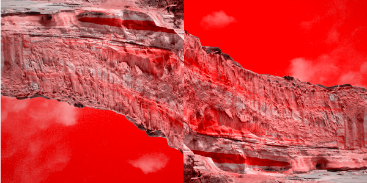 |
| True Gold (jak4) | The Wicked Twist (jak4) |

### Jamie Guo (jamieguo)

I recreated the *graphic design is my passion* meme, but adapted it for this class.

I also created a custom filter that pixellates the image, using an integer value `w` as the pixellation width. The pixellate filter loops through every pixel twice, first to calculate an average color of the pixels in each `w x w` block, and then to color each pixel in that block. The 'average' color is not the actual mean of the colors, but rather it is calculated by taking the midpoint between the current color and the next color, as the function iterates through the pixels. I added the `Pixel.prototype.average` function, which takes a pixel and returns a new pixel with the RGB values that are the midpoint of the original and the argument pixel. This filter was fun to play with; I used it to pixellate the background a bit.

|   |
|:-:|
| 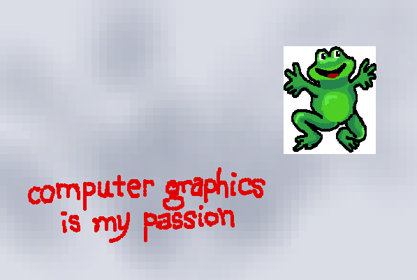 |
| computer graphics is my passion (jamieguo) |

### Jingwen Guo (jingweng)

For the art contest, I created a custom filter with adjustable brightness. I created a GIF using the Golden Gate bridge image by gradually turning down the brightness to simulate sunset. I used the soft brush filter to add lights to the image and to draw the moon.

|   |
|:-:|
| 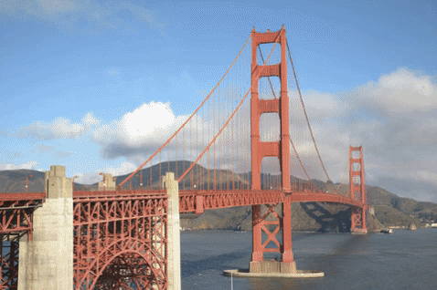 |
| Bay Area Lights (jingweng) |

### Chi Qi (jinyuanq)

My `customFilter()` is a blue mosaic filter. The input value determines the mosaic size --- the larger the input value, the greater the mosaic size.

I also added some random colored pixels to imitate signal noise on a TV, and I applied a blue filter based on the hundredths-digit of the input value. Finally, I used [GIPHY](https://giphy.com/) to assemble the filtered pictures into an animation that shows Santorini at dusk becoming more and more clear from mosaic patterns on an old TV.

|   |
|:-:|
| 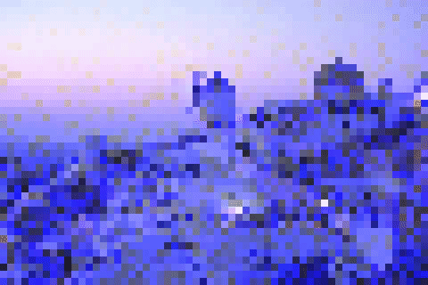 |
| Santorini TV (jinyuanq) |

### Jason Kim (jjk7)

In `customFilter()`, I switched the values of the blue and red channels for every pixel. I then set every pixel (except those on the border of the image) to the average of the the four pixels to the top, bottom, right, and left of the pixel. This creates a blurring effect.

Then I added clouds to both images below. The result is an attempt to create images that represent concepts for sci-fi planets. The first might represent a “terraformed” mars with a reddish atmosphere. It is an altered version of a picture from Yosemite National Park. The second image shows a picture from my neighborhood that I’ve changed to make it look like the sky of a planet that is orbiting a blue star.

|   |   |   |
|:-:|:-:|:-:|
|   | 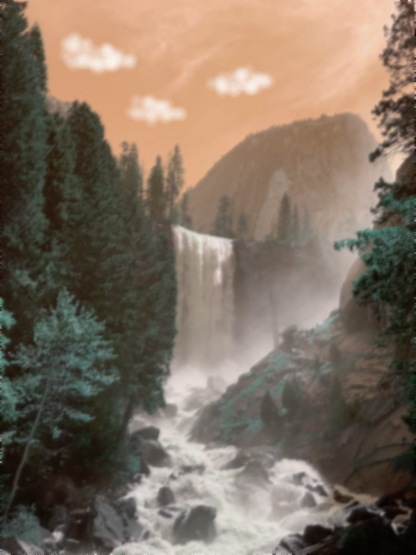 |   |
|   | Alien World (jjk7) |   |

|   |
|:-:|
| 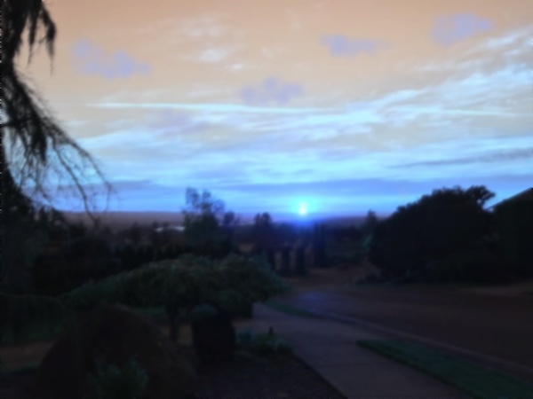 |
| Blue Star (jjk7) |

### Joanna Kuo (jkuo)

With the value variable set to zero, my custom filter turns a black background into alternating lines of red, green and blue. Then, splitting the screen into thirds, I set certain non-black pixels to R, G, or B depending on what colored line the pixel lands on (i.e. red and green in the top third of the picture). The height of each line is 3 pixels.

Known as [Munker–White's illusion](https://en.wikipedia.org/wiki/White%27s_illusion), this filter causes us to interpret the color for the circle incorrectly. In the image below, the circles appear to be yellow, blue, and purple from top to bottom; however, they are indeed all white. This illusion is caused by our eyes blending the color of the stripes and the color of the circle together. For example, in the bottom half, the circles appear purple because we see a mixture of white, red, and blue.

Using this illusion, I decided to color parts of black and white images with alternating blue and red stripes so they appear purple. To achieve this, I used the value variable (`0 < value <= 1`) to determine the threshold grayscale value at which any pixel with a RGB value below it will remain the same and any pixel above it will be set to red or blue, depending on its position. The result is an image that has its pixels with a higher grayscale value than the variable value to appear purple. The height of each line is one pixel.

|   |
|:-:|
| 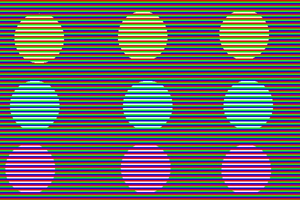 |
| Seeing Colors (jkuo) |

|   |
|:-:|
|  |
| Purple Lilies? (jkuo) |

### Lauren Johnston (lej2)

For the art contest, I recreated an old photo with burned edges. I achieved this "photo I found in the attic" effect in the custom filter by first translating RGB to HSL and reducing saturation to `s = 0`. I then set the hue to `0.6` and the luminance to twice the original luminance. Increasing the luminance made the image appear faded and overexposed.

I then translated HSL back to RGB and used alpha blending to combine sepia-tone pixels with every image pixel. To create the rough burned edge, I used the soft brush. Finally, for extra realism, I created a second soft brush layer with a low alpha value and traced over certain burned edges.

|   |   |
|:-:|:-:|
|  | 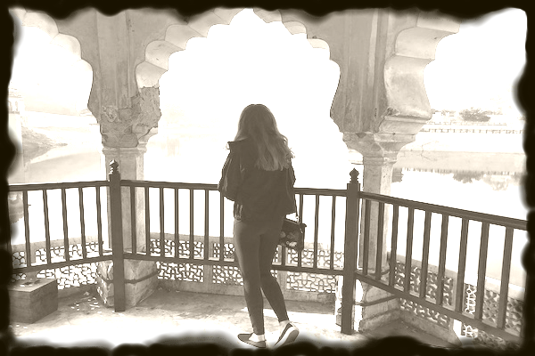 |
| Elephants (lej2) | Jaipur (lej2) |

### Sharon Zhang (sharonz)

My art project is a filter that simulates the effects of old, grainy film. Moving the value closer to `1` increases the strength of the effect. The filter is composed of three parts:
* Noise: I added monochromatic noise to the image by jittering each pixel a random amount in the `(r, g, b)` directions. The jitter on each channel was identical, resulting in monochromatic noise.
* Vignette: To create a vignette, I darkened the image (added black) to each pixel based on its distance from the center. I treated the image as an ellipse.
* Tint: I added a warm tint to the photo to create a sepia effect.

|   |   |   |
|:-:|:-:|:-:|
| 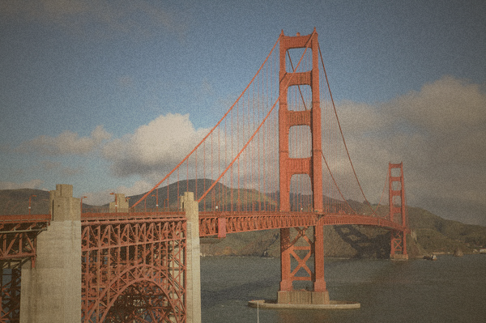 | 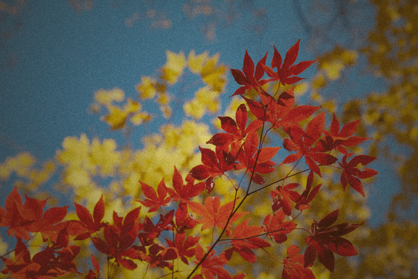 | 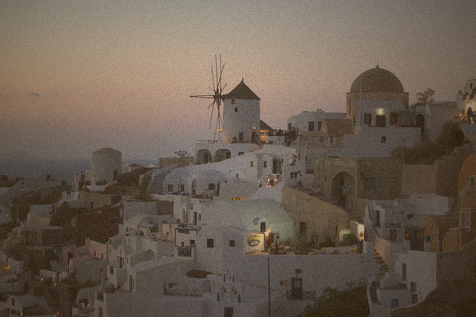 |
| Sepia San Fransisco (sharonz) | Fall Tones (sharonz) | Santorini Snapshot (sharonz) |

### Thomas Martinson (tmm2)

I decided to implement a median filter, as described in lecture. I did this by generating an image of horizontal medians for each pixel, and then using this image to find the vertical medians of each pixel. The median is defined by the medians of each RGB component in an N-pixel radius from the pixel.

|   |
|:-:|
| 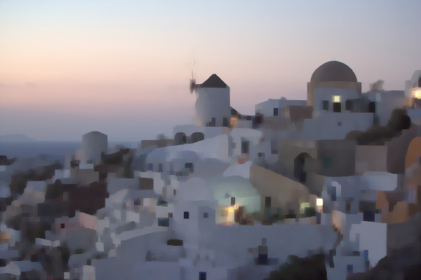 |
| A Smooth Sunset (tmm2) |

# Other Art Galleries

<galleries></galleries>

