# Contest Winners

### 1, Caio Costa (ccosta)

I have two art contest entries. The first is a Voronoi diagram filter, which runs a Euclidean k-means algorithm to generate centers, and then colors them according to the average color of the pixels nearest to that centroid. The value passed in is the number of centers to populate (technically the number of centers is value\*1000 since the value seems to be capped at 1). Here are a few of the images generated by it:

|   |   |
|:-:|:-:|
| 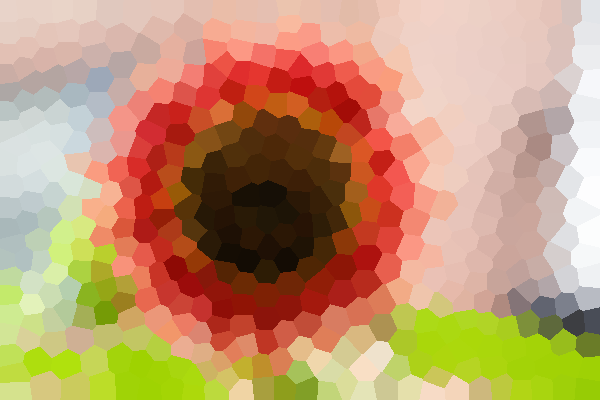 |  |
| Flower Voronoi (ccosta) | Golden Gate Voronoi (ccosta) |

My second entry was done using just the regular brush. I traced out the Princeton Tiger logo in orange, white, and black layers of differing radii.

|   |
|:-:|
| 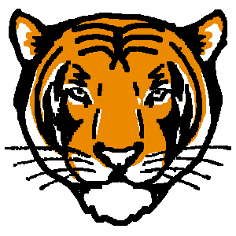 |
| Princeton Tiger (ccosta) |

### 2, Edward Yang (efyang)

I implemented a somewhat very janky filter that performs a partial triangulation of the image, and then averages color within those triangles. The actual triangulation method is questionable, basically generating a random set of points and then connecting points to each other radially outwards from the center of the image (honestly I just didn't want to implement delauney). The result of this gives the triangulation a distinct circular look, and with repeated applications of this filter (around 20 times), this results in a fairly "abstractified" mosaic-style image, where detail and smoothness can be increased or decreased based on the number of triangles. The method for drawing triangles themselves is from triangle rasterization, with my own implementation.

|   |   |   |   |
|:-:|:-:|:-:|:-:|
| 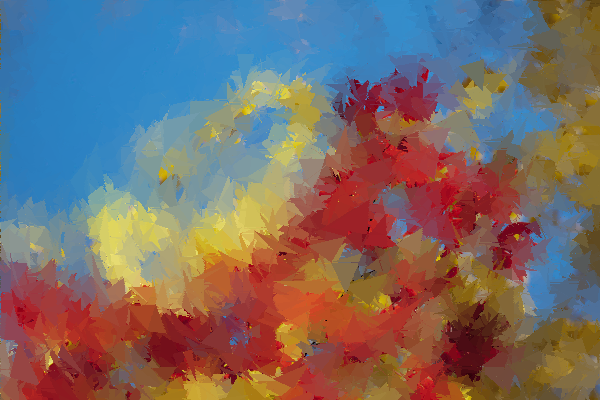 | 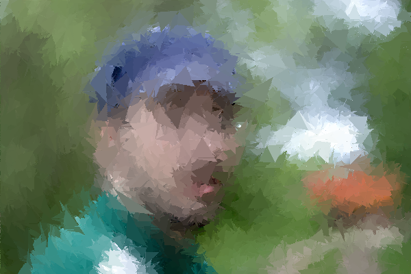 | 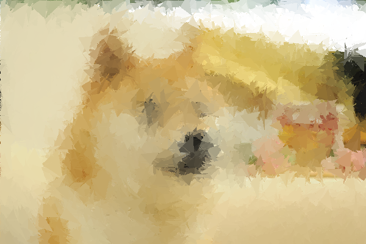 | 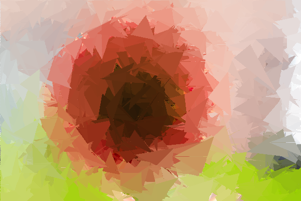 |
| Leaves (efyang) | Man (efyang) | Doge (efyang) | Flower (efyang) |

### 2, Edward Gartner (egartner)

While working on the alpha blending of SoftBrush, I made a mistake that set the entire circle to the color of the center pixel of the circle rather than the color of the background. I realized this created a pretty cool effect, and decided to use the custom filter to apply it to the entire image.
(Additionally, my brother and partner noted that it was like the "64 bits! 32 bits! 16 bits! 8 bits! 4 BITS! 2 BITS!" meme that's popular right now, so of course I had to keep going.)

The custom filter that created the effect takes the value as the radius and then multiplies it by a coefficient since the value can only be between 0 and 1. It then calculates a random vertical offset for each column and loops through the image, jumping "radius" pixels each time.

Then, just as with Brush and SoftBrush, it colors all pixels within the radius of the center to be the color of the center point. The overlapping circles create a sort of "frosted glass" effect. I think this effect (especially when not at too large a radius) is much cooler than if I used non-overlapping squares to create a pixelated effect.

|   |   |   |
|:-:|:-:|:-:|
| 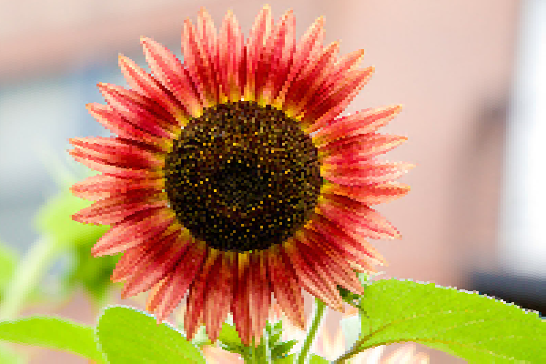 | 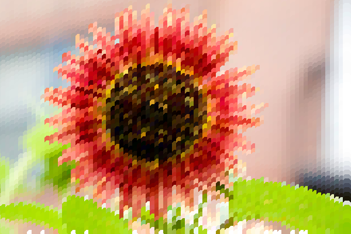 |  |
|  64 bits! (egartner) |  32 bits! (egartner) |  16 bits! (egartner) |

|   |   |   |
|:-:|:-:|:-:|
| 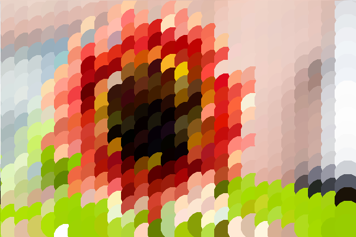 | 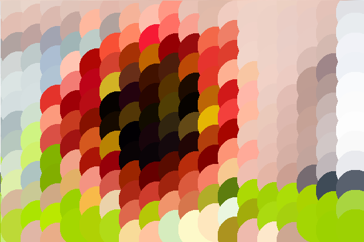 | 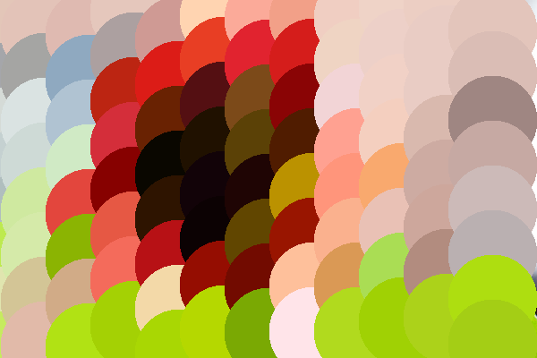 |
|  8 bits! (egartner) | 4 BITS! (egartner) | 2 BITS! (egartner) |

### 2, Monique Legaspi (mlegaspi)

While trying to implement the Soft Brush, I at one point accidentally reversed the opacity (such that the smallest alpha is in the center, and the largest is at the edges). The effect reminded me of bubbles, particularly the shiny bokeh-like effect they use in magical girls' cartoons, like Sailor Moon. This prompted me to draw Sailor Moon and disperse the "bubbles" on top for the same sort of effect.

Unfortunately, I had forgotten to re-implement the inverted Soft Brush opacity before starting to draw, so I had to hard-refresh before continuing on with the bubble effect. Since I had been drawing for an hour, and as such had made many brush strokes, the url sent so many requests that I am afraid the batch link for the bubble-less sketch does not work :( Luckily, I had saved my work as a .png before refreshing, so I was able to import it and add the bubble effect afterwards!

|   |
|:-:|
| 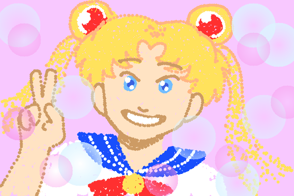 |
| Sailor Moon (mlegaspi) |

### 3, Sara Dardik (sdardik)

For every pixel in the image, convert the color space to HSL, then set the color of the pixel to 1 - color, where color refers to the current color of the pixel. This creates a pop art filter. Applying the filter repeatedly has some interesting effects (see images below).

|   |   |   |
|:-:|:-:|:-:|
| 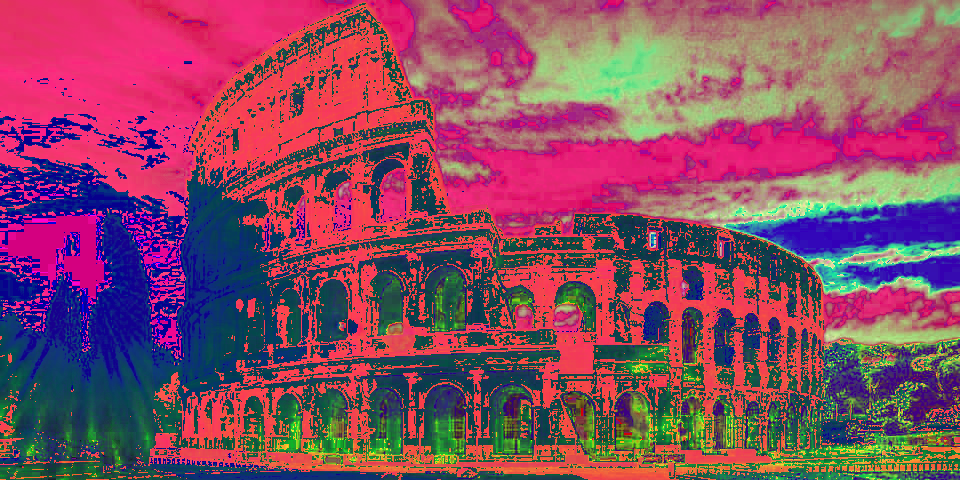 | 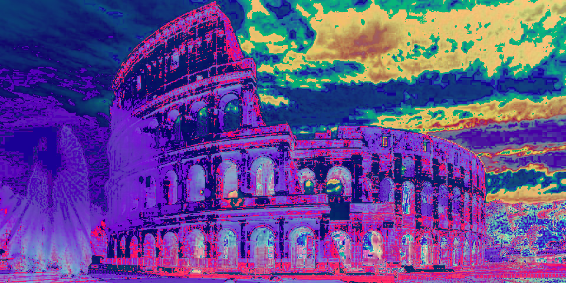 | 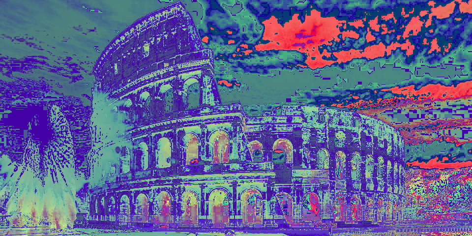 |
| | Colosseum (sdardik) | |

|   |   |   |
|:-:|:-:|:-:|
| 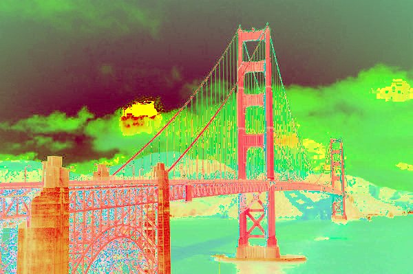 | 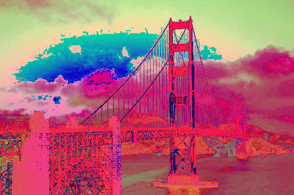 | 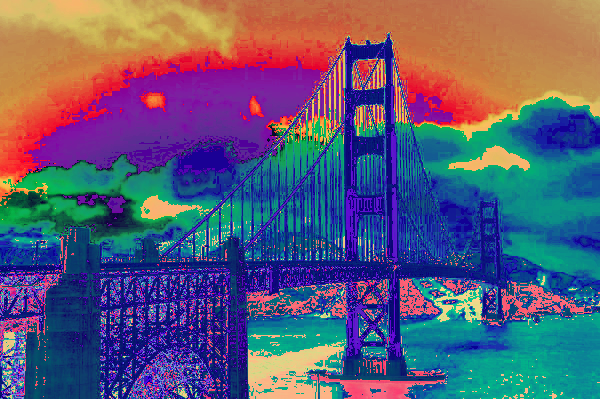 |
| | Golden Gate (sdardik) | |

### 3, Chloe Qiu (shiyunq)

This is a glitch filter that includes two effects. The first one shifts the red channel to the left and blends it with the green and the blue channels. The second one selects random rows of pixels and shifts each selected row by a random number of pixels, wrapping around the image. The value controls how glitchy the final image is.

|   |   |
|:-:|:-:|
| 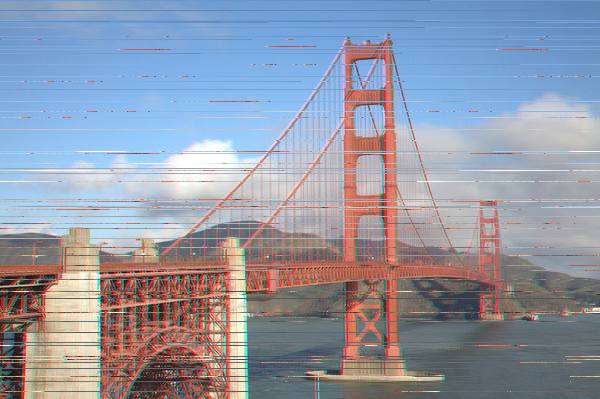 | 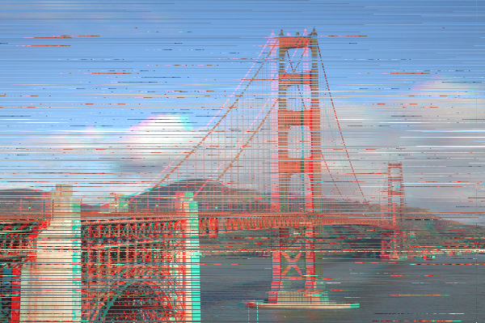 |
| Less Glitchy Golden Gate (shiyunq) | More Glitchy Golden Gate (shiyunq) |

|   |   |   |
|:-:|:-:|:-:|
| 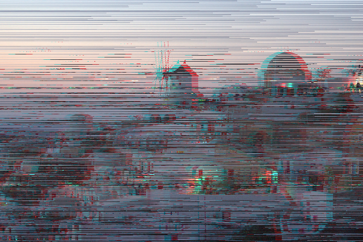 | 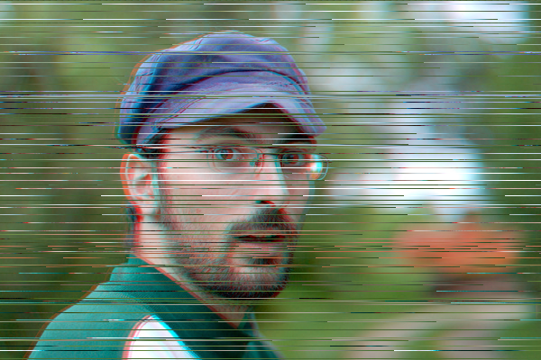 | 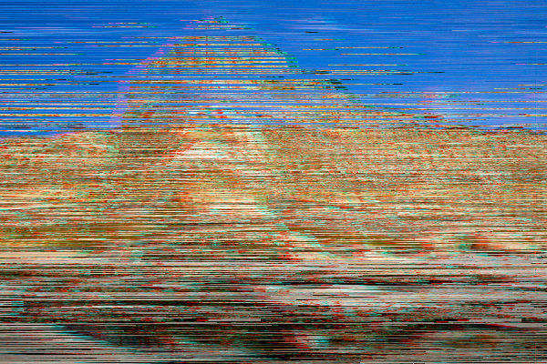 |
| Glitchy Santorini (shiyunq) | Glitchy Man (shiyunq) | Glitchy Mesa (shiyunq) |

# Honorable Mentions

### Allen Dai (allendai)

For the art contest I drew a portrait of King Dedede, my main character in Super Smash Bros. I first filled the image with white and then used a series of brush and softbrush filters to outline and color King Dedede. The most challenging aspect of this portrait was not being able to undo segments that I drew, making it necessary to either use several brush filters for a single segment for ease of deletion or not making many mistakes. Making a custom erase or undo feature could have made the process of drawing much easier in retrospect, but I believe that I have captured King Dedede's likeness quite well and I am proud of my submission.

|   |
|:-:|
| 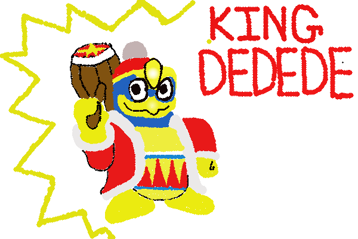 |
| King Dedede (allendai) |

### Nicholas Sum (nsum)

For the art contest, I used a custom filter, such that as input goes higher, we introduce more and more colors closer to white into the noise. This creates an interesting effect as the amount of white increases in the image. A gif of the filter is shown below.

|   |
|:-:|
|  |
| White Noise (nsum) |

### Watson Jia (watsonj)

My art submission uses Fill to create a gold colored background. I then use the brush to color a person and his clothes (specifically The Weeknd) using the red, brown, and peach colors with varying radii for precise color borders. Finally, I then use the soft brush using the black color and small radii to create a blur effect for The Weeknd's face.

|   |
|:-:|
| 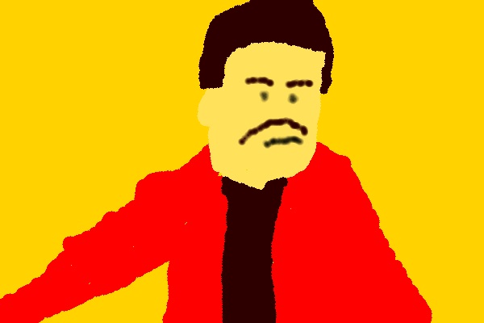 |
| When you're watching the Super Bowl but you remember your COS426 Assignment is due in two days (watsonj) |

# Other Art Galleries

<galleries></galleries>

