# Contest Winners

### 1, Caio Costa (ccosta)

For my art contest entry, I implemented a version of Herztmann et al.'s <a href="https://dl.acm.org/doi/10.1145/383259.383295">Image Analogies</a> paper, with help from implementation notes by <a href="http://cs.brown.edu/courses/csci1950-g/results/final/lfong"> Lyn Fong</a> and <a href="http://jmecom.github.io/projects/computational-photography/image-analogies">Jordan Mecom</a>. In essence, the approach taken in the paper is to try and take a training pair of images A and A', which encode some transformation (for instance, a watercolor, or superresolution, or blurring, etc) and use them to transform some given image B in the same fashion. This is done by comparing feature vectors for each pixel of the output B'. The paper uses several variants, but I used a 5x5 neighborhoor of luminance values as the feature vectors. These vectors are then compared with the A and A' images to find the most similar under two different distance metrics, the L2 norm and a coherence metric. The paper does this at several scales of a Gaussian pyramid, though I ended up using only a single scale. Once the most similar pixel is found, the luminance (and also I and Q channels for texture synthesis tasks) from the A' version is copied over into B'. This process continues over the scan line of B', until the whole transformed image is computed. Inspired by a comment by Mecom, I used the nearest L2 pixel distance rather than the coherence metric for pixels close to the border. However, this ended up rather visible, so I think I'd probably just leave the algorithm without that cut off in future.

There were several issues that came, not least of which was the long processing times. I think this was exacerbated due to the fact that I didn't use an Approximate Nearest Neighbors (ANN) algorithm as suggested in the paper, opting instead to just iterate over the whole image every time. I ended up using smaller images and a coarser iteration (skipping every 3-7 pixels) to get around this, at the cost of some fidelity. As mentioned above, I also didn't use the Gaussian pyramid, since that would have added a good deal of processing time for synthesizing the coarsest levels of B' as part of the process to generate the finest full-resolution level. I think the pyramids would have likely helped improve the texture synthesis at larger scales, since a lot of the large areas ended up not getting filled in well.

I used several training pairs from the paper, and one of their test photos as well.

|   |   |   |   |   |   |
|:-:|:-:|:-:|:-:|:-:|:-:|
| 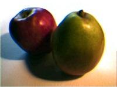 | 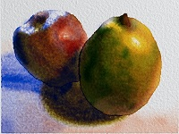 | 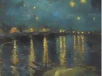 | 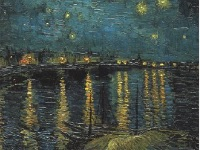 | 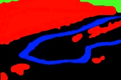 | 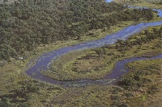 |
| Fruits A | Fruits A' | Van Gogh A | Van Gogh A' | River A | River A' |

Here are some of my results.

|   |   |   |
|:-:|:-:|:-:|
| 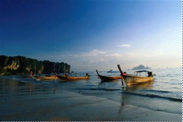 |  |  |
| Original Boats (ccosta) | Watercolor Boats (ccosta) | Van Gogh Boats (ccosta) |

|   |   |   |
|:-:|:-:|:-:|
|  |  | 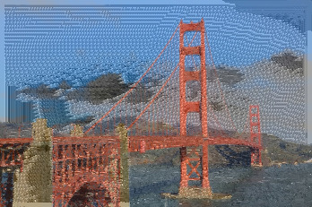 |
| Original Golden Gate (ccosta) | Watercolor Golden Gate (ccosta) | Van Gogh Golden Gate (ccosta) |

|   |   |   |
|:-:|:-:|:-:|
| 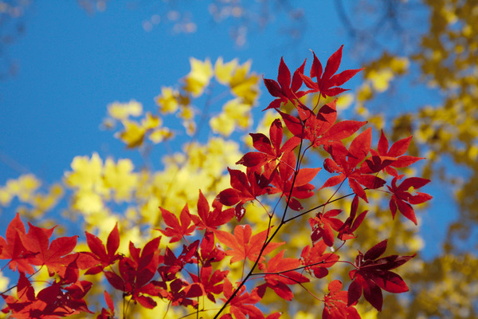 | 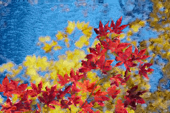 | 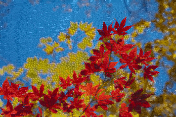 |
| Original Leaves (ccosta) | Watercolor Leaves (ccosta) | Van Gogh Leaves (ccosta) |

The Van Gogh filter can be prone to artifacting, but lowering the skip interval for the nearest neighbor search seems to improve it somewhat at the cost of higher processing times:

|   |   |
|:-:|:-:|
| 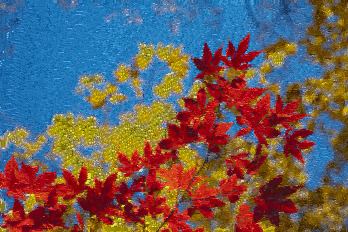 | 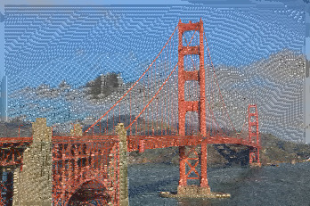 |
| Leaves Smaller Grid (ccosta) | Golden Gate Smaller Grid (ccosta) |

Applying a median, sharpening, and then median filter again yields a neat stylization which somewhat preserves the texture of the Van Gogh:

|   |   |
|:-:|:-:|
| 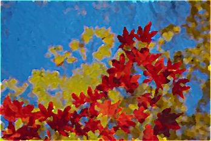 | 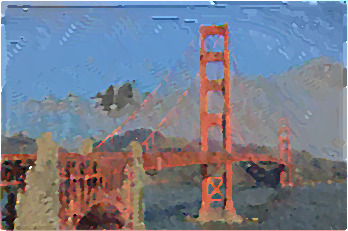 |
| Leaves + Med + Sharp + Med (ccosta) | Golden Gate + Med + Sharp + Med (ccosta) |

Here is the result from texture synthesis on the river training pair:

|   |   |
|:-:|:-:|
| 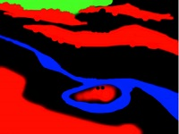 | 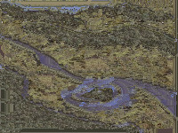 |
| River Colors (ccosta) | River Texture Synthesis (ccosta) |

### 1, Justin Bi (justinbi)

For my art contest submission, I morphed through the 32 NFL starting quarterbacks. An interesting note about the ordering is that they're ordered in a manner such that each qb's team has beaten the team of the qb they morph into and was beaten by the team of the team they were morphed from.

Even though this would have been a cleaner morph if instead of candid images I did stock images where all the players were in similar positions against uniform backgrounds, I thought the action shots with uniforms would look cooler, even if morphing between right and left handed quarterbacks wasn't easy (looking at you, Tua). All the images source were gotten from Getty.

|   |
|:-:|
|  |
| NFL Quarterbacks (justinbi) |

### 2, Bharat Govil (bgovil)

For the art contest, I wanted to see how well I could apply the morph function to images beside faces. To do this, I tested the morph function on the famous utah teapot, morhing it to a somewhat similarly structured watering can. While the results were not perfect, it worked surprisingly better than I expected. I also added a little modification to the morph function that let me track the movement of line dots across the morph, which helped in determining the ideal locations to morph lines.

|   |   |
|:-:|:-:|
| 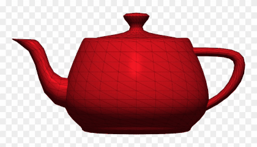 | 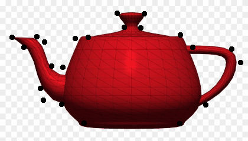 |
| Teapot to Watering Can (bgovil) | With Tracking (bgovil) |

### 2, Joseph Rubin (jmrubin)

Repeated application of the sharpen filter to a photograph can be interesting.

|   |
|:-:|
| 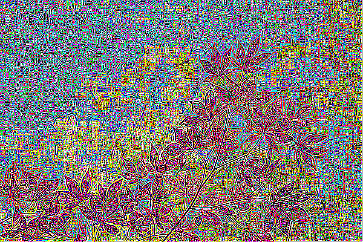 |
| Flower with Sharpen 5x (jmrubin) |

But doing this to a pixel art image adds cool outline effects.

|   |   |
|:-:|:-:|
| 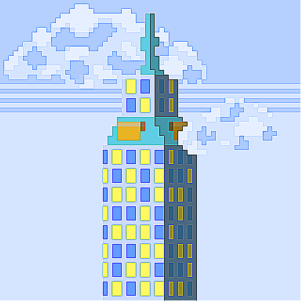 | 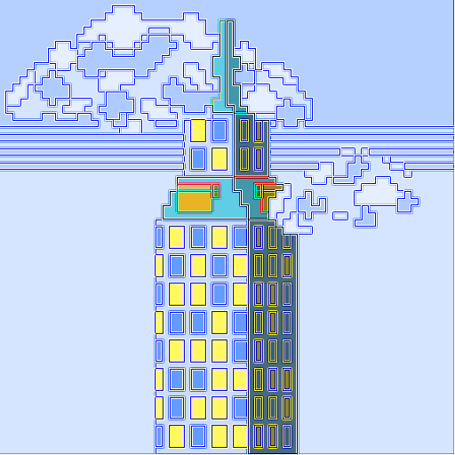  |
| Pixel Art with Sharpen 1x (jmrubin) | Pixel Art with Sharpen 2x (jmrubin) |

|   |   |
|:-:|:-:|
| 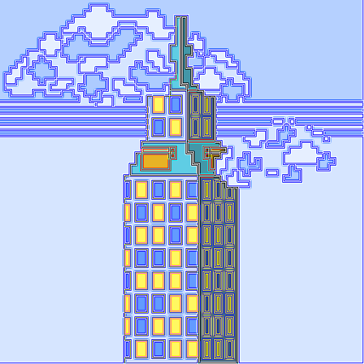 | 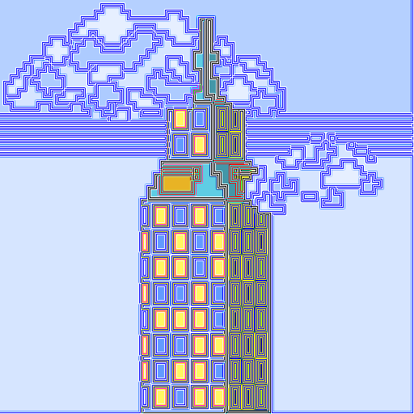 |
| Pixel Art with Sharpen 3x (jmrubin) | Pixel Art with Sharpen 4x (jmrubin) |

### 3, AnneMarie Caballero (agc2)

For the art contest, rather than experimenting with the effects of the filters on digital images, I was interested in seeing how these filters reacted with paintings (the originals are shown below them). The filters produce interesting results when combined with this different medium, and truly display the versatility of the images below. I've included some of my favorites. I chose Impressionist paintings because the more loose brush style (or facture) highlights the difference between painting and photography in conjunction with these filters.

First shown, my version of "Manneporte" uses a combination of saturation, contrast, and the median filter to create a pop art effect that, while vastly different from Impressionism, also really displays Monet's virtuosic attention to light and color.

Next shown, my version of the "Haystacks" or "Grainstacks" series also uses filtering and contrast, but in this case to enhance the Impressionistic effects. The time of day is seemingly artificial considering the light is abnormally bright (a la noon), but the shadows contradict this impression. Instead of overblurring like the median filter did, the bilateral filter keeps the edges sharp, while enhancing the brushiness of Monet's style. The histogram equalization ultimately did not affect this image as much though, perhaps due to less variation in luminance, considering the paint medium.

Finally, the Renoir at a glance seems to mimic the black and white photo phenomenon. The use of contrast to enhance the dithering helps create a sense of realism that interrupts the unrealistic smoothness of the paint. Additionally, the vignette conjures the impression of a camera to draw the viewer's attention to this visual metaphor. I like to imagine Renoir's boating party is taking place in 20th-century Brooklyn instead of 19th-century France.

In summary, the filtering allowed me to explore more of each of these paintings, and the reality of the pigments used and tricks of light created by each artist. I noticed based on experiments with filtering (not shown here) that Monet has a much brushier facture and more virtuosic lighting than Renoir. I studied both of these artists last semester in ART 212, but this project gave me a new lens to explore them through. Finally, these images were all originally retrieved from the ARTSTOR database.

|   |   |
|:-:|:-:|
| 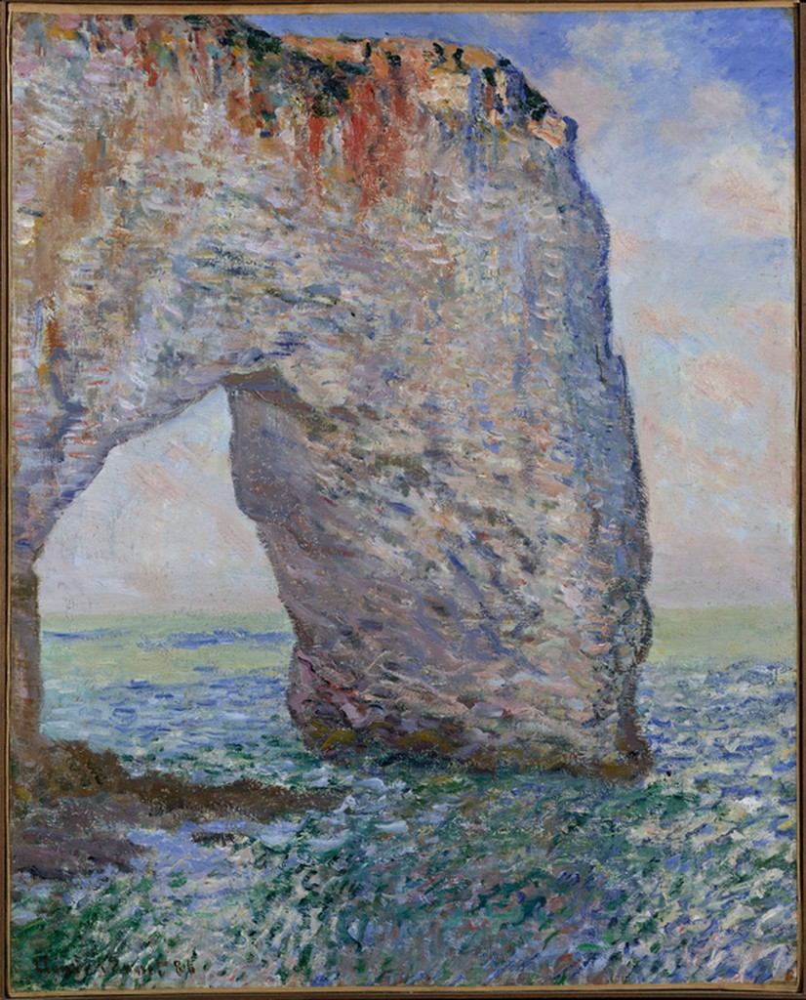 | 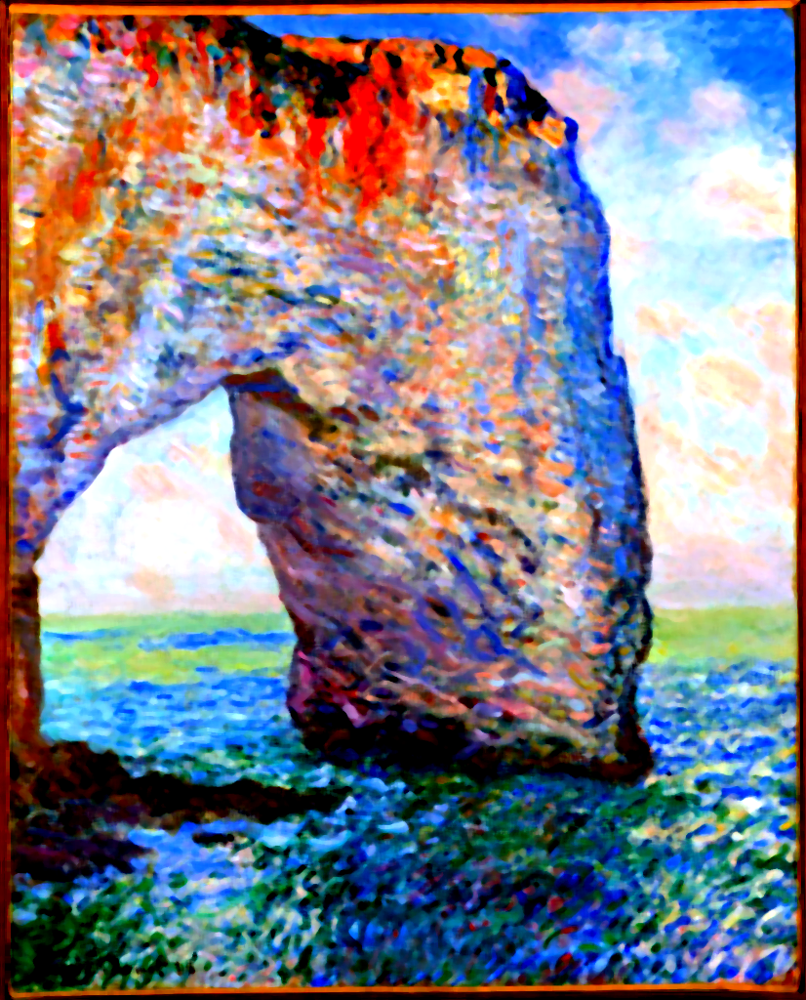 |
| Original Manneporte | Pop Art Manneporte (agc2) |

|   |   |
|:-:|:-:|
| 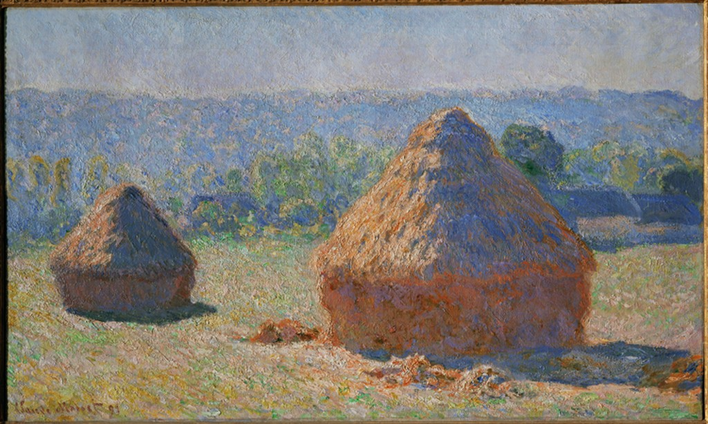 | 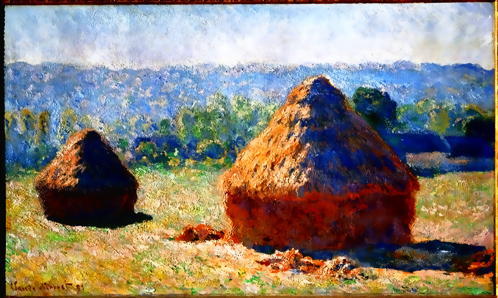 |
| Original Haystacks | Impressinist Haystacks (agc2) |

|   |   |
|:-:|:-:|
| 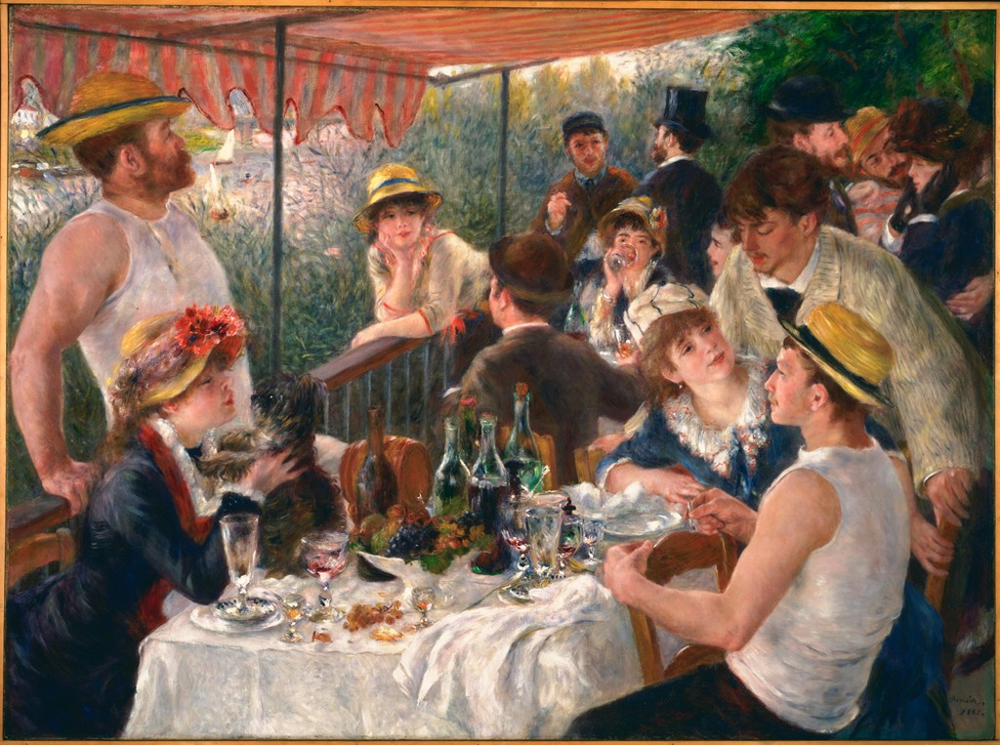 | 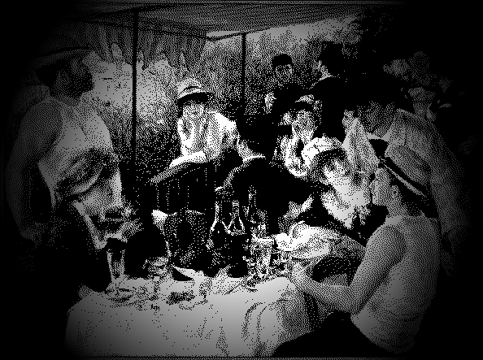 |
| Original Renoir | Dithered Renoir (agc2) |

### 3, Skyler Liu (skylerl)

This is a play on an abstract pinwheel. I stumbled across this when trying to implement the swirl function. It takes the input image and divides into 10 different "pinwheel" sections. Using the input value (aka the radians) you can rotate the image around. When animating this, the result looks like an abstract pinwheel! Below are an animated gif version and a static png version.

|   |   |
|:-:|:-:|
| 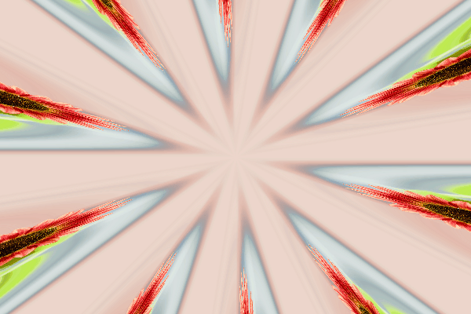 | 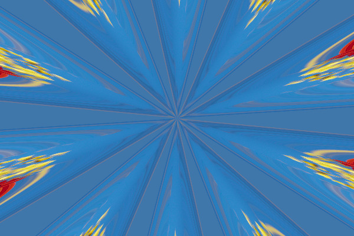 |
| Animated Swirly (skylerl) | Static Swirly (skylerl) |

Also including a picture of my messed up morph, not morph but looks cool!

|   |   |   |
|:-:|:-:|:-:|
| 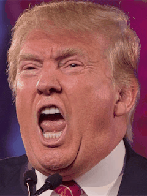 | 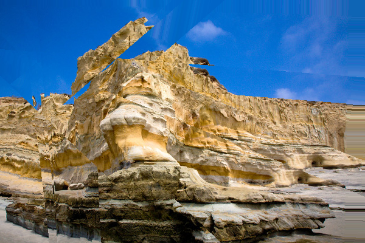 | 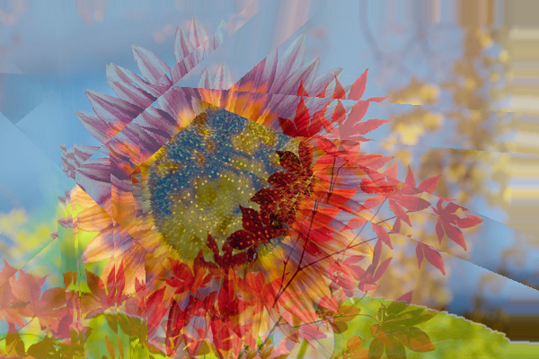 |
| Trump Morph (skylerl) | Mesa Morph (skylerl) | Flower Morph (skylerl) |

### 4, Raiden Evans (rbevans)

Signed painting of Doge using the Paint-by-numbers filter I spent extra time on. I also really like this golden gate painting so I'm including it here too lol.

|   |   |
|:-:|:-:|
| 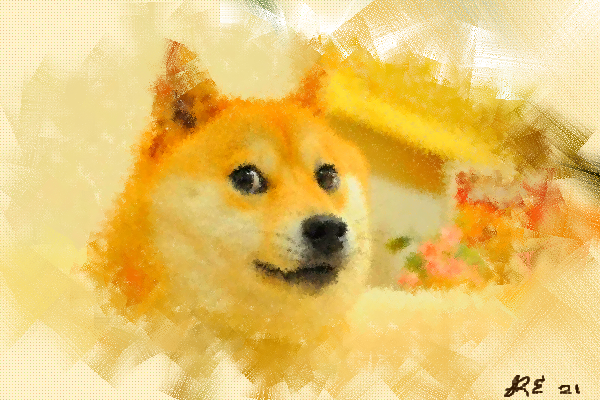 | 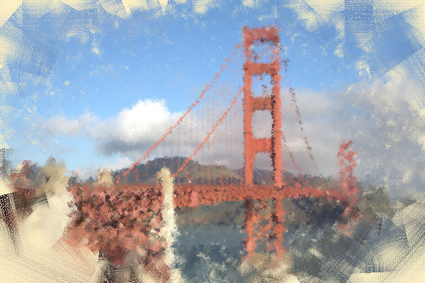 |
| Doge Paint-by-numbers (rbevans) | Golden Gate Paint-by-numbers (rbevans) |

# Honorable Mentions

### Aaron Skepasts (ams10)

I thought I'd share my favourite bug that happened through the assignment. This happened while trying to implement floydFilter.

|   |
|:-:|
| 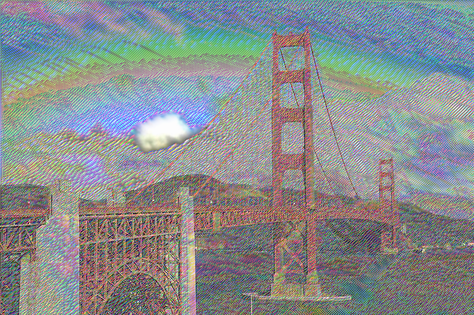 |
| Floyd Steinberg Golden Gate (ams10) |

### Edward Gartner (egartner)

I didn't make any custom thing this time and don't really expect to win the gallery, haha. However, I started playing D&D just a year ago and attempted to pay some sort of tribute to the two campaigns I'm in by trying to animate the morph bethween these very, very large images.

|   |
|:-:|
|  |
| D&D Tribute (egartner) |

### Ishani Kulkarni (isk)

I used the push, scale, translate, and morph filters to morph two images together. For the first one, I morphed Rory Gilmore into her mom, Lorelai Gilmore, both of whom are the main characters of the show Gilmore Girls. For the second one, I morphed the before and after images of Mia's transformation in the Princess Diaries.

|   |   |
|:-:|:-:|
| 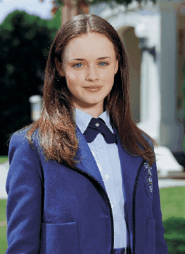 | 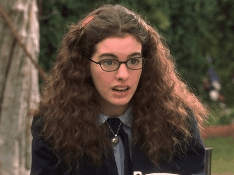 |
| Gilmore Morph (isk) | Mia Morph (isk) |

### Jayson Badal (jbadal)

For this work of art, I created a spaced out version of pixels based on the input image. I then rotated this image and obscured any previous details in the image. This art can also be transformed into an animation!!

|   |
|:-:|
| 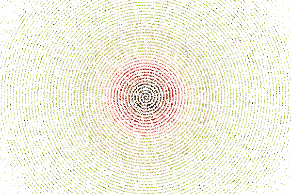 |
| Spaced Out (jbadal) |

### Jorge Zreik (jzreik)

My art contest submission is a doubly saturated version of the town image, that has been run through the median filter, with its palette extracted. My goal was to give the impression of a vibrant painting that was painted with the colors seen on the right of the image.

|   |
|:-:|
| 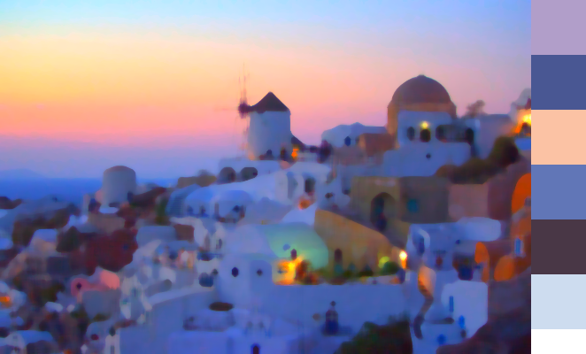 |
| Vibrant Santorini (jzreik) |

### Sara Dardik (sdardik)

I repeatedly applied the rotate and vignette filters to achieve a deepening optical illusion. Below is a picture of former President Donald Trump trapped inside many boxes.

|   |
|:-:|
| 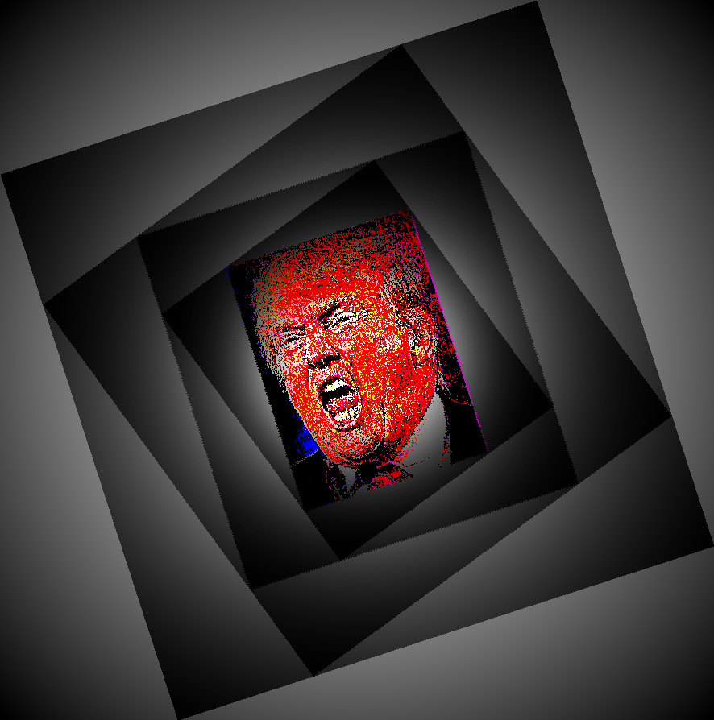 |
| Trump in a box! (sdardik) |

### Chloe Qiu (shiyunq)

The customFilter is a modified version of the edge filter. The kernel has different weights which still sum up to 0. The value determines the stride of the convolution (starting from 0.5). We still invert the image, but we write to the initial image instead of a new one. With different stride values, the effects look very dissimilar.

|   |   |
|:-:|:-:|
| 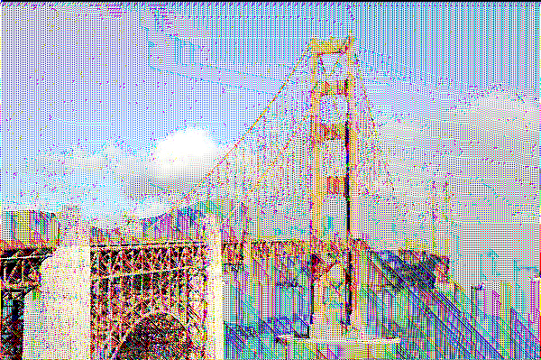 | 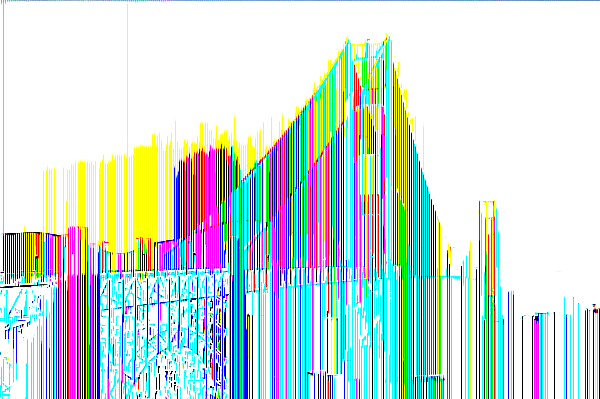  |
| Golden Gate S=0 (shiyunq)   | Golden Gate S=0.25 (shiyunq) |

|   |   |
|:-:|:-:|
| 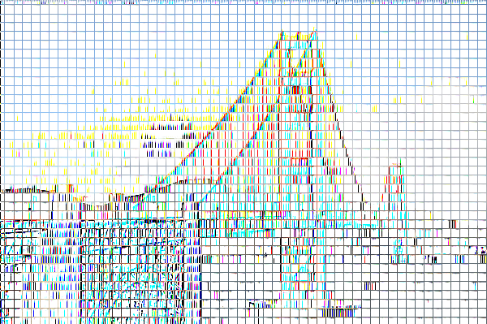 | 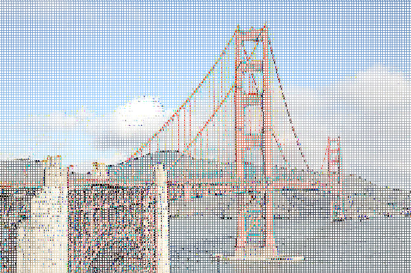 |
| Golden Gate S=0.3 (shiyunq)| Golden Gate S=0.45 (shiyunq) |

|   |   |
|:-:|:-:|
| 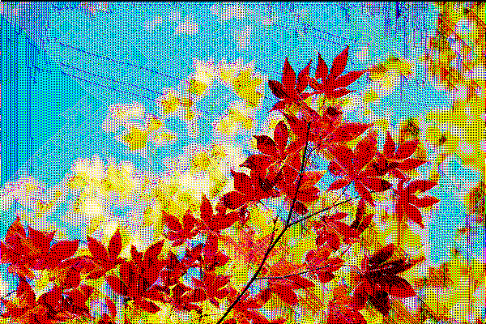 | 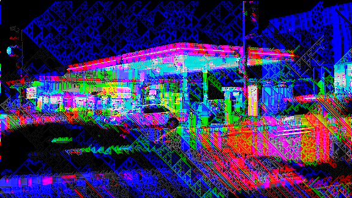 |
| Leaves S=0 (shiyunq) | Gas Station S=0 (shiyunq) |

# Other Art Galleries

<galleries></galleries>

