# Contest Winners

### 1, Yujin Yamahara (yamahara)

I implemented my "Cursed Image Filter" by performing operations similar to those in the bilateral filter, but without normalizing the pixel weights. This creates a darkened, cursed image filter.

|   |   |   |
|:-:|:-:|:-:|
| 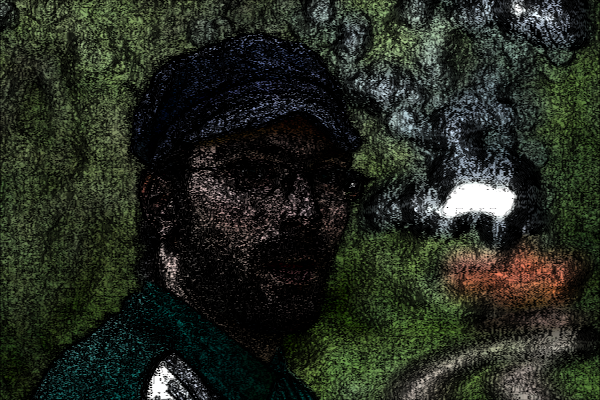 | 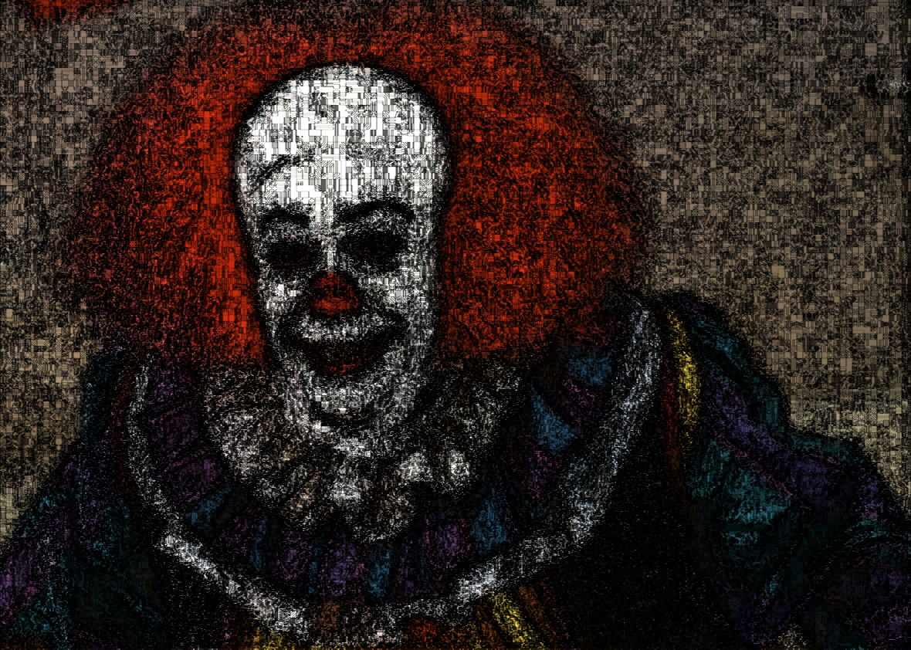 | 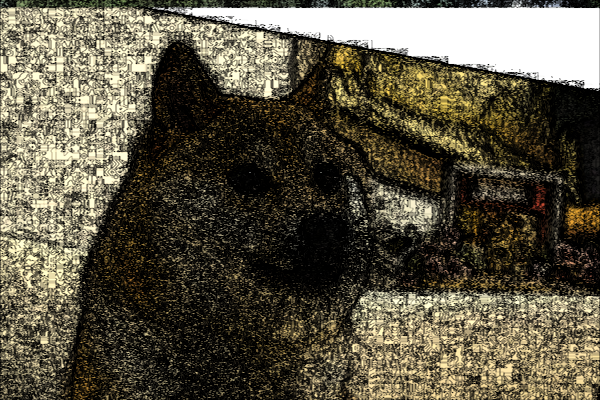 |
| Cursed Man (yamahara) | Cursed Clown (yamahara) | Cursed Doge (yamahara) |

|   |   |   |   |
|:-:|:-:|:-:|:-:|
|   | 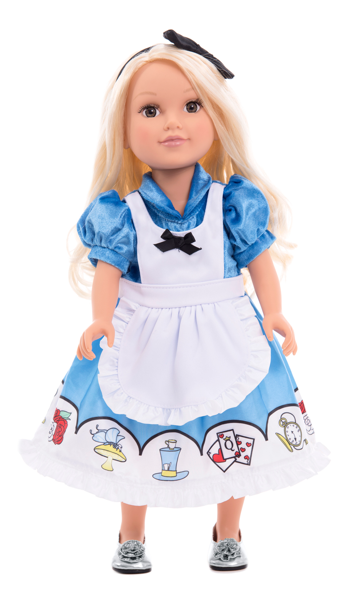 |  |    |
|    | Friendly Doll | Cursed Doll (yamahara) |   |

### 2, Joanna Kuo (jkuo)

I'm full of so much gratitude right now. And I do not feel elevated above any of my fellow art contest winners or anyone in this gallery because we share the same love --- the love of computer graphics. And this form of expression has given me the most extraordinary education; I don't know what I'd be without it. But I think the greatest gift that it's given me, and many of us in this class, is the opportunity to use our graphics for the [memes](https://www.youtube.com/watch?v=qiiWdTz_MNc&t=2m5s).

This morph of Joaquin Phoenix into his iconic Joker character was generated using 35 custom correspondence lines. "Test"

|   |
|:-:|
|  |
| “When you bring me out, can you introduce me as Joker?” (jkuo) |

### 2, Johan Ospina (jospina)

First, I created a morph for my significant other. Then I realized the POTUS, in his cheeto glory, closely resembles my morph's subject. She is truly an icon. [#BeefGirl2020](https://www.youtube.com/watch?v=5eZyspecXJE)

|   |   |   |
|:-:|:-:|:-:|
|   | 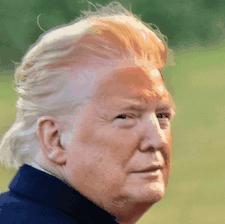 |   |
|   | I Smell Like a Beefy Cheeto (jospina) |   |

### 2, Jake Waksbaum (waksbaum)

I made this using my painting filter!

|   |
|:-:|
| 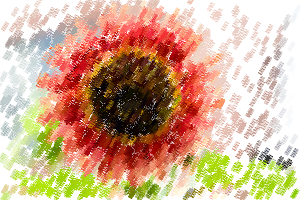 |
| A Sponge Painted Flower (waksbaum) |

This was the result of a bug in my morph implementation, and I thought it looked cool:

|   |
|:-:|
| 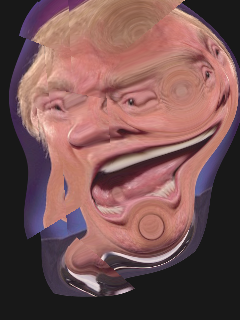 |
| Trump Visits his Dentist from the 5th Dimension (waksbaum) |

### 3, Benjamin Huang (bdhuang)

While I was debugging the bilateral filter, I found that my buggy implementation created a rather cool "painted" effect. Specifically, my implementation was over-weighting pixels (squared!) and not indexing over all the weights. Combining this with some changes in saturation and sharpening produced an effect that I would describe as a sort of "digital pointilism." In certain areas, the square window used in the bilateral filter becomes very evident due to the sharpening filter, creating an oddly impressionistic, yet distinctly digital image. I especially like how differently the filter treats natural aspects (lots of blurring, very pastoral and painterly) compared with its treatment of the bridge (bold, blocky and sharp).

|   |
|:-:|
|  |
| Digital Pointilism (bdhuang) |

### 3, Elizabeth Petrov (epetrov)

While trying to implement the rotate filter, I ended up creating a kaleidoscope effect! Additionally, when programming the saturation filter, I introduced a bug that brings out the red and blue in an image. I saved these happy accidents to use in the art contest, and applied them both to the leaves image to create a cool looking kaleidoscope looking picture. Here are some iterations that I found really interesting:

|   |   |   |   |
|:-:|:-:|:-:|:-:|
| 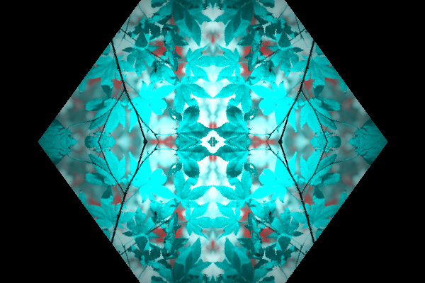 | 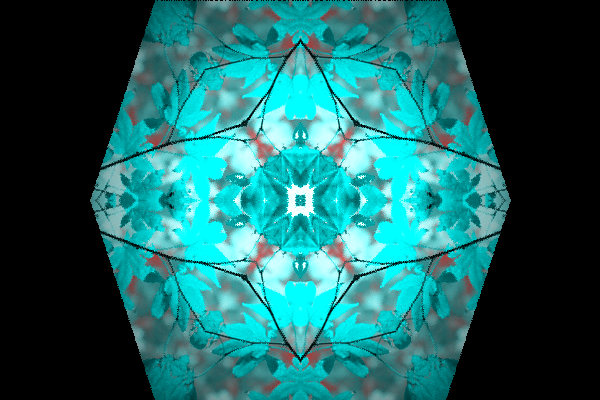 | 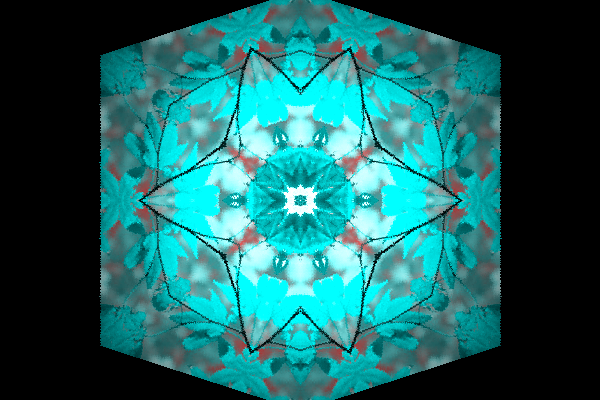 | 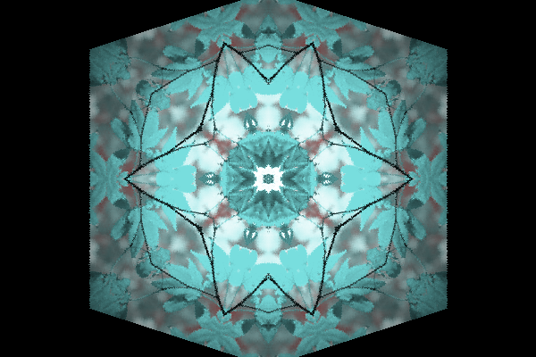 |
| Kaleidoscope 1 (epetrov) | Kaleidoscope 2 (epetrov) | Kaleidoscope 3 (epetrov) | Kaleidoscope 4 (epetrov) |

Here I implemented swirl with the distance squared, leading to a really interesting effect that I applied onto the mesa and leaves images.

|   |   |
|:-:|:-:|
| 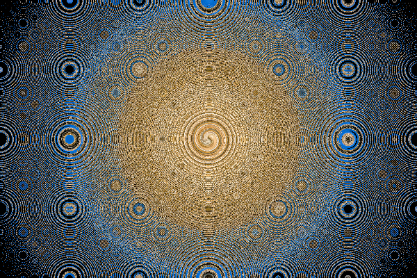 |  |
| Swirly Mesa (epetrov) | Swirly Leaves (epetrov) |

### 3, Yunzi Shi (yunzis)

I really like the style of halftone prints and wanted to replicate the effect (not by actually
implementing CMYK, but by using the filters developed in this assignment). I created three monochrome channels (R,G,B) and applied adapted Floyd filter to each of them. Each channel is shifted a little horizontally or vertically so they do not align with each other. I then blended the three channels, assigning more weight to the green and blue channels so the results looked more like retro low-res screens.

|   |   |
|:-:|:-:|
| 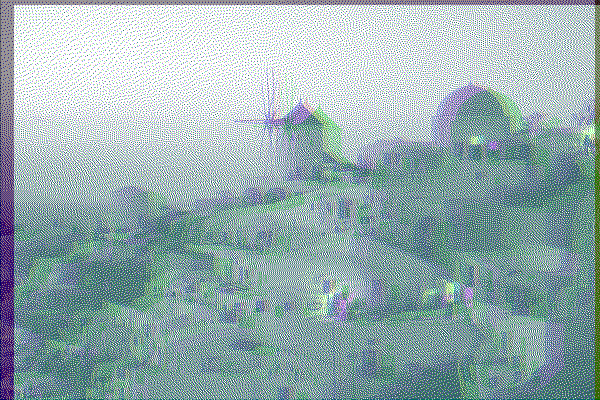 | 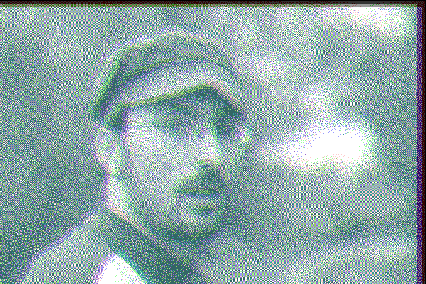 |
| Halftone Santorini (yunzis) | Halftone Man (yunzis) |

|   |   |
|:-:|:-:|
| 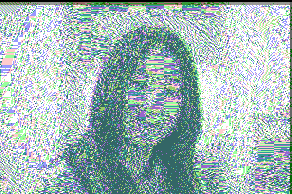 |  |
| Halftone Woman (yunzis) | Halftone Golden Gate (yunzis) |

### 3, Zak Dasaro (zdasaro)

For the art contest, I used the paint feature and the composite feature to combine an image with a painted version of itself. First, I took `goldengate.png` and applied the paint feature with the largest brush size. Then, I applied a gamma of `0.8` to make the strokes more vibrant. I next pushed the golden gate image again, after which I applied a custom alpha mask with medium opacity everywhere in the image. Finally, I used the composite filter to combine the original `goldengate.png` with the painted `goldengate.png`.

|   |
|:-:|
|  |
| Golden Gate Jazz (zdasaro) |

# Honorable Mentions

### David Todd (dtodd)

First, I found a palette using the k-means algorithm. Then I applied Floyd-Steinberg dithering across the three RGB channels and quantized the result to the palette colors. To make the dithering more effective, I fully saturated the palette beforehand and slightly increased the contrast to make the colors less visually similar. I found that 4-color palettes work pretty well for these images:

|   |   |
|:-:|:-:|
|  |  |
| Golden Gate Palette Dither (dtodd) | Palette Dithered Donald (dtodd) |

### Gabriel Roth (gjroth)

For the art contest, I created a "Tilt Shift Photography Filter". Tilt shift photography is a photography tool that makes an image look like a small object being seen close up by mimicking the human eye process of accommodation. Accommodation is when the eye changes its focus for objects at different depths. When the eye focuses on an object that is close up, the surrounding scene gets blurry. Our mind uses the blurriness that results from accommodation to estimate depth and scale of objects in the visual field. In tilt shift photography, the surroundings of the objects in focus are purposely blurred out to make the scene seem like a small object being looked at from up close.

I implemented the Tilt Shift Photography filter by creating a linearly increasing Gaussian blur starting at the edge of the focus area. The filter takes the horizontal and vertical locations of the center of focus, the size of the focus, and the max blur parameter as inputs. For each pixel, if it is outside of the focus area, I define the convolving window based on sigma (which is a linear function of pixel distance from the edge of the focus to the edge of the image), and convolve each pixel. This results in a clear original image within the desired focus window, and an increasing blur from the circular edge of the window to the edges of the image, which mimics accommodation.

|   |   |   |   |
|:-:|:-:|:-:|:-:|
|  | 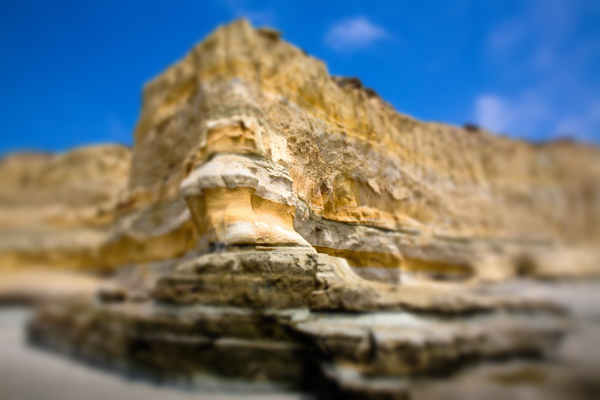 | 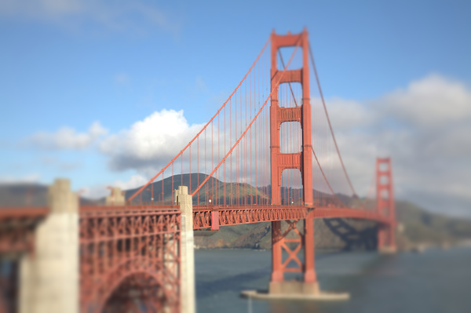 | 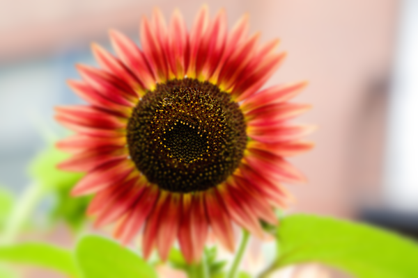 |
| Tilt Shift Santorini (gjroth) | Tilt Shift Mesa (gjroth) | Tilt Shift Golden Gate (gjroth) | Tilt Shift Flower (gjroth) |

### HJ Suh (hjsuh)

I used a custom filter to first create two images that had the same dimensions. Then, I created JSON files with new morph target lines, which were used by the morph filter to create this GIF:

|   |
|:-:|
| 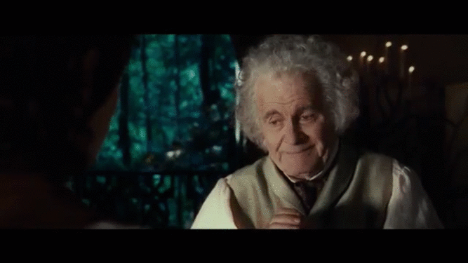 |
| Mad Bilbo (hjsuh) |

### Lauren Johnston (lej2)

I combined a custom filter (an edge filter without inversion) with a Gaussian blur to create a soft neon aesthetic.

|   |
|:-:|
| 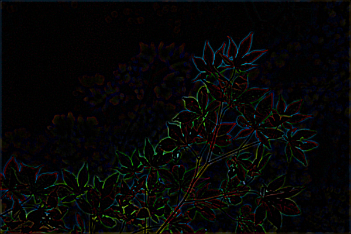 |
| Neon Leaves (lej2) |

### Michael Stambler (mas16)

The selected work here represents the absolute best of my bugs ---
*insectes crème de la crème*. Often times, as I would code up these filters, I would have some slight issue somewhere, that didn't totally break things but would definitely make things look incorrect. A lot of the time, these buggy images were way off from the intended effect but still looked quite cool, so I saved them.

|   |   |
|:-:|:-:|
| 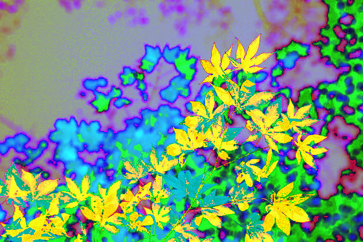 | 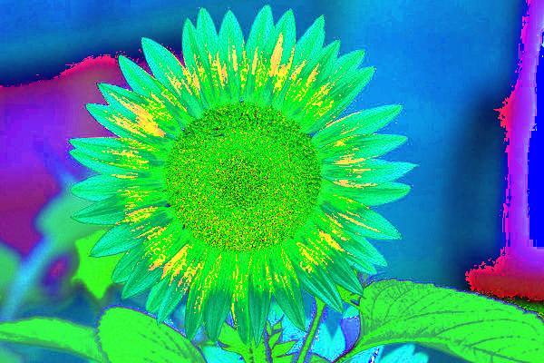 |
| Gold Leaf (mas16) | Seeing Green (mas16) |

|   |   |   |
|:-:|:-:|:-:|
|  |  | 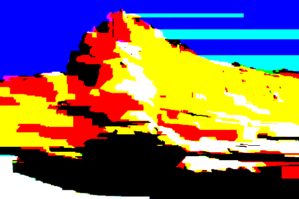 |
| Rd Flwr (mas16) | ngry Hmn (mas16) | Ht Mntn (mas16) |

|   |   |   |
|:-:|:-:|:-:|
| 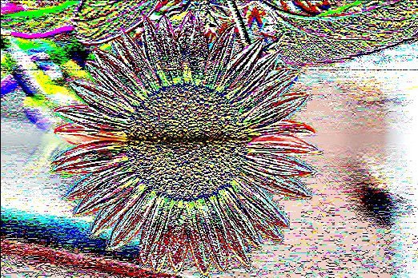 | 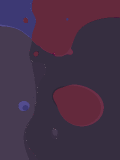 | 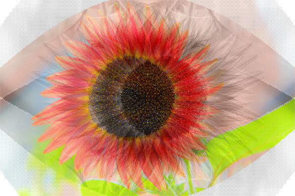 |
| Corruption (mas16) | Picasso, Is That You? (mas16) | Sauron (mas16) |

### Robert Freeman (raf5)

I noticed that the number of pictures of Trump was surprisingly low in the collection, so I have another to contribute. This was hand-crafted over the course of a couple weeks, perfectly combining the lush personality of the president with the soft intangibles of his eloquent speeches. Honestly, it speaks for itself.

|   |
|:-:|
| 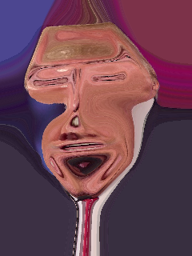 |
| The Beauty of the Beast (raf5) |

### Richard Wolf (rwolf)

To implement my art function, I created a variant of swirl. For every pixel in the original image, I calculated the polar coordinates (in radians) relative to the center of the image. Then I transform each pixel by adding `radians * 100 * distance`, where `distance` is the distance of the current pixel from the center of the image.

After this, I then convert my polar coordinates back to cartesian coordinates and check if `(oldX, oldY)` is a valid pixel in the original image. If so, I set the pixel at `(j, i)` in the new image equal to the gaussian sampling of `(oldX, oldY)`. Doing this results in an awesome, hyper-swirled image.

|   |   |
|:-:|:-:|
| 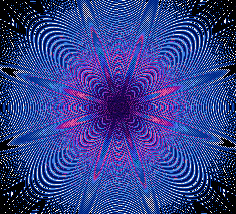 | 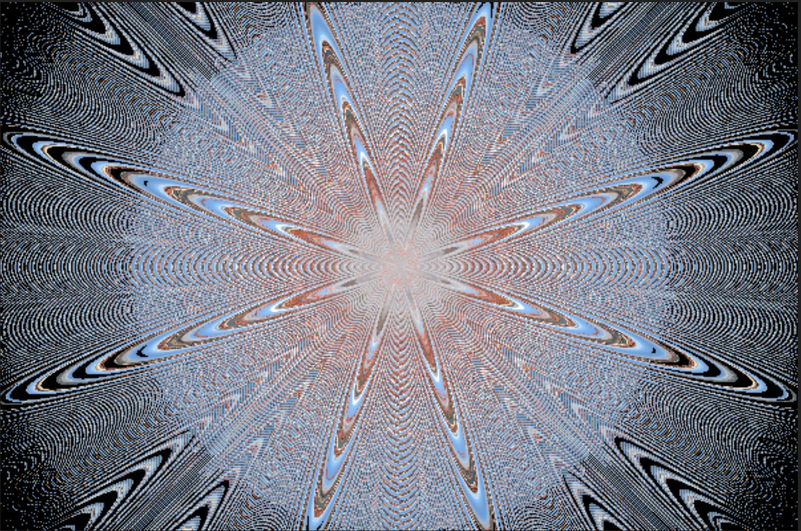 |
| Colorful Hyperswirl (rwolf) | Atomic Energy (rwolf) |
