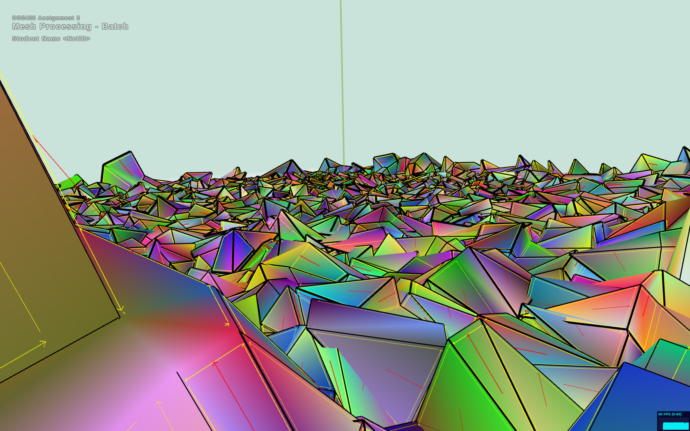
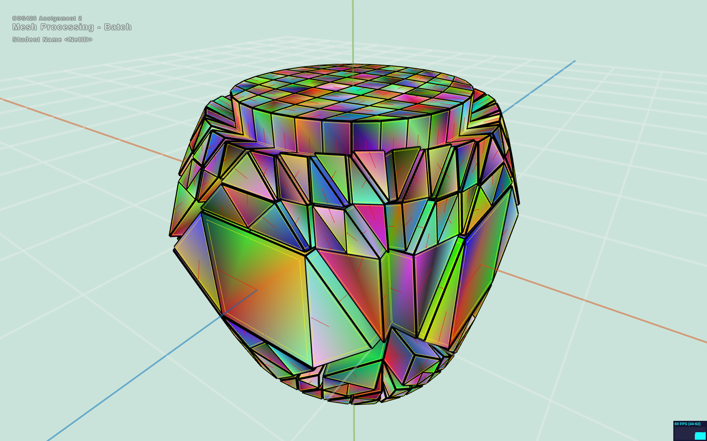
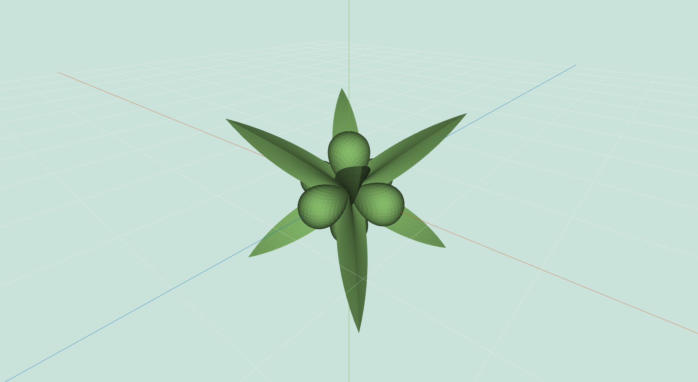
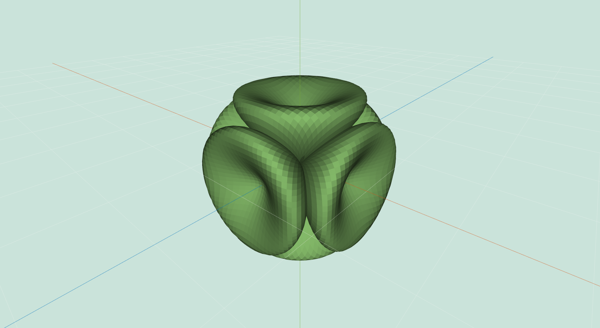
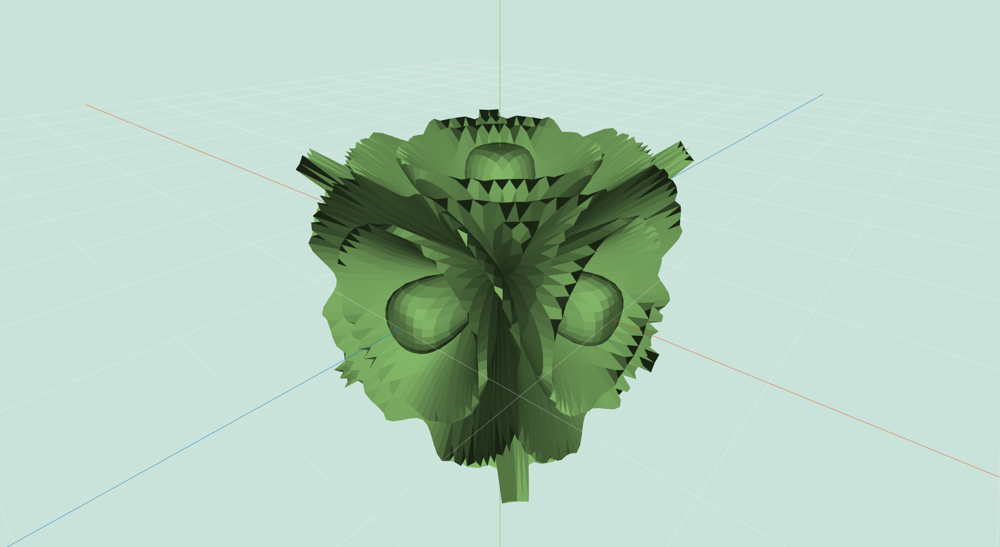
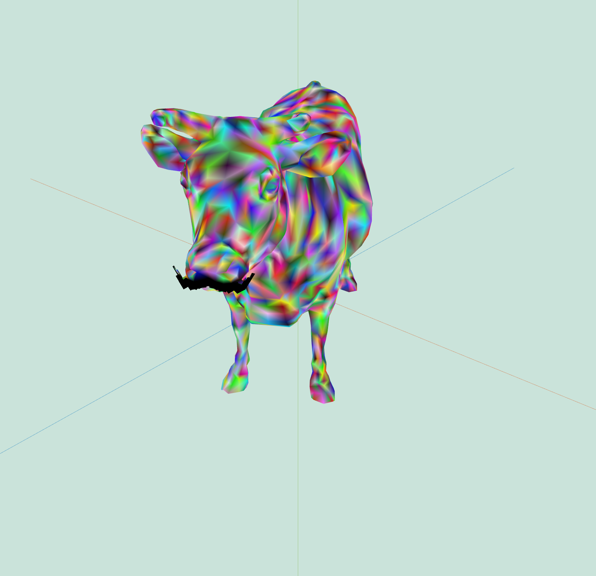
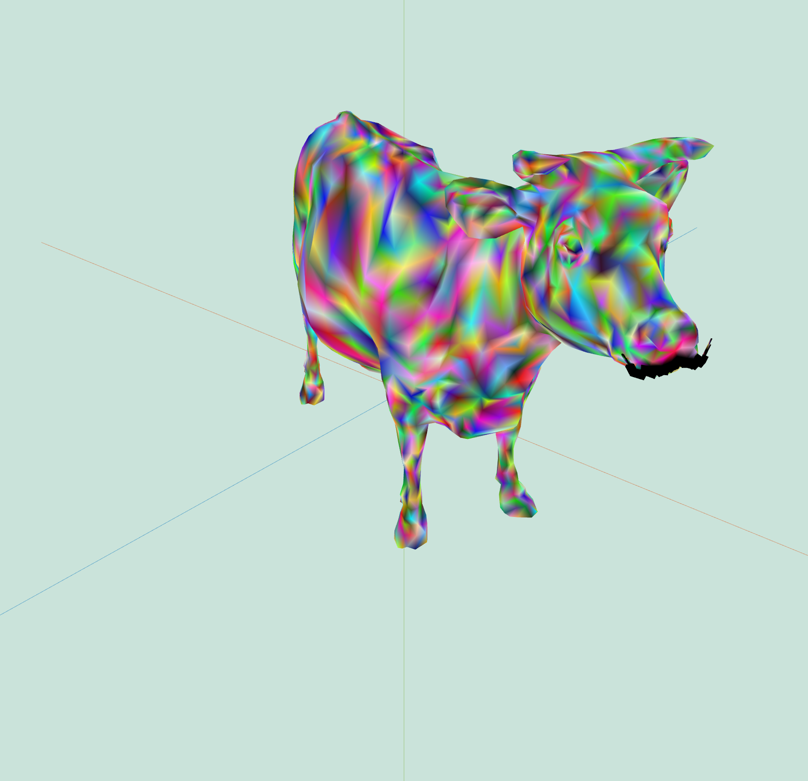
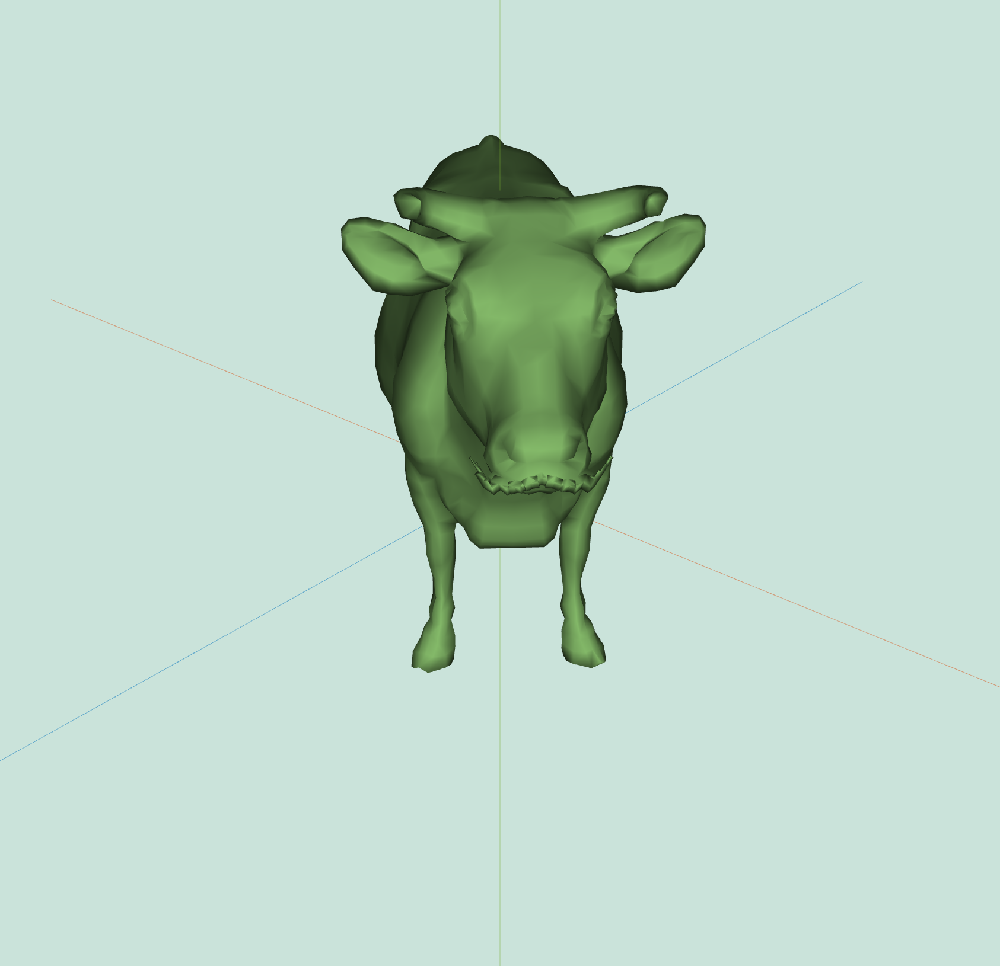

# Contest Winners

### 1, Andy Wang (andywang)

The following animation was created by applying a series of truncations, split long edge, and bevel filters onto a cube, and then varying a noise filter. The slight differences in angle resulting from the noise and bevel filters produces an interesting effect, especially when combined with the vertex colors option.

|   |   |   |
|:-:|:-:|:-:|
|  |  |  |
| Animation | Landscape | Deformed cube |

### 2, Arti Schmidt (arthurts)

A sequence of meshes generated by scaling vertex positions by the sine of their distance from the origin multiplied by some factor. The code is located in the wacky filter and is commented out.

|   |   |   |
|:-:|:-:|:-:|
|  |  |  |
| wacky(0.16) | wacky(0.26) | wacky(0.94) |

### 3, Dawn Luong (dluong)

For the art contest, I used multiple different filters to create my art piece, which consisted really of extrude, quad topology, and rotation. The star of this show was extrude, which was used to build a mustache for this cow. I started on the upper lip and extruded out some faces, I then went to elongate the mustache beyond the cow's face, triangualting or quad topology-ing the faces that I wanted to extrude so that I could get smaller/different shaped extrusions. I then created a filter that took all(most of) the vertices associated with the mustache and changed their vertex color to black, to help better define the mustache (i put this in the curvature filter since I didn't know how to add a custom one to the GUI and i didn't implement curvature). That is why the rainbow cow has a black mustache. I also smoothed out the faces of the mustache a bit to create a more cohesive looking stache. I then rotated and scaled the cow to showcase it better. This took me more time than I'd like to admit because my computer was on fire and running so slow due to all the filters and the size of cow. But this is my art piece :)

|   |   |
|:-:|:-:|
|  |  |
| Cow with Mustache | Cow with Mustache |

|   |
|:-:|
|  |
| Cow with Mustache |

# Other Art Galleries

<galleries></galleries>

