# Contest Winners

### 1, Caio Costa (ccosta)

I have three art contest submissions.

The first uses an animated lava texture based on Perlin noise as the interior of a lava lamp. The lava is animatd by a warping of fractional Brownian Motion. For the underlying noise, I used three dimensional Perlin noise, which was calculated by assigning each integer vertex one of 12 gradients randomly. I then found the nearest corners of the cube around the given position, and returned the trilinear interpolation of the dot products between the vectors from the corner to the position and the gradient assigned to each position.
To convert that to fBM, I adapted the code given in slide 30 of precept 7. Finally, I computed a warp of the noise (i.e. fBM(pos + f * fBM(pos + f * fBM(pos)))) as in Quilez's explanation linked in the precept slides.
For the animation, I defined a speed and size (i.e pseudo frequency and amplitude) for the animation. I cut the frame variable to increments of size speed, and assigned a canonical value in the bounds [-size/2, size/2] for each increment. Then, within the increments I linearly interpolated the values from the left and right bounds to get a smoothed value, which I used as the warp factor f in the fBM warping.
I added further noise by using the product of a zig zag fuction of the current frame and the normal vector as an input to the perlin noise, which I then mulitplied the current position by:
newPos = perlin(acos(cos(frame / 50)) * normalVector) * pos
I used this newPos as the input to the warped fractional Brownian motion:
fBM(newPos + f * fBM(newPos + f * fBM(newPos)))

|   |
|:-:|
| 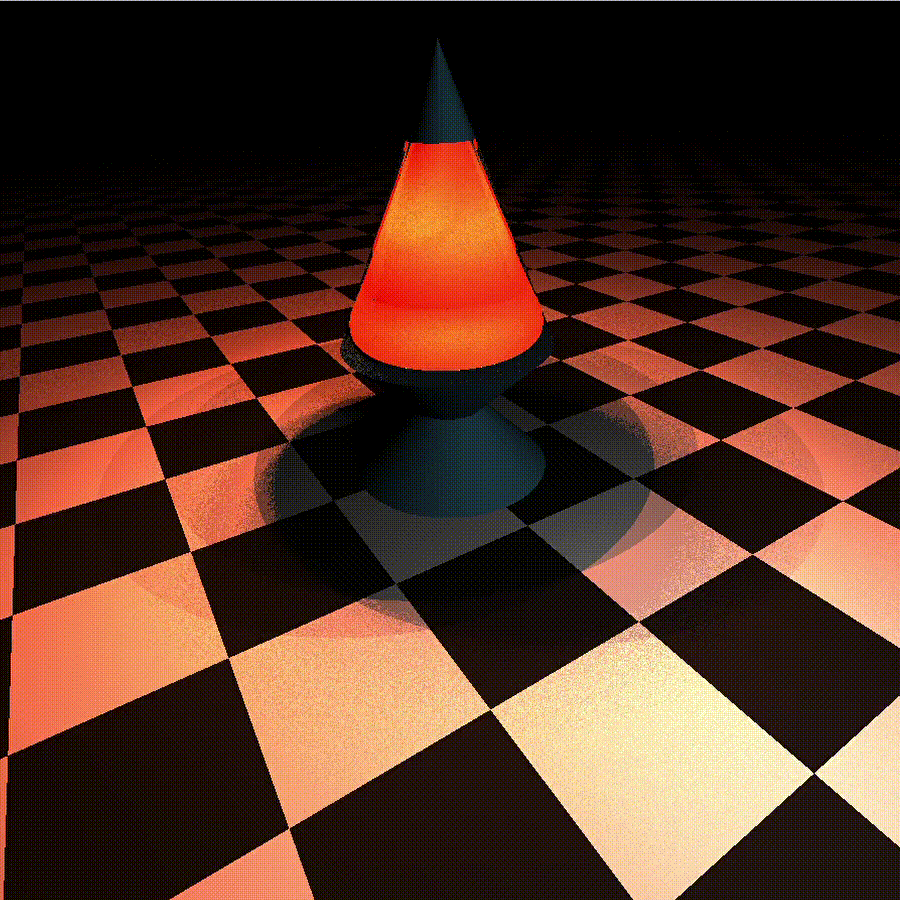 |
| Lava Lamp (ccosta) |

The second is a recreation of the image shown in lecture to demonstate radiosity-based global Illumination, using diffuse interreflection to illuminate the areas which would otherwise be dark. To implement diffuse interreflection, I used Monte Carlo methods to approximate the integral of the BRDF in a normal-oriented hemisphere. I sampled points in the hemisphere using uniform rejection sampling. Once the direction was set, I traced the ray up to two or three additional bounces without further indirect effects, accumlating the overall color.

|   |   |   |
|:-:|:-:|:-:|
|  | 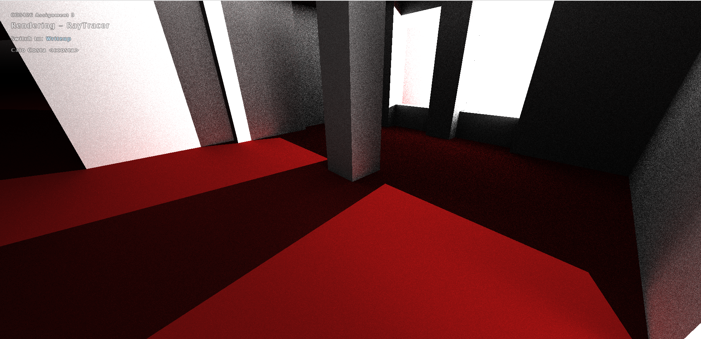 | 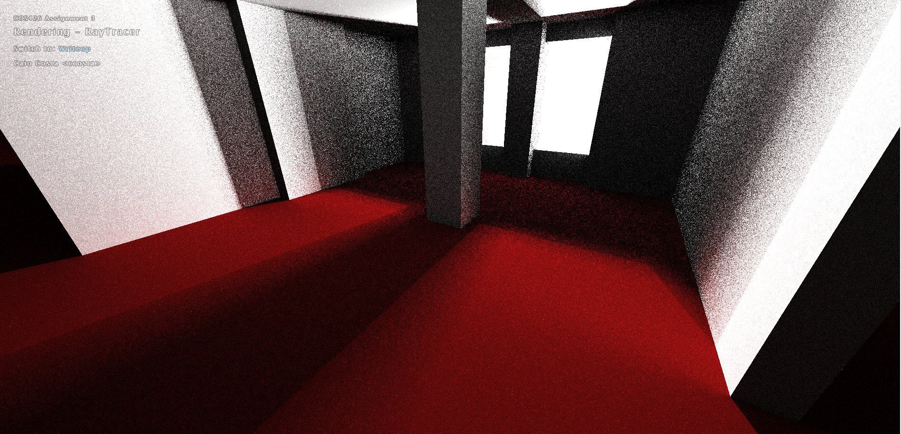 |
| | Diffuse Interreflection (ccosta) |    |

The third is an animation of a mirrored sphere as its glossiness changes. To implement glossy reflections, I used a similar Monte Carlo approximation for mirrored surfaces. Since I didn't want to dig through the parsing code to add a glossiness factor for the materials, I overloaded the refractionRatio to represent glossiness, since it wasn't in use for MIRRORREFLECT surfaces. Then, for each reflection ray, I rejection sampled in a spherical cone oriented around the perfect specular direction, with the size of the cone linearly increasing up to the full hemisphere as a factor of glossiness. The rays traced from there were similarly sampled up to two or three additional bounces.

|   |
|:-:|
|  |
| Glossiness (ccosta) |

### 2, Abhinaya Raghunathan (abhinaya)

This is my custom animation!

|   |
|:-:|
| 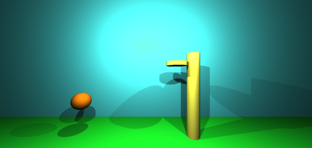 |
| Basketball (abhinaya) |

### 2, Ben Coles (bcoles)

My art contest submission is my animation referenced above. I give the description for my scene and animation for completeness below: For my scene, I decided to create a soccer field complete with goals, field markings and a ball. I made use of the special material pattern behind the goal, and the checkerboard pattern for the ball. Interesetingly, the checkerboard pattern on the ball gave the effect of something that actually looked fairly like a soccer ball. My animation was created by altering the position of the ball, along with the animation = 1 arguement in order to make it look like the ball was rolling into the goal. I changed the veloctiy of the ball as a function of time (reducing dramatically as the ball hit the wall). The checkerboard pattern on the ball really made it look like the ball was actually rolling, and gave the viewer an intuition for the pace at which the ball was rolling.

|   |
|:-:|
| 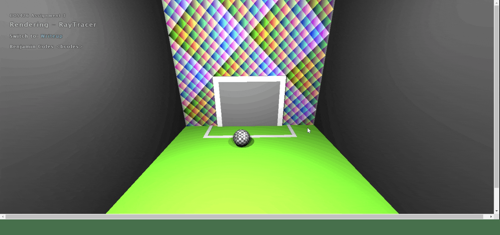 |
| Soccer (bcoles) |

### 3, Sara Dardik + Yael Stochel (sdardik + ystochel)

For the art contest submission, we created a gif of Newton's Cradle using a series of editing tools to put together a stop motion from screenshots. We used ten cylinders extended to be strings and five reflective spheres.

|   |
|:-:|
| 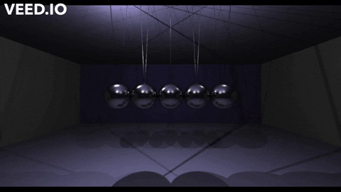 |
| Newton's Cradle (sdardik + ystochel) |

### 4, Diego Zamalloa-Chion (ddz)

I tried to make a Menger sponge equivalent out of tetrahedra. Unfortunately, the face number cap is quite low. I tried making it work with tetrahedra as the unit of construction. To try to bypass the face limit, I tried to make the obj file contain 4 tetrahedra in the structure I wanted. I gave up on triangles since there was no limit on sphere number so I replaced each tetrahedron with a slightly under-circumscribed sphere. I added color based on a basic RGB gradient I thought looked nice. n=5 in the scene because that is the maximum my computer can handle.

|   |
|:-:|
|  |
| TetraFractal (ddz) |

### 5, Aaron Skepasts (ams10)

My art contest is a GIF I made from my custom scene, where the four balls move in a square motion around the rectangular box.

|   |
|:-:|
| 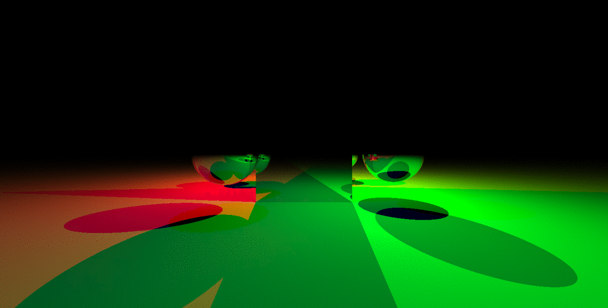 |
| Floating Balls (ams10) |

### 5, Charles Liu (cl43)

My submission for the art contest is my custom scene, as it is a work of art:

|   |
|:-:|
| 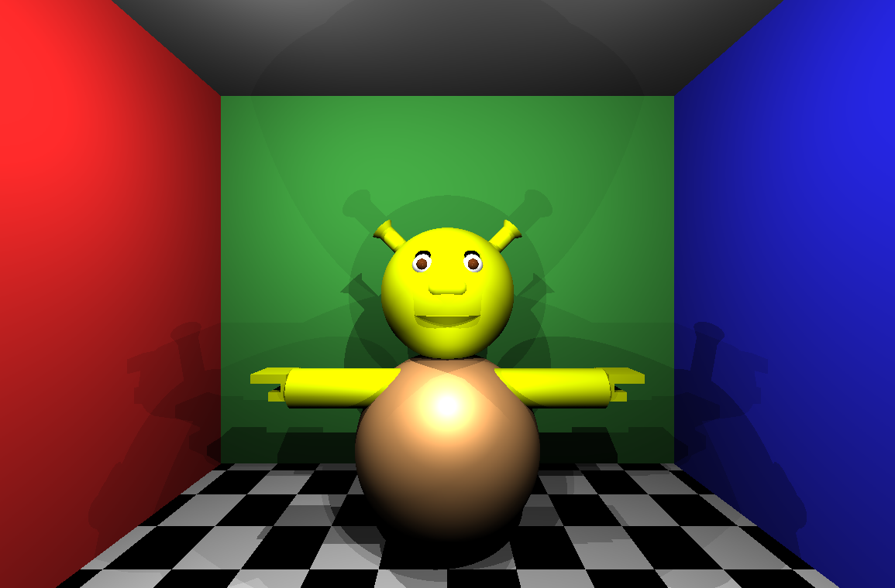 |
| Shrek! (cl43) |

### 5, Edward Gartner (egartner)

I sort of wanted to see what two mirrors pointed at each other would look like in the rayTracer, so I took the default scene, stripped out all the objects, and then made the left and right walls mirrors and changed the front and back walls' colors. Looking down this infinite reflection had a spooky vibe with the dark walls and meager lighting. My original desire was to build a 3D "triforce" out of tetrahedrons, so I did that. Moving them around with offsets was rough--maybe there was an easier way, but I am a little burnt-out on math at the moment. Ideally, I would've used special material to make the floor look water-like, but I decided not to spend more time on the assignment.

Here is an image of the custom scene looking down the spooky tunnel:

|   |   |
|:-:|:-:|
| 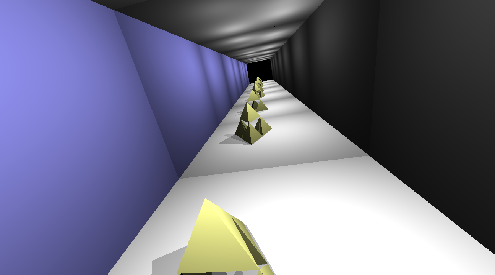 |  |
| Triforce (egartner) | |

### 5, Watson Jia (watsonj)

For the art contest, I am entering my custom scene, which is a model of the solar system with to-scale planet sizes and realistic planet colors.

|   |
|:-:|
| 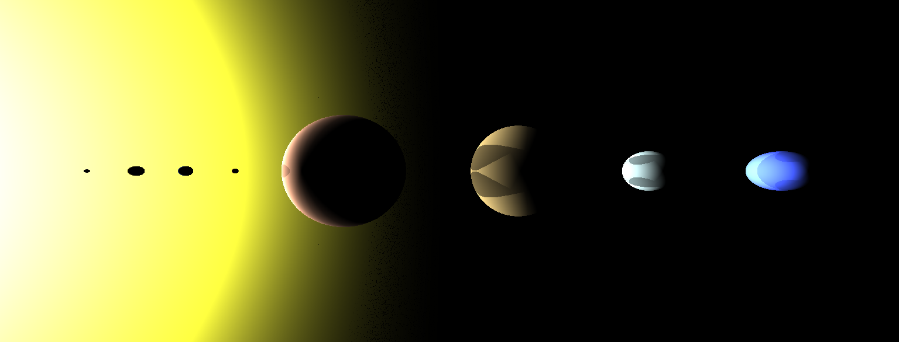 |
| Solar System (watsonj) |

# Honorable Mentions

### Bharat Govil (bgovil)

For my art contest submission, I decided to edit my custom scene into a new scene. Instead of sticking to the checkerboard, I decided to combine a variation of my special material with new colors and ratios. The infinite mirror effect works particularly well here, and creates some very interesting aliasing effects in the distance and on the spheres.

|   |
|:-:|
| 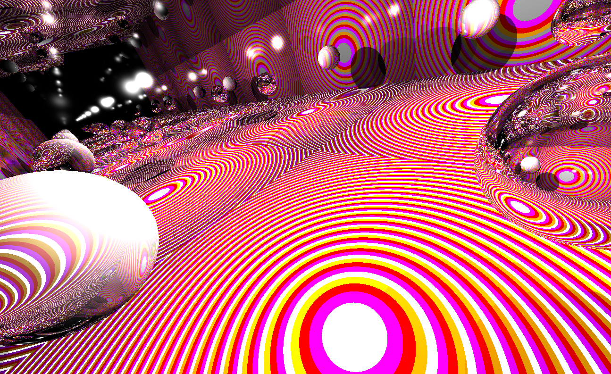 |
| Wacky Mirrors! (bgovil) |

### Chandler Ault (cjault)

I am submitting my scene to the art contest. As detailed above, I made a little scene of a snowman with a crystal ball.

|   |
|:-:|
| 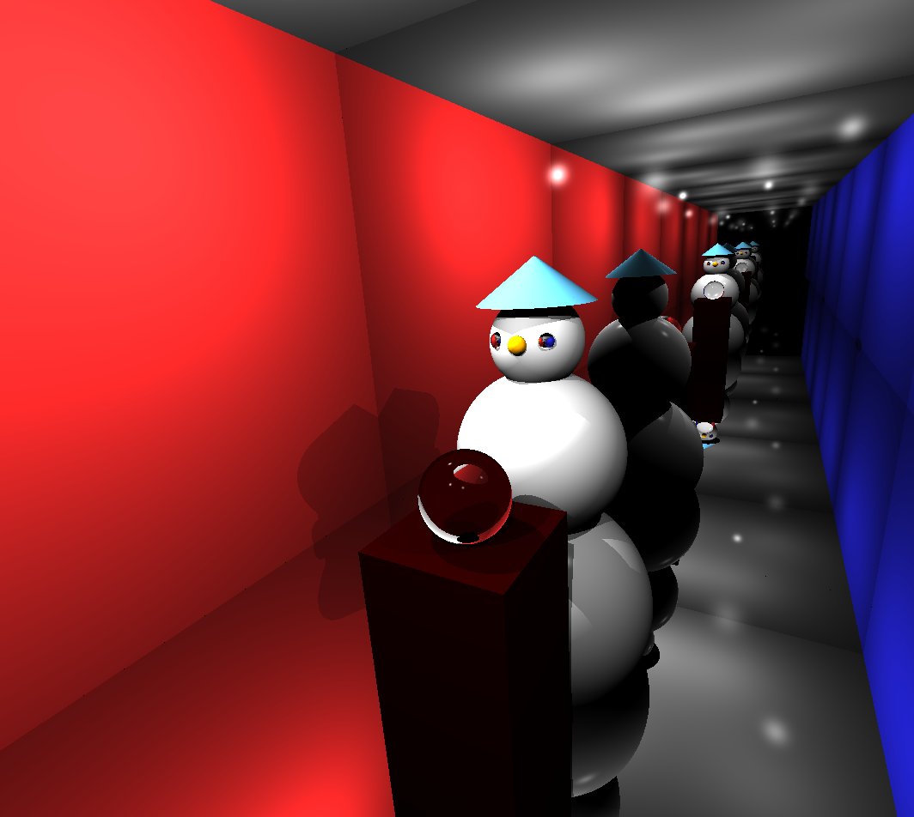 |
| Snowman (cjault) |

### Charles Smith (cms11)

For my art submission, I decided on something simple, but that I thought would be a cool idea. I replaced all the textures of the walls with a mirror like material, and then a made a simple structure in the center, so that it would be repeated many times. This simple structure was a snowman made out of various materials.

|   |
|:-:|
| 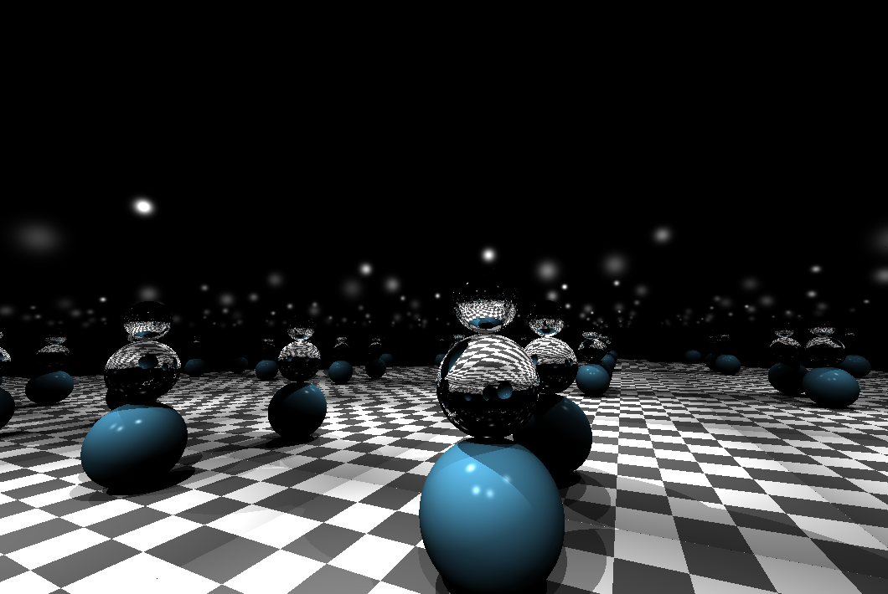 |
| Mirror Snowman (cms11) |

### Isabel Zaller (izaller)

For my art, I used my custom scene but set the tile size of the checkerboard to 0.005.

|   |
|:-:|
| 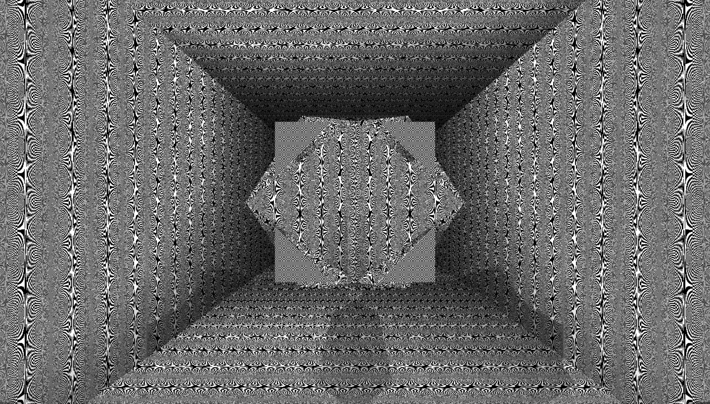 |
| Checkerboard Aliasing (izaller) |

### Raiden Evans (rbevans)

For the art contest, I made a few lollipops in a surreal scene with a wooden mirror and a pink-colored sky. I'm not 100% what the scene is, but I'm 100% sure I ran out of time.

|   |
|:-:|
| 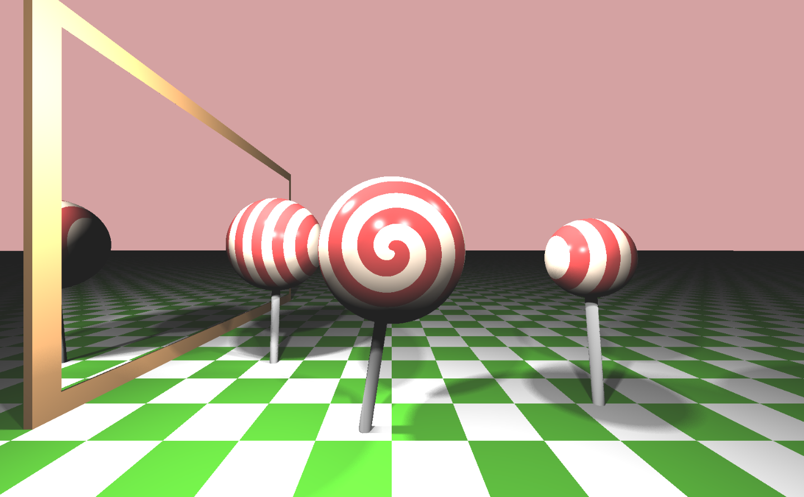 |
| Lollipops (rbevans) |

### Skyler Liu (skylerl)

This is the same as custom scene - My custom scene is called "trippy" and it uses the checkboard material to create a cool visual effect. The scene is composed of 4 spheres on each corner of the scene that have mirror reflection and phong applied. In addition, the scene has soft shadows to make it look more visually appealing. Beware, don't look at it too long or you might get dizzy!

|   |
|:-:|
|  |
| Trippy (skylerl) |

# Other Art Galleries

<galleries></galleries>

