# Contest Winners

### 1, Alice Xue (axue)

For my submission, I recreated the Great Hall from Harry Potter but made it infinitely long! To imitate the floating candlesticks, I generated 30 box objects with 30 lights, each at the top of the box to simulate a flame. To expedite the process, I wrote a Python script to randomly generate box objects with random `(x, y, z)` coordinates, as well as their corresponding light objects.

|   |
|:-:|
|  |
| The Great Hall (axue) |

### 2, David Todd (dtodd)

Let's face it: the checkerboard floor is pretty boring. But what if it weren't so square? What if it had colors? To resolve these pressing conundrums, I converted the `(x, y, z)` coordinates to spherical, applied a transformation, and then converted back before rounding coordinates. I also used a random function to select a hue based on these coordinates, and adapted Assignment 1 code to convert to RGB space (using saturation `1` and lightness `0.5`). To animate the transformation, I made theta in the spherical coordinates a function of the frame. For the scene, I created a Cornell box with reflective front and back faces and added two reflective spheres.

|   |
|:-:|
|  |
| The Trip (dtodd) |

### 3, Jake Kirkham (jak4)

In light of the ongoing pandemic, I decided to make a fitting special material: soap bubbles! While real (i.e. physically motivated) iridescent bubbles are very hard, I was able to come up with a nice looking alternative using HSV color wheels with sinusoidal inputs based on the angle of a point's normal vector.

While there's not a lot you can do to fight the virus (that we know of, right now), by washing your hands and staying home you can help keep yourself and your loved ones safe. With my art submission I hope to spread the word by spelling it out with bubbles: WASH YOUR HANDS!

|   |   |
|:-:|:-:|
|  |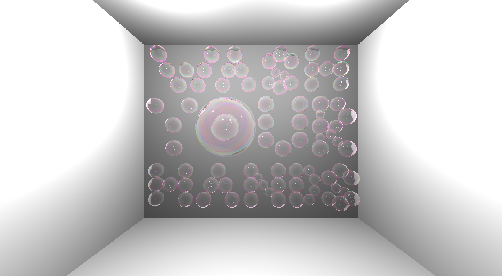 |
| Soap Bubble (jak4) | Stop the Spread (jak4) |

### 3, Jingwen Guo (jingweng)

I reorganized the primitive components of the default scene into something spooky that seems like it belongs in a cursed carnival house! Intruders beware!

|   |
|:-:|
|  |
| A Dark Place (jingweng) |

### 3, Joanna Kuo (jkuo)

Two words: Social Distancing!!!

|   |
|:-:|
|  |
| Too Little, Too Late (jkuo) |

### 4, Anabelle Chang (anabelle)

My art project is a tribute to Kobe Bryant. Adorned with a purple ceiling and a yellow floor, the room contains two balls shaping an 8 (his original Lakers number) moving from the back of the room to the front, mimicking a basketball bouncing up and down.

|   |
|:-:|
|  |
| Too Little, Too Late (anabelle) |

### 4, Elizabeth Petrov (epetrov)

For my art project, I have two submissions. In the first, I used my custom scene to create an animation similar to Turner Whitted's famous sphere animation in 1980; I also added in some colors to the material properties for an interesting effect.

When playing around with special material, I created a granite-like effect that has cotton candy colors, as can be seen in my second submission. I achieved this by multiplying the color I get from fractional brownian motion with the inverse of the current color. Finally, I applied this effect to multiple objects in the default scene.

|   |
|:-:|
|  |
| Whitted's Spheres, Revisited (epetrov) |

|   |
|:-:|
| 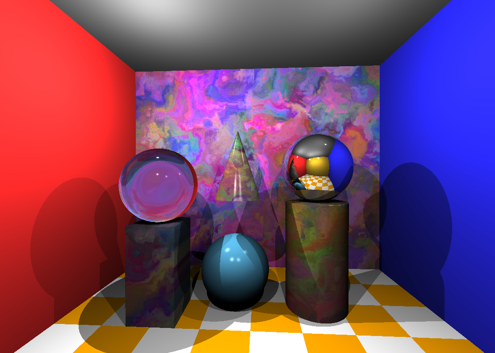 |
| Cotton Candy Culture (epetrov) |

### 4, Sharon Zhang (sharonz)

First, I played around with the custom scene I made and tried to give it some more energy. Then, I edited it using the custom filter I made in Assignment 0 along with some of the filters we implemented in Assignment 1, and finally made a stereographic GIF from shots taken from multiple camera angles. As a finishing touch, I also played around with the picture a little in Photoshop.

|   |   |
|:-:|:-:|
| 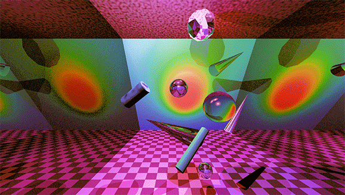 |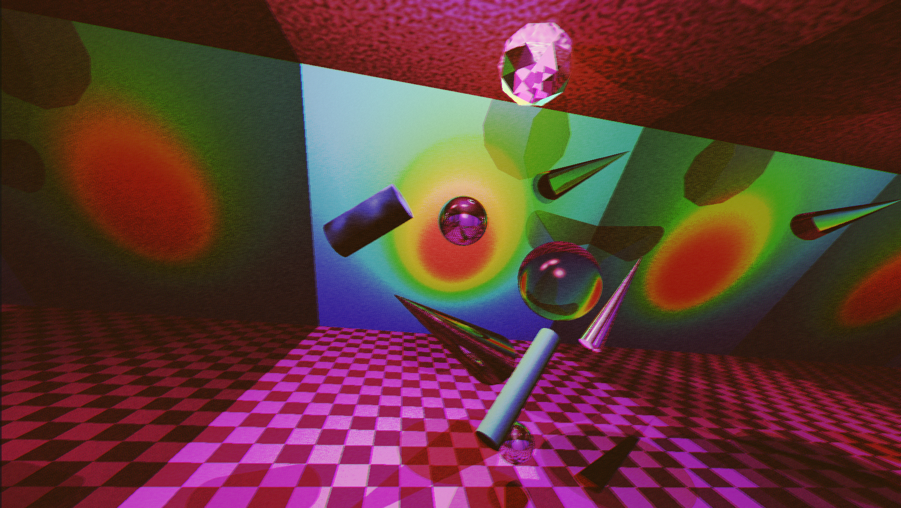 |
| RealD 3D (sharonz) | Your Next Album Cover (sharonz) |

### 4, Zak Dasaro (zdasaro)

This submission combines my custom scene with my bouncing sphere animation. I arranged the spheres in a circle and added a timing mechanism so that the bounces had a delay that was evenly spaced around the circle. The scene consists of a few reflective walls at different angles, producing an interesting staircase-like reflection pattern.

|   |
|:-:|
|  |
| Bounce Lighting (zdasaro) |

### 5, Hollis Ma (hollism)

I originally wanted to simulate an ocean with balls of light floating around and wrote a script to generate thousands of light, but the number of lights is capped at 10, so I went with a different approach to generate the lights. I used mirrors to reflect the lights down a tunnel, creating the illusion of thousands of lights. The ocean texture is done by a few iterations of procedural generation. This gif was made by varying the intensities of the different lights to create the illusion that the lights are coming towards you.

|   |
|:-:|
|  |
| Hold Your Breath (hollism) |

### 5, Heidi Kim (hyunsunk)

I wanted *Stockpile* to capture this weird time we're all living in, through a sight I'm sure a lot of us see day to day: a pantry, stocked to varying degrees. Spending so much time in the house, I've become a lot more aware of the groceries, cleaning supplies, etc. that take on more importance during a time of quarantine, when we can't access them the way we normally can.

From left to right, my scene includes what's on one of my kitchen shelves right now: Campbell's soup, some cereal boxes, Clorox wipes with paper towels behind them, and a box of pasta.

|   |
|:-:|
|  |
| Stockpile (hyunsunk) |

### 5, Jamie Guo (jamieguo)

Bears on bears on bears. I used spheres, cones, and cylinders to make a big ol' bear face! And then I stuck it in an infinity room because I think it looks funnier and more intimidating that way.

|   |   |
|:-:|:-:|
|  |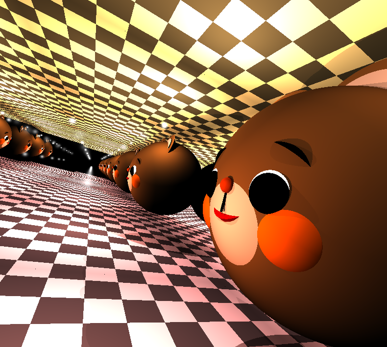 |
| Bears on Bears on Bears 1 (jamieguo) | Bears on Bears on Bears 2 (jamieguo) |

### 5, Emre Cakir (mecakir)

I created the Minecraft chicken using a custom scene. Do you think it'll lay an egg if I leave it rendering for long enough?

|   |
|:-:|
|  |
| Chicken (mecakir) |

### 5, Yunzi Shi (yunzis)

I was interested in simulating a scene of a cyberpunk cityscape with dark skyscrapers, neon-colored lights, and glass rail transportation in between the buildings. I made two different versions and controlled the color atmosphere by adjusting the color of the matte boxes, glass boxes, and lights.

|   |   |
|:-:|:-:|
| 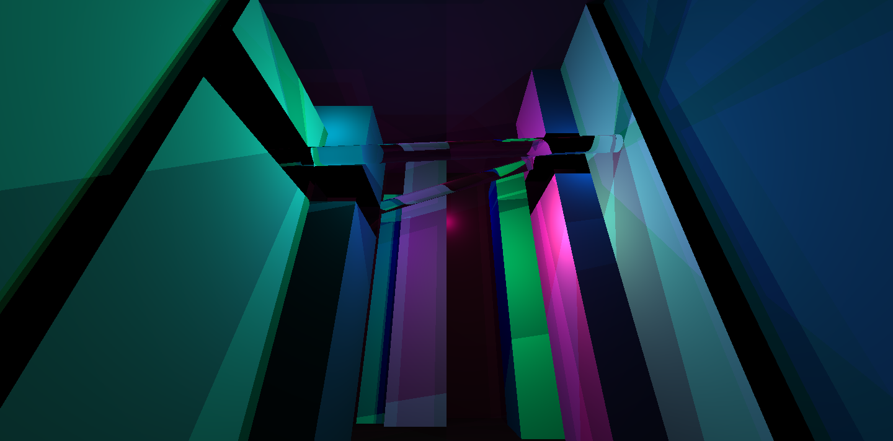 | |
| Cyberpunk 1977 1 (yunzis) | Cyberpunk 1977 2 (yunzis) |

# Honorable Mentions

### Anna Qin (alqin)

These are different views and lighting of the scene in `scenes/creative.json`. The cone and spheres are all made of glass, modeling water droplets sliding off a stalactite or an icicle. The infinite mirroring helps makes the scene more surreal and visually interesting.

|   |   |   |
|:-:|:-:|:-:|
| 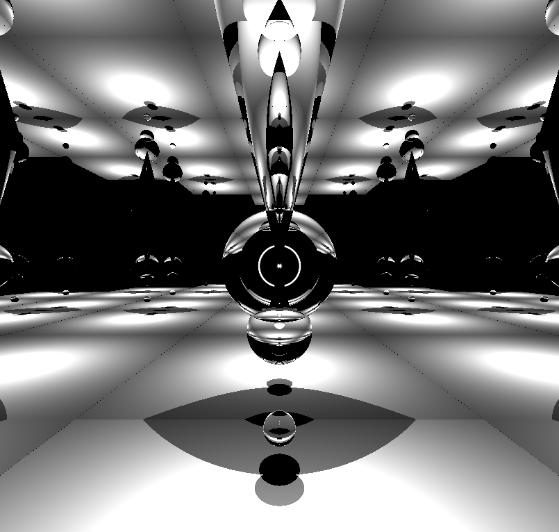 |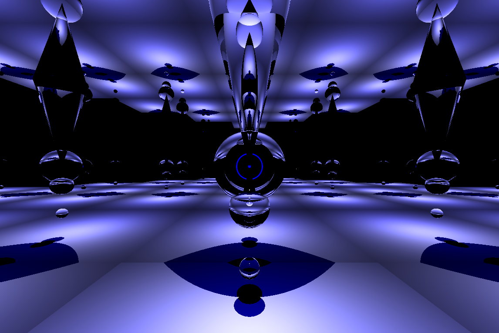 |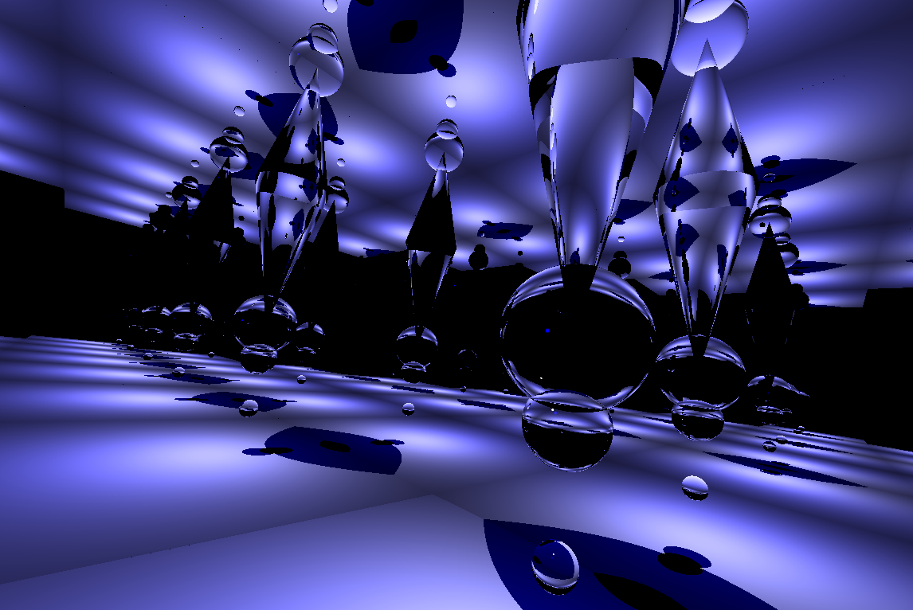 |
| The Cave in Grey (alqin) | The Cave in Blue (alqin) | A Wet Ceiling (alqin) |

### Abigail Rettew (arettew)

For my art contest submission, I am entering my custom scene. I used one straight plane as the "back" and added in two slanted planes (to create a sort of triangular shape). I also used my special material because I liked how it looked on the planes and added a bunch of mirror reflective spheres.

|   |
|:-:|
|  |
| An Aesthetic (arettew) |

### Arman Medghalchi (armanm)

My art contest submission is my attempt to create a time-lapse of my mental state during the month of March as the world fell apart.

|   |
|:-:|
|  |
| March Sadness (armanm) |

### Brandy Chen (brandyc)

For the art contest, I animated my custom scene. In the custom scene, I decided to make Patrick Star from *Spongebob* and his "house." To make Patrick, I primarily used cones and cylinders. For his house and his eyes, I used spheres. Patrick and his house are situated inside a box with a tan ground and blue walls to simulate being under water. For the animation, I made Patricks move towards the camera and move his arms up and down. I did this by gradually incrementing the position of Patrick, and then taking a screen shot at each increment.

|   |
|:-:|
| 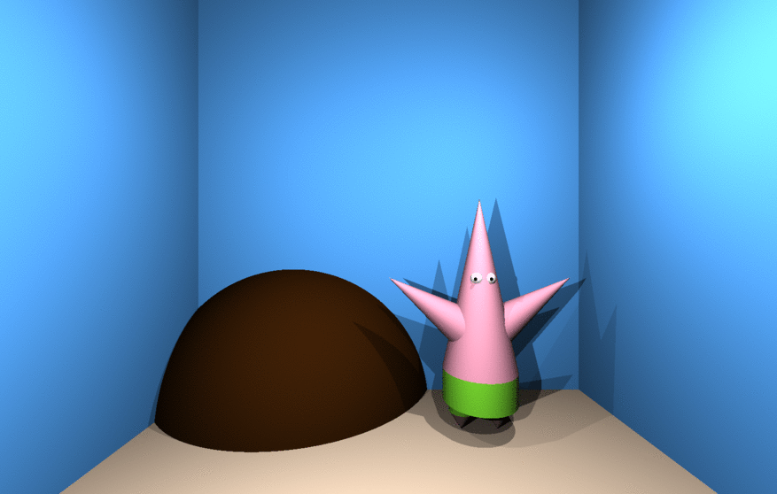 |
| Who Lives beneath a Rock under the Sea? (brandyc) |

### Christine Lu (cyclu)

For my art submission, I am submitting the gif I created in the animation section. This is an animation of the sphere in my custom scene rolling off the tip of the tetrahedron, bouncing on the block below, and rolling down the "steps" formed by the blocks. As the sphere reaches the bottom, the tetrahedron moves up and down and then the whole scene rotates.

|   |
|:-:|
|  |
| The Playground (cyclu) |

### Dora Zhao (dorothyz)

For my art project, I am turning in my custom scene. I was inspired by Japanese artist Yayoi Kusama and her social media famous infinity rooms. To recreate the scene, I made all of the walls on the plane mirrors. Then, I created floating cylinders that were replicated in the room. Finally, I added a yellow color light source to give the glowing aesthetic to the room and the cylinders.

|   |   |
|:-:|:-:|
|  |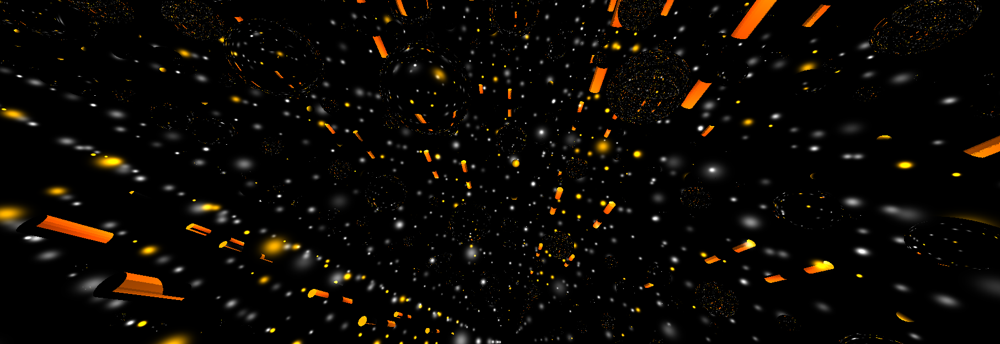 |
| Infinity Room 1 (dorothyz) | Infinity Room 2 (dorothyz) |

### Gabriel Roth (gjroth)

For the Art Contest I am submitting the Custom Scene that I made with my `custom.json` --- it's a chess board! I scaled my checkerboard pattern and moved the walls of the room to obtain an 8 x 8 chess board. I then designed modern looking pieces consisting of the primitive shapes we used in this assignment. The castle is a box, the knight is a cone with a sphere as its head, the bishop is a tall cone, the king is a tall box, the queen is a tall cylinder, and the pawns are short cylinders. I positioned the pieces in their starting positions for the game. Naturally, the white pieces are correctly positioned on one side of the board, and the black pieces are positioned on the opposite side of the board.

|   |   |   |
|:-:|:-:|:-:|
| 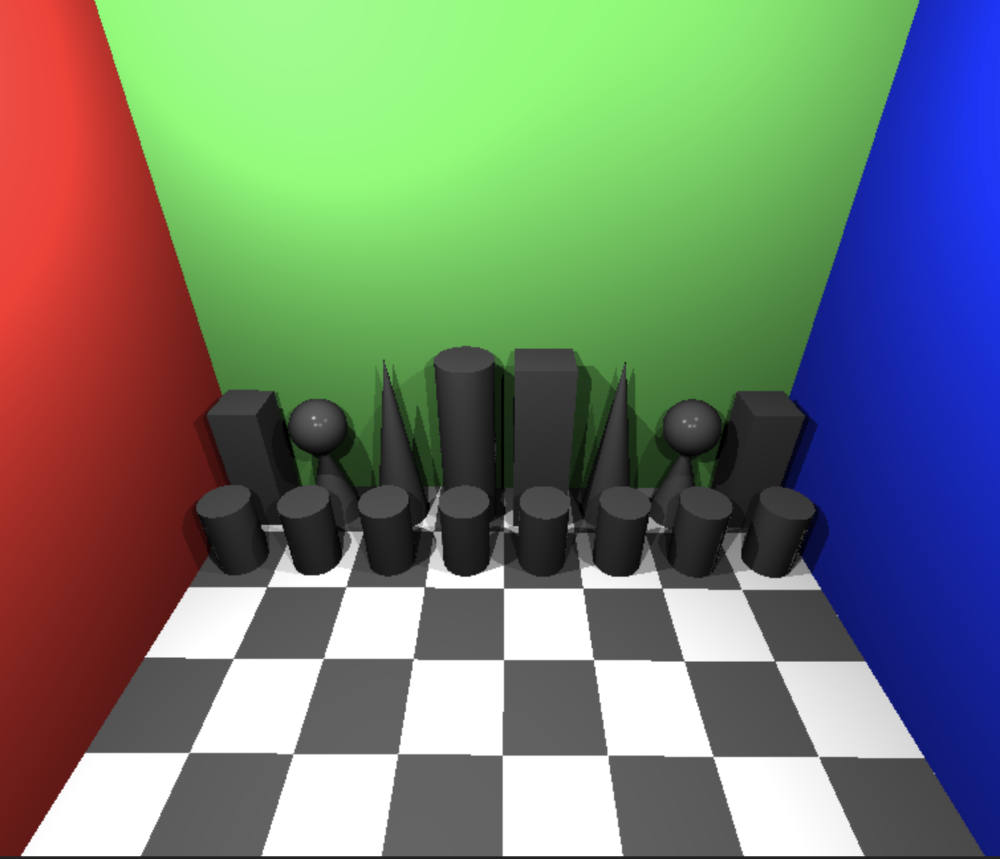 |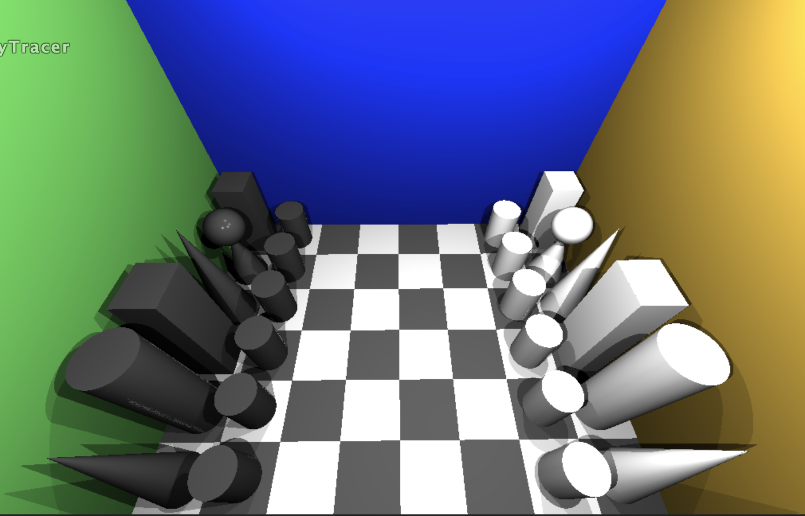 |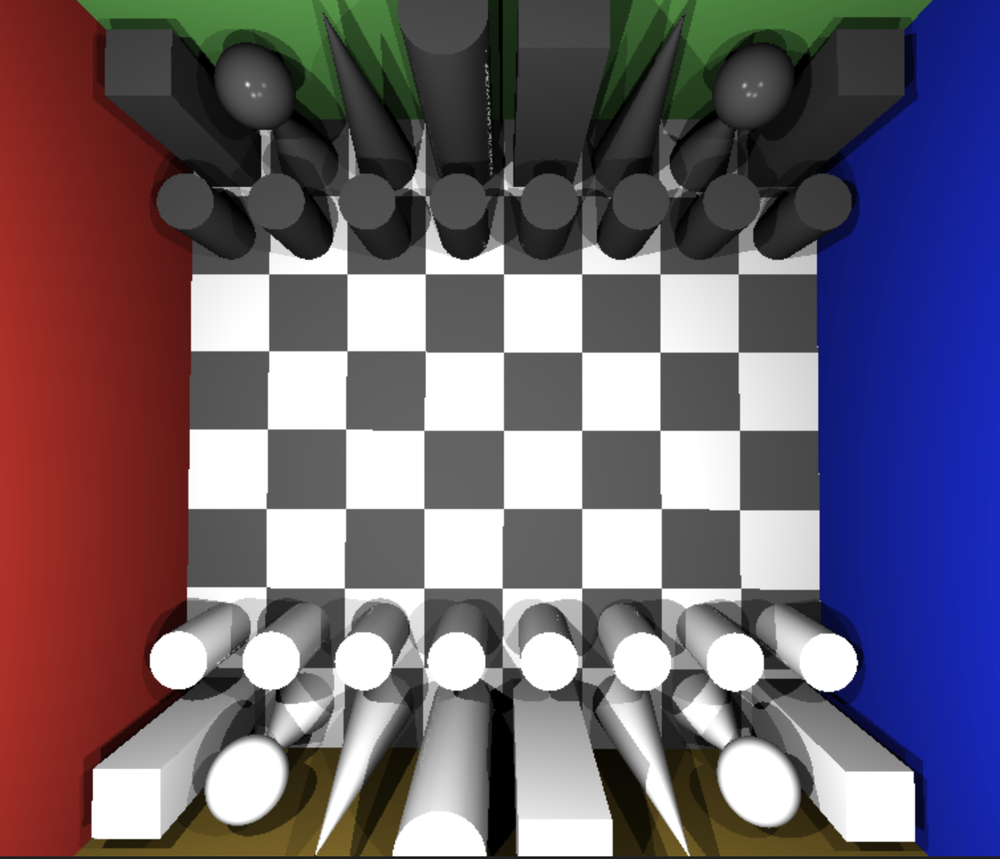 |
| Chess 1 (gjroth) | Chess 2 (gjroth) | Chess 3 (gjroth) |

### Greg Umali (gumali)

I have always wanted to know what it would be like to be in a room where all the walls are mirrors, so thank you to this project for letting me experience that. To accomplish this, I just put a mirror ball over a pyramid to create a cool symbolic central totem, and then changed the color and intensity of the lights that created an infinite disco (or the most dead surrealist club venue I have ever seen).

|   |
|:-:|
| 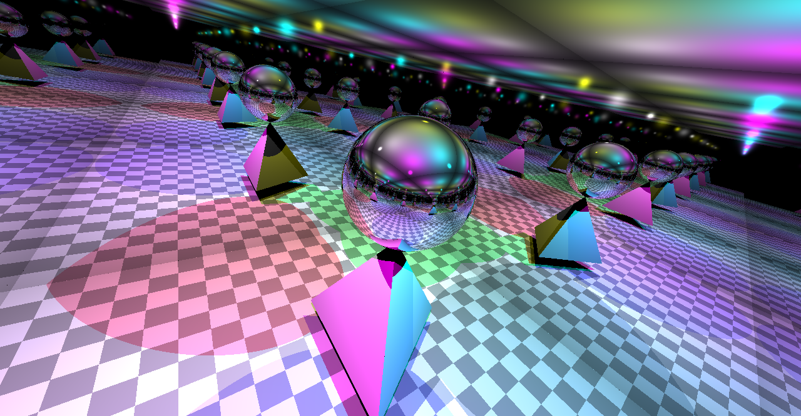 |
| Dimensional Disco (gumali) |

### Henry Wang (htwang)

Why render simple shapes when you can render the birth of the universe instead?

|   |
|:-:|
|  |
| Big Bang (htwang) |

### Jason Kim (jjk7)

My submission is a combination of my animation and custom scene. Each of my three scenes essentially have two spheres (one glass and one mirror) orbiting around a center point. Each of my three scenes includes a different background to give a cool effect as the spheres move around. One scene has mirror walls and a plain top and bottom. This gives a nice infinite mirror effect as the spheres move around. The second scene just includes mirrors for the walls and the top and bottom. This makes the scene give the effect of an infinite reflection of lights with the spheres reflecting these infinite lights. The final scene uses my custom "starfield" texture

|   |
|:-:|
| 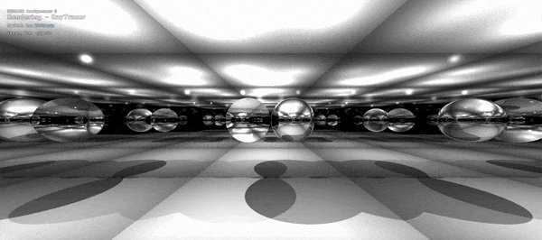 |
| Two Visible (jjk7) |

|   |   |
|:-:|:-:|
|  |
| Two Dark (jjk7) | Two Star (jjk7) |

### Jonah Lytle (jlytle)

For my custom scene, I played around with the materials and orientation of the cube and tetrahedron objects. By using a reflective material for both the objects and using my special material as the floor I created a scene which appears vast and futuristic.

|   |
|:-:|
| 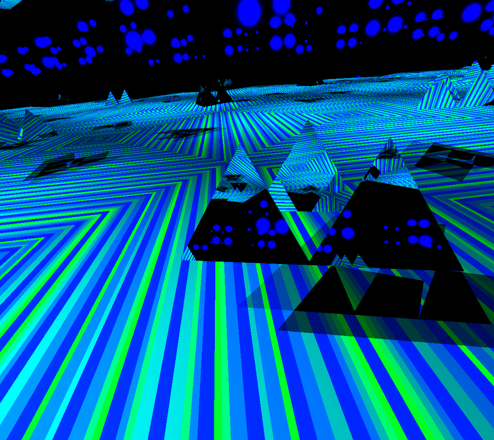 |
| Circuit City (jlytle) |

### Michael Fletcher (maf6)

I created the "Newton's Cradle", by doing a bit of physics to find the path of the balls (i.e. approximate location at each time step). I thought the changing reflection in the balls would be cool too.

|   |
|:-:|
|  |
| Fletcher's Cradle (maf6) |

# Other Art Galleries

<galleries></galleries>

