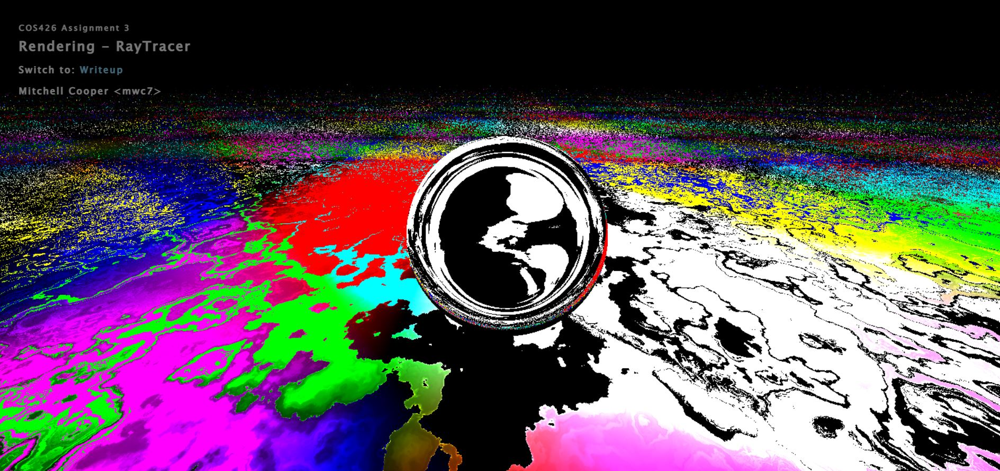

# Contest Winners

Three-way tie!

### 1, Harvey Wang (harveyw)

My art submission features none other than the legendary Patrick the star! Patrick is displayed in his full glory here with a beatufiul spherical body, complemented by conic limbs. He is sporting a stylish pair of shorts with a bold yellow color paired with pastel purple accents. These pants were intricately stiched together using cylinders to match Patrick's enviable figure. Everybody knows Patrick's best feature, however, is his smile. Observe the pure glee on Patrick's face, with his experessive spherical eyes and pupils, thin cylindrical eyebrows, and a cleverly tilted cylinder to form his contagious smile. In fact, Patrick seemed so happy that it only felt fitting to put him up front and center on stage, built using two mirror walls angled towards each other, as well as a (less) reflective ceiling. Along with some point lights, this places Patrick in the spotlight, with flashy strobe lights beaming behind him! Finally, to accurately represent Patrick's natural habitat, the floor is given a serene ocean blue color. Go Patrick!

|   |
|:-:|
|  |
| Patrick! (harveyw) |

### 1, Srija Makkapati (srijam)
Inspired by the checkerboard chessboard-like feature we implemented, I decided to try and combine the shapes we already created (cylinder, cone, box) to create chess pieces and arrange them ominously around the white king.

|   |
|:-:|
|  |
| Chessboard (srijam) |

### 1, Mitchell Cooper (mwc7)

I was inspired by the "Singularity" animation linked in the assignment specs. I wanted to play around with the special material and see what I could do with it and really try and show off that aspect, so I just created a very minimal scene with a sphere, a single light, and an infinite plane with the special material type. I played around a lot with the special material, creating different versions, but all of it was based on fractal brownian motion and perlin noise. I amplified the fbm by multiplying the result of one and the input of another. I then added color based on a sine function of the x and z compnents of position. I animated the special material plane by first scaling the posIntersection vector so that the fbm was the size that I wanted. I then created a sort of tidal movement by shifting the position according to a sine function (which smoothly and periodically reverses the direction of motion) and a tangent function which causes its speed to fluctuate more, almost giving the movement momentum. float f = float(frame); float scale = float(2.5); vec3 p = posIntersection/scale; p = p + 5.0 * tan(f/250.0) * sin(f/250.0); is the full equation I use.

|   |   |
|:-:|:-:|
|  |  | 
|  |  | 

|   |
|:-:|
| <iframe allow="autoplay" height="480" src="https://drive.google.com/file/d/1m1TfTawSWqmmp31GrNbScU7xppmGE0kR/preview" width="640"></iframe> |
| Singularity 2.0 (mwc7) |

# Other Art Galleries

<galleries></galleries>

