# Contest Winners

### 1, Christy Lee (christyl)

For the art contest, I experimented with several "colorful" scenes. I think this one turned out best!

|   |
|:-:|
|  |
| Colors in the Wind (christyl) |

### 2, Anna Qin (alqin)

I am submitting two series of art for this assignment's contest. The first one, *Fine*, uses textures to recreate the "This is Fine" meme with the cartoon dog surrounded by fire. It is a reflection of the current mood.

|   |
|:-:|
|  |
| Fine (alqin) |

For the second series of photos, *Lace*, I use a transparent and white image of a mandala pattern to create a pretty lace cloth that we drape over a box-table and a sphere. I think it turned out really well!

|   |   |   |
|:-:|:-:|:-:|
| 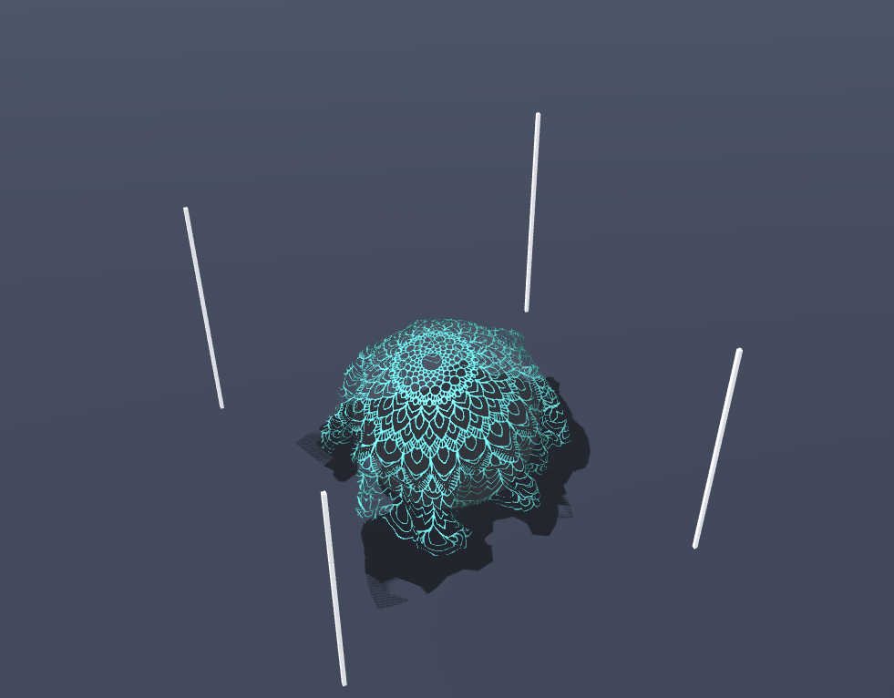 |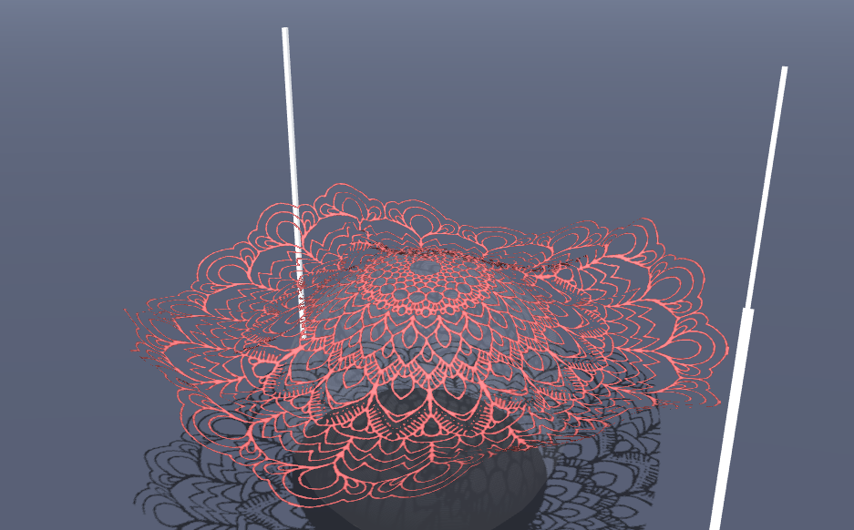 | |
| Lace 1 (alqin) | Lace 2 (alqin) | Lace 3 (alqin) |

### 2, Jake Kirkham (jak4)

It is clear that a ton of work has gone into making Assignment 5 interesting, fun, and educational --- from quality of life to documentation, A5 is on a level above the others. As such, I think A5 deserves to be the face of the course; so, I made a logo!

For my custom extension, I implemented tearable cloth by selectively enforcing constraints and hiding cut-away particles. The effect, though "hacky", ends up looking pretty neat in real-time with other forces. By binding tear to my mouse cursor plus a key press, I realized it also let me "draw" on the cloth by tearing away particles to reveal the background beneath. By adjusting the ground color and turning off gravity (so that my lettering did not simply fall down), I was able to make a fun set of letters in RGB complementary colors. I then used photoshop to cut the different letters together into a full COS 426 logo.

As part of my art submission, I've included a few shots of tearing with forces added, as the feature itself is also pretty neat looking on its own.

|   |
|:-:|
| 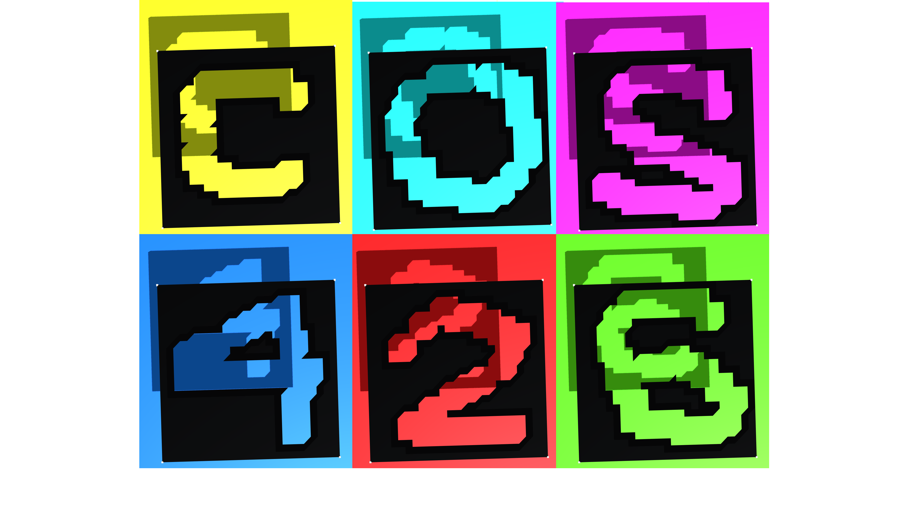 |
| The Face of the Course (jak4) |

|   |   |
|:-:|:-:|
|  | |
| RIP 1 (jak4) | RIP 2 (jak4) |

### 2, Jason Kim (jjk7)

I combined the effects of my custom force, custom scene, and custom textures/materials to create the effect of a bobbing ocean and the sun setting over it. The custom force randomly perturbs particles up and down to create a wave bobbing effect. The custom scene makes the cloth larger and lower to the ground and moves the sphere into a position where it looks like a sun on the horizon. The custom textures make the cloth look like water and add a bump map to the cloth to give it more depth.

If you enable the effects from my custom scene and custom textures/materials, you should be able to re-create the art contest submission with [this link](http://localhost:8000/index.html?fabricLength=1000&gravity=false&customForce=true&customFStrength=9.9&customFRate=7&object=Sphere&wireframe=false&clothColor=7030941&clothSpecular=15744831&groundColor=5917346&fogColor=16764108&showClothTexture=true&clothTexture=water.png).

|   |
|:-:|
|  |
| Beyond the Horizon (jjk7) |

### 2, Uri Schwartz (uris)

For my art contest, I realized that I got a very cool looking cloth texture when I only had bending constraints on. This maintained the squares formed by the diagonal constraints, but nothing else. I dropped this cloth onto the box shape, and adjusted some of the color settings, which yielded the following artistic result.

|   |
|:-:|
| 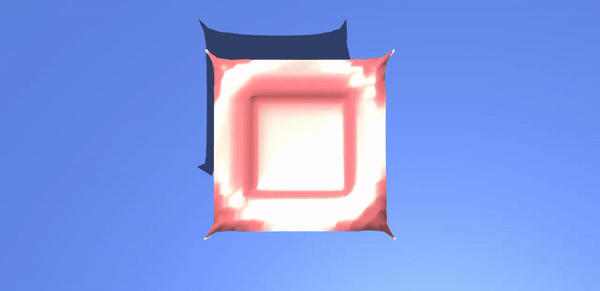 |
| Bending Tiles (uris) |

### 3, Jingwen Guo (jingweng)

For my art contest submission, I used my custom cloth and ground textures to create a ghost hovering over a graveyard background. To create the ghost, I decreased the size of the default sphere and changed its movement to be a periodic up-and-down motion. While the cloth is pinned in the four-corner configuration, I hid the poles by decreasing their height to `0`. I experimented with different ways to drape the cloth over the moving sphere, but I realized that removing all pins resulted in the cloth quickly sliding off the sphere, no matter the size of the cloth or movement of the sphere. To complete the scene, I added the ground texture and darkened the ground and fog colors.

|   |
|:-:|
|  |
| Trick or Treat (jingweng) |

### 3, Sharon Zhang (sharonz)

I hope you are all doing well in these trying/difficult/tough/hard/challenging times. (I really do though!)
Stay safe, stay sane, and stay home!

|   |
|:-:|
| 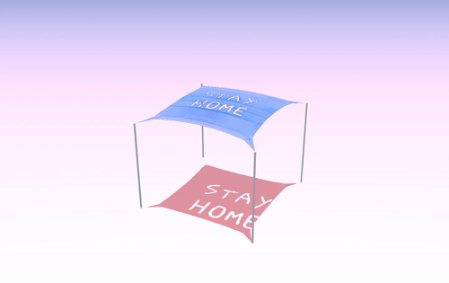 |
| Stay Home (sharonz) |

### 4, Sean-Wynn Ng (seanwynn)

I don't know what this is, but I beleive I've created a monster. Is this how Dr. Frankenstein felt?

|   |
|:-:|
|  |
| Monster Girl (seanwynn) |

### 4, Taylor Beckett (tbeckett)

The cloth in wind reminded me of a pirate flag, I decided to make one! I added the pirate flag texture to the cloth and water texture to the ground using two images off the internet. Next, I removed all but one of the poles. I added a function in `particle.js` called "lockToBottom" that would pin a particle to the middle of the remaining pole. Next, I modified `sim.js` so that when `fourCorners()` is called for pinning, I would lock the bottom left corner of the cloth to the pole, left the top let corner pinned at the top, and let the other two corners fly free. Then I added rain and wind force to the scene to let the flag fly! Below is a screenshot of the scene.

|   |
|:-:|
| 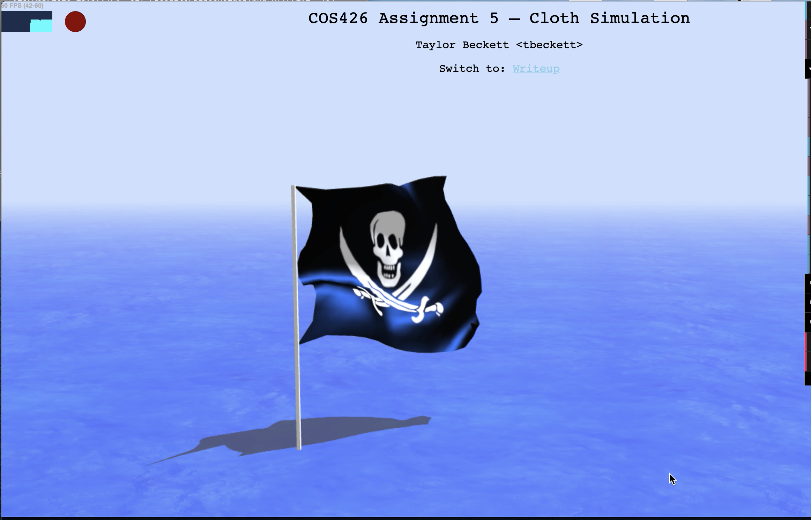 |
| The Jolly Roger (tbeckett) |

### 5, Christine Kwon (cmkwon)

For my submission, I used a custom texture I created in Adobe Illustrator, which consists of a transparent background scattered with circles of varying opacities. I draped this over a sphere to display its reflective properties.

|   |
|:-:|
|  |
| Bouncing Bubbles (cmkwon) |

### 5, Henry Wang (htwang)

I had a funny self-intersection bug, so I decided to make the most of it!

|   |   |
|:-:|:-:|
|  |  |
| Dumbledore's Pensive (htwang) | The Pulsating Mass (htwang) |

### 5, Julian Knodt (jknodt)

This work of art is inspired by a bug that looked cool and made me laugh. I reworked it into something a bit more trippy but this is the quarantine mood.

|   |
|:-:|
|  |
| The Clothy Way (jknodt) |

### 5, Michael Fletcher (maf6)

I really messed up my plane implementation and it made a cool swirly boi. I call it: *Cotton Candy*.

|   |
|:-:|
| 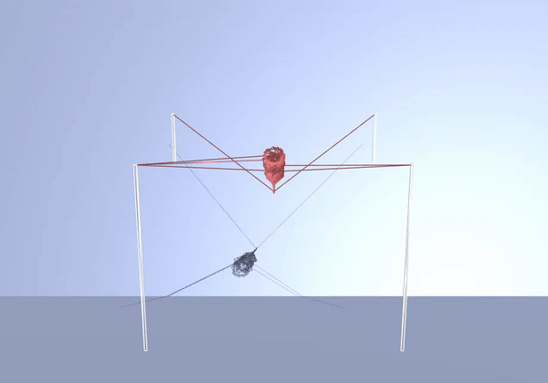 |
| Cotton Candy (maf6) |

# Honorable Mentions

### Anabelle Chang (anabelle)

For my custom scene, I digitally drew out a red flower and turned it into a texture for the cloth. I placed it against a grassy scene, as you can see below.

|   |
|:-:|
| 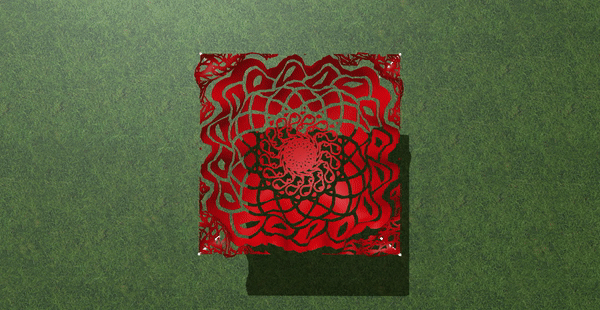 |
| Red Flower (anabelle) |

### Claire Guthrie (cguthrie)

My art contest are the custom scene and textures that I created!

|   |
|:-:|
| 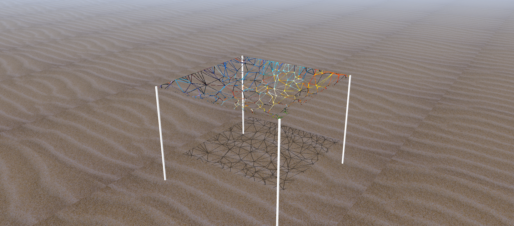 |
| Stranded in the Desert (cguthrie) |

### Gabriel Roth (gjroth)

For this art contest I made a parasailing parachute by altering the strength and direction of gravity. With wind turned on, the cloth looks like a parasailing parachute on the ocean and in the wind!

|   |
|:-:|
| 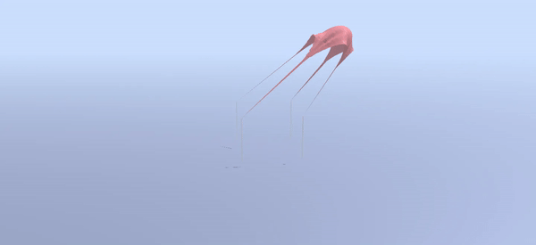 |
| Parasails Away! (gjroth) |

### Johana Leanos (jleanos)

I decided to use my custom filter to tell a story. I noticed that the fluttering looked like a bird in the cloth so I can up with a story.

*The Clips and the Sudden Storm*

> "It was a sunny summer afternoon. The linen was hanging to dry, gently flowing in the wind. The linen's owner had purchased magical clips last winter that guaranteed the garments wouldn't fly off the clothes lines. Well so far none have been taken by the wind so maybe the $1000 were worth it. Although this particular afternoon posed a challenge. A dark overcast slowly took over as a bird flew under the linen. It was flying so fast that it got caught in the middle of the linen and started to flutter upwards rapidly. Just then, the sky darkened and a tornado appeared. The linen and the bird were flung round and round as the tornado passed through. Just as the linen was sure gone, the tornado was gone and sky brighten up. The bird escaped the linen as it settled down once more. The clips lived to see another day.

|   |
|:-:|
|  |
| The Clips and the Sudden Storm (jleanos) |

### Johan Ospina (jospina)

|   |
|:-:|
| 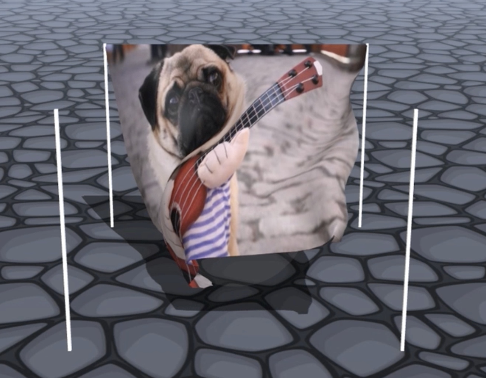 |
| Bulldog Blowing in the Wind (jospina) |

### Lauren Johnston (lej2)

First, I created a custom water texture in Figma (a free design tool) and used that as the floor texture for an underwater effect. I also used a public Domain image of a 16th century carpet from the Metropolitan Museum of Art!

|   |
|:-:|
| 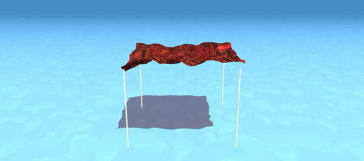 |
| The Underwater Magic Carpet Awaits (lej2) |

### Labib Hussain (lhussain)

For my art contest submission, I present an "illusion" that is the effect of my custom force.

|   |
|:-:|
|  |
| Superposition (lhussain) |

### Emre Cakir (mecakir)

I added two new textures for my art contest submission. The first one I added was the `pigmen.png` for the cloth. This is a skin of the "pigmen" mob from Minecraft. The second texture I added was `lava.jpg` for the ground. I also changed the ground material to use `MeshPhysicalMaterial`, and I changed the metalness and the reflectivity, all to better match lava. I felt that these textures gave the scene a real "Minecraft Nether" look.

|   |
|:-:|
| 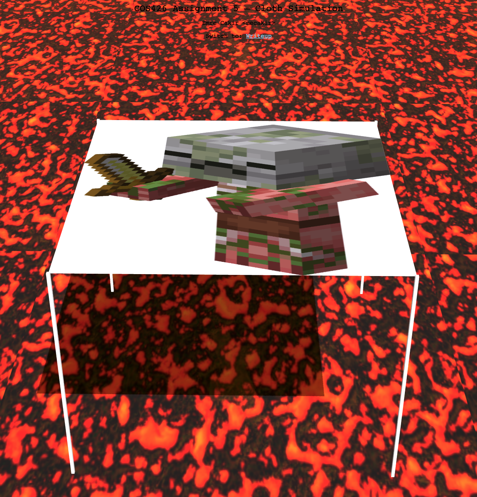 |
| The Nether (mecakir) |

### Oliver Schwartz (os4)

My art submission is an interesting effect I obtained when I was implementing by explosion. Here, I am holding down the explosion button, which makes particles bounce rapidly between far away randomly computed positions and `(0, 0, 0)`. This creates the interesting effect of a 'singularity', where we have almost an energy ball about to explode. In the video below, I hold `e` for a good amount of time, release it, and then press it again for an explosion.

|   |
|:-:|
|  |
| The Singularity (os4) |

### Scott Aravena (saravena)

My art contest submission was inspired by something that has taken up a lot of my time during quarantine: memes. In particular, the dancing [pallbearer meme](https://www.youtube.com/watch?v=qgDCM91f7NY) that has taken the internet by storm. After implementing my gravity hotkey, the motion of the cloth going up and down after repeatedly hitting the `G` key reminded me of the dancing pallbearers. As such, I found an image of the pallbearers for the ground texture and an image of a coffin for the cloth texture and recreated my favorite meme at the moment. Be sure to play Astronomia 2k19 by Stephan F. in the background. Enjoy!

|   |
|:-:|
|  |
| The Pallbearers (saravena) |

### Xi Chen (xc11)

My art contest submission sets cloth texture and ground to my cat Evelyn's photos. Additionally, I add the rain, wind and custom anti-gravity forces to the scene to make it more interesting.

|   |
|:-:|
|  |
| Evelyn (xc11) |

# Other Art Galleries

<galleries></galleries>

