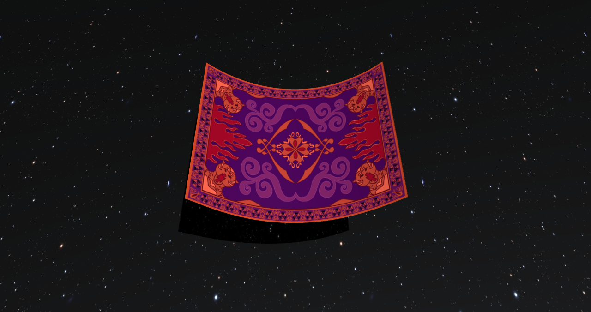
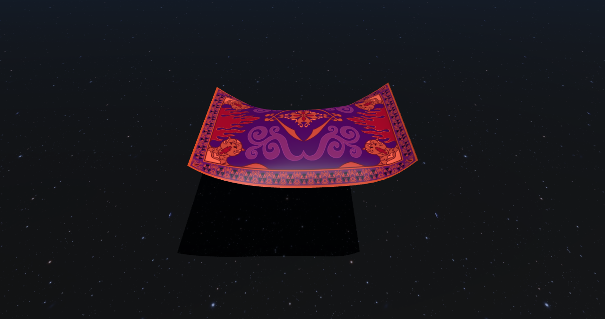
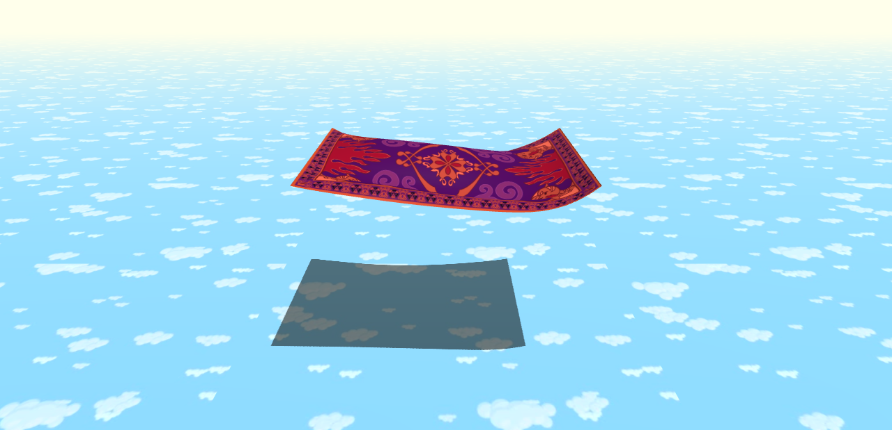
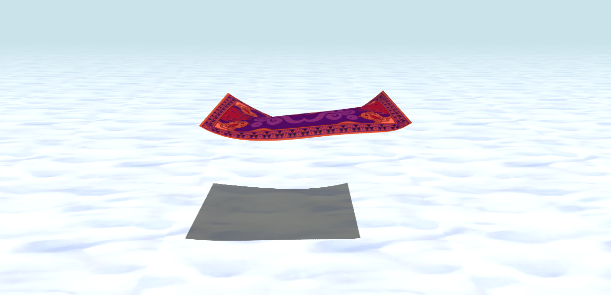
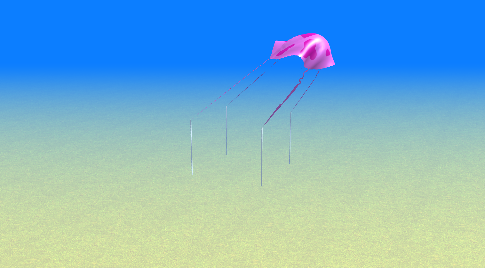
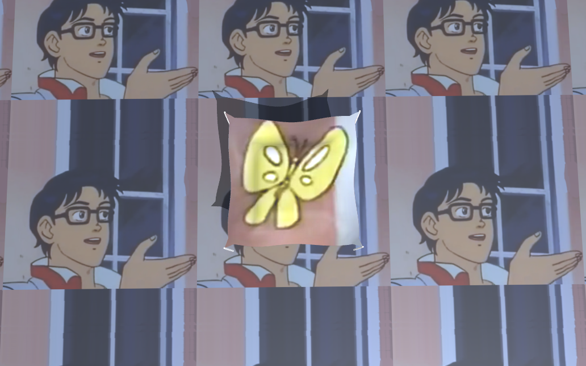
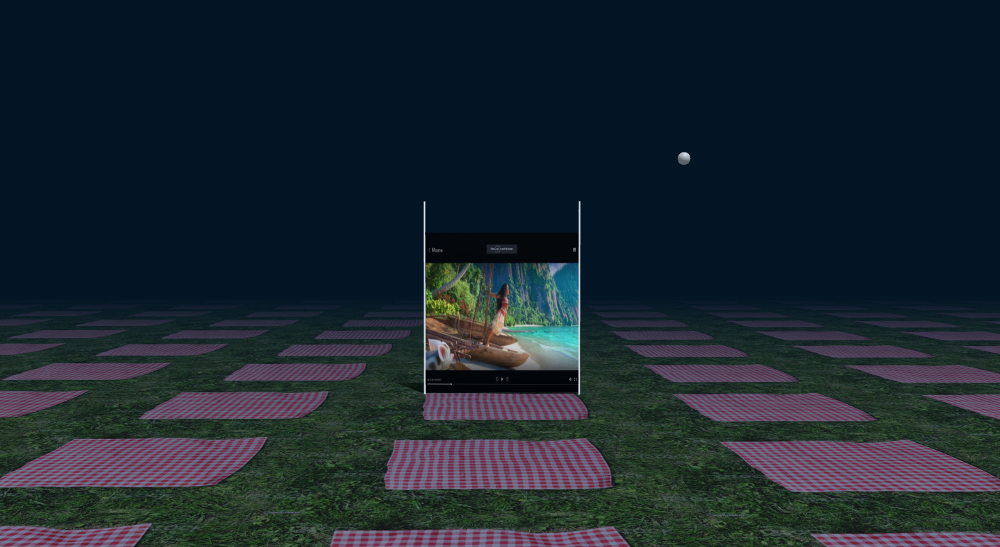
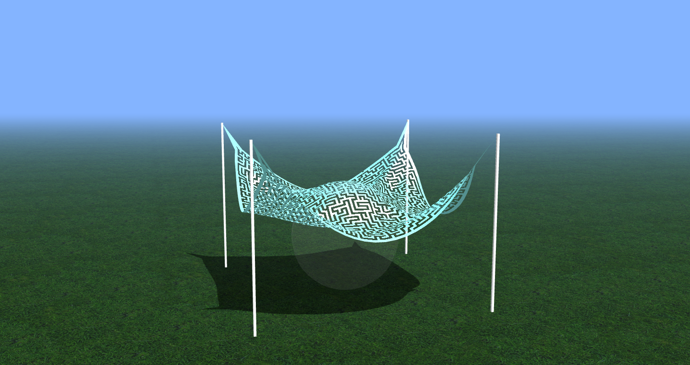
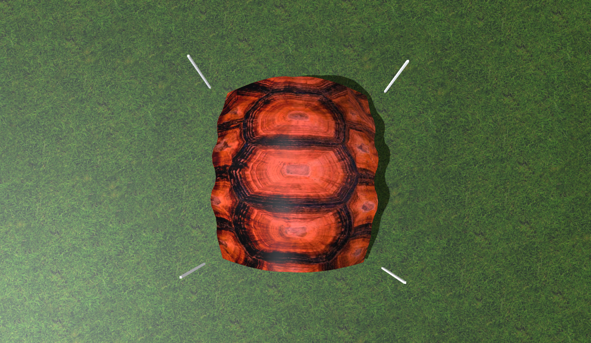
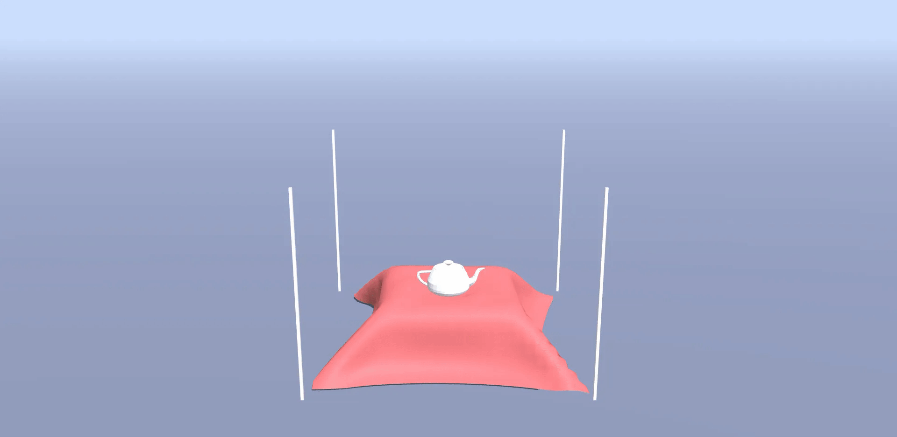

# Contest Winners

### 1, Sara Dardik + Yael Stochel (sdardik+ystochel)

For the art contest, we recreated the magic carpet from Disney's Aladdin, and depicted it flying through different scenes. Eventually the magic carpet finds itself in a storm, being buffeted by wind and rained on. He gets knocked down, but we're sure he makes it back to Aladdin eventually!

|   |
|:-:|
|  |
| Magic Carpet (sdardik+ystochel) |

|   |   |   |   |
|:-:|:-:|:-:|:-:|
|  |  |  |  |

### 1, Monique Legaspi (mlegaspi)

My first submission was inspired by my custom force, which applies antigravity in the y- and z-directions. I created a new texture for the cloth to look like a jellyfish from Spongebob Squarepants, altered the grass texture to look more like sand, and changed the fog to a deeper blue, so as to replicate the jellyfish fields in which Spongebob frolics and indulges in his jellyfish-catching fancies.

|   |
|:-:|
|  |
| Jellyfish (mlegaspi) |

My second submission was inspired by a bug I came upon while implementing handleSphereCollision(), wherein I accidentally made the cloth stay inside the sphere rather than clip back out. I created a fiery, sparkly kind of texture for the cloth, freed it from its tethers to the poles, and recreated the bug to trap the cloth inside the sphere. I additionally made the sphere move, so that the fire would swirl around inside. I also imported a hardwood floor texture for the flooring and colored the floor/fog a dark, purply palette, to evoke the feeling of being inside the home of a scheming witch or wizard, who is perhaps using their ball of fire to cast a spell on you! >:)

|   |
|:-:|
|  |
| Ball of Fire (mlegaspi) |

### 2, Isabel Zaller (izaller)

I used my mouse hovering event handler, cloth size 1000, and shear constraints only. I really like the movement -- it sort of reminds me of seeing the underbelly of a bird and how the feathers move to reveal different colors. I also really like how the end result for the cloth looks almost sculptural.

|   |
|:-:|
|  |
| Feathers (izaller) |

### 2, Charles Liu (cl43)

My submission for the art contest is a "Stress Cloth", which is a cloth that changes colors based on how much "stress" is being placed on the springs (specifically, this is the average of the ratios of displacements to rest distances for each spring constraint). This overwrites the provided cloth color by first computing the average displacement divided by rest distance across all constraints. This is then scaled up from values limited to [0, 0.2] (an empirical upper bound) to indices in the color gradient defined (which is red colors to green colors). If the index is between two indices, I just linearly interpolate each channel of the nearest two RGB colors (an approximation, but with enough specified colors, is reasonable). The higher the average displacement from resting distance divided by resting distance, the more red the cloth is (limited to 0.2), and a cloth with no displacement from resting distances would be perfectly green.

|   |
|:-:|
|  |
| Stress Cloth (cl43) |

### 3, Daniel Goodman (danielmg)

For the Art Contest, I'm submitting my custom scene - a bird's nest with 4 eggs. In my scene, I added four light blue spheres to represent bird eggs, and I edited the sim.js file to make them fall from the sky and land in the nest. I removed gravity from the sheet so it would only respond to the egg collisions. The eggs are a bit magical in that they don't actually respond to gravity and instead fall at a predetermined velocity (and they levitate for a bit after "landing"). However, at the end, they end up nice and safe in their nest.

|   |
|:-:|
|  |
| Bird's Nest (danielmg) |

### 3, Epifanio Torres-Smith (epifanio)

This video includes the work I did for the texture, custom force, self-intersections, and event handlers extensions. Based on the cloth's pulsating and rhythmic motion in the video, I've decided to name this art submission "Wiggle Wiggle Wiggle."

|   |
|:-:|
|  |
| Wiggle Wiggle Wiggle (epifanio) |

### 3, Joseph Rubin (jmrubin)

Textures I created projected onto the cloth and the background. The cloth is affected by the wind effect I made.

|   |
|:-:|
|  |
| Building Textures (jmrubin) |

### 3, Justin Chang (jtchang)

My submission is just an interesting combination of forces & wind & rain being applied to an unpinned cloth where it begins to run away from the sphere.

|   |
|:-:|
|  |
| Worm (jtchang) |

### 3, Kasey McFadden (kaseym)

*Go Tigers:* Created a custom, partially-transparent image in Photoshop from a Princeton flag design, goTigers.png. Added a pinned option "Flag" under the Scene menu, which when toggled creates only one pole mesh in scene.js, locks the top left and bottom left of the custom canvas to the top and halfway points of the singular pole, and applies special wind function flagWind() (in cloth.js) to ripple the flag.

|   |   |
|:-:|:-:|
|  |  |
| Go Tigers! (kaseym) | |

### 3, Martin Hito (mhito)

My art contest submission is a changed texture on the cloth to my Elon Musk texture with the addition of a few of my custom event handlers. The expression from Musk's face changes from a kind of goofy happiness to disgust and unhappiness the cloth particle's aking up his noise are increased (like Pinnochio!). The name of the artwork is "Elon's a real boy now!"

|   |
|:-:|
|  |
| Elon's a real boy now! (mhito) |

### 3, Nicholas Sum (nsum)

If only we had infinite cloths, then this man will have infinite butterflies.

|   |
|:-:|
|  |
| Is this a simulated cloth? (nsum) |

# Honorable Mentions

### Abhinaya Raghunatahan + Ishani Kulkarni (abhinaya+isk)

Our custom scene is an outdoor movie night of watching Moana (an incredible movie). To implement custom scene, we changed the parameters in scene.js in order to create a screen-like position using the cloth. We adjusted the poles, added an image of Moana as the texture to simulate a movie screen, and added ground texture as picnic blankets to add to the outdoor watch-party. We added a moon in the background using the sphere object.

|   |   |
|:-:|:-:|
|  |  |
| Outdoor Moana (abhinaya+isk) | |

### Aaron Skepasts (ams10)

For my art contest, I just tried to make a nice realistic simulation using the cloth texture to have a nice blanket drooping over a ball, and then the grass texture as well as changing the sky blue.

|   |
|:-:|
|  |
| Blanket (ams10) |

### Ben Coles (bcoles)

I noticed that if I used my custom force along three points down z = 0, it would begin to resemble the shape of a turtle shell. So, I used a turtle shell texture and a grass floor to complete the look.

|   |
|:-:|
|  |
| Turtle (bcoles) |

### Bharat Govil (bgovil)

For custom force and my art submission, I wanted to implement a 'pulsing' black hole of some sort. For this, I applied a sinusoidal function on the global time variable in the same manner as the changing winds function. Depending on this scaling factor, I either made all particles move towards a given point, or away from it.

|   |
|:-:|
|  |
| Black Hole (bgovil) |

### Caio Costa (ccosta)

My art contest entry is a rendition of the magic trick where a table cloth get pulled out from under a table setting. Due to budget constraints, (and performance reasons!) there's only one teapot instead of a whole tea set. While the mesh can and does collide with the teapot mesh, the teapot does not have physics, so there is no way this trick can go wrong!

|   |
|:-:|
|  |
| Magic Trick (ccosta) |

# Other Art Galleries

<galleries></galleries>

