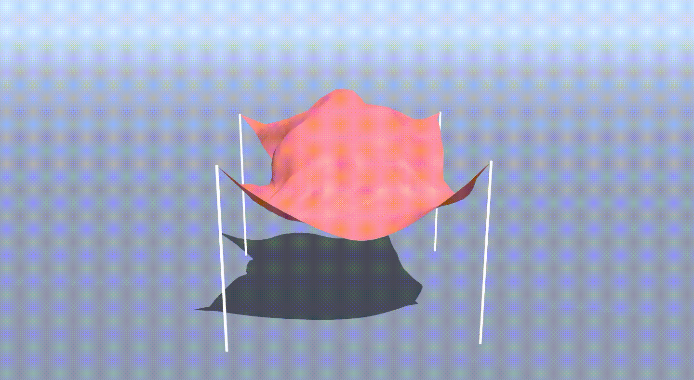
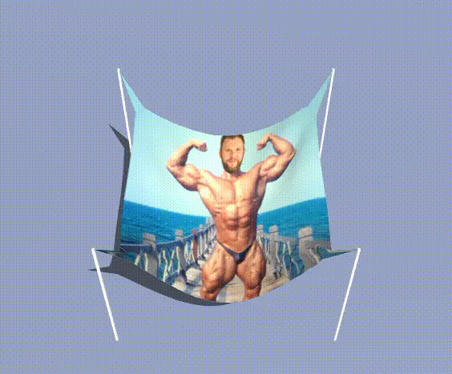
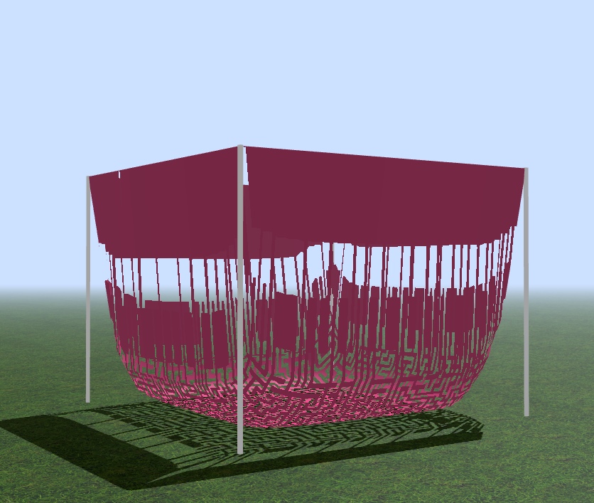
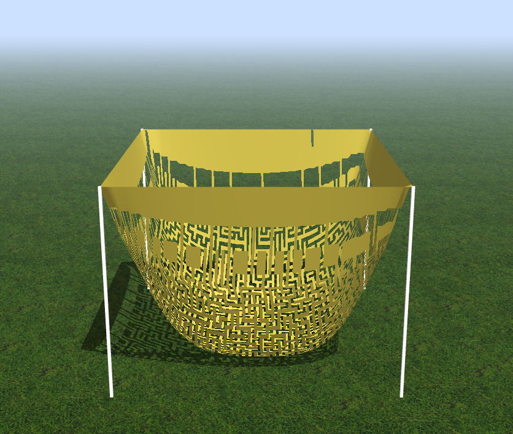
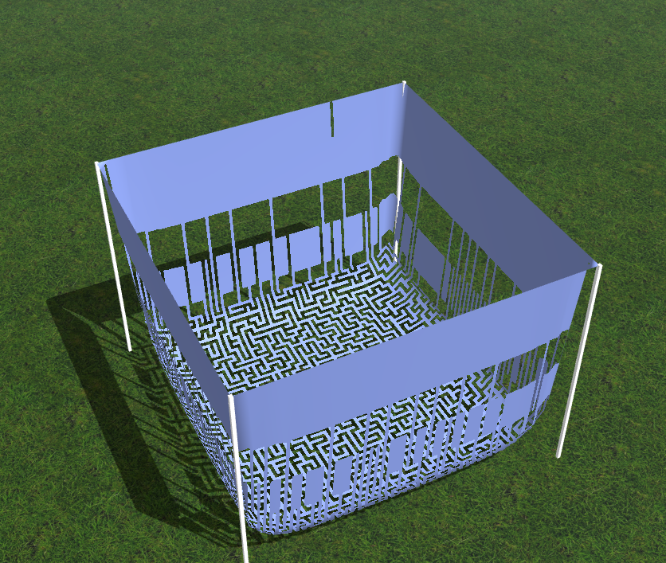

# Contest Winners

### 1, Dara Oseyemi (doseyemi)

Failed attempt of sphere collision function with moving sphere that causes the to jump and bubble up as the sphere move underneath it.

|   |
|:-:|
|  |
| |

An unpinned cloth when the upward rain and shear constraint is and isn't applied, respectively. This makes it appear as if the cloth is floating and dancing in the air. The higher the rain strength or rate is, the higher up the cloth floats.

|   |
|:-:|
|  |
| Dancing Cloth (doseyemi)|

|   |   |   |
|:-:|:-:|:-:|
|  |  |  |
| My custom wind function is applied then removed to cause the cloth spin. The cloth is initially stretched then decreases in size until it returns to its relaxed state. | Same as the video above but with a clear background sharingan cloth pattern. | A custom cloth pattern applying rain when the rain function initially added the rainForce force instead of subtracting it. This caused the cloth to float upward when the cloth isn't pinned and the rain strength or rate is high. Lower rain strength or rate brings the cloth back down. |

### 2, Richard Cheng (rc38)

|   |
|:-:|
|  |
| feLiX hEiDe (rc38) |

### 3, Bri Butler (bb5943)

For the art contest, I made an adjustable basket/laundry hamper with the custom force function! See the custom force description for more! Four Edges must be enabled for this effect!

|   |   |   |
|:-:|:-:|:-:|
|  |  |  |
| Laundry Basket (bb5943) |

# Other Art Galleries

<galleries></galleries>

