This art gallery contains a curated selection of student artwork from this semester. For each assignment, students are invited to submit a few results of their work for the assignment art contest. A jury of instructors then vote on all the submissions to determine the art contest winners. As a reward for their high quality work, art contest winners receive two points of assignment extra credit, and honorable mentions receive one and a half points of assignment extra credit. Students whose work was not selected for thus art gallery will still receive a single point of assignment extra credit for participating.

Enjoy the show!

# Assignment 0 Gallery

### Winners (A0)

<student gallery=0 place=1>Gabriel Roth (gjroth)</student>

For the art contest, I created a Mosaic filter that represents the image with solid color square tiles. Just as an artist creates a mosaic by choosing a solid color tile to represent a piece of an image, this filter replaces a region of the image with a single colored tile. The color of each tile is computed as the average of the colors of each pixel in that tile’s region. In addition, beige colored lines line each tile, just as grout separates tiles in a real mosaic.

The greater the input value, the larger the tiles grow, and thus the more abstract the mosaic representation becomes. Conversely, as the input value shrinks, so too do the tiles, thereby producing a more accurate mosaic representation. Below are some beautiful mosaics of different images with various sized tiles.

|   |   |
|:-:|:-:|
| 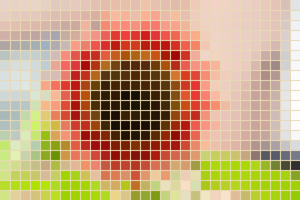 | 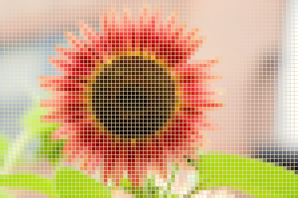 |
| Abstract Flower Mosaic (gjroth) | Detailed Flower Mosaic (gjroth) |

|   |   |
|:-:|:-:|
| 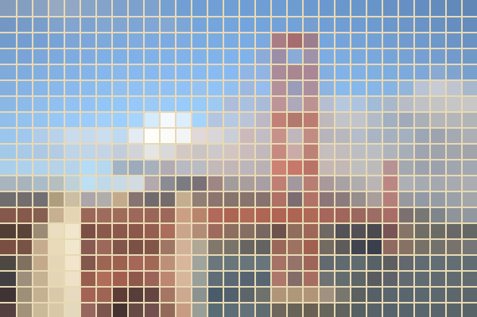 | 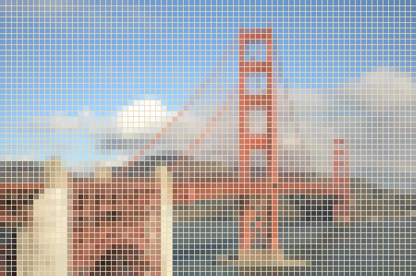 |
| Abstract Golden Gate Mosaic (gjroth) | Detailed Golden Gate Mosaic (gjroth) |

|   |   |   |
|:-:|:-:|:-:|
| 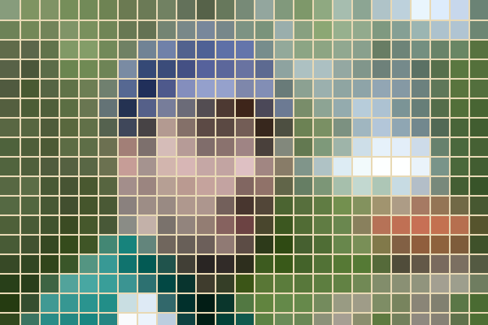 | 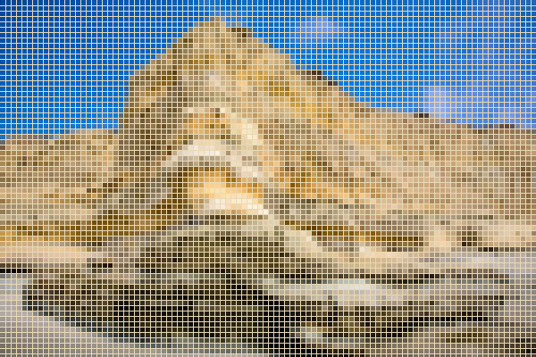 | 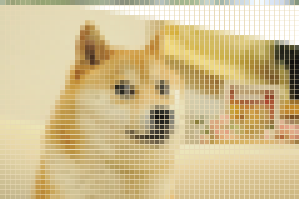 |
| A Tiled Man (gjroth) | A Mosaic of a Mesa (gjroth) | A Mosaic of a Doge (gjroth) |

<student gallery=0 place=2>David Todd (dtodd)</student>

First, I sampled a random number of pixels (inversely proportional to the user-input value). For each pixel in the image, I then found the closest randomly sampled point by color and set the pixel to this color --- in effect, quantizing the image. I then approximately traced contours by checking an appreciable difference between each pixel and one of its cardinal neighbors. This edge detection was crude but worked well since the image had been quantized.

|   |
|:-:|
| 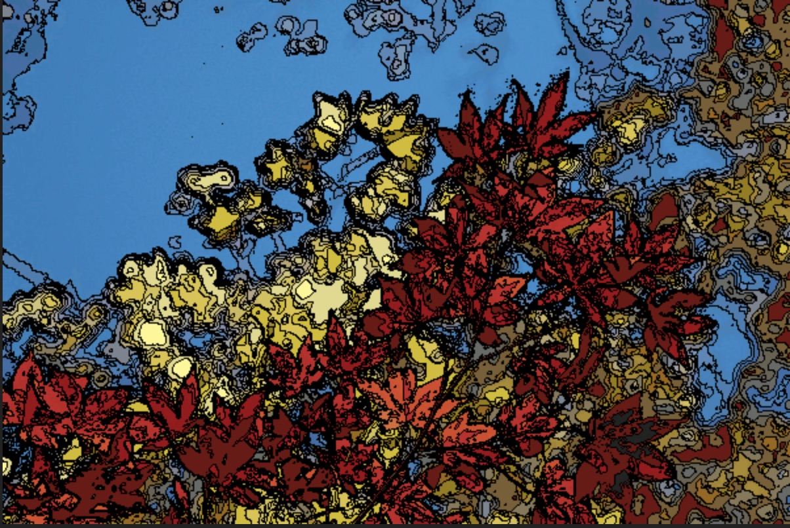 |
| Leaf Topologies (dtodd) |

|   |
|:-:|
| 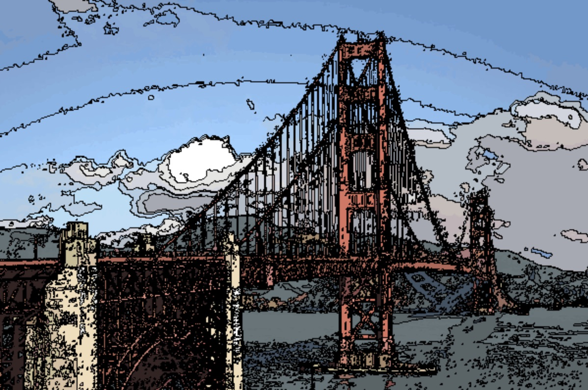 |
| A Golden Cartoon (dtodd) |

<student gallery=0 place=3>Audrey Cheng (accheng)</student>

I simulated intense light coming out of the windows of the town for my art project. First, I inverted the distance calculation of opacity for the soft brush to create the intense lighting effect. Then, I added light to the windows using the modified brush. Finally, I assembled several screenshots taken with different brush radii into an animated GIF.

|   |
|:-:|
| 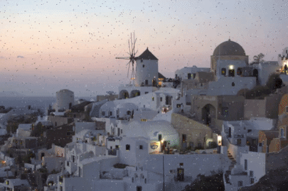 |
| Santorini Lights (accheng) |

<student gallery=0 place=3>Brandy Chen (brandyc)</student>

For the Art Contest, I drew a landscape of a mountain. I used the soft brush for big components like the sky and used the regular brush for the smaller details like the trees and mountain.

|   |
|:-:|
| 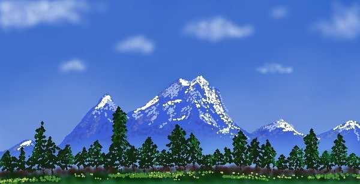 |
| the mountains are calling and i must go (brandyc) |

<student gallery=0 place=3>Yujin Yamahara (yamahara)</student>

My custom filter covers about a quarter of the image with circles of a randomly chosen color from the original image. My initial thoughts were that it would look as if an original image's painter had splattered the finished product with random colors from their color palette. The number and size of the color circles change proportionally with the input value, in order to remain consistent in covering 25% of the canvas. After adding alpha-blending, however, it now looks more like colored drops of water were sprinkled onto the camera lens.

|   |
|:-:|
| 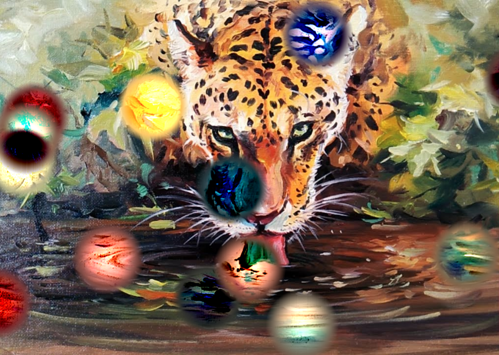 |
| The Cheetah Slurps (yamahara) |

|   |
|:-:|
| 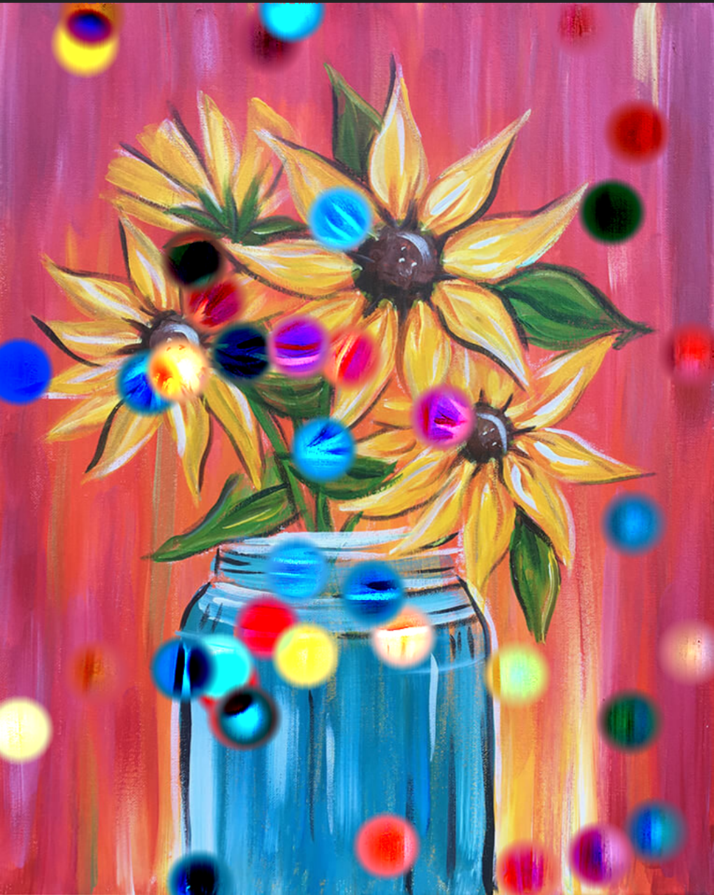 |
| The Fun Flowerpot (yamahara) |

<student gallery=0 place=4>Ofek Peres (operes)</student>

For the Art contest, I implemented the Gaussian Blur filter and the Edge Detection filter.

I randomly applied the two filters to every pixel in an image. The Edge Detection filter had a 90% chance of being picked and the Blur Effect had a 10% chance of being picked. This resulted in a very neat effect :)

The Gaussian blur kernel function had a radius of `3` pixels, a mean of `0` and a standard deviation of `100`. The Edge Detection filter subtracted all of the surrounding pixels from the center pixel, which had a weight of the area of the convolution matrix minus `1`. For the `3x3` case, the center pixel was assigned a weight of `8`, and the rest each had a weight of `-1`.

Both of my convolution functions are able to handle variable inputs for radius, but I hardcoded them because I did not have the sliders needed to adjust those parameters. If you slide the value parameter in the custom filter to the left, the image will have the blur effect applied. If the slider is in the middle, it will have the mixed blur/edge detection effect applied. If the slider is towards the right, only the edge detection filter will apply.

|   |   |   |   |
|:-:|:-:|:-:|:-:|
| 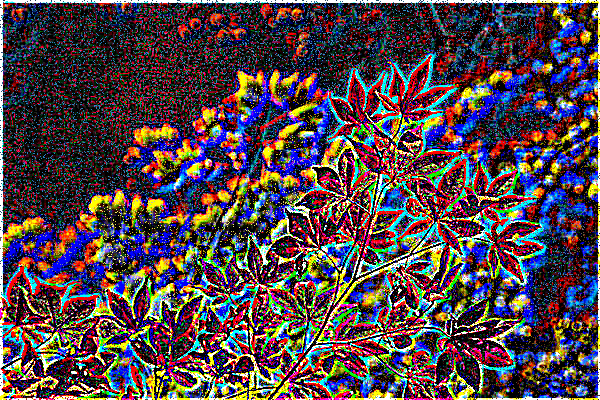 | 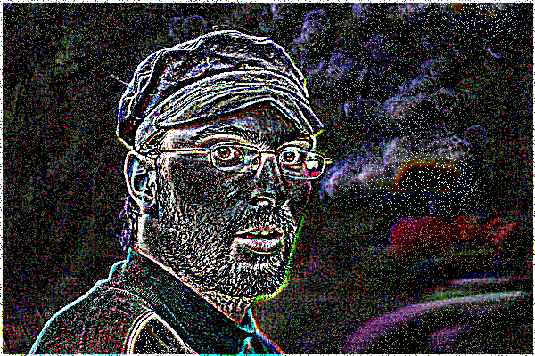 | 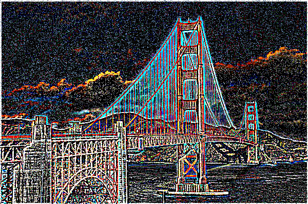 | 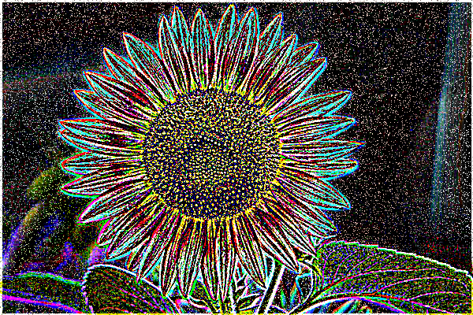 |
| Trippy Fall (operes) | The Edge of Man (operes) | The Rainbow Gate (operes) | A Yellow Sun (operes) |

<student gallery=0 place=4>Christine Kwon (cmkwon)</student>

My filter creates columns of green diamonds, which form an alternating horizontal gradation. The gradation was achieved by changing the alpha values from `0.25` to `1`, with increments of `0.25`. The green color was achieved by preserving the green channel of each pixel, while zeroing out the other two channels.

The overall effect resembles shards of green glass or crystal.

|   |   |
|:-:|:-:|
| 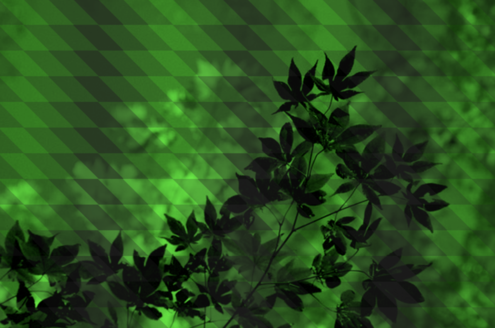 | 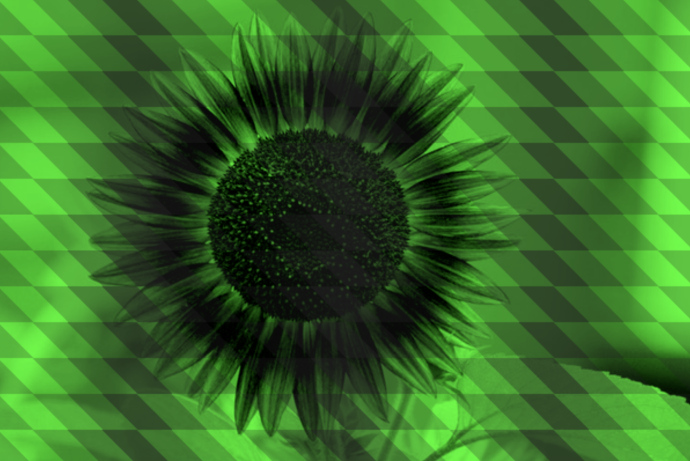 |
| Leaves in Oz (cmkwon) | The Emerald Sun (cmkwon) |

<student gallery=0 place=4>Lily Zhang (llzhang)</student>

|   |   |
|:-:|:-:|
| 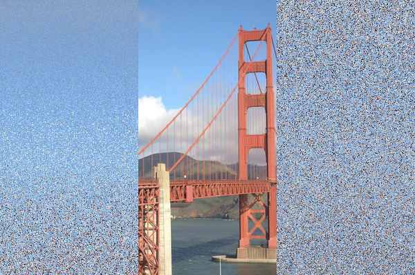 | 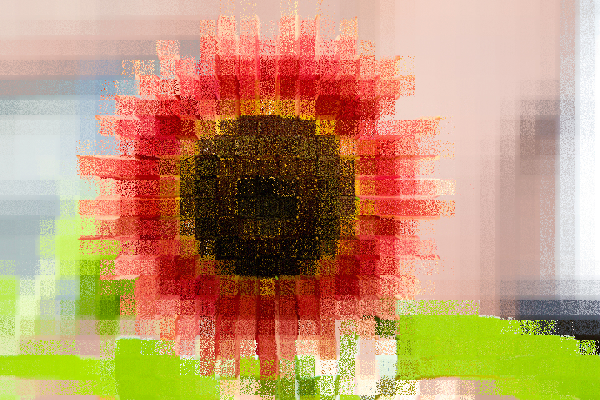 |
| Hazy Portrait Pic in SF (llzhang) | Sunflower Seeded (llzhang) |

<student gallery=0 place=4>Tyler Campbell (tylercc)</student>

My art contest filter makes the image look like a sketch. For each pixel, it calculates the sum of neighbor pixels times a scaling matrix, and then sets that sum (a color) to the value (also a color) of that pixel.

If the input parameter is less than `.5`, my filter will do image processing in color; otherwise, the image is processed in gray scale.

|   |   |
|:-:|:-:|
| 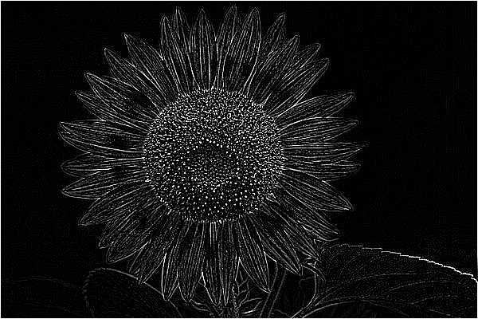 | 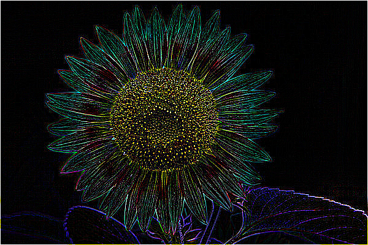 |
| Sunflower Sketch (tylercc) | Colorized Sunflower Sketch (tylercc) |

|   |   |
|:-:|:-:|
| 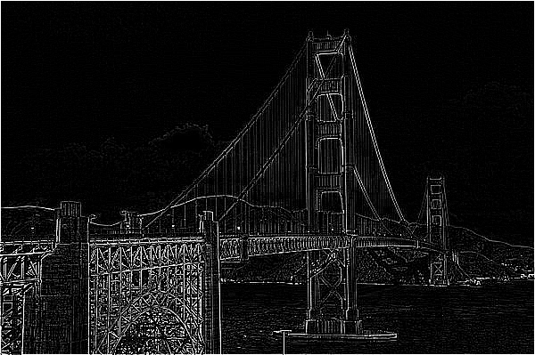 | 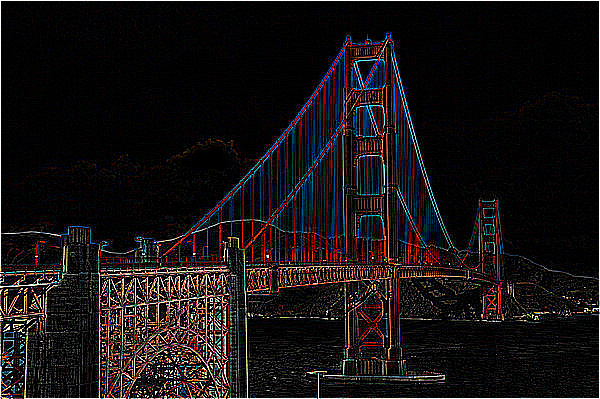 |
| Golden Gate Sketch (tylercc) | Colorized Golden Gate Sketch (tylercc) |

<student gallery=0 place=4>Zak Dasaro (zdasaro)</student>

For the art contest, I implemented a spiral feature. It rotates every concentric ring of pixels about the center of the image, such that the innermost ring rotates the most and each subsequent ring rotates less and less (proportional to $\frac{1}{r^2}$). The slider controls how far to spiral the image, with `0.5` indicating no spiraling, `0.0` indicating maximum counterclockwise spiraling, and `1.0` indicating maximum clockwise spiral. To create the Doge animation, I set the slider to values `[0, 0.05, 0.1, ..., 0.5]`.

|   |
|:-:|
| 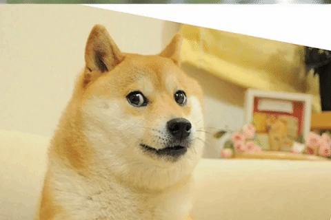 |
| Spiraling Doge (zdasaro) |

### Honorable Mentions (A0)

<student gallery=0>Dora Zhao (dorothyz)</student>

For the art contest, I made two images. The first uses the fill, brush, and soft brush filters to create the image of a warm mountain sunset. The second image takes the first image and inverts it using my custom filter. I inverted the image by taking each pixel and finding its inverted color through the following formula: white (R,G,B) - pixel color. I then set the pixel color to the newly calculated color.

|   |   |
|:-:|:-:|
| 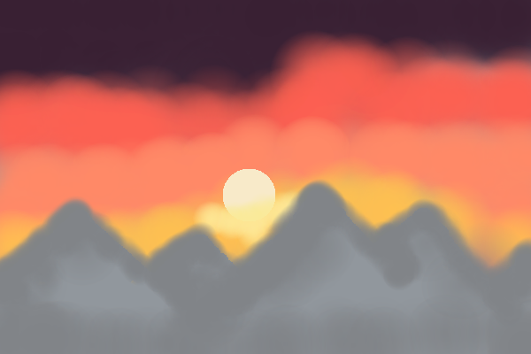 | 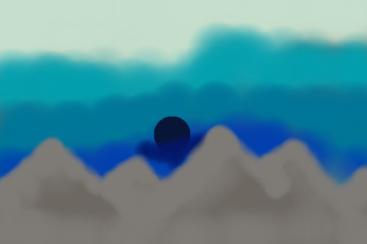 |
| Sunset Mountain (dorothyz) | Rise of the Ice Black Sun (dorothyz) |

<student gallery=0>Daniel Wey (dwey)</student>

My submission reflects an original image on a horizontal axis along the photo’s center. The sketch is meant to resemble a sky’s reflection on a creek.

|   |
|:-:|
| 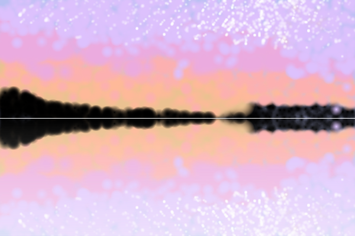 |
| Clouded Reflection (dwey) |

<student gallery=0>Henry Wang (htwang)</student>

For the art contest, I implemented a custom filter that rotates each pixel according to the given value and scales the distance from the center of the picture to the pixel by that same given value; a rotating spiral effect
was achieved.

By also applying a soft brush filter at the center of the image and slowly increasing the alpha value, images fade as they spiral inward. To assemble the animation, I captured the image at various intervals along its inward spiral and then used [EZGif](ezgif.com) to link the various frames together.

My animation uses 69 unique frames. Each frame after frame 26 was computed via [this batch link](batch.html?Push_Image=thisisfine.jpg&CustomFilter=value&Soft_Brush=100;[1,1,1,1];alpha;x200y194). The final
few frames were made through a simple application of the brush filter.

|   |   |   |
|:-:|:-:|:-:|
|   | 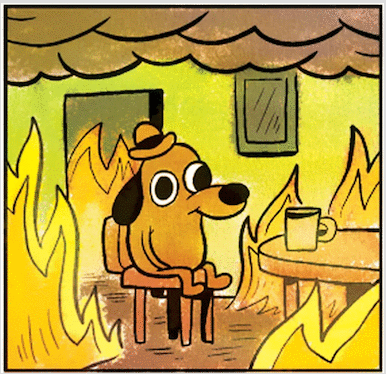 |   |
|   | Spiral Into Madness: Thesis 2020 (htwang) |   |

<student gallery=0>Jake Kirkham (jak4)</student>

For my art contest submission, I created a surreal, truly-golden Golden Gate Bridge. To do this, I first mirrored the image and flipped it on one side. I also added a vertical offset so that the cables in the middle would line up to create a crossing effect. I then changed all pixels to HSL format, set hue to gold (variable by value), and amplified saturation by 25% to make the gold pop. The feature is less "sensical" on other images, but can still be pretty.

|   |   |
|:-:|:-:|
| 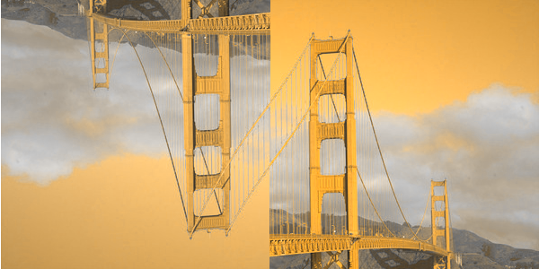 | 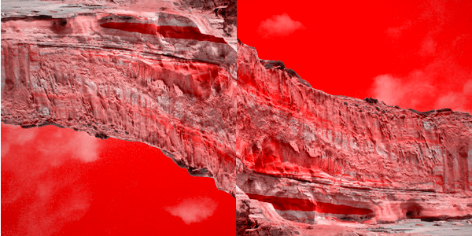 |
| True Gold (jak4) | The Wicked Twist (jak4) |

<student gallery=0>Jamie Guo (jamieguo)</student>

I recreated the *graphic design is my passion* meme, but adapted it for this class.

I also created a custom filter that pixellates the image, using an integer value `w` as the pixellation width. The pixellate filter loops through every pixel twice, first to calculate an average color of the pixels in each `w x w` block, and then to color each pixel in that block. The 'average' color is not the actual mean of the colors, but rather it is calculated by taking the midpoint between the current color and the next color, as the function iterates through the pixels. I added the `Pixel.prototype.average` function, which takes a pixel and returns a new pixel with the RGB values that are the midpoint of the original and the argument pixel. This filter was fun to play with; I used it to pixellate the background a bit.

|   |
|:-:|
| 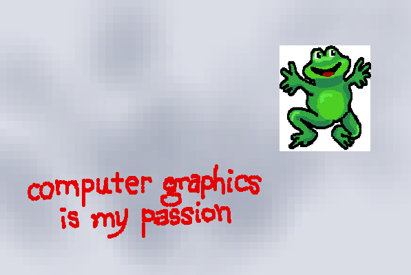 |
| computer graphics is my passion (jamieguo) |

<student gallery=0>Jingwen Guo (jingweng)</student>

For the art contest, I created a custom filter with adjustable brightness. I created a GIF using the Golden Gate bridge image by gradually turning down the brightness to simulate sunset. I used the soft brush filter to add lights to the image and to draw the moon.

|   |
|:-:|
| 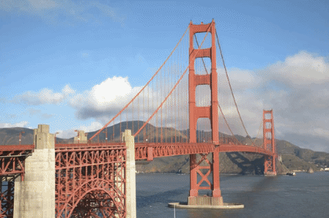 |
| Bay Area Lights (jingweng) |

<student gallery=0>Chi Qi (jinyuanq)</student>

My `customFilter()` is a blue mosaic filter. The input value determines the mosaic size --- the larger the input value, the greater the mosaic size.

I also added some random colored pixels to imitate signal noise on a TV, and I applied a blue filter based on the hundredths-digit of the input value. Finally, I used [GIPHY](https://giphy.com/) to assemble the filtered pictures into an animation that shows Santorini at dusk becoming more and more clear from mosaic patterns on an old TV.

|   |
|:-:|
| 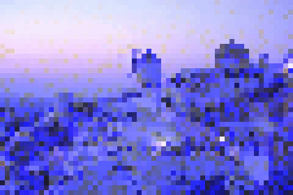 |
| Santorini TV (jinyuanq) |

<student gallery=0>Jason Kim (jjk7)</student>

In `customFilter()`, I switched the values of the blue and red channels for every pixel. I then set every pixel (except those on the border of the image) to the average of the the four pixels to the top, bottom, right, and left of the pixel. This creates a blurring effect.

Then I added clouds to both images below. The result is an attempt to create images that represent concepts for sci-fi planets. The first might represent a “terraformed” mars with a reddish atmosphere. It is an altered version of a picture from Yosemite National Park. The second image shows a picture from my neighborhood that I’ve changed to make it look like the sky of a planet that is orbiting a blue star.

|   |   |   |
|:-:|:-:|:-:|
|   | 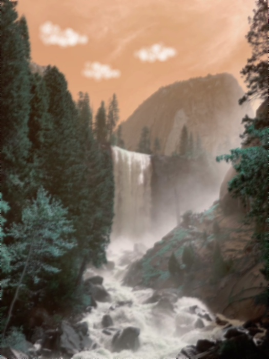 |   |
|   | Alien World (jjk7) |   |

|   |
|:-:|
| 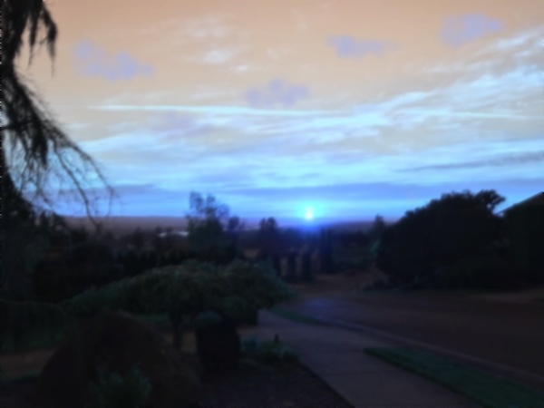 |
| Blue Star (jjk7) |

<student gallery=0>Joanna Kuo (jkuo)</student>

With the value variable set to zero, my custom filter turns a black background into alternating lines of red, green and blue. Then, splitting the screen into thirds, I set certain non-black pixels to R, G, or B depending on what colored line the pixel lands on (i.e. red and green in the top third of the picture). The height of each line is 3 pixels.

Known as [Munker–White's illusion](https://en.wikipedia.org/wiki/White%27s_illusion), this filter causes us to interpret the color for the circle incorrectly. In the image below, the circles appear to be yellow, blue, and purple from top to bottom; however, they are indeed all white. This illusion is caused by our eyes blending the color of the stripes and the color of the circle together. For example, in the bottom half, the circles appear purple because we see a mixture of white, red, and blue.

Using this illusion, I decided to color parts of black and white images with alternating blue and red stripes so they appear purple. To achieve this, I used the value variable (`0 < value <= 1`) to determine the threshold grayscale value at which any pixel with a RGB value below it will remain the same and any pixel above it will be set to red or blue, depending on its position. The result is an image that has its pixels with a higher grayscale value than the variable value to appear purple. The height of each line is one pixel.

|   |
|:-:|
| 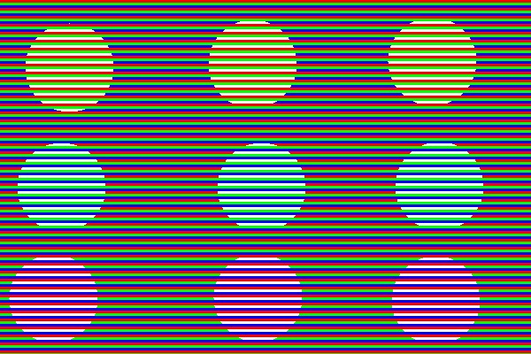 |
| Seeing Colors (jkuo) |

|   |
|:-:|
| 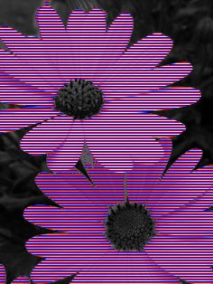 |
| Purple Lilies? (jkuo) |

<student gallery=0>Lauren Johnston (lej2)</student>

For the art contest, I recreated an old photo with burned edges. I achieved this "photo I found in the attic" effect in the custom filter by first translating RGB to HSL and reducing saturation to `s = 0`. I then set the hue to `0.6` and the luminance to twice the original luminance. Increasing the luminance made the image appear faded and overexposed.

I then translated HSL back to RGB and used alpha blending to combine sepia-tone pixels with every image pixel. To create the rough burned edge, I used the soft brush. Finally, for extra realism, I created a second soft brush layer with a low alpha value and traced over certain burned edges.

|   |   |
|:-:|:-:|
| 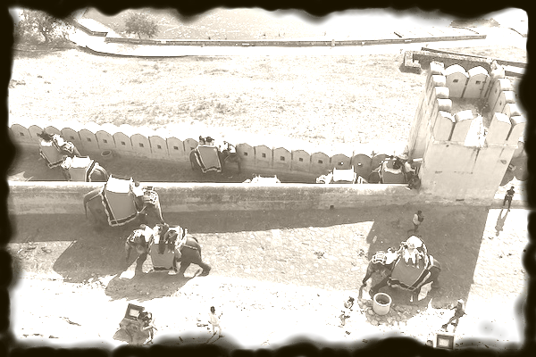 | 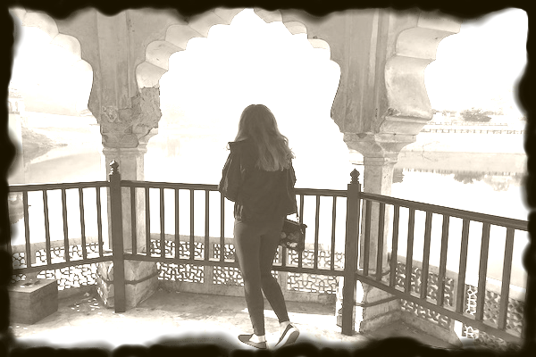 |
| Elephants (lej2) | Jaipur (lej2) |

<student gallery=0>Sharon Zhang (sharonz)</student>

My art project is a filter that simulates the effects of old, grainy film. Moving the value closer to `1` increases the strength of the effect. The filter is composed of three parts:
* Noise: I added monochromatic noise to the image by jittering each pixel a random amount in the `(r, g, b)` directions. The jitter on each channel was identical, resulting in monochromatic noise.
* Vignette: To create a vignette, I darkened the image (added black) to each pixel based on its distance from the center. I treated the image as an ellipse.
* Tint: I added a warm tint to the photo to create a sepia effect.

|   |   |   |
|:-:|:-:|:-:|
| 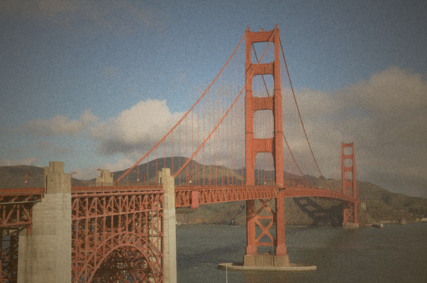 | 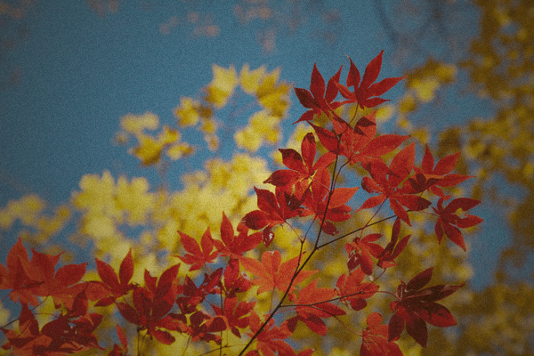 | 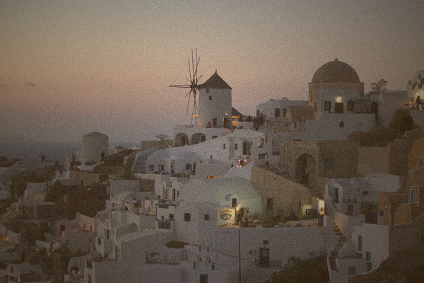 |
| Sepia San Fransisco (sharonz) | Fall Tones (sharonz) | Santorini Snapshot (sharonz) |

<student gallery=0>Thomas Martinson (tmm2)</student>

I decided to implement a median filter, as described in lecture. I did this by generating an image of horizontal medians for each pixel, and then using this image to find the vertical medians of each pixel. The median is defined by the medians of each RGB component in an N-pixel radius from the pixel.

|   |
|:-:|
| 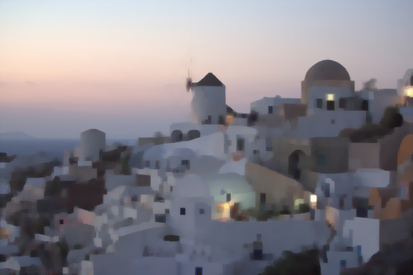 |
| A Smooth Sunset (tmm2) |

# Assignment 1 Gallery

### Winners (A1)

<student gallery=1 place=1>Yujin Yamahara (yamahara)</student>

I implemented my "Cursed Image Filter" by performing operations similar to those in the bilateral filter, but without normalizing the pixel weights. This creates a darkened, cursed image filter.

|   |   |   |
|:-:|:-:|:-:|
| 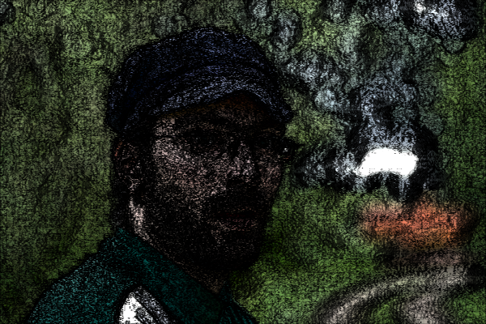 | 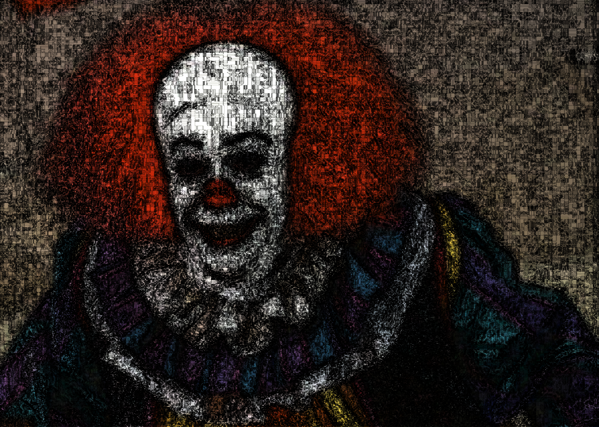 | 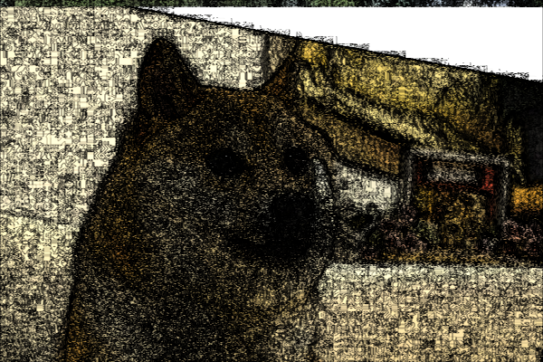 |
| Cursed Man (yamahara) | Cursed Clown (yamahara) | Cursed Doge (yamahara) |

|   |   |   |   |
|:-:|:-:|:-:|:-:|
|   | 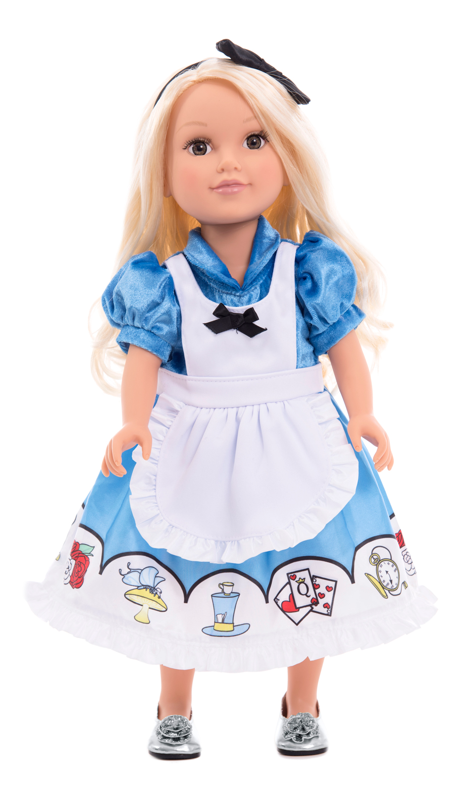 | 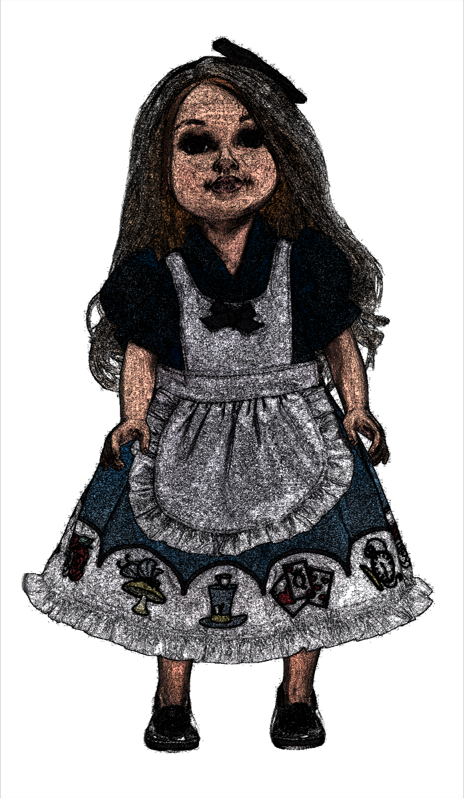 |    |
|    | Friendly Doll | Cursed Doll (yamahara) |   |

<student gallery=1 place=2>Joanna Kuo (jkuo)</student>

I'm full of so much gratitude right now. And I do not feel elevated above any of my fellow art contest winners or anyone in this gallery because we share the same love --- the love of computer graphics. And this form of expression has given me the most extraordinary education; I don't know what I'd be without it. But I think the greatest gift that it's given me, and many of us in this class, is the opportunity to use our graphics for the [memes](https://www.youtube.com/watch?v=qiiWdTz_MNc&t=2m5s).

This morph of Joaquin Phoenix into his iconic Joker character was generated using 35 custom correspondence lines. "Test"

|   |
|:-:|
|  |
| “When you bring me out, can you introduce me as Joker?” (jkuo) |

<student gallery=1 place=2>Johan Ospina (jospina)</student>

First, I created a morph for my significant other. Then I realized the POTUS, in his cheeto glory, closely resembles my morph's subject. She is truly an icon. [#BeefGirl2020](https://www.youtube.com/watch?v=5eZyspecXJE)

|   |   |   |
|:-:|:-:|:-:|
|   |  |   |
|   | I Smell Like a Beefy Cheeto (jospina) |   |

<student gallery=1 place=2>Jake Waksbaum (waksbaum)</student>

I made this using my painting filter!

|   |
|:-:|
|  |
| A Sponge Painted Flower (waksbaum) |

This was the result of a bug in my morph implementation, and I thought it looked cool:

|   |
|:-:|
|  |
| Trump Visits his Dentist from the 5th Dimension (waksbaum) |

<student gallery=1 place=3>Benjamin Huang (bdhuang)</student>

While I was debugging the bilateral filter, I found that my buggy implementation created a rather cool "painted" effect. Specifically, my implementation was over-weighting pixels (squared!) and not indexing over all the weights. Combining this with some changes in saturation and sharpening produced an effect that I would describe as a sort of "digital pointilism." In certain areas, the square window used in the bilateral filter becomes very evident due to the sharpening filter, creating an oddly impressionistic, yet distinctly digital image. I especially like how differently the filter treats natural aspects (lots of blurring, very pastoral and painterly) compared with its treatment of the bridge (bold, blocky and sharp).

|   |
|:-:|
|  |
| Digital Pointilism (bdhuang) |

<student gallery=1 place=3>Elizabeth Petrov (epetrov)</student>

While trying to implement the rotate filter, I ended up creating a kaleidoscope effect! Additionally, when programming the saturation filter, I introduced a bug that brings out the red and blue in an image. I saved these happy accidents to use in the art contest, and applied them both to the leaves image to create a cool looking kaleidoscope looking picture. Here are some iterations that I found really interesting:

|   |   |   |   |
|:-:|:-:|:-:|:-:|
|  |  |  |  |
| Kaleidoscope 1 (epetrov) | Kaleidoscope 2 (epetrov) | Kaleidoscope 3 (epetrov) | Kaleidoscope 4 (epetrov) |

Here I implemented swirl with the distance squared, leading to a really interesting effect that I applied onto the mesa and leaves images.

|   |   |
|:-:|:-:|
|  |  |
| Swirly Mesa (epetrov) | Swirly Leaves (epetrov) |

<student gallery=1 place=3>Yunzi Shi (yunzis)</student>

I really like the style of halftone prints and wanted to replicate the effect (not by actually
implementing CMYK, but by using the filters developed in this assignment). I created three monochrome channels (R,G,B) and applied adapted Floyd filter to each of them. Each channel is shifted a little horizontally or vertically so they do not align with each other. I then blended the three channels, assigning more weight to the green and blue channels so the results looked more like retro low-res screens.

|   |   |
|:-:|:-:|
|  |  |
| Halftone Santorini (yunzis) | Halftone Man (yunzis) |

|   |   |
|:-:|:-:|
|  |  |
| Halftone Woman (yunzis) | Halftone Golden Gate (yunzis) |

<student gallery=1 place=3>Zak Dasaro (zdasaro)</student>

For the art contest, I used the paint feature and the composite feature to combine an image with a painted version of itself. First, I took `goldengate.png` and applied the paint feature with the largest brush size. Then, I applied a gamma of `0.8` to make the strokes more vibrant. I next pushed the golden gate image again, after which I applied a custom alpha mask with medium opacity everywhere in the image. Finally, I used the composite filter to combine the original `goldengate.png` with the painted `goldengate.png`.

|   |
|:-:|
|  |
| Golden Gate Jazz (zdasaro) |

### Honorable Mentions (A1)

<student gallery=1>David Todd (dtodd)</student>

First, I found a palette using the k-means algorithm. Then I applied Floyd-Steinberg dithering across the three RGB channels and quantized the result to the palette colors. To make the dithering more effective, I fully saturated the palette beforehand and slightly increased the contrast to make the colors less visually similar. I found that 4-color palettes work pretty well for these images:

|   |   |
|:-:|:-:|
|  |  |
| Golden Gate Palette Dither (dtodd) | Palette Dithered Donald (dtodd) |

<student gallery=1>Gabriel Roth (gjroth)</student>

For the art contest, I created a "Tilt Shift Photography Filter". Tilt shift photography is a photography tool that makes an image look like a small object being seen close up by mimicking the human eye process of accommodation. Accommodation is when the eye changes its focus for objects at different depths. When the eye focuses on an object that is close up, the surrounding scene gets blurry. Our mind uses the blurriness that results from accommodation to estimate depth and scale of objects in the visual field. In tilt shift photography, the surroundings of the objects in focus are purposely blurred out to make the scene seem like a small object being looked at from up close.

I implemented the Tilt Shift Photography filter by creating a linearly increasing Gaussian blur starting at the edge of the focus area. The filter takes the horizontal and vertical locations of the center of focus, the size of the focus, and the max blur parameter as inputs. For each pixel, if it is outside of the focus area, I define the convolving window based on sigma (which is a linear function of pixel distance from the edge of the focus to the edge of the image), and convolve each pixel. This results in a clear original image within the desired focus window, and an increasing blur from the circular edge of the window to the edges of the image, which mimics accommodation.

|   |   |   |   |
|:-:|:-:|:-:|:-:|
|  |  |  |  |
| Tilt Shift Santorini (gjroth) | Tilt Shift Mesa (gjroth) | Tilt Shift Golden Gate (gjroth) | Tilt Shift Flower (gjroth) |

<student gallery=1>HJ Suh (hjsuh)</student>

I used a custom filter to first create two images that had the same dimensions. Then, I created JSON files with new morph target lines, which were used by the morph filter to create this GIF:

|   |
|:-:|
|  |
| Mad Bilbo (hjsuh) |

<student gallery=1>Lauren Johnston (lej2)</student>

I combined a custom filter (an edge filter without inversion) with a Gaussian blur to create a soft neon aesthetic.

|   |
|:-:|
|  |
| Neon Leaves (lej2) |

<student gallery=1>Michael Stambler (mas16)</student>

The selected work here represents the absolute best of my bugs ---
*insectes crème de la crème*. Often times, as I would code up these filters, I would have some slight issue somewhere, that didn't totally break things but would definitely make things look incorrect. A lot of the time, these buggy images were way off from the intended effect but still looked quite cool, so I saved them.

|   |   |
|:-:|:-:|
|  |  |
| Gold Leaf (mas16) | Seeing Green (mas16) |

|   |   |   |
|:-:|:-:|:-:|
|  |  |  |
| Rd Flwr (mas16) | ngry Hmn (mas16) | Ht Mntn (mas16) |

|   |   |   |
|:-:|:-:|:-:|
|  |  |  |
| Corruption (mas16) | Picasso, Is That You? (mas16) | Sauron (mas16) |

<student gallery=1>Robert Freeman (raf5)</student>

I noticed that the number of pictures of Trump was surprisingly low in the collection, so I have another to contribute. This was hand-crafted over the course of a couple weeks, perfectly combining the lush personality of the president with the soft intangibles of his eloquent speeches. Honestly, it speaks for itself.

|   |
|:-:|
|  |
| The Beauty of the Beast (raf5) |

<student gallery=1>Richard Wolf (rwolf)</student>

To implement my art function, I created a variant of swirl. For every pixel in the original image, I calculated the polar coordinates (in radians) relative to the center of the image. Then I transform each pixel by adding `radians * 100 * distance`, where `distance` is the distance of the current pixel from the center of the image.

After this, I then convert my polar coordinates back to cartesian coordinates and check if `(oldX, oldY)` is a valid pixel in the original image. If so, I set the pixel at `(j, i)` in the new image equal to the gaussian sampling of `(oldX, oldY)`. Doing this results in an awesome, hyper-swirled image.

|   |   |
|:-:|:-:|
|  |  |
| Colorful Hyperswirl (rwolf) | Atomic Energy (rwolf) |

# Assignment 2 Gallery

### Winners (A2)

<student gallery=2 place=1>Benjamin Huang (bdhuang)</student>

For this art, I modified extrude slightly to achieve a "spiraling" effect. Afterwards, I processed with loop subdivision and various other filters to produce some interesting volumes!

|   |   |   |
|:-:|:-:|:-:|
|  |  |  |
| Pigtails (bdhuang) | Twisted (bdhuang) | Dancer (bdhuang) |

<student gallery=2 place=1>Elizabeth Petrov (epetrov)</student>

I called catmull-clark and extrude multiple times to produce a cool fractal effect! Reminds me of a 3D snowflake.

|   |
|:-:|
|  |
| Colored Snowflake (epetrov) |

<student gallery=2 place=1>Jason Kim (jjk7)</student>

My Wacky  essentially swirls the mesh around all three axes. I realized that when this effect is applied to the octopus mesh, it makes the octopus look like it is floating in water and moving its tentacles. I decided to color the octopus using my curvature filter in addition to my loop subdivision filter to give the octopus a more natural appearance. Then, I varied the factor on my wacky filter from `0` to `0.15` to create an animation of the octopus moving.

|   |
|:-:|
|  |
| Inky the Octopus (jjk7) |

<student gallery=2 place=1>Yunzi Shi (yunzis)</student>

For my first submission, I applied noise and an adapted version of extrude to a sphere so the growth from the original surface is more random and organic. I changed the lightness of the vertices according to their distance from the original mesh surface. The result shows some kind of pulse, and a metaphor of the cycles of growth and decay.

|   |
|:-:|
|  |
| Life Cycles (yunzis) |

<student gallery=2 place=2>Daniel Wey (dwey)</student>

I created this artwork through a series of extrusions on randomly selected faces.

|   |
|:-:|
|  |
| Overwhelming Thoughts (dwey) |

<student gallery=2 place=2>Gabriel Roth (gjroth)</student>

Behold my "Spiky Filter", which adds a new vertex on the centroid of every face (similar to quad subdivision) and translates it by a certain factor in the direction of the face's normal vector. The larger the factor, the more spiky the effect!

|   |   |   |
|:-:|:-:|:-:|
|  |  |  |
| Don't Step on Me (gjroth) | Spiky Ball (gjroth) | Pins and Needles (gjroth) |

|   |   |   |
|:-:|:-:|:-:|
|  |  |  |
| Fuzzy Pony (gjroth) | New Course Logo (gjroth) | Medieval Cheetah (gjroth) |

<student gallery=2 place=2>Julian Knodt (jknodt)</student>

Just random bugs and nice looking images :)

|   |   |   |   |
|:-:|:-:|:-:|:-:|
|  |  |  |  |
| Black Panther (jknodt) | UFO (jknodt) | Folding Ball (jknodt) | Regular Crystals (jknodt) |

<student gallery=2 place=3>David Todd (dtodd)</student>

To make these works, I first iteratively truncated all convex vertices. To make things a bit more interesting, I also introduced new vertices between truncations by finding the centroid of each face, connecting each vertex in the face to the centroid, then moving the centroid in the direction of the face normal. This led to a spiky appearance and allowed for more truncations. Finally, I colored the vertices such that the hue and saturation were proportional to the average area of adjacent faces.

|   |   |   |
|:-:|:-:|:-:|
|  |  |  |
| Fusion Ball (dtodd) | Radioactive Ball (dtodd) | Toxic Ball (dtodd) |

<student gallery=2 place=3>Henry Wang (htwang)</student>

Chester the Cheetah decided to try those "rainbow" colored Cheetos. Only, they weren't actually Cheetos. Now he's become the table that he was just eating those "Cheetos" on.

|   |   |   |
|:-:|:-:|:-:|
|  |  |  |
| Chester the Table (htwang) | Chester Takes the L on A2 (htwang) | Chester the Mad Hatter (htwang) |

Additionally, here's a disco ball and a disco ball that's done the twist:

|   |   |
|:-:|:-:|
|  |  |
| Disco Ball (htwang) | Disco Party (htwang) |

<student gallery=2 place=3>Heidi Kim (hyunsunk)</student>

While creating my quad topology filter, I tried toying around with the displacement vector for the center point, which gave me interesting results. My first image shows how I imagine corona on a cellular scale. The other two are the results of applying my filter to `cube.png` and `octopus.png`.

|   |   |   |
|:-:|:-:|:-:|
|  |  |  |
| Corona (hyunsunk) | A Bigger Box (hyunsunk) | The Firebird (hyunsunk) |

<student gallery=2 place=3>Jake Kirkham (jak4)</student>

I aimed to create a desktop wallpaper. I did this by extruding the biresolution sphere, finding a nice location, zooming deep inside, and taking a screenshot. Finally, I passed my image through greyscale and contrast filters in post production. Ideally, I would continue to color edit my artwork in order to make the gray closer to white and make the black pop, but I am busy trying to not get quarantined or die. Hope you are also doing well, reader!

|   |
|:-:|
|  |
| The Cage (jak4) |

<student gallery=2 place=3>Jamie Guo (jamieguo)</student>

Here's an animation of my wacky filter on the biresolution sphere, ranging from `factor = 1` to ` factor = EPS` (almost zero)! I like how it looks squishy in the beginning!

|   |
|:-:|
|  |
| Orbitals (jamieguo) |

<student gallery=2 place=3>Joanna Kuo (jkuo)</student>

All the submissions below are cool looking bugs that I encountered while implementing certain filters!

|   |
|:-:|
|  |
| Teapotception (jkuo) |

|   |   |   |
|:-:|:-:|:-:|
|  |  |  |
| Butterflies (jkuo) | Porcelain Teapot (jkuo) | Ergonomic Cheetah (jkuo) |

|   |   |
|:-:|:-:|
|  |  |
| Oragami (jkuo) | Striped Ball (jkuo) |

### Honorable Mentions (A2)

<student gallery=2>Christine Lu (cyclu)</student>

To create my submission for the art contest, I first applied vertex colors and the wacky filter with amount `0.8` to the cheetah. Then, I inflated the cheetah with a factor of `0.65` and finally applied curvature-flow smoothing with `300` iterations and `delta = 0.01`.

|   |   |
|:-:|:-:|
|  |  |
| Off Balance (cyclu) | Cheetah Skipped Leg Day (cyclu) |

<student gallery=2>Donovan Coronado (dtc2)</student>

When I was trying to implement wacky, I messed something up and just ended up flattening the object much. In retrospect, it was a happy accident because I think the result is pretty cool!

|   |   |
|:-:|:-:|
|  |  |
| Flat Horsey 1 (dtc2) | Flat Horsey 2 (dtc2) |

<student gallery=2>Jonah Lytle (jlytle)</student>

My first artwork is a play on the triangle topology function. I changed up the way the triangles were split into smaller triangles and thought it resulted in a cool flower-esque image when the half-edges are shown. My next artwork came from playing around with the smooth functions. Finally, when implementing the scale-dependent smoothing, I made a mistake with the scaling and the cheetah turned into a pup-looking version of itself!

|   |   |   |
|:-:|:-:|:-:|
|  |  |  |
| Halfedge Flower (jlytle) | Rainbow Scrunchie (jlytle) | Cheetah Cub (jlytle) |

<student gallery=2>Lydia You (lgyou)</student>

|   |   |
|:-:|:-:|
|  |  |
| Curvature (lgyou) | Shrink Wrap (lgyou) |

|   |
|:-:|
|  |
| The Kraken (lgyou) |

<student gallery=2>Nicholas Liu (nl3)</student>

A serpentine Chinese dragon rises into the air! I created this artwork by first slightly smoothing a cheetah, applying some reverse inflation to make it thin and sleek, and finally a sin-based wacky filter to transform it into a dragon. Displaying half-edges creates the scales.

|   |
|:-:|
|  |
| A Dragon Rises (nl3) |

<student gallery=2>Sophie Kader (skader)</student>

For my art contest I decided to mimic the flowy-hair days of Justin Bieber. I accomplished this by conducting a loop subdivision three times on a cube, then extruding these new faces, truncating them, and finally twisting them.

|   |
|:-:|
|  |
| Justin's Hair (skader) |

<student gallery=2>Taylor Beckett (tbeckett)</student>

My art contest uses a filter similar to twist, except instead of just multiplying the `y` value of the vertex by the given factor, I multiplied the `x`, `y`, and `z` values by the given factor. This introduced some weird and interesting "twisted-plus" looks, and then of course I wanted to add some color.

|   |   |
|:-:|:-:|
|  |  |
| Twisted Plus (tbeckett) | Decorated Twisted Plus (tbeckett) |

<student gallery=2>William Li (wl14)</student>

To create this artwork, I took the default cube, truncated it, and extruded the faces created during the truncation step. For polish, I added a little bit of noise and enable vertex colors.

|   |
|:-:|
|  |
| Groovy (wl14) |

# Assignment 3 Gallery

### Winners (A3)

<student gallery=3 place=1>Alice Xue (axue)</student>

For my submission, I recreated the Great Hall from Harry Potter but made it infinitely long! To imitate the floating candlesticks, I generated 30 box objects with 30 lights, each at the top of the box to simulate a flame. To expedite the process, I wrote a Python script to randomly generate box objects with random `(x, y, z)` coordinates, as well as their corresponding light objects.

|   |
|:-:|
|  |
| The Great Hall (axue) |

<student gallery=3 place=2>David Todd (dtodd)</student>

Let's face it: the checkerboard floor is pretty boring. But what if it weren't so square? What if it had colors? To resolve these pressing conundrums, I converted the `(x, y, z)` coordinates to spherical, applied a transformation, and then converted back before rounding coordinates. I also used a random function to select a hue based on these coordinates, and adapted Assignment 1 code to convert to RGB space (using saturation `1` and lightness `0.5`). To animate the transformation, I made theta in the spherical coordinates a function of the frame. For the scene, I created a Cornell box with reflective front and back faces and added two reflective spheres.

|   |
|:-:|
|  |
| The Trip (dtodd) |

<student gallery=3 place=3>Jake Kirkham (jak4)</student>

In light of the ongoing pandemic, I decided to make a fitting special material: soap bubbles! While real (i.e. physically motivated) iridescent bubbles are very hard, I was able to come up with a nice looking alternative using HSV color wheels with sinusoidal inputs based on the angle of a point's normal vector.

While there's not a lot you can do to fight the virus (that we know of, right now), by washing your hands and staying home you can help keep yourself and your loved ones safe. With my art submission I hope to spread the word by spelling it out with bubbles: WASH YOUR HANDS!

|   |   |
|:-:|:-:|
|  | |
| Soap Bubble (jak4) | Stop the Spread (jak4) |

<student gallery=3 place=3>Jingwen Guo (jingweng)</student>

I reorganized the primitive components of the default scene into something spooky that seems like it belongs in a cursed carnival house! Intruders beware!

|   |
|:-:|
|  |
| A Dark Place (jingweng) |

<student gallery=3 place=3>Joanna Kuo (jkuo)</student>

Two words: Social Distancing!!!

|   |
|:-:|
|  |
| Too Little, Too Late (jkuo) |

<student gallery=3 place=4>Anabelle Chang (anabelle)</student>

My art project is a tribute to Kobe Bryant. Adorned with a purple ceiling and a yellow floor, the room contains two balls shaping an 8 (his original Lakers number) moving from the back of the room to the front, mimicking a basketball bouncing up and down.

|   |
|:-:|
|  |
| Too Little, Too Late (anabelle) |

<student gallery=3 place=4>Elizabeth Petrov (epetrov)</student>

For my art project, I have two submissions. In the first, I used my custom scene to create an animation similar to Turner Whitted's famous sphere animation in 1980; I also added in some colors to the material properties for an interesting effect.

When playing around with special material, I created a granite-like effect that has cotton candy colors, as can be seen in my second submission. I achieved this by multiplying the color I get from fractional brownian motion with the inverse of the current color. Finally, I applied this effect to multiple objects in the default scene.

|   |
|:-:|
|  |
| Whitted's Spheres, Revisited (epetrov) |

|   |
|:-:|
|  |
| Cotton Candy Culture (epetrov) |

<student gallery=3 place=4>Sharon Zhang (sharonz)</student>

First, I played around with the custom scene I made and tried to give it some more energy. Then, I edited it using the custom filter I made in Assignment 0 along with some of the filters we implemented in Assignment 1, and finally made a stereographic GIF from shots taken from multiple camera angles. As a finishing touch, I also played around with the picture a little in Photoshop.

|   |   |
|:-:|:-:|
|  | |
| RealD 3D (sharonz) | Your Next Album Cover (sharonz) |

<student gallery=3 place=4>Zak Dasaro (zdasaro)</student>

This submission combines my custom scene with my bouncing sphere animation. I arranged the spheres in a circle and added a timing mechanism so that the bounces had a delay that was evenly spaced around the circle. The scene consists of a few reflective walls at different angles, producing an interesting staircase-like reflection pattern.

|   |
|:-:|
|  |
| Bounce Lighting (zdasaro) |

<student gallery=3 place=5>Hollis Ma (hollism)</student>

I originally wanted to simulate an ocean with balls of light floating around and wrote a script to generate thousands of light, but the number of lights is capped at 10, so I went with a different approach to generate the lights. I used mirrors to reflect the lights down a tunnel, creating the illusion of thousands of lights. The ocean texture is done by a few iterations of procedural generation. This gif was made by varying the intensities of the different lights to create the illusion that the lights are coming towards you.

|   |
|:-:|
|  |
| Hold Your Breath (hollism) |

<student gallery=3 place=5>Heidi Kim (hyunsunk)</student>

I wanted *Stockpile* to capture this weird time we're all living in, through a sight I'm sure a lot of us see day to day: a pantry, stocked to varying degrees. Spending so much time in the house, I've become a lot more aware of the groceries, cleaning supplies, etc. that take on more importance during a time of quarantine, when we can't access them the way we normally can.

From left to right, my scene includes what's on one of my kitchen shelves right now: Campbell's soup, some cereal boxes, Clorox wipes with paper towels behind them, and a box of pasta.

|   |
|:-:|
|  |
| Stockpile (hyunsunk) |

<student gallery=3 place=5>Jamie Guo (jamieguo)</student>

Bears on bears on bears. I used spheres, cones, and cylinders to make a big ol' bear face! And then I stuck it in an infinity room because I think it looks funnier and more intimidating that way.

|   |   |
|:-:|:-:|
|  | |
| Bears on Bears on Bears 1 (jamieguo) | Bears on Bears on Bears 2 (jamieguo) |

<student gallery=3 place=5>Emre Cakir (mecakir)</student>

I created the Minecraft chicken using a custom scene. Do you think it'll lay an egg if I leave it rendering for long enough?

|   |
|:-:|
|  |
| Chicken (mecakir) |

<student gallery=3 place=5>Yunzi Shi (yunzis)</student>

I was interested in simulating a scene of a cyberpunk cityscape with dark skyscrapers, neon-colored lights, and glass rail transportation in between the buildings. I made two different versions and controlled the color atmosphere by adjusting the color of the matte boxes, glass boxes, and lights.

|   |   |
|:-:|:-:|
|  | |
| Cyberpunk 1977 1 (yunzis) | Cyberpunk 1977 2 (yunzis) |

### Honorable Mentions (A3)

<student gallery=3>Anna Qin (alqin)</student>

These are different views and lighting of the scene in `scenes/creative.json`. The cone and spheres are all made of glass, modeling water droplets sliding off a stalactite or an icicle. The infinite mirroring helps makes the scene more surreal and visually interesting.

|   |   |   |
|:-:|:-:|:-:|
|  | | |
| The Cave in Grey (alqin) | The Cave in Blue (alqin) | A Wet Ceiling (alqin) |

<student gallery=3>Abigail Rettew (arettew)</student>

For my art contest submission, I am entering my custom scene. I used one straight plane as the "back" and added in two slanted planes (to create a sort of triangular shape). I also used my special material because I liked how it looked on the planes and added a bunch of mirror reflective spheres.

|   |
|:-:|
|  |
| An Aesthetic (arettew) |

<student gallery=3>Arman Medghalchi (armanm)</student>

My art contest submission is my attempt to create a time-lapse of my mental state during the month of March as the world fell apart.

|   |
|:-:|
|  |
| March Sadness (armanm) |

<student gallery=3>Brandy Chen (brandyc)</student>

For the art contest, I animated my custom scene. In the custom scene, I decided to make Patrick Star from *Spongebob* and his "house." To make Patrick, I primarily used cones and cylinders. For his house and his eyes, I used spheres. Patrick and his house are situated inside a box with a tan ground and blue walls to simulate being under water. For the animation, I made Patricks move towards the camera and move his arms up and down. I did this by gradually incrementing the position of Patrick, and then taking a screen shot at each increment.

|   |
|:-:|
|  |
| Who Lives beneath a Rock under the Sea? (brandyc) |

<student gallery=3>Christine Lu (cyclu)</student>

For my art submission, I am submitting the gif I created in the animation section. This is an animation of the sphere in my custom scene rolling off the tip of the tetrahedron, bouncing on the block below, and rolling down the "steps" formed by the blocks. As the sphere reaches the bottom, the tetrahedron moves up and down and then the whole scene rotates.

|   |
|:-:|
|  |
| The Playground (cyclu) |

<student gallery=3>Dora Zhao (dorothyz)</student>

For my art project, I am turning in my custom scene. I was inspired by Japanese artist Yayoi Kusama and her social media famous infinity rooms. To recreate the scene, I made all of the walls on the plane mirrors. Then, I created floating cylinders that were replicated in the room. Finally, I added a yellow color light source to give the glowing aesthetic to the room and the cylinders.

|   |   |
|:-:|:-:|
|  | |
| Infinity Room 1 (dorothyz) | Infinity Room 2 (dorothyz) |

<student gallery=3>Gabriel Roth (gjroth)</student>

For the Art Contest I am submitting the Custom Scene that I made with my `custom.json` --- it's a chess board! I scaled my checkerboard pattern and moved the walls of the room to obtain an 8 x 8 chess board. I then designed modern looking pieces consisting of the primitive shapes we used in this assignment. The castle is a box, the knight is a cone with a sphere as its head, the bishop is a tall cone, the king is a tall box, the queen is a tall cylinder, and the pawns are short cylinders. I positioned the pieces in their starting positions for the game. Naturally, the white pieces are correctly positioned on one side of the board, and the black pieces are positioned on the opposite side of the board.

|   |   |   |
|:-:|:-:|:-:|
|  | | |
| Chess 1 (gjroth) | Chess 2 (gjroth) | Chess 3 (gjroth) |

<student gallery=3>Greg Umali (gumali)</student>

I have always wanted to know what it would be like to be in a room where all the walls are mirrors, so thank you to this project for letting me experience that. To accomplish this, I just put a mirror ball over a pyramid to create a cool symbolic central totem, and then changed the color and intensity of the lights that created an infinite disco (or the most dead surrealist club venue I have ever seen).

|   |
|:-:|
|  |
| Dimensional Disco (gumali) |

<student gallery=3>Henry Wang (htwang)</student>

Why render simple shapes when you can render the birth of the universe instead?

|   |
|:-:|
|  |
| Big Bang (htwang) |

<student gallery=3>Jason Kim (jjk7)</student>

My submission is a combination of my animation and custom scene. Each of my three scenes essentially have two spheres (one glass and one mirror) orbiting around a center point. Each of my three scenes includes a different background to give a cool effect as the spheres move around. One scene has mirror walls and a plain top and bottom. This gives a nice infinite mirror effect as the spheres move around. The second scene just includes mirrors for the walls and the top and bottom. This makes the scene give the effect of an infinite reflection of lights with the spheres reflecting these infinite lights. The final scene uses my custom "starfield" texture

|   |
|:-:|
|  |
| Two Visible (jjk7) |

|   |   |
|:-:|:-:|
|  |
| Two Dark (jjk7) | Two Star (jjk7) |

<student gallery=3>Jonah Lytle (jlytle)</student>

For my custom scene, I played around with the materials and orientation of the cube and tetrahedron objects. By using a reflective material for both the objects and using my special material as the floor I created a scene which appears vast and futuristic.

|   |
|:-:|
|  |
| Circuit City (jlytle) |

<student gallery=3>Michael Fletcher (maf6)</student>

I created the "Newton's Cradle", by doing a bit of physics to find the path of the balls (i.e. approximate location at each time step). I thought the changing reflection in the balls would be cool too.

|   |
|:-:|
|  |
| Fletcher's Cradle (maf6) |

# Assignment 5 Gallery

### Winners (A5)

<student gallery=5 place=1>Christy Lee (christyl)</student>

For the art contest, I experimented with several "colorful" scenes. I think this one turned out best!

|   |
|:-:|
|  |
| Colors in the Wind (christyl) |

<student gallery=5 place=2>Anna Qin (alqin)</student>

I am submitting two series of art for this assignment's contest. The first one, *Fine*, uses textures to recreate the "This is Fine" meme with the cartoon dog surrounded by fire. It is a reflection of the current mood.

|   |
|:-:|
|  |
| Fine (alqin) |

For the second series of photos, *Lace*, I use a transparent and white image of a mandala pattern to create a pretty lace cloth that we drape over a box-table and a sphere. I think it turned out really well!

|   |   |   |
|:-:|:-:|:-:|
|  | | |
| Lace 1 (alqin) | Lace 2 (alqin) | Lace 3 (alqin) |

<student gallery=5 place=2>Jake Kirkham (jak4)</student>

It is clear that a ton of work has gone into making Assignment 5 interesting, fun, and educational --- from quality of life to documentation, A5 is on a level above the others. As such, I think A5 deserves to be the face of the course; so, I made a logo!

For my custom extension, I implemented tearable cloth by selectively enforcing constraints and hiding cut-away particles. The effect, though "hacky", ends up looking pretty neat in real-time with other forces. By binding tear to my mouse cursor plus a key press, I realized it also let me "draw" on the cloth by tearing away particles to reveal the background beneath. By adjusting the ground color and turning off gravity (so that my lettering did not simply fall down), I was able to make a fun set of letters in RGB complementary colors. I then used photoshop to cut the different letters together into a full COS 426 logo.

As part of my art submission, I've included a few shots of tearing with forces added, as the feature itself is also pretty neat looking on its own.

|   |
|:-:|
|  |
| The Face of the Course (jak4) |

|   |   |
|:-:|:-:|
|  | |
| RIP 1 (jak4) | RIP 2 (jak4) |

<student gallery=5 place=2>Jason Kim (jjk7)</student>

I combined the effects of my custom force, custom scene, and custom textures/materials to create the effect of a bobbing ocean and the sun setting over it. The custom force randomly perturbs particles up and down to create a wave bobbing effect. The custom scene makes the cloth larger and lower to the ground and moves the sphere into a position where it looks like a sun on the horizon. The custom textures make the cloth look like water and add a bump map to the cloth to give it more depth.

If you enable the effects from my custom scene and custom textures/materials, you should be able to re-create the art contest submission with [this link](http://localhost:8000/index.html?fabricLength=1000&gravity=false&customForce=true&customFStrength=9.9&customFRate=7&object=Sphere&wireframe=false&clothColor=7030941&clothSpecular=15744831&groundColor=5917346&fogColor=16764108&showClothTexture=true&clothTexture=water.png).

|   |
|:-:|
|  |
| Beyond the Horizon (jjk7) |

<student gallery=5 place=2>uris (uris)</student>

For my art contest, I realized that I got a very cool looking cloth texture when I only had bending constraints on. This maintained the squares formed by the diagonal constraints, but nothing else. I dropped this cloth onto the box shape, and adjusted some of the color settings, which yielded the following artistic result.

|   |
|:-:|
|  |
| Bending Tiles (uris) |

<student gallery=5 place=3>Jingwen Guo (jingweng)</student>

For my art contest submission, I used my custom cloth and ground textures to create a ghost hovering over a graveyard background. To create the ghost, I decreased the size of the default sphere and changed its movement to be a periodic up-and-down motion. While the cloth is pinned in the four-corner configuration, I hid the poles by decreasing their height to `0`. I experimented with different ways to drape the cloth over the moving sphere, but I realized that removing all pins resulted in the cloth quickly sliding off the sphere, no matter the size of the cloth or movement of the sphere. To complete the scene, I added the ground texture and darkened the ground and fog colors.

|   |
|:-:|
|  |
| Trick or Treat (jingweng) |

<student gallery=5 place=3>Sharon Zhang (sharonz)</student>

I hope you are all doing well in these trying/difficult/tough/hard/challenging times. (I really do though!)
Stay safe, stay sane, and stay home!

|   |
|:-:|
|  |
| Stay Home (sharonz) |

<student gallery=5 place=4>Sean-Wynn Ng (seanwynn)</student>

I don't know what this is, but I beleive I've created a monster. Is this how Dr. Frankenstein felt?

|   |
|:-:|
|  |
| Monster Girl (seanwynn) |

<student gallery=5 place=4>Taylor Beckett (tbeckett)</student>

The cloth in wind reminded me of a pirate flag, I decided to make one! I added the pirate flag texture to the cloth and water texture to the ground using two images off the internet. Next, I removed all but one of the poles. I added a function in `particle.js` called "lockToBottom" that would pin a particle to the middle of the remaining pole. Next, I modified `sim.js` so that when `fourCorners()` is called for pinning, I would lock the bottom left corner of the cloth to the pole, left the top let corner pinned at the top, and let the other two corners fly free. Then I added rain and wind force to the scene to let the flag fly! Below is a screenshot of the scene.

|   |
|:-:|
|  |
| The Jolly Roger (tbeckett) |

<student gallery=5 place=5>Christine Kwon (cmkwon)</student>

For my submission, I used a custom texture I created in Adobe Illustrator, which consists of a transparent background scattered with circles of varying opacities. I draped this over a sphere to display its reflective properties.

|   |
|:-:|
|  |
| Bouncing Bubbles (cmkwon) |

<student gallery=5 place=5>Henry Wang (htwang)</student>

I had a funny self-intersection bug, so I decided to make the most of it!

|   |   |
|:-:|:-:|
|  |  |
| Dumbledore's Pensive (htwang) | The Pulsating Mass (htwang) |

<student gallery=5 place=5>Julian Knodt (jknodt)</student>

This work of art is inspired by a bug that looked cool and made me laugh. I reworked it into something a bit more trippy but this is the quarantine mood.

|   |
|:-:|
|  |
| The Clothy Way (jknodt) |

<student gallery=5 place=5>Michael Fletcher (maf6)</student>

I really messed up my plane implementation and it made a cool swirly boi. I call it: *Cotton Candy*.

|   |
|:-:|
|  |
| Cotton Candy (maf6) |

### Honorable Mentions (A5)

<student gallery=5>Anabelle Chang (anabelle)</student>

For my custom scene, I digitally drew out a red flower and turned it into a texture for the cloth. I placed it against a grassy scene, as you can see below.

|   |
|:-:|
|  |
| Red Flower (anabelle) |

<student gallery=5>Claire Guthrie (cguthrie)</student>

My art contest are the custom scene and textures that I created!

|   |
|:-:|
|  |
| Stranded in the Desert (cguthrie) |

<student gallery=5>Gabriel Roth (gjroth)</student>

For this art contest I made a parasailing parachute by altering the strength and direction of gravity. With wind turned on, the cloth looks like a parasailing parachute on the ocean and in the wind!

|   |
|:-:|
|  |
| Parasails Away! (gjroth) |

<student gallery=5>Johana Leanos (jleanos)</student>

I decided to use my custom filter to tell a story. I noticed that the fluttering looked like a bird in the cloth so I can up with a story.

*The Clips and the Sudden Storm*

> "It was a sunny summer afternoon. The linen was hanging to dry, gently flowing in the wind. The linen's owner had purchased magical clips last winter that guaranteed the garments wouldn't fly off the clothes lines. Well so far none have been taken by the wind so maybe the $1000 were worth it. Although this particular afternoon posed a challenge. A dark overcast slowly took over as a bird flew under the linen. It was flying so fast that it got caught in the middle of the linen and started to flutter upwards rapidly. Just then, the sky darkened and a tornado appeared. The linen and the bird were flung round and round as the tornado passed through. Just as the linen was sure gone, the tornado was gone and sky brighten up. The bird escaped the linen as it settled down once more. The clips lived to see another day.

|   |
|:-:|
|  |
| The Clips and the Sudden Storm (jleanos) |

<student gallery=5>Johan Ospina (jospina)</student>

|   |
|:-:|
|  |
| Bulldog Blowing in the Wind (jospina) |

<student gallery=5>Lauren Johnston (lej2)</student>

First, I created a custom water texture in Figma (a free design tool) and used that as the floor texture for an underwater effect. I also used a public Domain image of a 16th century carpet from the Metropolitan Museum of Art!

|   |
|:-:|
|  |
| The Underwater Magic Carpet Awaits (lej2) |

<student gallery=5>Labib Hussain (lhussain)</student>

For my art contest submission, I present an "illusion" that is the effect of my custom force.

|   |
|:-:|
|  |
| Superposition (lhussain) |

<student gallery=5>Emre Cakir (mecakir)</student>

I added two new textures for my art contest submission. The first one I added was the `pigmen.png` for the cloth. This is a skin of the "pigmen" mob from Minecraft. The second texture I added was `lava.jpg` for the ground. I also changed the ground material to use `MeshPhysicalMaterial`, and I changed the metalness and the reflectivity, all to better match lava. I felt that these textures gave the scene a real "Minecraft Nether" look.

|   |
|:-:|
|  |
| The Nether (mecakir) |

<student gallery=5>Oliver Schwartz (os4)</student>

My art submission is an interesting effect I obtained when I was implementing by explosion. Here, I am holding down the explosion button, which makes particles bounce rapidly between far away randomly computed positions and `(0, 0, 0)`. This creates the interesting effect of a 'singularity', where we have almost an energy ball about to explode. In the video below, I hold `e` for a good amount of time, release it, and then press it again for an explosion.

|   |
|:-:|
|  |
| The Singularity (os4) |

<student gallery=5>Scott Aravena (saravena)</student>

My art contest submission was inspired by something that has taken up a lot of my time during quarantine: memes. In particular, the dancing [pallbearer meme](https://www.youtube.com/watch?v=qgDCM91f7NY) that has taken the internet by storm. After implementing my gravity hotkey, the motion of the cloth going up and down after repeatedly hitting the `G` key reminded me of the dancing pallbearers. As such, I found an image of the pallbearers for the ground texture and an image of a coffin for the cloth texture and recreated my favorite meme at the moment. Be sure to play Astronomia 2k19 by Stephan F. in the background. Enjoy!

|   |
|:-:|
|  |
| The Pallbearers (saravena) |

<student gallery=5>xc11 (xc11)</student>

My art contest submission sets cloth texture and ground to my cat Evelyn's photos. Additionally, I add the rain, wind and custom anti-gravity forces to the scene to make it more interesting.

|   |
|:-:|
|  |
| Evelyn (xc11) |

# Final Project Gallery

### Project Award Winners

<project-winners></project-winners>

### Project Honorable Mentions

<project-mentions></project-mentions>

